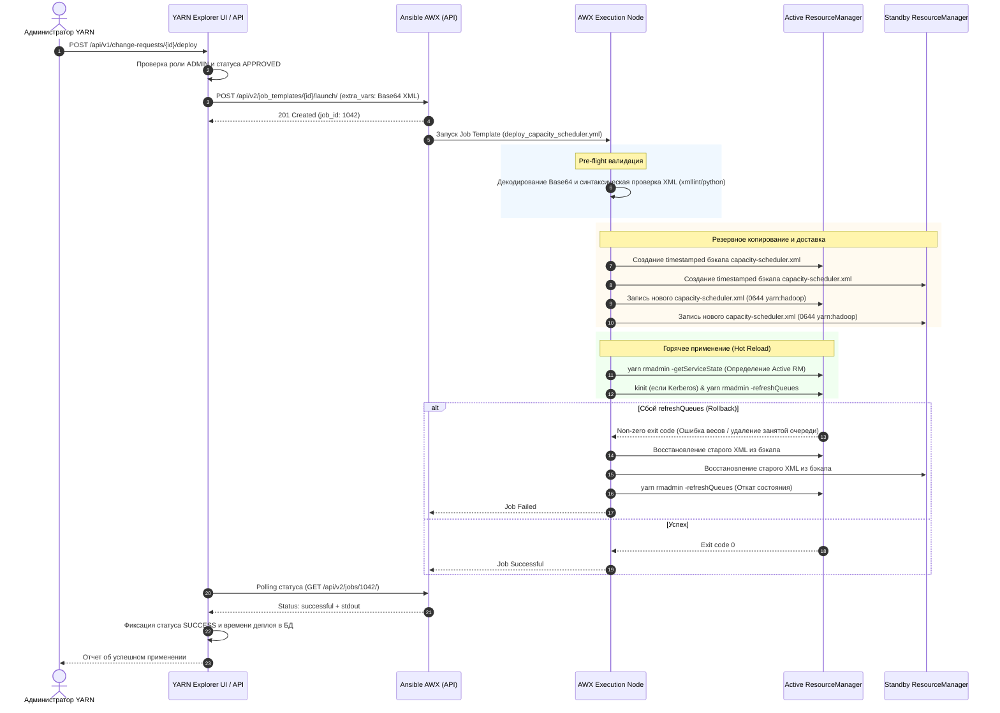

# Руководство: Доставка и применение конфигурации YARN через Ansible AWX

Данный документ описывает архитектуру, настройку и эксплуатацию модуля автоматизированной доставки и горячего применения конфигурации очередей (`capacity-scheduler.xml`) на кластеры Apache Hadoop YARN с использованием платформы **Ansible AWX / Red Hat Ansible Automation Platform**.

---

## 1. Архитектура решения

Схема потоков данных и компонентов при согласовании и деплое изменений:



---

## 2. Структура Ansible-репозитория

Все артефакты Ansible хранятся в каталоге `ansible/`:

```text
ansible/
├── inventory.example.ini             # Шаблон инвентаря для кластеров YARN
├── playbooks/
│   └── deploy_capacity_scheduler.yml # Плейбук верхнего уровня для Job Template в AWX
└── roles/
    └── yarn_capacity_scheduler/      # Роль доставки и применения
        ├── defaults/main.yml         # Переменные по умолчанию
        ├── meta/main.yml             # Метаданные роли
        ├── tasks/
        │   ├── main.yml              # Главный оркестратор с блоком rescue
        │   ├── backup.yml            # Создание резервных копий
        │   ├── deploy.yml            # Запись файла конфигурации
        │   └── refresh.yml           # kinit и rmadmin -refreshQueues
        └── README.md
```

### Ключевые особенности роли `yarn_capacity_scheduler`:
1. **Безопасная передача содержимого**: XML передается через переменную `capacity_scheduler_xml_b64` в формате **Base64**. Это полностью исключает искажение кавычек, переносов строк и специальных символов JSON.
2. **Pre-flight проверка**: Валидация структуры XML выполняется на стороне Runner перед любым изменением файлов на кластере.
3. **Автоматический Rollback**: В случае ошибки команды `yarn rmadmin -refreshQueues` блок `rescue` автоматически возвращает файлы из резервной копии на всех серверах RM и повторно вызывает `refreshQueues`.

---

## 3. Настройка в интерфейсе AWX

### Шаг 1: Создание Machine Credentials (SSH)
1. В боковом меню перейдите в **Administration → Credentials → Add**.
2. **Name**: `YARN RM Deployer Key`
3. **Credential Type**: `Machine`
4. **Username**: `deployer` (пользователь с доступом по SSH на ноды RM).
5. **SSH Private Key**: Закрытый ключ пользователя `deployer`.

### Шаг 2: Создание Inventory (Инвентарь)
1. Перейдите в **Automation Content → Inventories → Add → Add inventory**.
2. **Name**: `Hadoop Clusters Inventory`
3. Во вкладке **Hosts** добавьте все узлы ResourceManager кластера:
   * Хост 1: `rm1.hadoop.company.local`
     * В поле **Variables (YAML)** укажите:
       ```yaml
       rm_id: rm1
       ```
   * Хост 2: `rm2.hadoop.company.local`
     * В поле **Variables (YAML)** укажите:
       ```yaml
       rm_id: rm2
       ```
4. Во вкладке **Groups** создайте группу `yarn_rm` и включите в неё оба хоста.
5. Задайте переменные группы `yarn_rm`:
   ```yaml
   hadoop_conf_dir: "/etc/hadoop/conf"
   hadoop_user: "yarn"
   hadoop_group: "hadoop"
   kerberos_enabled: true
   yarn_keytab: "/etc/security/keytabs/yarn.service.keytab"
   yarn_principal: "yarn/{{ inventory_hostname }}@COMPANY.LOCAL"
   ```

### Шаг 3: Подключение Git-проекта (Project)
1. Перейдите в **Automation Content → Projects → Add**.
2. **Name**: `Hadoop Explorer Automation`
3. **Execution Environment**: Выберите стандартный или кастомный EE (с Python 3).
4. **Source Control Type**: `Git`
5. **Source Control URL**: URL вашего Git-репозитория.
6. **Branch**: `main` (или ветка релиза).

### Шаг 4: Создание Job Template
1. Перейдите в **Automation Execution → Templates → Add → Add job template**.
2. **Name**: `YARN - Deploy Capacity Scheduler`
3. **Job Type**: `Run`
4. **Inventory**: `Hadoop Clusters Inventory`
5. **Project**: `Hadoop Explorer Automation`
6. **Playbook**: `ansible/playbooks/deploy_capacity_scheduler.yml`
7. **Credentials**: `YARN RM Deployer Key`
8. **Privilege Escalation**: Отметьте `Enable Privilege Escalation` (become: true).
9. **Variables (Extra Variables)**:
   > [!IMPORTANT]
   > Обязательно отметьте чекбокс **Prompt on launch** напротив поля **Variables**. Это позволит бэкенду YARN Explorer передавать Base64-код и контекст вызова при запуске через API.
10. Нажмите **Save**. Обратите внимание на ID созданного шаблона в адресной строке браузера (например, `/templates/job_template/101`).

### Шаг 5: Выпуск Application Token
1. В профиле пользователя AWX перейдите во вкладку **Tokens → Add**.
2. **Application**: Оставьте пустым (Personal Access Token) или выберите приложение.
3. **Description**: `Hadoop Explorer Token`
4. **Scope**: `Write`
5. Скопируйте полученный токен (он показывается только один раз).

---

## 4. Настройка серверов YARN ResourceManager

### 1. Доступ пользователя в ОС (`sudoers`)
Пользователь `deployer` должен иметь право переключаться на пользователя `yarn` без ввода пароля:
```bash
# /etc/sudoers.d/deployer
deployer ALL=(yarn) NOPASSWD: ALL
```

### 2. Права администратора в YARN (`yarn-site.xml`)
Учетная запись, от имени которой выполняется `yarn rmadmin`, должна входить в список `yarn.admin.acl`:
```xml
<property>
  <name>yarn.admin.acl</name>
  <value>yarn,hadoop-admins</value>
</property>
```

### 3. Kerberos Keytab
Сервисный keytab `yarn.service.keytab` должен находиться по указанному в переменных пути (например, `/etc/security/keytabs/yarn.service.keytab`) с правами `0400` и владельцем `yarn:hadoop`.

---

## 5. Конфигурация в Hadoop Explorer (`config.yaml`)

В файле конфигурации бэкенда YARN Explorer (`backend/yarn/config/config.yaml`):

```yaml
awx:
  # Включение интеграции с AWX
  enabled: true
  # URL инстанса AWX
  base_url: "https://awx.company.local"
  # Токен доступа (рекомендуется передавать через переменную окружения AWX_TOKEN)
  token: "Ваш_Секретный_AWX_Токен"
  verify_ssl: true
  # Дефолтный ID шаблона запуска в AWX
  default_job_template_id: 101
  # Интервал опроса статуса выполнения задачи в секундах
  poll_interval_seconds: 2
  # Максимальное время ожидания завершения деплоя в секундах
  timeout_seconds: 180

clusters:
  - id: "prod-yarn"
    name: "Production Hadoop Cluster"
    resource_manager_urls:
      - "http://rm1.prod.company.local:8088"
      - "http://rm2.prod.company.local:8088"
    kerberos_enabled: true
    # Индивидуальные параметры AWX для конкретного кластера:
    awx:
      enabled: true
      job_template_id: 101 # Переопределяет default_job_template_id
    acl:
      roles:
        admin:
          users: ["admin_user"]
          groups: ["hadoop-admins"]
```

### Переменные окружения для производственного запуска:
- `AWX_ENABLED=true`
- `AWX_BASE_URL=https://awx.prod.company.local`
- `AWX_TOKEN=xxxxxx`
- `AWX_JOB_TEMPLATE_ID=101`

---

## 6. Использование через REST API

### Вариант 1: Деплой согласованной заявки (Change Request)

1. **Создание заявки** (роль `WRITER` или `ADMIN`):
   ```http
   POST /api/v1/change-requests
   Content-Type: application/json

   {
     "cluster_id": "prod-yarn",
     "title": "Добавление очереди analytics.spark",
     "changes": [ ... ]
   }
   ```
2. **Одобрение заявки** (только роль `ADMIN`, с соблюдением принципа Four-Eyes):
   ```http
   POST /api/v1/change-requests/{cr_id}/approve
   Content-Type: application/json

   {
     "comment": "Одобрено на совете инфраструктуры"
   }
   ```
   *Статус заявки переходит в `APPROVED`, генерируется финальный XML.*

3. **Запуск деплоя на кластер через AWX** (только роль `ADMIN`):
   ```http
   POST /api/v1/change-requests/{cr_id}/deploy?wait=true
   Authorization: Bearer <ADMIN_JWT_TOKEN>
   ```
   **Ответ (200 OK):**
   ```json
   {
     "cr_id": 42,
     "cluster_id": "prod-yarn",
     "awx_job_id": 1042,
     "status": "SUCCESS",
     "message": "Конфигурация успешно развернута и применена на кластере через AWX",
     "deployed_at": "2026-09-09T11:20:00.000Z",
     "stdout": "PLAY [Deploy YARN Capacity Scheduler via AWX] ... ok=5 changed=2 failed=0"
   }
   ```

4. **Проверка статуса деплоя**:
   ```http
   GET /api/v1/change-requests/{cr_id}/deploy-status
   ```

---

### Вариант 2: Прямой деплой XML администратором (Direct Deploy)

Для экстренных изменений очередей администратор кластера может напрямую применить проверенный XML:

```http
POST /api/v1/clusters/prod-yarn/deploy-xml
Authorization: Bearer <ADMIN_JWT_TOKEN>
Content-Type: application/json

{
  "xml_content": "<configuration>...</configuration>",
  "comment": "Оперативное изменение лимитов"
}
```

---

## 7. Траблшутинг и диагностика

1. **Ошибка `Mandatory variable 'capacity_scheduler_xml_b64' is missing`**:
   * Проверьте, что в настройках Job Template в AWX включена опция **Prompt on launch** для поля **Variables**.
2. **Ошибка `Cannot refresh queues: sum of child capacity != 100%`**:
   * YARN ResourceManager отклонил конфигурацию из-за математического дисбаланса весов.
   * Сработал встроенный в роль механизм **Rollback**: предыдущая версия файла была автоматически восстановлена из `capacity-scheduler-<timestamp>.xml`, а исходное состояние очередей не повреждено.
3. **Ошибка `User yarn cannot run rmadmin -refreshQueues`**:
   * Проверьте список администраторов в `yarn-site.xml` (`yarn.admin.acl`).
4. **Таймаут ожидания в API (`HTTP 504`)**:
   * Если кластер насчитывает сотни узлов или сеть перегружена, увеличьте параметр `timeout_seconds` в `config.yaml` или вызывайте деплой с параметром `?wait=false` с последующим опросом через `GET /deploy-status`.
