

# Руководство пользователя: HDFS Explorer

<strong>Корпоративный высокопроизводительный веб-проводник для распределенной файловой системы Apache Hadoop HDFS</strong>

---

**HDFS Explorer** — современное веб-приложение корпоративного уровня для безопасной, быстрой и удобной работы с распределенными файловыми системами **Apache Hadoop HDFS**. Платформа предоставляет единый интуитивный веб-интерфейс для навигации по петабайтным озерам данных (Data Lakes), предпросмотра файлов аналитических форматов, пакетной загрузки, распаковки архивов и репликации данных между независимыми кластерами.

---

## 📑 Содержание

1. [Введение и ключевые возможности](#1-введение-и-ключевые-возможности)
2. [Архитектура и потоки данных](#2-архитектура-и-потоки-данных)
3. [Аутентификация и ролевая модель безопасности](#3-аутентификация-и-ролевая-модель-безопасности)
4. [Главный экран и навигация по озеру данных](#4-главный-экран-и-навигация-по-озеру-данных)
5. [Интеллектуальный просмотрщик файлов (Preview Modal)](#5-интеллектуальный-просмотрщик-файлов-preview-modal)
   - [Просмотр структурированных таблиц (CSV, TSV, Parquet, ORC)](#51-просмотр-структурированных-таблиц-csv-tsv-parquet-orc)
   - [Просмотр текстовых и конфигурационных файлов (JSON, XML, YAML, Logs)](#52-просмотр-текстовых-и-конфигурационных-файлов-json-xml-yaml-logs)
6. [Загрузка данных в HDFS (Upload Modal)](#6-загрузка-данных-в-hdfs-upload-modal)
   - [Загрузка отдельных файлов (Drag & Drop)](#61-загрузка-отдельных-файлов-drag--drop)
   - [Загрузка папок целиком с сохранением иерархии](#62-загрузка-папок-целиком-с-сохранением-иерархии)
   - [Автоматическая серверная распаковка ZIP-архивов](#63-автоматическая-серверная-распаковка-zip-архивов)
7. [Управление объектами HDFS](#7-управление-объектами-hdfs)
   - [Создание директорий](#71-создание-директорий)
   - [Переименование и перемещение](#72-переименование-и-перемещение)
   - [Скачивание файлов и потоковая архивация папок в ZIP](#73-скачивание-файлов-и-потоковая-архивация-папок-в-zip)
   - [Удаление файлов и рекурсивное удаление каталогов](#74-удаление-файлов-и-рекурсивное-удаление-каталогов)
   - [Мультивыбор и пакетные операции (Batch Actions)](#75-мультивыбор-и-пакетные-операции-batch-actions)
8. [Межкластерная передача данных (Cross-Cluster Copy)](#8-межкластерная-передача-данных-cross-cluster-copy)
9. [Горячие клавиши и оптимизация производительности](#9-горячие-клавиши-и-оптимизация-производительности)
10. [Часто задаваемые вопросы (FAQ) и диагностика ошибок](#10-часто-задаваемые-вопросы-faq-и-диагностика-ошибок)

---

## 1. Введение и ключевые возможности

В традиционных Hadoop-инфраструктурах инженеры данных, аналитики и системные администраторы вынуждены работать с распределенными файлами через интерфейс командной строки (`hdfs dfs -ls`, `hdfs dfs -cat`, `hdfs dfs -put`) или стандартный веб-интерфейс NameNode (порт 9870), который обладает ограниченным функционалом, не поддерживает предпросмотр бинарных аналитических форматов и требует прямого сетевого доступа к узлам кластера.

**HDFS Explorer** объединяет удобство современного облачного файлового менеджера с надежностью корпоративной безопасности Hadoop:

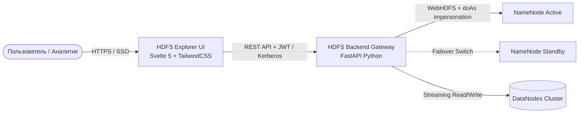

### Основные функциональные возможности:

- **⚡ Высокопроизводительный виртуализированный список файлов:** Мгновенный скроллинг и работа с каталогами, содержащими десятки и сотни тысяч файлов без просадки FPS браузера.
- **🌐 Мультикластерность (Multi-Cluster Management):** Бесшовное переключение между различными HDFS кластерами (Development, Staging, Production DataLake, DMZ) в одном окне без необходимости повторной авторизации.
- **👁️ Интеллектуальный предпросмотр файлов:** Автоматическое распознавание форматов CSV, TSV, JSON, XML, YAML, SQL, Python, Logs, а также колоночных форматов Apache Parquet и ORC без необходимости полного скачивания файла на локальный компьютер.
- **📁 Пакетная загрузка и распаковка:** Поддержка Drag & Drop для файлов, рекурсивная загрузка целых локальных каталогов, а также потоковая загрузка ZIP-архивов с автоматической распаковкой на стороне кластера.
- **📦 Скачивание каталогов «на лету»:** Генерация и потоковая отдача ZIP-архива с содержимым любой директории HDFS без создания временных файлов на диске сервера.
- **🔄 Межкластерная репликация (Cross-Cluster Transfer):** Прямое копирование данных между кластерами в один клик.
- **🔒 Корпоративная безопасность:** Аутентификация через Kerberos SPNEGO SSO / LDAP, ролевая модель доступа (RBAC), разграничение прав на уровне кластеров (Read-Only / Full-Access) и прозрачная трансляция учетных записей через механизм безопасного делегирования **WebHDFS `doAs` impersonation**.

---

## 2. Архитектура и потоки данных

Платформа спроектирована по микросервисной архитектуре с разделением на высокопроизводительный клиентский слой и отказоустойчивый серверный шлюз.

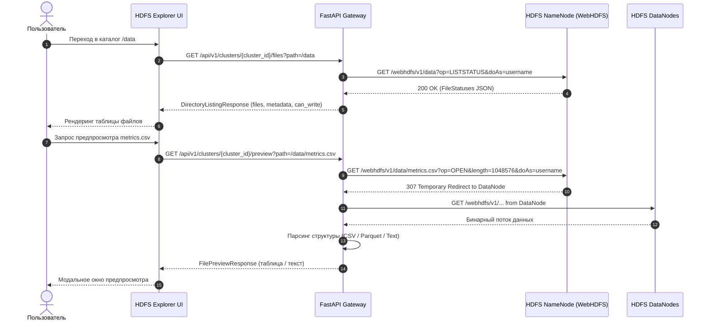

> [!NOTE]
> Серверный шлюз автоматически обрабатывает HTTP 307 редиректы от NameNode к DataNode, сохраняя Kerberos-билеты и параметры делегирования `doAs`, что исключает необходимость прямого сетевого доступа клиентских рабочих станций к сегменту DataNode.

---

## 3. Аутентификация и ролевая модель безопасности

HDFS Explorer поддерживает два основных механизма аутентификации:
1. **Kerberos SPNEGO SSO:** Прозрачный беспарольный вход на основе системного тикета Kerberos в доменных сетях Active Directory / FreeIPA.
2. **Корпоративный LDAP / Active Directory:** Вход по имени пользователя и паролю с поддержкой групповых политик.

  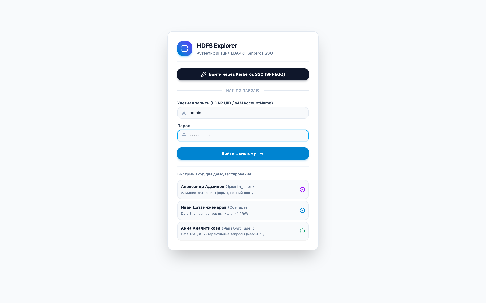
  
<em>Рисунок 1: Экран аутентификации LDAP & Kerberos SSO</em>

### Ролевая модель и разграничение доступа (RBAC):

Права пользователей определяются на основе групп в конфигурационном файле кластеров `clusters.yaml`:

| Группа / Роль | Права на чтение (Read) | Загрузка и создание (Write) | Удаление и перемещение | Межкластерное копирование |
| :--- | :---: | :---: | :---: | :---: |
| **Hadoop Admins** (`hadoop-admins`) | ✅ Полный доступ | ✅ Все каталоги | ✅ Все каталоги | ✅ Любые кластеры |
| **Data Engineers** (`data-engineers`) | ✅ Полный доступ | ✅ Разрешенные каталоги | ✅ Личные и проектные папки | ✅ Доступные кластеры |
| **Data Analysts** (`analytics`) | ✅ Режим Read-Only | ❌ Запрещено | ❌ Запрещено | ❌ Запрещено |
| **Domain Users** (`domain users`) | ✅ Базовый доступ | ⚠️ По квоте / домашняя папка | ⚠️ Только в `/user/{username}` | ❌ Запрещено |

> [!IMPORTANT]
> **Принцип WebHDFS `doAs` Impersonation**: Все операции с файловой системой на кластере выполняются не от имени системного демона HDFS Explorer, а строго от имени текущего авторизованного пользователя. Все стандартные права POSIX (`rwxr-xr-x`) и списки контроля доступа (HDFS ACLs) применяются на уровне NameNode в полном объеме.

---

## 4. Главный экран и навигация по озеру данных

После успешной авторизации открывается главный экран файлового менеджера. По умолчанию выполняется переход в домашнюю директорию пользователя (`/user/{username}`) или в корень кластера (`/`).

  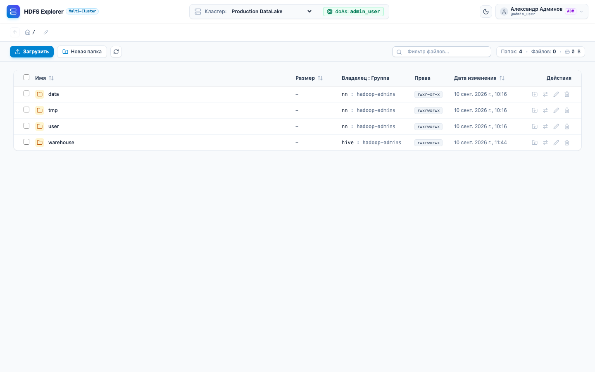
  
<em>Рисунок 2: Главный экран файлового менеджера HDFS (корневой каталог кластера)</em>

### Элементы управления интерфейса:

1. **Верхняя панель (Header):**
   - Выбор активного HDFS-кластера из выпадающего списка (с индикацией статуса подключения);
   - Информация о текущем пользователе и назначенных ролях;
   - Кнопка выхода из системы (Logout).
2. **Панель навигации (Breadcrumbs):**
   - Интерактивная строка пути с возможностью перехода в любую родительскую директорию в один клик;
   - Кнопка **«/» (Корень)** для быстрого возврата в корневой каталог;
   - Кнопка **«Вверх»** для перехода на один уровень выше;
   - Кнопка **редактирования пути (Карандаш)** для быстрого перехода по произвольному абсолютному пути HDFS.
3. **Панель действий (Action Toolbar):**
   - Кнопка **«Загрузить»** для открытия диалога загрузки файлов, папок и архивов;
   - Кнопка **«Новая папка»** для быстрого создания директории;
   - Кнопка **«Скачать папку»** (иконка архива) для загрузки текущей директории в виде ZIP;
   - Кнопка **«Обновить»** для принудительного обновления списка файлов;
   - **Строка фильтрации:** мгновенный поиск и фильтрация файлов в текущем каталоге по подстроке;
   - **Счетчики статистики:** отображение количества директорий, файлов и суммарного объема данных в текущем каталоге.

  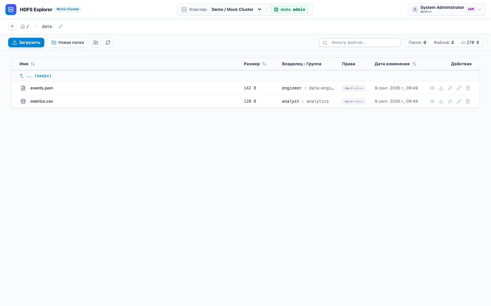
  
<em>Рисунок 3: Просмотр содержимого директории /data с аналитическими файлами</em>

### Таблица объектов файловой системы:

- **Имя объекта:** Имя файла или папки со специализированной иконкой типа (директория, документ, код, табличные данные, архив).
- **Размер:** Размер файла в человекочитаемом формате (B, KB, MB, GB, TB). Для каталогов отображается прочерк.
- **Владелец и группа:** Владелец и POSIX-группа объекта (`owner:group`).
- **Права доступа:** Строка прав в формате POSIX (например, `rwxr-xr-x` или `rw-r--r--`).
- **Дата изменения:** Точная дата и время последней модификации.
- **Панель действий строки (Quick Actions):**
  - 👁️ **Предпросмотр** (для файлов);
  - 📥 **Скачать файл** или **Скачать папку в ZIP**;
  - 🔄 **Скопировать в другой кластер**;
  - ✏️ **Переименовать / Переместить**;
  - 🗑️ **Удалить**.

---

## 5. Интеллектуальный просмотрщик файлов (Preview Modal)

HDFS Explorer избавляет от необходимости скачивать гигабайтные датасеты на локальный компьютер, чтобы просто ознакомиться с их схемой и содержимым.

### 5.1. Просмотр структурированных таблиц (CSV, TSV, Parquet, ORC)

При открытии табличных и колоночных форматов данных файл парсится на сервере и отображается в виде интерактивной таблицы с нумерацией строк и закрепленными заголовками колонок.

  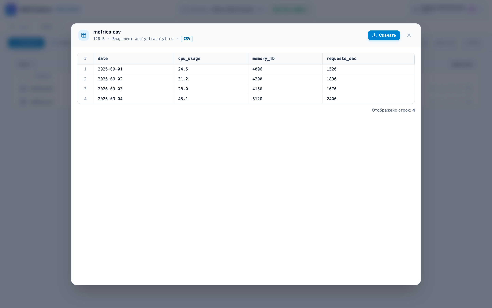
  
<em>Рисунок 4: Интеллектуальный табличный предпросмотр файла metrics.csv</em>

> [!TIP]
> При предпросмотре больших файлов система автоматически загружает начальный чанк данных (по умолчанию до 1 МБ) и выводит информационное уведомление о количестве отображенных строк. В правом верхнем углу модального окна доступны кнопки **«Копировать»** и **«Скачать»** для выгрузки файла целиком.

### 5.2. Просмотр текстовых и конфигурационных файлов (JSON, XML, YAML, Logs)

Для текстовых форматов (JSON, XML, YAML, SQL, Python, конфигурационные `.properties` и логи) просмотрщик отображает содержимое в моноширинном блоке с сохранением исходного форматирования.

  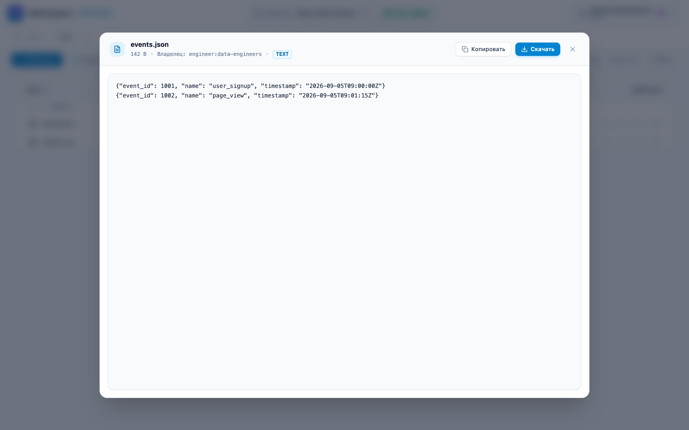
  
<em>Рисунок 5: Просмотр структурированного JSON-файла events.json</em>

---

## 6. Загрузка данных в HDFS (Upload Modal)

Диалоговое окно загрузки поддерживает 3 специализированных режима работы, переключаемых с помощью вкладок:

  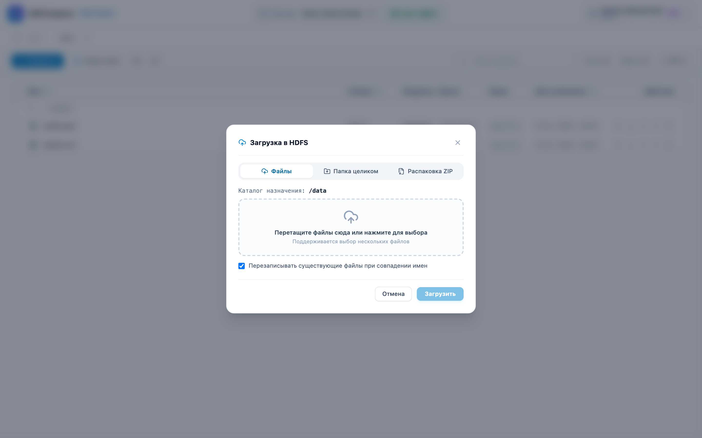
  
<em>Рисунок 6: Окно загрузки файлов, каталогов и ZIP-архивов</em>

### 6.1. Загрузка отдельных файлов (Drag & Drop)
- Перетащите один или несколько файлов в область Drag & Drop или выберите их через стандартный проводник ОС;
- Список выбранных файлов с их размерами отображается перед отправкой;
- Доступна опция **«Перезаписывать существующие файлы при совпадении имен»**.

### 6.2. Загрузка папок целиком с сохранением иерархии
- Выберите локальный каталог на компьютере;
- Браузер рекурсивно передаст все вложенные поддиректории и файлы;
- HDFS Explorer автоматически воссоздаст точную структуру папок в целевом каталоге HDFS.

### 6.3. Автоматическая серверная распаковка ZIP-архивов
- Перетащите `.zip` архив с данными;
- Серверный шлюз HDFS Explorer выполнит потоковую распаковку архива прямо в целевую директорию кластера без необходимости промежуточного сохранения на локальном диске;
- Идеально подходит для быстрой загрузки больших наборов файлов, логов или датасетов.

### 6.4. Многопоточная чанковая загрузка больших файлов (Resumable Chunked Upload)
- Файлы размером свыше 5 МБ автоматически нарезаются клиентом на чанки по 2 МБ;
- Каждый чанк передается независимо с автоматическим механизмом повторных попыток (Retry) при сетевых сбоях;
- Прогресс отображается в реальном времени с индикацией текущей скорости и объема переданных данных;
- Потоковая сборка в WebHDFS выполняется без аллокации избыточной оперативной памяти на шлюзе.

---

## 7. Управление объектами HDFS

### 7.1. Создание директорий

Нажмите кнопку **«Новая папка»** на панели инструментов, укажите имя создаваемого каталога и нажмите **«Создать»** (или клавишу `Enter`).

  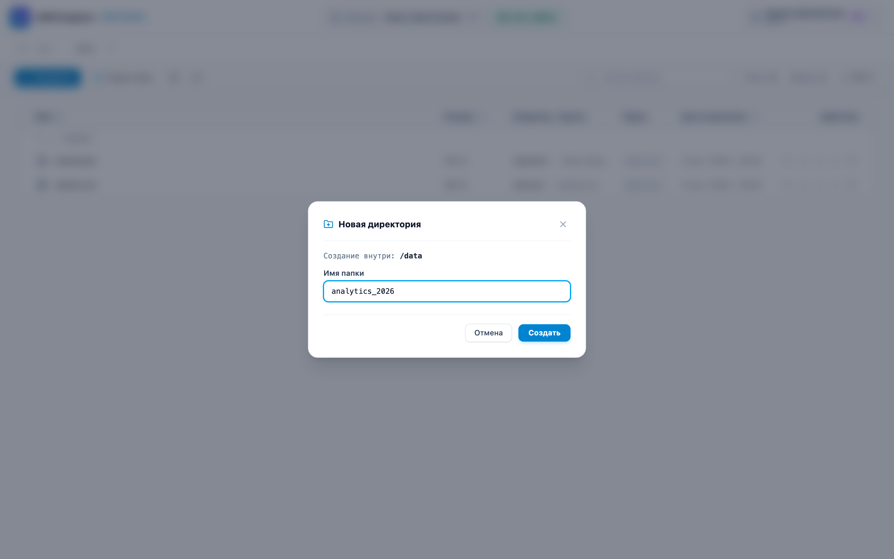
  
<em>Рисунок 7: Создание новой директории в HDFS</em>

---

### 7.2. Переименование и перемещение

Кнопка **«Переименовать»** в строке объекта открывает диалог, позволяющий:
- **Переименовать объект:** введите новое имя файла/папки;
- **Переместить объект:** укажите полный целевой путь, начинающийся со слеша (например, `/archive/2026/events.json`).

  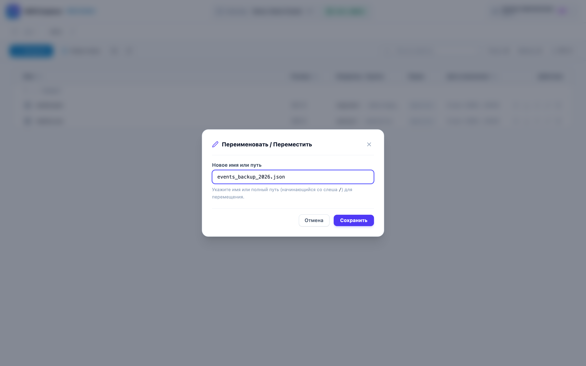
  
<em>Рисунок 8: Переименование и перемещение файла events.json</em>

---

### 7.3. Скачивание файлов и потоковая архивация папок в ZIP

- **Одиночный файл:** нажмите иконку скачивания в строке таблицы — браузер загрузит файл напрямую из HDFS.
- **Директория целиком:** нажмите иконку **«Скачать папку»** в строке директории или на панели инструментов. Бэкенд сгенерирует ZIP-архив на лету, упакует все вложенные файлы и отдаст поток в браузер без ограничения по размеру.

---

### 7.4. Удаление файлов и рекурсивное удаление каталогов

Для защиты от случайной потери данных удаление требует явного подтверждения в модальном окне:

  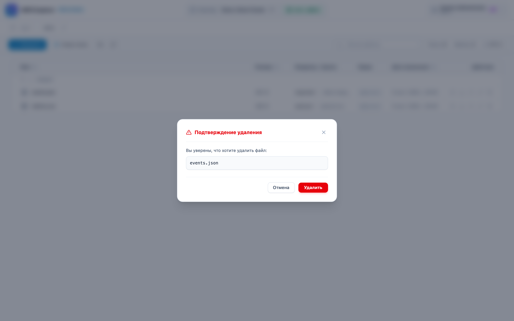
  
<em>Рисунок 9: Окно подтверждения удаления файла или каталога</em>

> [!WARNING]
> При удалении непустой директории необходимо активировать флаг **«Рекурсивное удаление»**. Удаление объектов в HDFS является необратимой операцией (если в кластере не настроена корзина `.Trash`).

---

### 7.5. Мультивыбор и пакетные операции (Batch Actions)

HDFS Explorer поддерживает множественный выбор файлов и папок для выполнения групповых действий в один клик:

- **Выбор объектов:** отмечайте файлы и папки индивидуальными чекбоксами в первой колонке таблицы;
- **Выбор всех элементов:** чекбокс в заголовке таблицы (`<thead>`) позволяет выделить или снять выделение со всех файлов текущей директории;
- **Диапазонное выделение (`Shift + клик`):** отметьте первый элемент, затем, удерживая клавишу `Shift`, кликните по последнему — все промежуточные файлы будут выбраны автоматически;
- **Горячие клавиши:** комбинация `Cmd + A` (macOS) или `Ctrl + A` (Linux/Windows) выбирает все файлы в списке, а клавиша `Escape` мгновенно сбрасывает выделение.

При выборе одного или нескольких объектов внизу экрана появляется всплывающая **Панель пакетных действий (Batch Action Bar)**:

  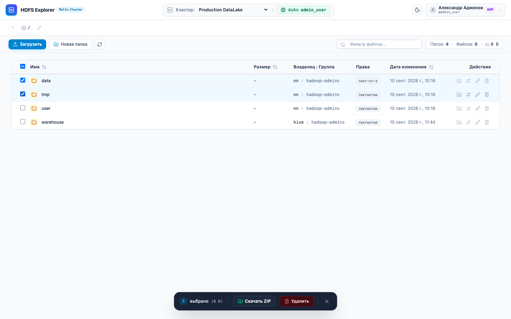
  
<em>Рисунок 10: Плавающая панель пакетных действий со счетчиком выбранных объектов и суммарным объёмом</em>

#### Доступные пакетные операции:
1. **📦 Скачать ZIP (Batch Download):**
   - Серверный шлюз параллельно собирает все выбранные файлы и папки и упаковывает их в единый `.zip` архив на лету;
   - Загрузка в браузер происходит единым потоком без создания временных файлов на диске клиента;
   - Имя архива формируется автоматически с идентификатором кластера и таймстемпом (например, `hdfs-batch-cluster-1-2026-09-10.zip`).

2. **🗑️ Пакетное удаление (Batch Delete):**
   - Нажатие кнопки **«Удалить»** открывает специализированное модальное окно подтверждения со списком всех намеченных к удалению объектов и их размерами;
   - Поддерживается флаг рекурсивного удаления для директорий;
   - Бэкенд возвращает подробный отчёт с перечислением успешно удалённых путей и детальных причин ошибок (например, при нехватке POSIX-прав в HDFS).

  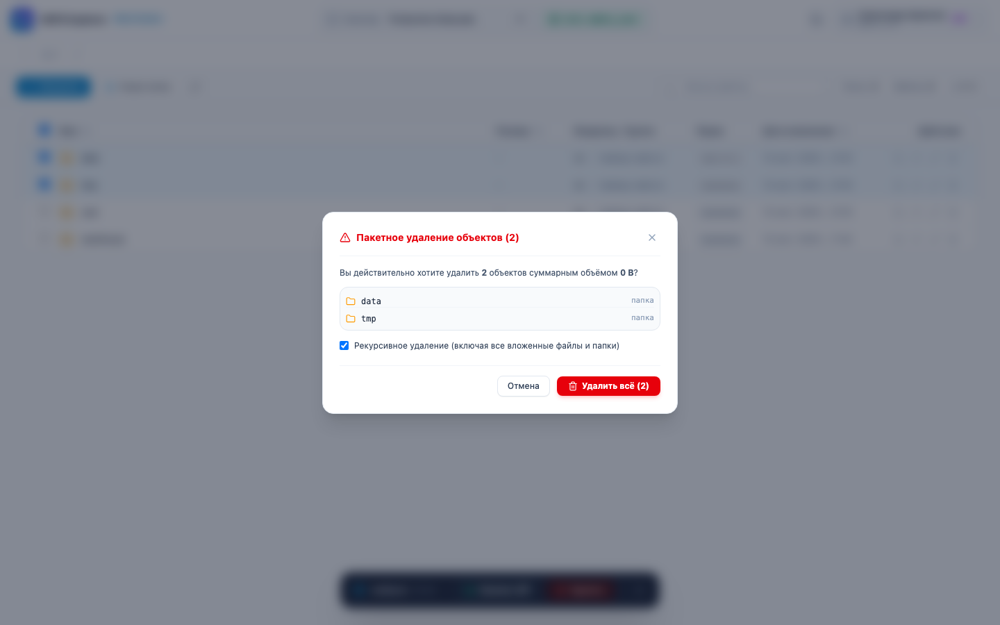
  
<em>Рисунок 11: Модальное окно пакетного удаления объектов HDFS</em>

---

## 8. Межкластерная передача данных (Cross-Cluster Copy)

Функция межкластерного копирования позволяет быстро передавать датасеты между независимыми Hadoop-кластерами без необходимости ручного запуска утилиты `hadoop distcp` в консоли.

  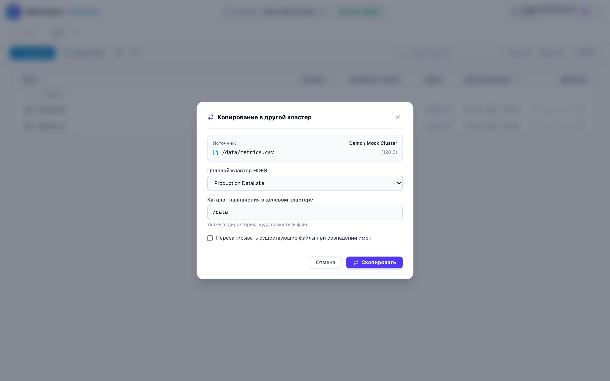
  
<em>Рисунок 12: Копирование датасета metrics.csv в целевой HDFS кластер</em>

### Порядок выполнения операции:
1. В строке нужного файла или папки нажмите иконку **«Скопировать в другой кластер»**;
2. Выберите **Целевой кластер HDFS** из списка доступных для записи;
3. Укажите **Каталог назначения** в целевом кластере;
4. При необходимости отметьте флаг перезаписи существующих файлов;
5. Нажмите кнопку **«Скопировать»**. Серверный шлюз выполнит потоковую передачу данных между кластерами и уведомит об успешном завершении.

---

## 9. Горячие клавиши и оптимизация производительности

Для ускорения повседневных операций в HDFS Explorer поддерживаются клавиатурные комбинации:

| Клавиша / Комбинация | Область действия | Выполняемое действие |
| :--- | :--- | :--- |
| `Cmd + A` / `Ctrl + A` | Таблица файлов | Выделить все файлы и папки в текущем каталоге |
| `Shift + Click` | Чекбоксы файлов | Диапазонное выделение от предыдущего выбранного элемента |
| `Escape` | Панель / модальные окна | Снять выделение со всех файлов или закрыть модальное окно |
| `Enter` | Формы создания / переименования | Подтвердить операцию и отправить форму |
| `Click` по строке папки | Таблица файлов | Переход внутрь выбранной директории |
| `Click` по строке файла | Таблица файлов | Открытие окна предпросмотра файла |
| `Click` по заголовку колонки | Шапка таблицы | Сортировка по имени, размеру или дате изменения |

### Архитектурные оптимизации производительности:
- **Виртуализация DOM-дерева:** рендерится только видимая часть строк таблицы, что обеспечивает плавную прокрутку со скоростью 60 FPS для каталогов с миллионами записей.
- **Потоковая передача (Stream Chunks):** предварительный просмотр и скачивание осуществляются чанками без аллокации избыточной оперативной памяти на сервере.
- **HTTP/2 & Keep-Alive:** мультиплексирование сетевых соединений к WebHDFS минимизирует накладные расходы на TLS/Kerberos рукопожатия.

---

## 10. Часто задаваемые вопросы (FAQ) и диагностика ошибок

### Q: Почему при попытке загрузки или удаления возникает ошибка «Permission Denied»?
> **О:** HDFS Explorer транслирует вашу учетную запись в NameNode через механизм `doAs`. Если у вашего пользователя в HDFS нет прав на запись (`w`) в соответствующую директорию или прав на выполнение (`x`) в родительских папках, NameNode отклонит операцию. Обратитесь к администраторам кластера для настройки POSIX-прав или HDFS ACL.

---

### Q: Что делать, если при входе через Kerberos SSO возникает ошибка «SPNEGO ticket not provided»?
> **О:** Убедитесь, что:
> 1. Ваш браузер настроен на доверие к домену HDFS Explorer (параметр `network.negotiate-auth.trusted-uris` в Firefox или групповая политика `AuthServerAllowlist` в Chrome/Edge);
> 2. На рабочей станции получен валидный Kerberos TGT билет (`klist` в терминале).
> 
> В качестве альтернативы всегда можно авторизоваться по логину и паролю LDAP.

---

### Q: Поддерживается ли работа с NameNode High Availability (HA Active/Standby)?
> **О:** Да. В конфигурации кластера `clusters.yaml` задается список всех URL NameNode (`webhdfs_urls`). Серверный шлюз автоматически определяет активную NameNode и при сбое (Failover) переключает запросы на Standby-ноду, ставшую Active.

---

### Q: Какой максимальный размер файла поддерживается для предпросмотра?
> **О:** По умолчанию для предпросмотра считывается первый 1 МБ файла (настраивается параметром `preview_max_bytes` в `clusters.yaml`). Это позволяет мгновенно открывать файлы любого размера (включая файлы размером сотни гигабайт), не перегружая память сервера и сеть. Для работы со всем объемом файла используйте кнопку **«Скачать»**.
