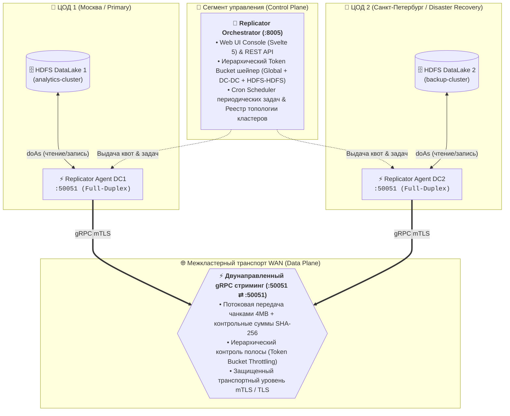
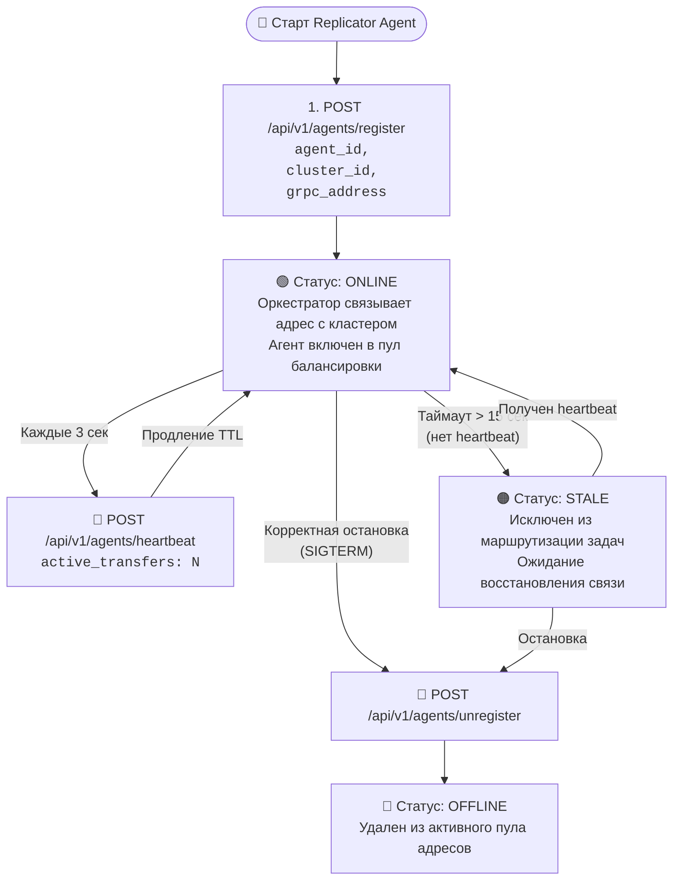
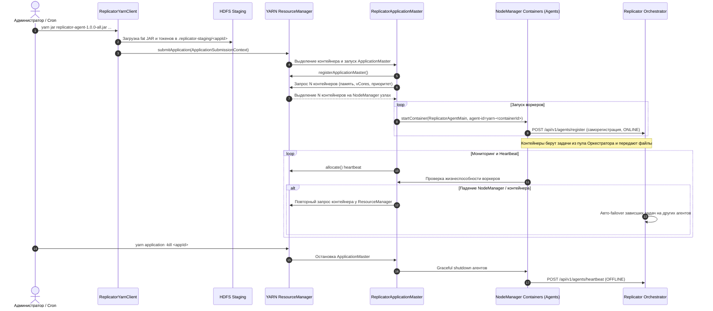

# 🛠️ Руководство администратора: Hadoop gRPC Replicator

Данный документ содержит полное руководство для инженеров **DevOps / SRE / сетевых администраторов** по установке, конфигурированию, промышленному развертыванию и эксплуатации распределенной системы межкластерной репликации **Hadoop gRPC Replicator** в четырех режимах:
1. **Standalone & Hadoop Nodes** (Bare-Metal / DataNode / Edge Nodes под управлением systemd или `hadoop jar`)
2. **Apache Hadoop YARN** (Эластичный пул распределенных агентов под управлением ApplicationMaster)
3. **Docker & Docker Compose** (Контейнеризированный запуск компонентов)
4. **Kubernetes** (Промышленное развертывание в K8s)

---

## 1. Архитектура и сетевая топология

#### 1.1 Архитектура и компоненты системы
Hadoop gRPC Replicator построен на базе симметричных универсальных агентов **Replicator Agent (`Full-Duplex`)**:
Каждый узел в ЦОД1 и ЦОД2 запускает агент `backend.replicator.agent`, который одновременно принимает входящие gRPC-потоки (:50051) и передает исходящие задачи из очереди Оркестратора. Это обеспечивает полноценную двунаправленную репликацию (`DC1 ⇄ DC2`, DR failback) в рамках единого сервиса.



### 1.2 Сетевые порты и протоколы
| Сервис | Порт | Протокол | Направление | Назначение |
|---|---|---|---|---|
| **Orchestrator** | `8005` | HTTP/HTTPS | Inbound | Web UI консоль, REST API, выдача токенов шейпера, `/health`, `/metrics` |
| **Replicator Agent (DC1 / DC2)** | `50051` | gRPC (HTTP/2) | Inbound/Outbound | Полный дуплекс: прием входящих чанков и отправка исходящих реплик |
| **NameNodes** | `9870`/`8020` | HTTP / RPC | Outbound | Чтение из исходного HDFS и запись в целевой HDFS |
| **KDC** | `88` | TCP/UDP | Outbound | Выпуск билетов Kerberos для системной техучетки |

### 1.3 Динамическая регистрация агентов и разрешение адресов (Dynamic Keepalive Service Discovery)

В платформе реализован режим **динамической саморегистрации агентов с keepalive-мониторингом**:



#### Приоритет разрешения целевого адреса (get_target_address):
1. **Динамический реестр живых агентов (AgentRegistry keepalive) — основной механизм**:
   - Агент при старте автоматически сообщает свой внешний адрес `advertised_grpc_address` (например, `agent-dc1:50051`).
   - Оркестратор динамически регистрирует этот адрес за целевым HDFS-кластером.
   - Если один кластер обслуживают несколько агентов (горизонтальное масштабирование), Оркестратор выполняет балансировку нагрузки, выбирая узел с наименьшим числом текущих задач (`active_transfers`).
2. **Статическая топология Оркестратора (`application.yml`)**:
   - Значения по умолчанию из конфигурации Оркестратора (`hadoop.replicator.clusters`) используются как резерв, если живой агент еще не зарегистрировался.
3. **Локальный оверрайд переменной окружения `AGENT_TARGET_<CLUSTER_ID>`**:
   - Применяется в нестандартных изолированных сетях (NAT, Ingress-шлюзы, раздельные DMZ).
4. **Резервный адрес по умолчанию (Fallback)**:
   - Значение переменной `FALLBACK_TARGET_ADDRESS` / `RECEIVER_ADDRESS` (по умолчанию `localhost:50051`).

### 1.3.1 Безопасность динамической регистрации (Security & Zero-Trust)

Динамическая регистрация защищена комплексной многоуровневой системой безопасности:

1. **Аутентификация агентов через Agent Secret (PSK / Token)**:
   - На Оркестраторе и всех доверенных агентах задается общий секретный ключ `REPLICATOR_AGENT_SECRET` (минимум 32 символа).
   - Агент автоматически передает этот токен в HTTP-заголовке `X-Agent-Secret` (или `Authorization: Bearer <token>`) при вызовах `/api/v1/agents/register`, `/api/v1/agents/heartbeat`, `/api/v1/agents/unregister` и запросах сетевых квот `/api/v1/tokens/request`.
   - Запросы без валидного токена отбрасываются с кодом `401 Unauthorized`. В боевом режиме (`ENVIRONMENT=production`) отсутствие переменной блокирует старт сервиса.
2. **Белый список кластеров (Cluster Whitelisting)**:
   - Свойство `hadoop.replicator.enforce-cluster-whitelist=true` (по умолчанию активно в боевом режиме).
   - Агенту разрешено регистрироваться только для тех кластеров, которые явно объявлены администратором в `application.yml` (`hadoop.replicator.clusters`).
   - Попытка зарегистрировать неавторизованный кластер отклоняется с ошибкой `403 Forbidden`, защищая топологию от отравления (Topology Poisoning).
3. **Защита от SSRF и валидация сетевых адресов**:
   - Оркестратор валидирует структуру анонсируемого gRPC-адреса `host:port` и диапазон порта (1–65535).
   - Автоматически блокируются попытки передать эндпоинты облачных метаданных (`169.254.169.254`, `metadata.google.internal`, `instance-data`) и адреса link-local (`169.254.0.0/16`, `fe80::/10`).

### 1.3.2 Шифрование gRPC трафика и взаимная аутентификация (TLS / mTLS)

Каналы потоковой передачи файлов по gRPC поддерживают криптографическую защиту:
1. **Шифрование данных в канале (TLS)**:
   - Включается установкой `REPLICATOR_GRPC_TLS_ENABLED=true` либо указанием префикса `grpcs://` в целевом адресе.
   - Сервер-приемник использует сертификат и приватный ключ (`REPLICATOR_GRPC_CERT_CHAIN_PATH` и `REPLICATOR_GRPC_PRIVATE_KEY_PATH`).
   - При отсутствии явных сертификатов в dev/тест средах генерируется временный самоподписанный сертификат на лету (`SelfSignedCertificate`).
2. **Взаимная аутентификация узлов (mTLS)**:
   - При `REPLICATOR_GRPC_CLIENT_AUTH=REQUIRE` сервер запрашивает и валидирует сертификат подключающегося передающего агента.
   - Доверенные корневые центры сертификации задаются через `REPLICATOR_GRPC_TRUST_CERT_COLLECTION_PATH`.
   - Клиент-отправитель (`ReplicationSender`) автоматически передает клиентский сертификат и ключ при наличии конфигурации.
3. **Безопасность REST-вызовов Оркестратора**:
   - `OrchestratorClient` поддерживает вызовы по `https://` с валидацией доверенных сертификатов или безопасным fallback флагом `ORCHESTRATOR_TLS_INSECURE_SKIP_VERIFY=true` для тестовых сред.

---

### 1.4 Справочник переменных окружения (Environment Variables Reference)

#### 1.4.1 Переменные Replicator Orchestrator
| Переменная | Описание | Значение по умолчанию | Обязательность |
|---|---|---|---|
| `SPRING_CONFIG_ADDITIONAL_LOCATION` | Путь к внешнему файлу конфигурации Spring Boot | `file:/etc/hadoop-explorer/replicator/application.yml` | Опционально |
| `HADOOP_REPLICATOR_GLOBAL_LIMIT_BYTES_PER_SEC` | Глобальный лимит пропускной способности WAN (байт/сек) | `104857600` (100 МБ/с) | Опционально |
| `SPRING_DATASOURCE_URL` | JDBC URL подключения к БД (PostgreSQL / SQLite / H2) | `jdbc:h2:mem:replicator` | Опционально |
| `SPRING_DATASOURCE_USERNAME` | Пользователь базы данных | `sa` | Опционально |
| `SPRING_DATASOURCE_PASSWORD` | Пароль пользователя базы данных | `""` | Опционально |
| `HADOOP_REPLICATOR_AGENT_SECRET` | Общий секретный ключ аутентификации агентов репликации (заголовок `X-Agent-Secret`) | — (в dev опционален, в prod обязателен) | Обязательно в prod |
| `HADOOP_REPLICATOR_ENFORCE_CLUSTER_WHITELIST` | Принудительная блокировка регистрации неизвестных кластеров (`true`/`false`) | `false` (в prod рекомендуется `true`) | Опционально |
| `JWT_SECRET_KEY` | Секретный ключ подписи JWT-токенов сессий Web UI (мин. 32 симв.) | В dev автогенерируется, в prod обязателен | Обязательно в prod |

#### 1.4.2 Переменные Replicator Agent (Full-Duplex)
| Переменная | Описание | Значение по умолчанию | Обязательность |
|---|---|---|---|
| `AGENT_ID` | Уникальный строковый идентификатор агента в платформе | `agent-01` (или `$WORKER_ID`) | Рекомендуется |
| `AGENT_CLUSTER_ID` | Идентификатор HDFS-кластера, который обслуживает данный агент | `demo-cluster` | Рекомендуется |
| `REPLICATOR_AGENT_SECRET` | Секретный ключ для аутентификации на Оркестраторе (передается в `X-Agent-Secret`) | — (должен совпадать с Оркестратором) | Обязательно в prod |
| `AGENT_MODE` | Режим работы агента: `all` (дуплекс: прием + передача), `sender` (только передача), `receiver` (только прием) | `all` | Опционально |
| `ORCHESTRATOR_URL` | URL Replicator Orchestrator для саморегистрации, задач и квот | `http://localhost:8005` | Обязательно |
| `RECEIVER_HOST` | Сетевой интерфейс для прослушивания входящего gRPC-сервера | `0.0.0.0` | Опционально |
| `RECEIVER_PORT` | Порт входящего gRPC-сервера для приема чанков данных | `50051` | Опционально |
| `AGENT_ADVERTISED_ADDRESS` | Внешний gRPC-адрес для саморегистрации в Оркестраторе (например, `agent-dc1:50051`) | Вычисляется автоматически (`hostname:50051`) | Опционально |
| `AGENT_ENABLE_REGISTRATION` | Включение режима динамической саморегистрации с keepalive | `true` | Опционально |
| `REPLICATOR_STAGING_DIR` | Локальная директория буфера для приема чанков перед коммитом | `/tmp/staging` | Опционально |
| `REPLICATOR_HDFS_NAMENODE` | Хост целевого NameNode для прямого HDFS-коммита через Java HDFS Client | Не задано (локальный commit) | Опционально |
| `POLL_INTERVAL_SEC` | Интервал опроса очереди задач и keepalive-пингов (секунды) | `3.0` | Опционально |
| `AGENT_MAX_BANDWIDTH_MB_S` | Локальный лимит пропускной способности агента (МБ/с, Token Bucket). Предотвращает перегрузку сетевой карты и дисков при установке непосредственно на ноду Hadoop (DataNode / Edge Gateway). `0` или пусто — без ограничений | `0.0` (без ограничений) | Опционально |
| `AGENT_TARGET_<CLUSTER_ID>` | Ручной оверрайд сетевого gRPC-адреса для целевого кластера (для NAT/DMZ) | Динамический реестр Оркестратора | Опционально |
| `REPLICATOR_KEYTAB_PATH` | Путь к Keytab-файлу системной техучетки для Kerberos аутентификации | `/etc/security/keytabs/replicator.keytab` | Рекомендуется |
| `REPLICATOR_GRPC_TLS_ENABLED` | Включение защищенного шифрования TLS для входящего и исходящего gRPC трафика | `false` | Опционально |
| `REPLICATOR_GRPC_CERT_CHAIN_PATH` | Путь к сертификату узла (X.509 PEM) | `null` | Опционально |
| `REPLICATOR_GRPC_PRIVATE_KEY_PATH` | Путь к приватному ключу узла (PKCS8 PEM) | `null` | Опционально |
| `REPLICATOR_GRPC_TRUST_CERT_COLLECTION_PATH` | Путь к цепочке доверенных сертификатов CA для проверки пиров | `null` | Опционально |
| `REPLICATOR_GRPC_CLIENT_AUTH` | Режим взаимной проверки сертификатов mTLS (`NONE`, `OPTIONAL`, `REQUIRE`) | `NONE` | Опционально |
| `REPLICATOR_GRPC_INSECURE_SKIP_VERIFY` | Отключение строгой проверки TLS сертификатов для gRPC (только dev) | `false` | Опционально |
| `ORCHESTRATOR_TLS_INSECURE_SKIP_VERIFY` | Отключение проверки HTTPS сертификатов при запросах к Оркестратору | `false` | Опционально |

### 1.5 Настройка Hadoop Impersonation (Proxy User) для Apache Ranger

Для обеспечения прозрачного аудита безопасности и применения политик доступа в **Apache Ranger** платформа использует протокол **Hadoop Proxy User (doAs имперсонация)**:
1. Replicator Agent аутентифицируется в Kerberos KDC по системному keytab техучетки (`hdfs-replicator@REALM.LOCAL`).
2. При операциях с HDFS (`HadoopFsManager` / `FileSystem.get`) агент создает прокси-контекст `UserGroupInformation.createProxyUser(user, baseUgi).doAs(...)` от имени конечного пользователя (`user=alice`, извлеченное из `execution_principal` или сессии).
3. NameNode и Apache Ranger проверяют политики доступа непосредственно для `alice`, а в Ranger Audit Log регистрируется запись вида:
   ```
   UGI: alice (auth:PROXY via hdfs-replicator@REALM.LOCAL)
   Resource: /data/production/events/...
   Action: WRITE / READ
   Access Result: ALLOWED / DENIED
   ```

Для работы данного механизма в файле конфигурации `core-site.xml` на NameNode должна быть разрешена имперсонация для сервисной техучетки:
```xml
<property>
    <name>hadoop.proxyuser.hdfs-replicator.hosts</name>
    <value>*</value>
</property>
<property>
    <name>hadoop.proxyuser.hdfs-replicator.groups</name>
    <value>*</value>
</property>
```

---

### 1.6 Модель поставки и готовые дистрибутивы (Distribution & No-Build Deployment)

Платформа **Hadoop Explorer** поставляется в виде полностью скомпилированных, готовых к промышленной эксплуатации релизных артефактов и Docker-образов.

> [!IMPORTANT]
> **Для развертывания сервиса в production-средах НЕ требуется компиляция исходного кода руками.**
> На целевых серверах и шлюзах **не нужно** устанавливать Git, Apache Maven, Node.js, npm или компиляторы. Достаточно только среды исполнения **Java 21 JRE** и стандартных системных библиотек Kerberos.

#### Официальные артефакты релиза (GitHub Releases)
Для каждого релиза `v${VERSION}` (например, `v1.0.0`) в репозитории автоматически формируются и публикуются следующие файлы:

| Файл артефакта | Тип | Размер | Содержимое и назначение |
|---|---|---|---|
| **`replicator-orchestrator-${VERSION}.jar`** | Spring Boot 3 Fat JAR | ~50 МБ | **Оркестратор репликации**: включает в себя веб-сервер, REST API, встроенный веб-интерфейс (Svelte 5 SPA предварительно упакован в `/static`), иерархический Token Bucket шейпер, драйверы БД (H2, PostgreSQL) и метрики Actuator. |
| **`replicator-agent-${VERSION}-all.jar`** | Shaded Executable Fat JAR | ~81.5 МБ | **Нативный агент репликации**: самодостаточный исполняемый JAR со всеми упакованными зависимостями (Netty HTTP/2, gRPC runtime, Apache Hadoop Client, YARN ApplicationMaster, Jackson). Готов к прямому запуску через `java -jar` или `hadoop jar`. |
| **`replicator-agent-${VERSION}.jar`** | Lean JAR (тонкий) | ~211 КБ | Скомпилированные классы агента без внешних библиотек. Предназначен для запуска на нодах Hadoop с системным `HADOOP_CLASSPATH` (`$(hadoop classpath)`), экономя дисковое пространство. |
| **`SHA256SUMS.txt`** | Текстовый файл контрольных сумм | <1 КБ | Криптографические контрольные суммы SHA-256 для верификации целостности всех JAR-артефактов релиза. |

#### Готовые контейнеры (GitHub Container Registry — GHCR)
Для сред Docker и Kubernetes в реестре контейнеров GitHub (`ghcr.io`) публикуются предсобранные многослойные образы на базе легковесного дистрибутива `eclipse-temurin:21-jre-jammy`:
- `ghcr.io/company/hadoop-explorer/replicator-orchestrator:${VERSION}`
- `ghcr.io/company/hadoop-explorer/replicator-agent:${VERSION}`

---

## 2. Режим 1: Standalone (Bare-Metal / VM / systemd)

Развертывание компонентов платформы (Orchestrator и нативных Replicator Agent) на Linux-серверах и шлюзах под управлением `systemd`.

### Шаг 1: Системные пакеты ОС

#### Вариант для Production (Запуск из готовых артефактов — только Runtime JRE):
На целевых серверах требуется только Java 21 JRE, curl и библиотеки Kerberos:

```bash
# Ubuntu 22.04 / 24.04 LTS, Debian 12:
sudo apt-get update && sudo apt-get install -y --no-install-recommends \
    openjdk-21-jre-headless \
    libkrb5-3 krb5-user curl ca-certificates

# RHEL 8/9, Rocky Linux 8/9, AlmaLinux:
sudo dnf install -y --setopt=install_weak_deps=False \
    java-21-openjdk-headless \
    krb5-workstation curl ca-certificates
```

> [!TIP]
> Установка легковесного пакета `headless JRE` уменьшает вектор атак и объем дискового пространства сервера на сотни мегабайт по сравнению с полным JDK и Maven.

#### Альтернативный вариант (Только если требуется сборка из исходников):
```bash
# Ubuntu / Debian:
sudo apt-get install -y openjdk-21-jdk maven git nodejs npm
# RHEL / Rocky Linux:
sudo dnf install -y java-21-openjdk-devel maven git nodejs npm
```

---

### Шаг 2: Пользователь и структура каталогов
Выполняется на серверах Orchestrator и Agent:

```bash
# Создание выделенного системного пользователя
sudo groupadd -g 10001 appuser
sudo useradd -u 10001 -g appuser -m -s /bin/bash appuser

# Создание иерархии рабочих каталогов
sudo mkdir -p /opt/hadoop-explorer/replicator/releases
sudo mkdir -p /opt/hadoop-explorer/replicator/bin
sudo mkdir -p /etc/hadoop-explorer/replicator
sudo mkdir -p /var/log/hadoop-explorer/replicator
sudo mkdir -p /var/lib/hadoop-explorer/replicator/data
sudo mkdir -p /var/lib/hadoop-explorer/replicator/staging
sudo mkdir -p /etc/security/keytabs

# Назначение прав доступа
sudo chown -R appuser:appuser /opt/hadoop-explorer /etc/hadoop-explorer /var/log/hadoop-explorer /var/lib/hadoop-explorer/replicator
sudo chmod 750 /var/lib/hadoop-explorer/replicator/data /var/lib/hadoop-explorer/replicator/staging
```

---

### Шаг 3: Получение бинарных артефактов (Два варианта)

#### Способ А (Рекомендуемый для Production): Загрузка из GitHub Releases (No-Build)

Готовые бинарные Fat JAR скачиваются напрямую из раздела релизов GitHub. Все веб-ресурсы фронтенда (Svelte 5) уже встроены внутри `replicator-orchestrator.jar`, а все gRPC и Hadoop библиотеки — внутри `replicator-agent-*-all.jar`.

##### 1. Загрузка через GitHub CLI (`gh`):
Если на сервере или шлюзе установлен `gh`:
```bash
sudo -u appuser -i

VERSION="1.0.0"
RELEASE_DIR="/opt/hadoop-explorer/replicator/releases/v${VERSION}"
mkdir -p "${RELEASE_DIR}" && cd "${RELEASE_DIR}"

gh release download "v${VERSION}" --repo company/hadoop-explorer \
    --pattern "replicator-orchestrator-*.jar" \
    --pattern "replicator-agent-*-all.jar" \
    --pattern "SHA256SUMS.txt"
```

##### 2. Загрузка через `curl` или `wget` (по прямым ссылкам):
Если GitHub CLI отсутствует, используйте стандартный `curl`:
```bash
sudo -u appuser -i

VERSION="1.0.0"
GITHUB_REPO="company/hadoop-explorer"
BASE_URL="https://github.com/${GITHUB_REPO}/releases/download/v${VERSION}"
RELEASE_DIR="/opt/hadoop-explorer/replicator/releases/v${VERSION}"

mkdir -p "${RELEASE_DIR}" && cd "${RELEASE_DIR}"

# Скачивание артефактов
curl -fsSL -O "${BASE_URL}/replicator-orchestrator-${VERSION}.jar"
curl -fsSL -O "${BASE_URL}/replicator-agent-${VERSION}-all.jar"
curl -fsSL -O "${BASE_URL}/SHA256SUMS.txt"
```

> [!NOTE]
> Для изолированных закрытых контуров (Air-Gapped) файлы скачиваются во внешней сети и загружаются в корпоративный Nexus, Artifactory либо копируются на целевые серверы по `scp`/`rsync`.

##### 3. Проверка контрольных сумм SHA-256:
Обязательно проверяйте целостность файлов перед запуском в промышленной эксплуатации:
```bash
cd "${RELEASE_DIR}"
sha256sum -c SHA256SUMS.txt --ignore-missing
# Ожидаемый вывод:
# replicator-orchestrator-1.0.0.jar: УСПЕШНО (OK)
# replicator-agent-1.0.0-all.jar: УСПЕШНО (OK)
```

##### 4. Создание постоянных символических ссылок:
Для того чтобы systemd-юниты и скрипты автоматизации ссылались на стабильные пути без указания версии в имени файла, создаются симлинки:
```bash
BIN_DIR="/opt/hadoop-explorer/replicator/bin"

# Для сервера Оркестратора:
ln -sfn "${RELEASE_DIR}/replicator-orchestrator-${VERSION}.jar" "${BIN_DIR}/replicator-orchestrator.jar"

# Для серверов Агентов:
ln -sfn "${RELEASE_DIR}/replicator-agent-${VERSION}-all.jar" "${BIN_DIR}/replicator-agent.jar"
```

##### 5. Автоматизированный скрипт развертывания (`install-from-release.sh`):
Вы можете сохранить следующий скрипт в `/opt/hadoop-explorer/replicator/bin/install-from-release.sh` для быстрого обновления сервиса одной командой:
```bash
#!/usr/bin/env bash
set -euo pipefail

VERSION="${1:-1.0.0}"
GITHUB_REPO="${GITHUB_REPO:-company/hadoop-explorer}"
BASE_DIR="/opt/hadoop-explorer/replicator"
RELEASE_DIR="${BASE_DIR}/releases/v${VERSION}"
BIN_DIR="${BASE_DIR}/bin"
BASE_URL="https://github.com/${GITHUB_REPO}/releases/download/v${VERSION}"

echo "==> Установка Hadoop gRPC Replicator v${VERSION} из GitHub Releases..."
mkdir -p "${RELEASE_DIR}" "${BIN_DIR}"
cd "${RELEASE_DIR}"

echo "--> Загрузка артефактов..."
curl -fsSL -O "${BASE_URL}/replicator-orchestrator-${VERSION}.jar"
curl -fsSL -O "${BASE_URL}/replicator-agent-${VERSION}-all.jar"
curl -fsSL -O "${BASE_URL}/SHA256SUMS.txt"

echo "--> Проверка контрольных сумм..."
sha256sum -c SHA256SUMS.txt --ignore-missing

echo "--> Обновление символических ссылок..."
ln -sfn "${RELEASE_DIR}/replicator-orchestrator-${VERSION}.jar" "${BIN_DIR}/replicator-orchestrator.jar"
ln -sfn "${RELEASE_DIR}/replicator-agent-${VERSION}-all.jar" "${BIN_DIR}/replicator-agent.jar"

echo "✅ Версия v${VERSION} успешно установлена в ${BIN_DIR}!"
```

---

#### Способ Б: Сборка из исходных кодов (для разработчиков и тестирования)

Если вам необходимо внести изменения в код или протестировать snapshot-сборку:
```bash
sudo -u appuser -i
cd /tmp
git clone https://github.com/company/hadoop-explorer.git
cd hadoop-explorer

# 1. Сборка фронтенда (Svelte 5 SPA)
cd frontend
npm ci --workspace=apps/replicator --include-workspace-root
npm run build:replicator
cd ..

# 2. Сборка Java-модулей (Spring Boot Orchestrator + Shaded Agent)
mvn clean package -DskipTests -f backend/replicator/pom.xml

# 3. Копирование артефактов в рабочий каталог bin
cp backend/replicator/orchestrator/target/replicator-orchestrator-*.jar \
   /opt/hadoop-explorer/replicator/bin/replicator-orchestrator.jar
cp backend/replicator/agent/target/replicator-agent-*-all.jar \
   /opt/hadoop-explorer/replicator/bin/replicator-agent.jar
```

---

### Шаг 4: Конфигурация Оркестратора (`/etc/hadoop-explorer/replicator/application.yml`)
```yaml
server:
  port: 8005

spring:
  datasource:
    # Для Standalone / Тестирования:
    url: jdbc:h2:file:/var/lib/hadoop-explorer/replicator/data/replicator;DB_CLOSE_DELAY=-1;MODE=PostgreSQL
    # Для промышленного кластера (PostgreSQL):
    # url: jdbc:postgresql://pg.company.local:5432/replicator
    # username: replicator_user
    # password: "DbPassword123"
  jpa:
    hibernate:
      ddl-auto: update

hadoop:
  security:
    jwt:
      secret-key: "CHANGE_TO_SUPER_SECURE_KEY_AT_LEAST_32_CHARS"
      expiration-minutes: 480
    cors:
      allowed-origins:
        - "https://replicator.company.local"
        - "http://localhost:8005"

  replicator:
    # Глобальный пул полосы пропускания WAN (в байтах/сек, 100 МБ/с = 104857600)
    global-limit-bytes-per-sec: 104857600
    agent-secret: "CHANGE_TO_SUPER_SECURE_AGENT_SECRET_KEY_32_CHARS"
    enforce-cluster-whitelist: true
    agent-heartbeat-timeout-seconds: 15
    agent-offline-timeout-seconds: 45

    # Настройка топологии дата-центров
    datacenters:
      - id: "dc1"
        name: "Дата-Центр Москва (DC1)"
        network-zone: "zone-a"
      - id: "dc2"
        name: "Дата-Центр Санкт-Петербург (DC2)"
        network-zone: "zone-b"

    # Реестр обслуживаемых HDFS кластеров
    clusters:
      - id: "demo-cluster"
        name: "HDFS Primary (Prod)"
        dc-id: "dc1"
        hdfs-rpc-address: "hdfs://namenode-dc1:8020"
        grpc-host: "node1.dc1.company.local"
        grpc-port: 50051
      - id: "backup-cluster"
        name: "HDFS DR (Backup)"
        dc-id: "dc2"
        hdfs-rpc-address: "hdfs://namenode-dc2:8020"
        grpc-host: "node1.dc2.company.local"
        grpc-port: 50051

    # Маппинг федерации HDFS для репликации Hive Metastore (HMS Replication)
    federation-mappings:
      - source-nameservice: "ns-cold"
        source-cluster-id: "dc1-ns-cold"
        target-nameservice: "hdfs://ns-cold-dc2:8020"
        target-cluster-id: "dc2-ns-cold"
      - source-nameservice: "ns-hot"
        source-cluster-id: "dc1-ns-hot"
        target-nameservice: "hdfs://ns-hot-dc2:8020"
        target-cluster-id: "dc2-ns-hot"
```

> [!NOTE]
> Конфигурация Оркестратора управляет **сетевой топологией, аутентификацией и глобальными лимитами полосы WAN**. Агенты репликации (`Replicator Agent`) настраиваются через переменные окружения и регистрируются на Оркестраторе динамически при старте, передавая свой статус, анонсируемый адрес и локальные ограничения скорости.


### Шаг 5: Создание systemd units

#### 1. Сервис Оркестратора (`/etc/systemd/system/replicator-orchestrator.service`):
```ini
[Unit]
Description=Hadoop gRPC Replicator Orchestrator
After=network.target

[Service]
Type=simple
User=appuser
Group=appuser
WorkingDirectory=/opt/hadoop-explorer/replicator
Environment="SPRING_CONFIG_ADDITIONAL_LOCATION=file:/etc/hadoop-explorer/replicator/application.yml"

ExecStart=/usr/bin/java -Xms512m -Xmx2048m \
    -jar /opt/hadoop-explorer/replicator/bin/replicator-orchestrator.jar \
    --server.port=8005

Restart=always
RestartSec=5s
LimitNOFILE=65536

[Install]
WantedBy=multi-user.target
```

#### 2. Сервис Агента репликации (`/etc/systemd/system/replicator-agent.service`):
Устанавливается на серверах в каждом ЦОД (DC1 и DC2) для обеспечения полной двунаправленной репликации (`DC1 ⇄ DC2`):
```ini
[Unit]
Description=Hadoop gRPC Replicator Full-Duplex Agent
After=network.target

[Service]
Type=simple
User=appuser
Group=appuser
WorkingDirectory=/opt/hadoop-explorer/replicator
Environment="AGENT_ID=agent-dc1-node-01"
Environment="AGENT_CLUSTER_ID=demo-cluster"
Environment="AGENT_MODE=all"
Environment="ORCHESTRATOR_URL=http://orchestrator.company.local:8005"
Environment="RECEIVER_HOST=0.0.0.0"
Environment="RECEIVER_PORT=50051"
Environment="REPLICATOR_STAGING_DIR=/var/lib/hadoop-explorer/replicator/staging"
Environment="POLL_INTERVAL_SEC=2.0"

ExecStart=/usr/bin/java -Xms256m -Xmx1024m \
    -jar /opt/hadoop-explorer/replicator/bin/replicator-agent.jar

Restart=always
RestartSec=5s
LimitNOFILE=65536

[Install]
WantedBy=multi-user.target
```

### Шаг 6: Запуск и валидация
```bash
sudo systemctl daemon-reload

# На сервере Оркестратора:
sudo systemctl enable --now replicator-orchestrator
curl -s http://127.0.0.1:8005/health
# {"status":"ok","timestamp":"..."}

# На серверах Агентов (DC1 и DC2):
sudo systemctl enable --now replicator-agent
```

### Шаг 7: Бесшовное обновление версий (Zero-Downtime / Rolling Upgrade)

При выходе новой версии в GitHub Releases обновление выполняется без остановки кластера и без компиляции:

1. **Скачивание новой версии релиза** (например, `v1.0.1`):
   ```bash
   sudo -u appuser -i
   NEW_VER="1.0.1"
   NEW_DIR="/opt/hadoop-explorer/replicator/releases/v${NEW_VER}"
   mkdir -p "${NEW_DIR}" && cd "${NEW_DIR}"

   curl -fsSL -O "https://github.com/company/hadoop-explorer/releases/download/v${NEW_VER}/replicator-orchestrator-${NEW_VER}.jar"
   curl -fsSL -O "https://github.com/company/hadoop-explorer/releases/download/v${NEW_VER}/replicator-agent-${NEW_VER}-all.jar"
   curl -fsSL -O "https://github.com/company/hadoop-explorer/releases/download/v${NEW_VER}/SHA256SUMS.txt"
   sha256sum -c SHA256SUMS.txt --ignore-missing
   ```

2. **Атомарное переключение символических ссылок**:
   ```bash
   ln -sfn "${NEW_DIR}/replicator-orchestrator-${NEW_VER}.jar" /opt/hadoop-explorer/replicator/bin/replicator-orchestrator.jar
   ln -sfn "${NEW_DIR}/replicator-agent-${NEW_VER}-all.jar" /opt/hadoop-explorer/replicator/bin/replicator-agent.jar
   ```

3. **Перезапуск сервисов**:
   - **Оркестратор**: перезапуск занимает 2–3 секунды. Воркеры временно сохраняют состояние и автоматически переподключаются.
     ```bash
     sudo systemctl restart replicator-orchestrator
     ```
   - **Агенты репликации**: перезапускаются поочередно (Rolling restart). При остановке одного воркера Оркестратор моментально переводит активные задачи на соседние воркеры благодаря встроенному механизму Self-Healing & Orphaned Task Failover:
     ```bash
     sudo systemctl restart replicator-agent
     ```

---

### 2.1 Запуск нескольких агентов для одного кластера (Горизонтальное масштабирование и HA)

Оркестратор из коробки поддерживает параллельную работу **произвольного числа агентов**, обслуживающих один и тот же HDFS-кластер.

#### Механизм распределения нагрузки и отказоустойчивости (High Availability):
- **Параллельная передача (Sender Scale-out)**: Все запущенные агенты с одинаковым `AGENT_CLUSTER_ID` независимо опрашивают очередь задач Оркестратора (`POLL_INTERVAL_SEC=2.0`). Задачи забираются свободными воркерами параллельно, линейно увеличивая общую скорость репликации кластера.
- **Интеллектуальная балансировка приема (Least-Connections Receiver)**: Когда удаленный дата-центр запрашивает адрес для передачи файлов в данный кластер, Оркестратор выбирает онлайн-агент с **наименьшим числом активных потоков** (`min(active_transfers)`).
- **Автоматический Failover задач (Task Self-Healing & Retry)**:
  - При сбое воркера во время передачи (разрыв gRPC-потока, отказ целевого хоста, сетевой сбой) или падении узла подзадача **не переходит в статус `FAILED`**.
  - Оркестратор увеличивает счетчик попыток `retry_count` и возвращает задачу в статус `QUEUED` с фиксацией сбойного узла (`last_failed_agent_id`), после чего задача автоматически отдается **другому доступному воркеру**.
  - Фоновый сторожевой сервис (Watchdog `checkAndFailoverOrphanedTasks`, каждые 3 сек) отслеживает задачи в статусе `RUNNING`, чьи агенты перешли в `OFFLINE` или потеряли связь (`STALE` более `agent-heartbeat-timeout-seconds`), и автоматически эвакуирует их в очередь для других агентов.
  - При штатном рестарте агента (`POST /api/v1/agents/unregister`) активные задачи моментально возвращаются в очередь без ожидания таймаутов.
  - Параметр `hadoop.replicator.max-task-retries` (по умолчанию `3`) определяет максимальное количество попыток до перевода в терминальный `FAILED`.

#### Вариант 1: Запуск нескольких агентов в systemd (Шаблонные Units)
Создайте шаблонный юнит `/etc/systemd/system/replicator-agent@.service`:
```ini
[Unit]
Description=Hadoop Replicator Agent Instance %i
After=network.target

[Service]
Type=simple
User=appuser
WorkingDirectory=/opt/hadoop-explorer/replicator
Environment="AGENT_ID=agent-dc1-%i"
Environment="AGENT_CLUSTER_ID=demo-cluster"
Environment="RECEIVER_PORT=5005%i"
Environment="AGENT_ADVERTISED_ADDRESS=node1.dc1.company.local:5005%i"
Environment="ORCHESTRATOR_URL=http://orchestrator.company.local:8005"
ExecStart=/usr/bin/java -jar /opt/hadoop-explorer/replicator/bin/replicator-agent.jar
Restart=always

[Install]
WantedBy=multi-user.target
```
Запуск 2 инстансов агента на одной ноде:
```bash
sudo systemctl enable --now replicator-agent@1
sudo systemctl enable --now replicator-agent@2
```

#### Вариант 2: Запуск нескольких агентов в Docker Compose
```yaml
services:
  agent-dc1-01:
    image: hadoop-explorer/replicator:latest
    environment:
      AGENT_ID: agent-dc1-01
      AGENT_CLUSTER_ID: demo-cluster
      ORCHESTRATOR_URL: http://orchestrator:8005
      RECEIVER_PORT: 50051

  agent-dc1-02:
    image: hadoop-explorer/replicator:latest
    environment:
      AGENT_ID: agent-dc1-02
      AGENT_CLUSTER_ID: demo-cluster
      ORCHESTRATOR_URL: http://orchestrator:8005
      RECEIVER_PORT: 50051
```

#### Вариант 3: Запуск в Kubernetes (Deployment с replicas > 1)
В Kubernetes достаточно указать `replicas: 3` в Deployment агента. Имя пода автоматически передается в `AGENT_ID`, а сетевой адрес — через Pod IP или Headless Service DNS.

### 2.2 Совместное развертывание на нодах Hadoop (DataNode Co-location) и локальный шейпинг полосы (`AGENT_MAX_BANDWIDTH_MB_S`)

#### Зачем устанавливать агент непосредственно на DataNode / Edge Gateway?
В высоконагруженных enterprise-кластерах выделение отдельных серверов-шлюзов под репликацию может создавать бутылочное горлышко. Установка Replicator Agent непосредственно на узлы Hadoop (DataNode или Edge Node) обеспечивает:
1. **Локальный ввод-вывод (Zero WAN-Hop внутри кластера)**: агент читает блоки данных непосредственно с локальных дисковых массивов или обращается к локальному DataNode демону, минуя дополнительную пересылку по локальной сети кластера.
2. **Линейное масштабирование**: при добавлении новых DataNode пропускная способность кластера по репликации растет пропорционально.

#### Проблема и риски совместного размещения:
Если агент не ограничен по ресурсам, при репликации объемного датасета он может занять 100% пропускной способности сетевой карты ноды (1GbE / 10GbE / 25GbE) или вызвать дисковую перегрузку (I/O saturation). В результате боевые задачи Spark, YARN-контейнеры и запросы HDFS DataNode начнут испытывать задержки и падать по Heartbeat Timeout.

#### Решение: Локальный шейпер `AGENT_MAX_BANDWIDTH_MB_S`
Для изоляции ресурсов каждого агента предусмотрена переменная окружения `AGENT_MAX_BANDWIDTH_MB_S`:
```ini
# /etc/systemd/system/replicator-agent.service.d/override.conf
[Service]
# Ограничить утилизацию сетевого интерфейса и дисков этой DataNode до 40 МБ/с
Environment="AGENT_MAX_BANDWIDTH_MB_S=40.0"
```

#### Принцип работы локального шейпера (Token Bucket):
1. **Исходящий трафик (Sender Throttling)**: Перед передачей каждого потокового чанка данных воркер запрашивает токены у встроенного `LocalBandwidthLimiter`. Если лимит исчерпан, передача приостанавливается на рассчитанный интервал времени. Затем воркер дополнительно согласовывает квоту с Оркестратором (глобальные ограничения DC-DC и HDFS-HDFS).
2. **Входящий трафик (Receiver Backpressure Throttling)**: При приеме чанков на стороне сервера Receiver агент сдерживает чтение блоков через `LocalBandwidthLimiter`. Благодаря протоколу HTTP/2 и окнам приема TCP (TCP Window Flow Control), задержка в чтении буфера автоматически передается удаленному передающему узлу через WAN, плавно снижая скорость отправки без переполнения оперативной памяти и без потерь пакетов.
3. **Мониторинг и наблюдаемость**: Заданное значение `max_bandwidth_mb_s` автоматически передается при динамической регистрации на Оркестраторе и отображается в карточке агента в веб-консоли (бейдж с точным ограничением либо статус «без ограничений»).

### 2.3 Архитектура и структура JAR-артефактов Replicator Agent

Replicator Agent спроектирован для высокоскоростной передачи данных с глубокой интеграцией в инфраструктуру Apache Hadoop: прямое взаимодействие с `org.apache.hadoop.fs.FileSystem`, использование криптографических билетов HDFS Delegation Tokens, поддержка имперсонации пользователей через `UserGroupInformation.doAs` и нативное исполнение в распределенных контейнерах **Apache Hadoop YARN**.

Для обеспечения максимальной гибкости при эксплуатации в различных сценариях (автономные серверы, Docker/K8s, узлы Hadoop DataNode, эластичные пулы YARN) сборка агента через `maven-shade-plugin` формирует два специализированных JAR-артефакта:

#### 2.3.1 Сборка JAR-пакетов
Сборка выполняется через корневой Makefile или напрямую через Maven:
```bash
# Из корня репозитория через Makefile:
make build-replicator-agent

# Либо напрямую через Maven:
mvn clean package -pl backend/replicator/agent -am -DskipTests
```

В результате сборки в каталоге `backend/replicator/agent/target/` генерируются два взаимодополняющих артефакта:

| Артефакт | Размер | Содержимое | Сценарии применения |
|---|---|---|---|
| **`replicator-agent-1.0.0-all.jar`**<br/>*(Shaded Fat JAR)* | ~81.5 МБ | Включает скомпилированные классы агента, сгенерированные gRPC/Protobuf стабы, а также все упакованные runtime-зависимости: Netty HTTP/2, gRPC Java runtime, Apache Hadoop Client, YARN Client, Jackson, Commons CLI. | 1. Запуск в **Docker-контейнерах** (`Dockerfile.replicator-agent`).<br/>2. Автономный запуск через `java -jar` на серверах без дистрибутива Hadoop.<br/>3. Сабмит в **YARN** (`yarn jar` или `submit-yarn.sh` — JAR автоматически загружается в HDFS staging директорию приложения).<br/>4. Запуск через `hadoop jar` на DataNode и Edge-нодах. |
| **`replicator-agent-1.0.0.jar`**<br/>*(Тонкий JAR)* | ~211 КБ | Содержит исключительно скомпилированные классы агента и Protobuf DTO (без внешних библиотек). | 1. Использование в качестве Maven-зависимости в `replicator-orchestrator` (`<artifactId>replicator-agent</artifactId>`) без раздувания classpath.<br/>2. Запуск на Hadoop-нодах с подключением системного `HADOOP_CLASSPATH` (`hadoop classpath`). |

#### 2.3.2 Архитектурное разделение: почему формируются два артефакта?
В отличие от Spring Boot сервисов (где плагин `spring-boot-maven-plugin` заменяет исходный JAR исполняемым fat-архивом), сборка Replicator Agent решает две разнородные задачи:
1. **Изоляция транзитивных зависимостей**: Модуль `replicator-orchestrator` напрямую ссылается на библиотеку `replicator-agent` для вызова Protobuf-моделей и служебных классов. Если бы Shade-плагин перезаписал базовый артефакт 80-мегабайтным Fat JAR, Оркестратор затянул бы в свой classpath десятки дублирующих и затененных версий Netty и Hadoop Client, вызвав конфликты версий (JAR Hell).
2. **Экономия дискового пространства и трафика**: В кластерах с уже установленным дистрибутивом Hadoop (Cloudera, Arenadata, Apache Hadoop) все базовые клиенты (`hadoop-common`, `hadoop-hdfs-client`) уже лежат на нодах. Тонкий JAR (211 КБ) позволяет запускать агент без необходимости повторного копирования 80+ МБ библиотек на десятки серверов.

---

### 2.4 Варианты запуска Replicator Agent на нодах Hadoop

Агент может быть запущен непосредственно на DataNode, Edge Node или выделенном сервере передачи данных кластера Hadoop тремя способами:

#### 2.4.1 Способ А: Прямой запуск через Hadoop CLI (`hadoop jar`)
Запуск через стандартную утилиту `hadoop jar` является предпочтительным для ad-hoc задач, ручного тестирования или интеграции с корпоративными планировщиками (Airflow, Control-M, Autosys). Утилита `hadoop` автоматически подгружает конфигурационные файлы (`core-site.xml`, `hdfs-site.xml`, `yarn-site.xml`) из каталога `$HADOOP_CONF_DIR`.

```bash
# 1. Запуск Shaded Fat JAR (установленного из GitHub Release в /opt/hadoop-explorer/replicator/bin):
hadoop jar /opt/hadoop-explorer/replicator/bin/replicator-agent.jar \
    org.apache.hadoop.explorer.replicator.agent.ReplicatorAgentMain \
    --agent-id agent-dn01-dc1 \
    --cluster-id dc1-prod \
    --orchestrator http://orchestrator.company.local:8005 \
    --port 50051 \
    --bandwidth 80.0 \
    --staging-dir /data/replicator-staging \
    --mode all
```

**Запуск с тонким JAR через Java с подключением системного `HADOOP_CLASSPATH`**:
Если на узле уже развернут дистрибутив Hadoop (Cloudera, Arenadata, Apache Hadoop), можно сэкономить дисковое пространство и использовать тонкий JAR:
```bash
# Формирование системного classpath Hadoop
export HADOOP_CLASSPATH=$(hadoop classpath)

java -Xms1g -Xmx4g \
    -cp "/opt/hadoop-explorer/replicator/releases/v1.0.0/replicator-agent-1.0.0.jar:${HADOOP_CLASSPATH}" \
    org.apache.hadoop.explorer.replicator.agent.ReplicatorAgentMain \
    --agent-id agent-dn01-dc1 \
    --cluster-id dc1-prod \
    --orchestrator http://orchestrator.company.local:8005 \
    --port 50051 \
    --bandwidth 80.0 \
    --mode all
```

#### 2.4.2 Способ Б: Запуск через скрипт `replicator-agent.sh`
Скрипт `replicator-agent.sh` инкапсулирует автоопределение путей к JAR, проверку наличия `hadoop classpath`, выбор оптимальных флагов JVM G1GC и запуск процесса:

```bash
JAR_FILE=/opt/hadoop-explorer/replicator/bin/replicator-agent.jar \
/opt/hadoop-explorer/replicator/bin/replicator-agent.sh \
    --agent-id agent-dn01-dc1 \
    --cluster-id dc1-prod \
    --orchestrator http://orchestrator.company.local:8005 \
    --port 50051 \
    --bandwidth 80.0 \
    --staging-dir /data/replicator-staging \
    --mode all
```

#### 2.4.3 Способ В: Постоянный фоновый сервис systemd (DataNode Daemon)
Для промышленной круглосуточной репликации на постоянных узлах рекомендуется зарегистрировать агент как управляемый systemd-юнит.

Создайте файл `/etc/systemd/system/replicator-agent.service`:
```ini
[Unit]
Description=Hadoop gRPC Replicator Agent (Java 21)
After=network.target hadoop-hdfs-datanode.service
Wants=hadoop-hdfs-datanode.service

[Service]
Type=simple
User=hdfs
Group=hadoop
WorkingDirectory=/opt/hadoop-explorer/replicator

# Окружение Java и Hadoop
Environment="JAVA_HOME=/usr/lib/jvm/java-21-openjdk"
Environment="HADOOP_CONF_DIR=/etc/hadoop/conf"

# Идентификация и топология
Environment="AGENT_ID=agent-dn01-dc1"
Environment="AGENT_CLUSTER_ID=dc1-prod"
Environment="AGENT_MODE=all"
Environment="ORCHESTRATOR_URL=http://orchestrator.company.local:8005"

# Сеть и лимиты
Environment="RECEIVER_HOST=0.0.0.0"
Environment="RECEIVER_PORT=50051"
Environment="AGENT_MAX_BANDWIDTH_MB_S=60.0"
Environment="REPLICATOR_STAGING_DIR=/tmp/staging"

# Безопасность Kerberos
Environment="KRB5_KEYTAB=/etc/security/keytabs/hdfs.keytab"
Environment="KRB5_PRINCIPAL=hdfs/_HOST@REALM.LOCAL"

# Параметры запуска
ExecStart=/opt/hadoop-explorer/replicator/backend/replicator/agent/bin/replicator-agent.sh

Restart=always
RestartSec=5s
LimitNOFILE=65536
StandardOutput=journal
StandardError=journal
SyslogIdentifier=replicator-agent

[Install]
WantedBy=multi-user.target
```

Управление сервисом:
```bash
sudo systemctl daemon-reload
sudo systemctl enable --now replicator-agent
sudo systemctl status replicator-agent
```

#### 2.4.4 Справочник параметров командной строки и переменных окружения
Агент поддерживает конфигурацию как через флаги командной строки, так и через переменные окружения (флаги CLI имеют наивысший приоритет):

| Флаг CLI | Переменная окружения | По умолчанию | Описание |
|---|---|---|---|
| `-i, --agent-id` | `AGENT_ID` | `agent-<uuid>` | Уникальный ID агента в реестре Оркестратора. |
| `-c, --cluster-id` | `AGENT_CLUSTER_ID` | `null` | Идентификатор обслуживаемого HDFS-кластера (должен соответствовать топологии в Оркестраторе). |
| `-o, --orchestrator` | `ORCHESTRATOR_URL` | `http://localhost:8005` | URL REST API Оркестратора для регистрации и получения задач. |
| `-m, --mode` | `AGENT_MODE` | `all` | Режим работы: `all` (дуплекс: прием и передача), `sender` (только чтение и отправка), `receiver` (только прием и запись). |
| `-p, --port` | `RECEIVER_PORT` | `50051` | Порт прослушивания входящих gRPC-соединений для приема данных. |
| `-b, --bandwidth` | `AGENT_MAX_BANDWIDTH_MB_S` | `0.0` | Локальный Token Bucket лимит скорости репликации в МБ/с (`0.0` — без ограничений). |
| `-s, --staging-dir` | `REPLICATOR_STAGING_DIR` | `/tmp/staging` | Локальная или HDFS директория временных файлов перед коммитом. |
| — | `REPLICATOR_AGENT_SECRET` | `null` | Общий секретный токен для заголовка `X-Agent-Secret`. |
| — | `REPLICATOR_GRPC_TLS_ENABLED` | `false` | Включение защищенного TLS/mTLS gRPC соединения. |
| — | `REPLICATOR_GRPC_CERT_CHAIN_PATH` | `null` | Путь к цепочке X.509 сертификатов (PEM). |
| — | `REPLICATOR_GRPC_PRIVATE_KEY_PATH` | `null` | Путь к закрытому ключу PKCS8 (PEM). |
| — | `REPLICATOR_GRPC_TRUST_CERT_COLLECTION_PATH` | `null` | Путь к доверенным корневым сертификатам CA для mTLS. |
| — | `REPLICATOR_GRPC_CLIENT_AUTH` | `NONE` | Режим проверки клиентских сертификатов: `NONE`, `OPTIONAL`, `REQUIRE`. |
| — | `KRB5_KEYTAB` | `null` | Путь к Kerberos Keytab файлу для авторизации в защищенном HDFS. |
| — | `KRB5_PRINCIPAL` | `null` | Kerberos Principal (например, `hdfs/node01.corp@REALM`). |

---

### 2.5 Запуск распределенного пула агентов в Apache Hadoop YARN

Для крупных кластеров и высоконагруженных миграций (сотни терабайт и миллионы файлов) запуск агентов на выделенных серверах может приводить к узким местам в пропускной способности. В Replicator встроен **нативный YARN Client и ApplicationMaster**, позволяющий запускать динамический масштабируемый пул агентов прямо в вычислительных ресурсах Hadoop YARN.

#### 2.5.1 Архитектура и принцип работы в YARN



**Ключевые преимущества работы в YARN**:
1. **Эластичное масштабирование**: Мгновенное выделение от 2 до 50+ агентов под тяжелые ночные пакетные репликации без ручной настройки отдельных ВМ.
2. **Colocation с данными**: YARN размещает контейнеры на тех же физических узлах NodeManager/DataNode, где расположены реплицируемые HDFS-блоки, минимизируя трафик внутри стойки (Data Locality).
3. **Безопасность без распространения Keytab**: Клиент YARN автоматически получает **HDFS Delegation Tokens** от активной NameNode и вкладывает их в контекст безопасности контейнеров. Контейнерам агента **не требуется доступ к физическим Kerberos keytab файлам на хостах**.
4. **Гарантия изоляции ресурсов**: Память и vCores строго изолируются через cgroups YARN NodeManager.
5. **Авто-перезапуск (Fault-Tolerance)**: При аппаратном сбое узла или перезагрузке сервера ApplicationMaster автоматически запрашивает новый контейнер у ResourceManager.

#### 2.5.2 Способы отправки (сабмита) в YARN

##### Способ 1: Прямой вызов через CLI `yarn jar` или `hadoop jar`
```bash
# Запуск 4 контейнеров по 2 ГБ RAM и 1 vCore в очереди replication (из установленного релиза):
yarn jar /opt/hadoop-explorer/replicator/bin/replicator-agent.jar \
    org.apache.hadoop.explorer.replicator.yarn.ReplicatorYarnClient \
    --jar /opt/hadoop-explorer/replicator/bin/replicator-agent.jar \
    --cluster_id dc1-prod \
    --orchestrator http://orchestrator.company.local:8005 \
    --num_containers 4 \
    --memory 2048 \
    --vcores 1 \
    --queue replication
```

##### Способ 2: Запуск через скрипт `submit-yarn.sh`
Скрипт `submit-yarn.sh` упрощает запуск и проверяет переменные окружения:
```bash
JAR_FILE=/opt/hadoop-explorer/replicator/bin/replicator-agent.jar \
/opt/hadoop-explorer/replicator/bin/submit-yarn.sh \
    --cluster_id dc1-prod \
    --orchestrator http://orchestrator.company.local:8005 \
    --num_containers 8 \
    --memory 4096 \
    --vcores 2 \
    --queue data_transfer
```

#### 2.5.3 Полный справочник параметров `ReplicatorYarnClient`

| Флаг CLI | Обязательный | По умолчанию | Описание |
|---|---|---|---|
| `-j, --jar <path>` | **Да** | — | Абсолютный путь к Shaded JAR файлу агента на машине сабмита. Этот файл автоматически загружается в HDFS staging директорию для раздачи на ноды. |
| `-c, --cluster_id <id>` | **Да** | `demo-cluster` | Идентификатор кластера HDFS, задачи которого будут обрабатывать созданные контейнеры. Должен совпадать с `cluster_id` в настройках Оркестратора. |
| `-o, --orchestrator <url>` | Нет | `http://localhost:8005` | URL REST API Оркестратора, к которому будут подключаться запущенные контейнеры. |
| `-n, --num_containers <n>` | Нет | `1` | Количество рабочих контейнеров (агентов репликации), выделяемых в кластере. |
| `-m, --memory <mb>` | Нет | `1024` | Объем оперативной памяти на один рабочий контейнер (в мегабайтах). |
| `-v, --vcores <n>` | Нет | `1` | Количество виртуальных процессорных ядер (vCores) на один рабочий контейнер. |
| `-q, --queue <name>` | Нет | `default` | Имя очереди в YARN Capacity Scheduler, в которой будет запущено приложение. |
| `-h, --help` | Нет | — | Вывод краткой справки по доступным флагам. |

#### 2.5.4 Настройка очереди в YARN Capacity Scheduler (`capacity-scheduler.xml`)
Для предотвращения вытеснения производственных Spark/Tez/Hive нагрузок рекомендуется создать в YARN выделенную очередь `root.replication` с жестким ограничением максимальной емкости:

```xml
<!-- Добавление очереди replication в список очередей корня -->
<property>
  <name>yarn.scheduler.capacity.root.queues</name>
  <value>default,analytics,replication</value>
</property>

<!-- Гарантированная емкость очереди репликации (10% кластера) -->
<property>
  <name>yarn.scheduler.capacity.root.replication.capacity</name>
  <value>10</value>
</property>

<!-- Максимальный лимит (Bursting) не более 30% ресурсов кластера -->
<property>
  <name>yarn.scheduler.capacity.root.replication.maximum-capacity</name>
  <value>30</value>
</property>

<!-- Ограничение аллокации ресурсов на одного пользователя -->
<property>
  <name>yarn.scheduler.capacity.root.replication.user-limit-factor</name>
  <value>1</value>
</property>

<!-- Состояние очереди -->
<property>
  <name>yarn.scheduler.capacity.root.replication.state</name>
  <value>RUNNING</value>
</property>

<!-- Разрешение прерывания (Preemption) задач репликации при нехватке ресурсов для SLA-очередей -->
<property>
  <name>yarn.scheduler.capacity.root.replication.preemption.disabled</name>
  <value>false</value>
</property>
```

Применение изменений без перезагрузки кластера:
```bash
yarn rmadmin -refreshQueues
```

#### 2.5.5 Kerberos-аутентификация и Delegation Tokens в YARN
При запуске в защищенном Kerberos-кластере:
1. Пользователь или планировщик перед выполнением `yarn jar` выполняет первичный `kinit`:
   ```bash
   kinit -kt /etc/security/keytabs/hdfs-replicator.keytab hdfs-replicator@REALM.LOCAL
   ```
2. `ReplicatorYarnClient` при инициализации обращается к HDFS NameNode и запрашивает **HDFS Delegation Token**.
3. Токены делегирования автоматически сериализуются в `Credentials` контекста `ApplicationSubmissionContext`.
4. ResourceManager передает токены на узлы NodeManager, и контейнеры агента работают с HDFS от имени принципала `hdfs-replicator` без локальных keytab-файлов.

#### 2.5.6 Мониторинг, логирование и управление жизненным циклом в YARN

##### 1. Проверка статуса приложения:
```bash
# Список всех активных приложений репликатора
yarn application -list -appTypes YARN | grep Hadoop-Replicator-Agent

# Детальная информация о приложении по ApplicationId
yarn application -status application_1728460000000_0042
```

##### 2. Просмотр логов воркеров и ApplicationMaster:
```bash
# Получение объединенных логов всех контейнеров приложения
yarn logs -applicationId application_1728460000000_0042

# Получение логов только контейнера ApplicationMaster
yarn logs -applicationId application_1728460000000_0042 -containerId container_1728460000000_0042_01_000001

# Получение только ошибок (stderr)
yarn logs -applicationId application_1728460000000_0042 -logFiles stderr
```

##### 3. Остановка пула агентов в YARN:
```bash
yarn application -kill application_1728460000000_0042
```
При принудительном завершении:
- ResourceManager отзывает контейнеры.
- Оркестратор обнаруживает отсутствие heartbeat от агентов (`yarn-<containerId>`), переводит их в `OFFLINE`, а встроенный watchdog автоматически возвращает незавершенные задачи репликации в статус `QUEUED` для перехвата оставшимися живыми воркерами.

---

### 2.6 Сравнительная матрица вариантов развертывания Replicator Agent

| Критерий | Standalone (systemd) | Прямой запуск (`hadoop jar`) | Пул в Apache Hadoop YARN | Docker / Kubernetes |
|---|---|---|---|---|
| **Где размещается** | DataNode / Edge Server | DataNode / Edge Server / Gateway | Контейнеры NodeManager по всему кластеру | Контейнеры на K8s Worker Nodes |
| **Масштабируемость** | Фиксированная (по числу серверов) | Ручная (на каждый хост) | **Эластичная** (динамически 1–100+ воркеров) | Эластичная (HPA / Deployment replicas) |
| **Авто-перезапуск контейнеров** | systemd (`Restart=always`) | Отсутствует (ручной перезапуск) | **ApplicationMaster** перезаказывает упавшие контейнеры | K8s Kubelet (`restartPolicy`) |
| **Kerberos** | Локальный Keytab на ноде | Локальный Keytab / `kinit` | **HDFS Delegation Tokens** (без keytab на NM) | Secret с keytab / sidecar kinit |
| **Влияние на кластер** | Задается через `AGENT_MAX_BANDWIDTH_MB_S` | Задается через `--bandwidth` | Ограничено очередью Capacity Scheduler и лимитами vCores/RAM | Ограничено K8s resource limits |
| **Рекомендуемый сценарий** | Постоянная непрерывная синхронизация каталогов | Разовые ad-hoc копирования, отладка | **Тяжелые миграции больших объемов данных**, ночные бэкапы | Развертывание в гибридных и облачных средах |

---


## 3. Режим 2: Docker & Docker Compose

Развертывание сервиса в контейнерах Docker без необходимости компиляции Java и сборки фронтенда на хосте.

### 3.1 Запуск из предсобранных образов GitHub Container Registry (GHCR — Рекомендуется)

Готовые оптимизированные Docker-образы публикуются в реестре контейнеров GitHub (`ghcr.io`) для каждого релиза:
- **Оркестратор**: `ghcr.io/company/hadoop-explorer/replicator-orchestrator:${VERSION}`
- **Агент**: `ghcr.io/company/hadoop-explorer/replicator-agent:${VERSION}`

#### 1. Авторизация в GHCR (при использовании приватного репозитория):
```bash
echo "${GITHUB_TOKEN}" | docker login ghcr.io -u <github-username> --password-stdin
```

#### 2. Загрузка образов:
```bash
VERSION="1.0.0"
docker pull ghcr.io/company/hadoop-explorer/replicator-orchestrator:${VERSION}
docker pull ghcr.io/company/hadoop-explorer/replicator-agent:${VERSION}
```

---

### 3.2 Альтернатива: Локальная сборка образов из исходного кода (для разработки)

Если в исходный код вносились локальные модификации, образы можно собрать вручную:
```bash
# Сборка Оркестратора:
docker build -t ghcr.io/company/hadoop-explorer/replicator-orchestrator:latest \
    -f docker/Dockerfile.replicator-orchestrator .

# Сборка Агента:
docker build -t ghcr.io/company/hadoop-explorer/replicator-agent:latest \
    -f docker/Dockerfile.replicator-agent .

# Либо через общий скрипт платформы:
./scripts/build-containers.sh replicator
```

---

### 3.3 Полный `docker-compose.yml` (Двунаправленная репликация DC1 ⇄ DC2)
Готовый compose-файл находится в `demo/replicator/docker-compose.yml`:
```yaml
name: hadoop-replicator-demo

services:
  # 1. Orchestrator (Web UI, API, Token Bucket, Scheduler, Prometheus)
  orchestrator:
    image: ghcr.io/company/hadoop-explorer/replicator-orchestrator:1.0.0
    container_name: replicator-orchestrator
    hostname: orchestrator
    restart: unless-stopped
    environment:
      HADOOP_REPLICATOR_GLOBAL_LIMIT_BYTES_PER_SEC: "104857600" # 100 MB/s
      HADOOP_REPLICATOR_AGENT_SECRET: "${REPLICATOR_AGENT_SECRET:-}"
      SPRING_DATASOURCE_URL: "jdbc:h2:file:/app/data/replicator;DB_CLOSE_DELAY=-1;MODE=PostgreSQL;AUTO_SERVER=TRUE"
      JWT_SECRET_KEY: "${JWT_SECRET_KEY:-}"
    volumes:
      - replicator-data:/app/data
      - /etc/krb5.conf:/etc/krb5.conf:ro
      - /etc/security/keytabs:/etc/security/keytabs:ro
    ports:
      - "8005:8005"
    networks:
      - replicator-net
    healthcheck:
      test: ["CMD", "curl", "-f", "http://localhost:8005/health"]
      interval: 15s
      timeout: 5s
      retries: 3

  # 2. Агент DC1 (Primary ЦОД: Москва, dc1 / demo-cluster) — Полный дуплекс
  agent-dc1:
    image: ghcr.io/company/hadoop-explorer/replicator-agent:1.0.0
    container_name: replicator-agent-dc1
    hostname: agent-dc1
    restart: unless-stopped
    environment:
      AGENT_ID: "agent-dc1"
      AGENT_CLUSTER_ID: "dc1"
      AGENT_MODE: "all"
      AGENT_MAX_BANDWIDTH_MB_S: "80.0"
      ORCHESTRATOR_URL: "http://orchestrator:8005"
      RECEIVER_HOST: "0.0.0.0"
      RECEIVER_PORT: "50051"
      AGENT_ADVERTISED_ADDRESS: "agent-dc1:50051"
      FALLBACK_TARGET_ADDRESS: "agent-dc2:50051"
      REPLICATOR_STAGING_DIR: "/tmp/staging"
      POLL_INTERVAL_SEC: "2.0"
      REPLICATOR_AGENT_SECRET: "${REPLICATOR_AGENT_SECRET:-}"
    volumes:
      - agent-dc1-staging:/tmp/staging
      - /etc/krb5.conf:/etc/krb5.conf:ro
      - /etc/security/keytabs:/etc/security/keytabs:ro
    ports:
      - "50051:50051"
    depends_on:
      - orchestrator
    networks:
      - replicator-net

  # 3. Агент DC2 (DR ЦОД: Санкт-Петербург, dc2 / backup-cluster) — Полный дуплекс
  agent-dc2:
    image: ghcr.io/company/hadoop-explorer/replicator-agent:1.0.0
    container_name: replicator-agent-dc2
    hostname: agent-dc2
    restart: unless-stopped
    environment:
      AGENT_ID: "agent-dc2"
      AGENT_CLUSTER_ID: "dc2"
      AGENT_MODE: "all"
      AGENT_MAX_BANDWIDTH_MB_S: "60.0"
      ORCHESTRATOR_URL: "http://orchestrator:8005"
      RECEIVER_HOST: "0.0.0.0"
      RECEIVER_PORT: "50051"
      AGENT_ADVERTISED_ADDRESS: "agent-dc2:50051"
      FALLBACK_TARGET_ADDRESS: "agent-dc1:50051"
      REPLICATOR_STAGING_DIR: "/tmp/staging"
      POLL_INTERVAL_SEC: "2.0"
      REPLICATOR_AGENT_SECRET: "${REPLICATOR_AGENT_SECRET:-}"
    volumes:
      - agent-dc2-staging:/tmp/staging
      - /etc/krb5.conf:/etc/krb5.conf:ro
      - /etc/security/keytabs:/etc/security/keytabs:ro
    ports:
      - "50052:50051"
    depends_on:
      - orchestrator
    networks:
      - replicator-net

volumes:
  replicator-data:
  agent-dc1-staging:
  agent-dc2-staging:

networks:
  replicator-net:
    driver: bridge
```

Запуск:
```bash
docker compose up -d
docker compose ps
docker compose logs -f orchestrator
```

---

## 4. Режим 3: Kubernetes (K8s Manifests & Helm)

Развертывание в Kubernetes с использованием готовых образов из GitHub Container Registry (GHCR).

### 4.0 Настройка доступа к GHCR (ImagePullSecret)
Если репозиторий контейнеров приватный, создайте секрет для вытягивания образов:
```bash
kubectl create namespace hadoop-replicator --dry-run=client -o yaml | kubectl apply -f -

kubectl create secret docker-registry ghcr-secret \
    --namespace=hadoop-replicator \
    --docker-server=ghcr.io \
    --docker-username="<github-username>" \
    --docker-password="<github-token-with-read:packages>"
```

### 4.1 Манифесты Kubernetes (Raw Manifests)

#### 1. Namespace, Secret и ConfigMap
```yaml
apiVersion: v1
kind: Namespace
metadata:
  name: hadoop-replicator
---
apiVersion: v1
kind: Secret
metadata:
  name: replicator-secrets
  namespace: hadoop-replicator
type: Opaque
stringData:
  jwt-secret-key: "Min32CharSecretKeyForReplicatorTokens"
---
apiVersion: v1
kind: ConfigMap
metadata:
  name: replicator-config
  namespace: hadoop-replicator
data:
  REPLICATOR_GLOBAL_LIMIT_BYTES_PER_SEC: "104857600"
  ORCHESTRATOR_URL: "http://replicator-orchestrator:8005"
  # Опциональный резервный адрес (fallback при отсутствии кластера в топологии):
  FALLBACK_TARGET_ADDRESS: "replicator-agent:50051"
```

#### 2. Deployment и Service Оркестратора
```yaml
apiVersion: apps/v1
kind: Deployment
metadata:
  name: replicator-orchestrator
  namespace: hadoop-replicator
spec:
  replicas: 1 # При PostgreSQL можно масштабировать до 2+
  selector:
    matchLabels:
      app: replicator-orchestrator
  template:
    metadata:
      labels:
        app: replicator-orchestrator
    spec:
      imagePullSecrets:
        - name: ghcr-secret
      containers:
        - name: orchestrator
          image: ghcr.io/company/hadoop-explorer/replicator-orchestrator:1.0.0
          imagePullPolicy: IfNotPresent
          envFrom:
            - configMapRef:
                name: replicator-config
          env:
            - name: JWT_SECRET_KEY
              valueFrom:
                secretKeyRef:
                  name: replicator-secrets
                  key: jwt-secret-key
          ports:
            - containerPort: 8005
          livenessProbe:
            httpGet:
              path: /health
              port: 8005
            initialDelaySeconds: 15
            periodSeconds: 20
          readinessProbe:
            httpGet:
              path: /health
              port: 8005
            initialDelaySeconds: 5
            periodSeconds: 10
          resources:
            requests:
              cpu: "500m"
              memory: "512Mi"
            limits:
              cpu: "2"
              memory: "2Gi"
---
apiVersion: v1
kind: Service
metadata:
  name: replicator-orchestrator
  namespace: hadoop-replicator
spec:
  type: ClusterIP
  selector:
    app: replicator-orchestrator
  ports:
    - port: 8005
      targetPort: 8005
```

#### 3. Deployment и Service Replicator Agent (Full-Duplex)
```yaml
apiVersion: apps/v1
kind: Deployment
metadata:
  name: replicator-agent
  namespace: hadoop-replicator
spec:
  replicas: 2 # Горизонтальное масштабирование дуплексных агентов
  selector:
    matchLabels:
      app: replicator-agent
  template:
    metadata:
      labels:
        app: replicator-agent
    spec:
      imagePullSecrets:
        - name: ghcr-secret
      containers:
        - name: agent
          image: ghcr.io/company/hadoop-explorer/replicator-agent:1.0.0
          imagePullPolicy: IfNotPresent
          envFrom:
            - configMapRef:
                name: replicator-config
          env:
            - name: AGENT_ID
              valueFrom:
                fieldRef:
                  fieldPath: metadata.name
            - name: AGENT_MODE
              value: "all"
            - name: RECEIVER_HOST
              value: "0.0.0.0"
            - name: RECEIVER_PORT
              value: "50051"
            - name: REPLICATOR_STAGING_DIR
              value: "/tmp/staging"
          ports:
            - containerPort: 50051
              name: grpc
          resources:
            requests:
              cpu: "1"
              memory: "1Gi"
            limits:
              cpu: "4"
              memory: "4Gi"
---
apiVersion: v1
kind: Service
metadata:
  name: replicator-agent
  namespace: hadoop-replicator
spec:
  type: ClusterIP # Либо LoadBalancer при межкластерном K8s-to-K8s доступе
  selector:
    app: replicator-agent
  ports:
    - port: 50051
      targetPort: 50051
      name: grpc
```

---

## 5. Мониторинг и Troubleshooting

### 5.1 Метрики Prometheus (`GET http://orchestrator:8005/metrics`)
- `replication_bytes_total{status="COMPLETED"}` — суммарный объем успешно переданных байт данных.
- `active_workers` — количество зарегистрированных активных воркеров в пуле.
- `replication_jobs_total{status="SCHEDULED|QUEUED|RUNNING|COMPLETED|FAILED|CANCELLED"}` — количество задач репликации по статусам.
- `throttling_delay_seconds_total` — суммарное время принудительной задержки передачи из-за исчерпания сетевых токенов (шейпинг).

### 5.2 Дашборд Grafana (`hadoop_replicator_overview.json`)
Для системы репликации подготовлен официальный дашборд Grafana [`monitoring/grafana/dashboards/hadoop_replicator_overview.json`](../monitoring/grafana/dashboards/hadoop_replicator_overview.json):
- 🌊 **Throughput во времени**: мгновенная и средняя скорость передачи чанков по gRPC (MB/s).
- ⚖️ **Token Bucket Throttling**: задержки воркеров из-за исчерпания сетевых квот WAN/ЦОД.
- 👥 **Флот воркеров**: число активных передающих агентов (`active_workers`).
- 📋 **Статусы задач**: распределение RUNNING, QUEUED, SCHEDULED, COMPLETED, FAILED.
- 📦 **Размеры файлов**: гистограмма размеров реплицируемых файлов.
- 🩺 **Ресурсы процесса**: использование CPU и памяти (RSS) оркестратором.

### 5.3 Решение инцидентов (FAQ)

| Ошибка / Симптом | Возможная причина | Решение |
|---|---|---|
| Скорость репликации зафиксирована на низком значении | Срабатывает один из уровней Token Bucket шейпера | Проверьте значения `global_limit_mb_per_sec`, `dc_limits` и `hdfs_limits` в веб-интерфейсе Оркестратора на вкладке «Топология ЦОД и Полоса». Увеличьте лимит или включите чекбокс «Без лимита» (0 МБ/с). |
| `gRPC Unavailable: failed to connect to agent:50051` | Сетевая блокировка между ЦОД или агент не запущен | Проверьте статус пода/сервиса агента репликации и откройте порт `50051` TCP в межсетевом экране (Firewall) между ЦОД. |
| Периодическая задача зависла в статусе `SCHEDULED` | Время следующего запуска `next_run_at` еще не наступило | Статус `SCHEDULED` является штатным режимом ожидания между циклами расписания. Чтобы запустить задачу немедленно, нажмите кнопку `▶` (Старт) в строке таблицы. |
| Переполнение каталога Staging (`No space left on device`) | Большой поток файлов при медленной финализации в HDFS | Увеличьте размер буфера Staging или смонтируйте быстрый NVMe диск в `/var/lib/hadoop-explorer/replicator/staging`. |
| Рост базы данных при частых cron-запусках | Настроена слишком большая глубина истории | Уменьшите лимит `history_retention_runs` (например, до 10–20 запусков). Старые записи автоматически удаляются функцией прунинга. |

---

## 6. Промышленная эксплуатация на стеке Java 21 / Spring Boot 3

Сервис **Hadoop gRPC Replicator** построен на базе мультимодульного проекта Java 21 (`backend/replicator/pom.xml`), объединяющего:
- **`agent`** (Java 21 LTS / gRPC / Protobuf / Hadoop HDFS Client / YARN Client & ApplicationMaster);
- **`orchestrator`** (Java 21 LTS / Spring Boot 3.3.4 / Spring Data JPA / `common-security-starter`).

### 6.1 Мультимодульная архитектура Maven

```
backend/replicator/
├── pom.xml                 # Родительский POM (org.apache.hadoop.explorer:replicator-parent)
├── agent/                  # Агент репликации (DataNode/Edge Node/YARN)
│   └── pom.xml             # org.apache.hadoop.explorer:replicator-agent:1.0.0
└── orchestrator/           # Высокопроизводительный оркестратор
    ├── pom.xml             # org.apache.hadoop.explorer:replicator-orchestrator:1.0.0
    └── src/
        ├── main/
        │   ├── java/       # Контроллеры, Сервисы, Реестры, Токен-бакет
        │   └── resources/  # application.yml
        └── test/           # Интеграционные и юнит-тесты MockMvc / H2
```

### 6.2 Команды сборки и тестирования

```bash
# Сборка всех модулей Replicator (Agent + Orchestrator)
make build-replicator

# Запуск тестов всего Replicator
make test-replicator

# Тестирование отдельно Orchestrator
make test-replicator-orchestrator

# Сборка исполняемого Spring Boot fat JAR оркестратора
mvn clean package -DskipTests -f backend/replicator/orchestrator/pom.xml
# Результат: backend/replicator/orchestrator/target/replicator-orchestrator-1.0.0.jar
```

### 6.3 Запуск Orchestrator в production

```bash
java -jar -Dspring.profiles.active=prod \
  -Dserver.port=8005 \
  -Dspring.datasource.url=jdbc:postgresql://postgres.hadoop.local:5432/replicator \
  -Dspring.datasource.username=replicator_user \
  -Dspring.datasource.password=secret_password \
  -Dhadoop.security.auth.mode=kerberos \
  backend/replicator/orchestrator/target/replicator-orchestrator-1.0.0.jar
```

### 6.4 Полноценные End-to-End Smoke-тесты репликации Hive Metastore и HDFS (2 ЦОД)

Для сквозной проверки работоспособности платформы в CI/CD и демонстрационных контурах реализован полноценный end-to-end smoke-тест полного цикла репликации между двумя изолированными дата-центрами (`dc1` и `dc2`) со всем платформенным стеком:
- **Kerberos KDC** (порт 88, Realm `COMPANY.LOCAL`)
- **Primary HDFS Cluster 1** (WebHDFS порт 9870, RPC 9000)
- **DR Backup HDFS Cluster 2** (WebHDFS порт 9872, RPC 9000)
- **Primary Hive Metastore 1** (Thrift порт 9083, Apache Hive 4.0.0)
- **DR Hive Metastore 2** (Thrift порт 9084, Apache Hive 4.0.0)
- **Replicator Orchestrator** (порт 8005)
- **2x Replicator Agents** (gRPC порты 50051 и 50052)

```bash
# Прямой запуск скрипта smoke-тестирования:
./demo/replicator/run-smoke-tests.sh

# Запуск в изолированном тест-раннере Docker Compose:
docker compose -f demo/replicator/docker-compose.yml --profile test run --rm smoke-test
```

#### REST API управления кластерами для тестов и интеграций (`/api/v1/hms/clusters`):
- `POST /api/v1/hms/clusters/{clusterId}/databases` — создание базы данных в метасторе кластера.
- `POST /api/v1/hms/clusters/{clusterId}/tables` — создание таблицы с генерацией схемы, опциональных файлов данных и CDC-события `CREATE_TABLE`.
- `GET /api/v1/hms/clusters/{clusterId}/tables/{db}/{table}` — получение метаданных таблицы из метастора указанного кластера.
- `GET /api/v1/hms/clusters/{clusterId}/tables/{db}/{table}/data` — валидация физического наличия файлов данных на HDFS/томе кластера.
- `POST /api/v1/hms/clusters/{clusterId}/tables/{db}/{table}/partitions` — добавление партиции и фиксация события `ADD_PARTITION` в `NOTIFICATION_LOG`.

#### REST API оркестратора репликации схем Hive (`/api/v1/hms/jobs`):
- `GET /api/v1/hms/jobs` — получение списка всех настроенных задач репликации схем.
- `POST /api/v1/hms/jobs` — регистрация новой задачи репликации схемы с запуском полного Bootstrap.
- `GET /api/v1/hms/jobs/{id}` — получение статуса задачи и прогресса репликации.
- `POST /api/v1/hms/jobs/{id}/pause` — приостановка задачи (сохранение чекпоинта `last_processed_event_id`).
- `POST /api/v1/hms/jobs/{id}/resume` — возобновление задачи (догоняющее вычитывание накопившихся CDC-событий).
- `POST /api/v1/hms/jobs/{id}/rebootstrap` — принудительный запуск повторной полной синхронизации без потери данных (`deleteData = false`).
- `DELETE /api/v1/hms/jobs/{id}` — каскадное удаление задачи, дочерних HDFS саб-джоб и логов аудита.
- `GET /api/v1/hms/jobs/{id}/events` — аудит обработанных DDL событий Hive с детализацией.
