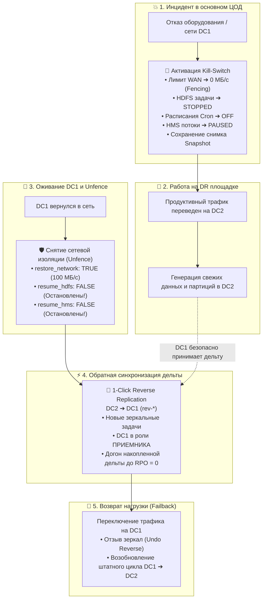

<div align="center">


# 🛡️ Руководство по Disaster Recovery: сетевая изоляция (Fencing), защита от перезаписи данных и безопасный Failback

</div>

Данный документ описывает регламент и архитектурные механизмы обеспечения непрерывности бизнеса (Disaster Recovery), аварийного переключения (Failover) и безопасного возврата нагрузки (Failback) в **Hadoop gRPC Replicator**.

---

## 1. Проблема Split-Brain и риск деструктивной перезаписи данных

В распределенных озерах данных (Data Lake) и корпоративных хранилищах на базе HDFS и Apache Hive при аварии основного дата-центра (**DC1 / Primary**) возникает критический риск возникновения состояния **Split-Brain** и потери данных.

### Сценарий возникновения катастрофической перезаписи (Data Overwrite):
1. **Штатный режим**: Данные реплицируются в прямом направлении: `DC1 ➔ DC2`.
2. **Авария DC1**: Основной ЦОД становится недоступен. Продуктивный трафик переключается на резервный ЦОД (**DC2 / Standby**).
3. **Работа на резерве**: Бизнес-системы, Spark/Flink пайплайны и пользователи пишут новые данные, создают таблицы и обновляют партиции непосредственно в **DC2**. В этот момент DC2 содержит наиболее актуальное состояние данных, а DC1 отстает на весь объем изменений, произошедших за время аварии.
4. **Оживание DC1**: Физическое питание или сетевая связность в DC1 восстанавливаются. Кластер DC1 возвращается в сеть со **старым, неактуальным состоянием данных**.
5. **Риск Split-Brain при наивном снятии блокировки**:
   > [!CAUTION]
   > Если при оживании DC1 автоматически возобновить ранее запущенные прямые задачи репликации (`DC1 ➔ DC2`):
   > - Воркеры репликации на DC1 увидят свои старые файлы и попытаются синхронизировать их в DC2.
   > - При наличии логики синхронизации каталогов (зеркалирование) старый DC1 **перезапишет или удалит свежие файлы на DC2**, созданные во время аварии!
   > - CDC-стример Hive Metastore на DC1 попытается накатить устаревшие состояния схем и партиций поверх обновленных метаданных DC2.
   > **Итог**: Безвозвратная потеря бизнес-данных за всё время работы резервного ЦОД.

---

## 2. Архитектурное решение: разделение сетевого ограждения и исполнения задач

Для 100% защиты от перезаписи данных в архитектуре Hadoop Replicator строго разделены два уровня управления:
1. **Сетевое ограждение (Network Fencing / Transport Level)** — управление лимитами пропускной способности WAN-канала в иерархическом шейпере Token Bucket.
2. **Исполнение задач (Task Execution / Data Flow Level)** — жизненный цикл репликационных задач HDFS и стримеров Hive Metastore CDC.



---

## 3. Пошаговый регламент Disaster Recovery (5 фаз)

<div align="center">
  
  <p><em>Рисунок 1: Консоль Disaster Recovery & Failover Hub в штатном режиме (активный WAN-канал DC1 ➔ DC2)</em></p>
</div>

### Фаза 1. Авария основного ЦОД и активация Kill-Switch
При подтверждении сбоя основного ЦОД (DC1) дежурный администратор платформы переходит в раздел **Disaster Recovery** и нажимает кнопку **🛑 Kill-Switch (Стоп DC1)** (или вызывает API).

<div align="center">
  
  <p><em>Рисунок 2: Модальное окно аварийного останова (Kill-Switch) с сетевым ограждением Fencing (0 МБ/с)</em></p>
</div>

**Что выполняет Оркестратор:**
1. **Перевод задач HDFS**: Все активные передачи кластера-источника немедленно переводятся в статус `STOPPED`, активные запуски прерываются.
2. **Деактивация планировщика**: У всех задач снимается признак периодического запуска (`isScheduled = false`), что гарантирует отсутствие фоновых срабатываний по Cron.
3. **Заморозка CDC Hive Metastore**: Все потоки репликации метаданных переводятся в статус `PAUSED`.
4. **Сетевое ограждение (Network Fencing)**: Иерархический шейпер выставляет лимит канала `DC1 ➔ Any` в **`0 МБ/с`**. Даже если изолированный агент попытается отправить чанк, он будет немедленно заблокирован на уровне Token Bucket.
5. **Создание Snapshot**: Фиксируется точный слепок состояния системы (активные задачи, лимиты, расписания, автор и причина остановки) для последующего корректного отката.
6. **Индикация**: Панель DC1 подсвечивается тревожной красной рамкой со статусом **`🔒 ПОДАВЛЕН (FENCED)`**, кнопка управления переключается в янтарный режим **`🛡️ Снять изоляцию / Откат`**.

<div align="center">
  
  <p><em>Рисунок 3: Сетевое ограждение и подавленное состояние кластера DC1 (Fenced) с тревожным баннером</em></p>
</div>

---

### Фаза 2. Переключение нагрузки на резервный ЦОД (DC2)
- Сетевые балансировщики и DNS перенаправляют клиентские подключения на NameNode и HiveServer2 дата-центра **DC2**.
- Приложения и ETL-процессы продолжают непрерывную работу.
- В консоли DR суммарный лаг дельты наглядно фиксирует объемы изменений, накапливающихся на DC2.

---

### Фаза 3. Оживание DC1 и снятие изоляции (Unfence) БЕЗ возобновления прямых задач
Когда инженеры инфраструктуры восстановили питание и сеть в DC1, узлы кластера снова становятся доступны по сети (`ONLINE`).

> [!IMPORTANT]
> **Главное правило безопасности**: При снятии аварийной блокировки восстанавливается **ТОЛЬКО** сетевой канал!
> Прямые задачи `DC1 ➔ DC2` **НЕ ДОЛЖНЫ** возобновляться автоматически!

**Действия оператора в UI:**
1. Нажать янтарную кнопку **`🛡️ Снять изоляцию / Откат (DC1)`** (или быструю ссылку «Снять» на баннере подавленного кластера).
2. В модальном окне:
   - Выбрать кластер `dc1 [ПОДАВЛЕН 🔒]`;
   - Оставить чекбокс **«Снять сетевое ограждение (Unfence Network)»** включенным (`true`) — это вернет пропускную способность канала в штатные 100 МБ/с, чтобы Оркестратор мог управлять агентами DC1, а DC1 мог выступать в роли целевого приемника данных;
   - Чекбоксы **«Возобновить старые схемы Hive Metastore»** и **«Возобновить старые HDFS задачи и их расписания»** по умолчанию **выключены (`false`)** и должны оставаться выключенными!
3. Нажать кнопку **«Снять ограничения»**.

<div align="center">
  
  <p><em>Рисунок 4: Модальное окно безопасного снятия изоляции (Unfence) с защитой от Split-Brain и перезаписи данных</em></p>
</div>

**Результат:**
- Сетевой канал разблокирован (лимит 100 МБ/с).
- Кластер DC1 больше не подавлен.
- **Старые прямые задачи остаются остановленными** (`STOPPED` / `PAUSED`), исключая любую возможность повреждения данных на DC2.

---

### Фаза 4. Обратная синхронизация дельты (Reverse Replication: `DC2 ➔ DC1`)
Теперь, когда сетевая связность есть, а старые прямые задачи безопасно заморожены, необходимо перенести все накопленные за время аварии данные из DC2 в восстановленный DC1.

**Действия оператора в UI:**
1. Нажать кнопку **🔄 Reverse Replication (DC2 ➔ DC1)** в заголовке консоли DR (или кнопки **«Развернуть ⇄»** в строках конкретных каталогов таблицы маршрутов).
2. Для защиты от случайного нажатия ввести проверочное слово `REVERSE` и подтвердить операцию.

<div align="center">
  
  <p><em>Рисунок 5: Мастер запуска обратной репликации (Reverse Replication DC2 ➔ DC1)</em></p>
</div>

**Что выполняет Оркестратор:**
1. Находит все прямые задачи `DC1 ➔ DC2` (включая остановленные аварийным остановом).
2. Автоматически создает **зеркальные задачи с противоположным направлением** `DC2 ➔ DC1` (с уникальным префиксом `rev-...`):
   - Меняются местами кластеры: `sourceClusterId = "dc2"`, `targetClusterId = "dc1"`;
   - Меняются местами каталоги данных: `sourcePath = direct.getTargetPath()`, `targetPath = direct.getSourcePath()`;
   - Сохраняются авторизационные параметры и UGI принципалы;
   - Создаются обратные потоки репликации CDC для баз данных Hive Metastore;
   - Задачи автоматически помещаются в очередь исполнения (`QUEUED`) и запускаются воркерами DC2.
3. В таблице маршрутов сгенерированные задачи помечаются фиолетовым бейджем **`Зеркало ⇄`**.
4. В блоке WAN-канала стрелка направления меняется на `DC2 ➔ DC1`.
5. Оператор отслеживает схождение лага (Delta Convergence) в реальном времени.

---

### Фаза 5. Возврат нагрузки (Failback) и возобновление штатного цикла
Когда отставание дельты достигает **RPO = 0** (все байты и CDC-события из DC2 полностью синхронизированы в DC1):
1. Продуктивный трафик плавно переключается обратно на **DC1**.
2. В консоли DR оператор нажимает янтарную кнопку **«Отозвать ↩»** у исходных маршрутов (или **«Удалить зеркало ✕»** у сгенерированных зеркал).
3. Оркестратор безопасно удаляет временные обратные задачи `DC2 ➔ DC1` и разблокирует прямой регламентный цикл `DC1 ➔ DC2`.

---

## 4. Матрица состояний задач на протяжении DR-цикла

| Фаза | Прямые HDFS задачи (DC1 ➔ DC2) | Прямые HMS потоки (DC1 ➔ DC2) | Сетевой лимит DC1 | Обратные задачи (DC2 ➔ DC1) | Направление трафика |
|---|---|---|---|---|---|
| **Штатный режим** | `RUNNING` / `SCHEDULED` | `ACTIVE` | 100 МБ/с | Отсутствуют | Клиенты на DC1 |
| **Kill-Switch (Авария DC1)** | `STOPPED` (`isScheduled=false`) | `PAUSED` | **0 МБ/с (Fenced)** | Отсутствуют | Клиенты на DC2 |
| **Unfence (Оживание DC1)** | `STOPPED` (Защищено от запуска) | `PAUSED` | **100 МБ/с (Открыт)** | Готовы к генерации | Клиенты на DC2 |
| **Reverse Replication** | `STOPPED` (Заморожены) | `PAUSED` | 100 МБ/с | **`QUEUED` / `RUNNING` (`rev-*`)** | Клиенты на DC2 |
| **Failback завершен** | `QUEUED` / `SCHEDULED` | `ACTIVE` | 100 МБ/с | Удалены (`undo-reverse`) | Клиенты на DC1 |

---

## 5. Автоматизация через REST API (Ansible / AWX / CI-CD)

Все операции консоли DR полностью доступны через программный REST API:

```bash
# 1. Проверка текущего DR статуса и лага непереданных данных
curl -s -X GET "http://orchestrator:8005/api/v1/dr/status" | jq .

# 2. Экстренный останов аварийного кластера DC1 с сетевым ограждением (Fencing)
curl -s -X POST "http://orchestrator:8005/api/v1/dr/emergency-stop" \
  -H "Content-Type: application/json" \
  -d '{
    "cluster_id": "dc1",
    "reason": "Аварийный сбой энергоснабжения основного ЦОД",
    "fence_network": true
  }'

# 3. Снятие сетевой изоляции после восстановления DC1 БЕЗ возобновления старых задач
# ВНИМАНИЕ: resume_hdfs и resume_hms передаются как false во избежание перезаписи!
curl -s -X POST "http://orchestrator:8005/api/v1/dr/emergency-stop/rollback" \
  -H "Content-Type: application/json" \
  -d '{
    "cluster_id": "dc1",
    "restore_network": true,
    "resume_hms": false,
    "resume_hdfs": false
  }'

# 4. Запуск обратной синхронизации дельты из DC2 в DC1
curl -s -X POST "http://orchestrator:8005/api/v1/dr/reverse" \
  -H "Content-Type: application/json" \
  -d '{
    "from_cluster_id": "dc2",
    "to_cluster_id": "dc1",
    "include_hdfs": true,
    "include_hms": true,
    "auto_start": true
  }'

# 5. Отзыв обратного зеркала после схождения лага и завершения Failback
curl -s -X POST "http://orchestrator:8005/api/v1/dr/jobs/{directJobId}/undo-reverse"
```

---

## 6. Чек-лист дежурного инженера при инциденте

- [ ] Зафиксировать факт недоступности DC1 в мониторинге;
- [ ] Активировать **🛑 Kill-Switch (Стоп DC1)** в DR-консоли;
- [ ] Убедиться, что на карточке DC1 горит статус **`🔒 ПОДАВЛЕН (FENCED)`**, а лимит канала равен `0 МБ/с`;
- [ ] Перевести продуктивный трафик приложений на DC2;
- [ ] После физического восстановления узлов DC1 выполнить **`🛡️ Снять изоляцию / Откат`**, **сняв галочки возобновления задач** (`resume_hdfs=false`, `resume_hms=false`);
- [ ] Запустить **`🔄 Reverse Replication (DC2 ➔ DC1)`**;
- [ ] Дождаться обнуления лага непереданных данных (`Lag = 0 B`, `0 CDC events`);
- [ ] Переключить продуктивный трафик обратно на DC1;
- [ ] Отозвать обратные зеркала через **«Отозвать ↩»** и вернуть прямую репликацию в штатный режим.
