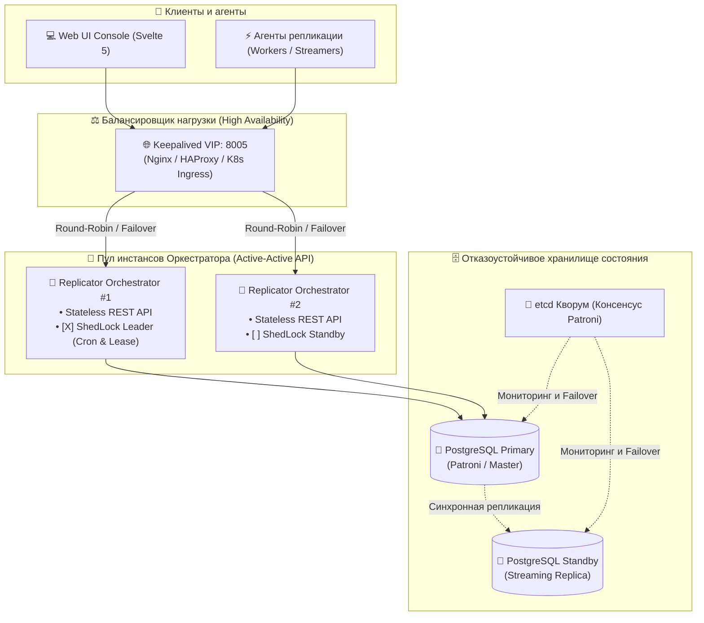
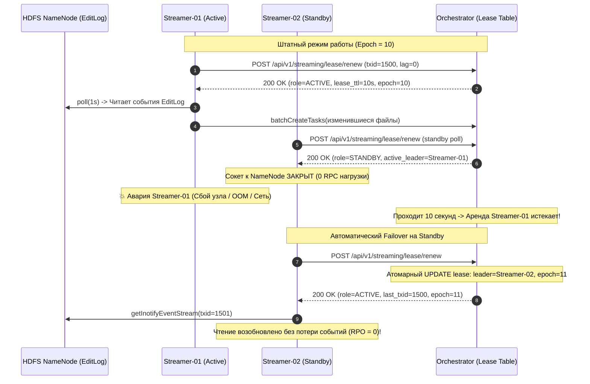
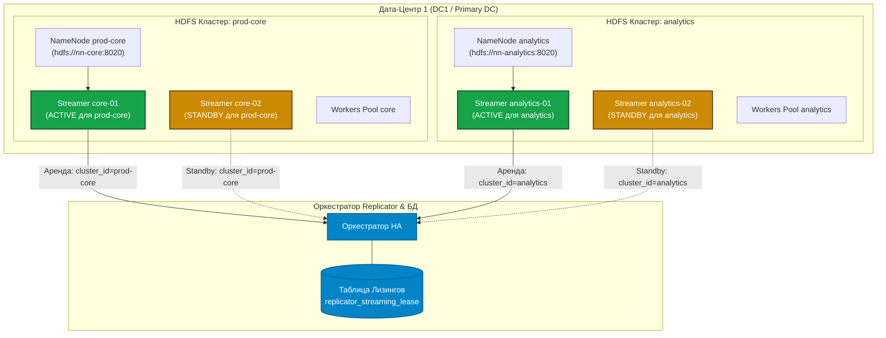
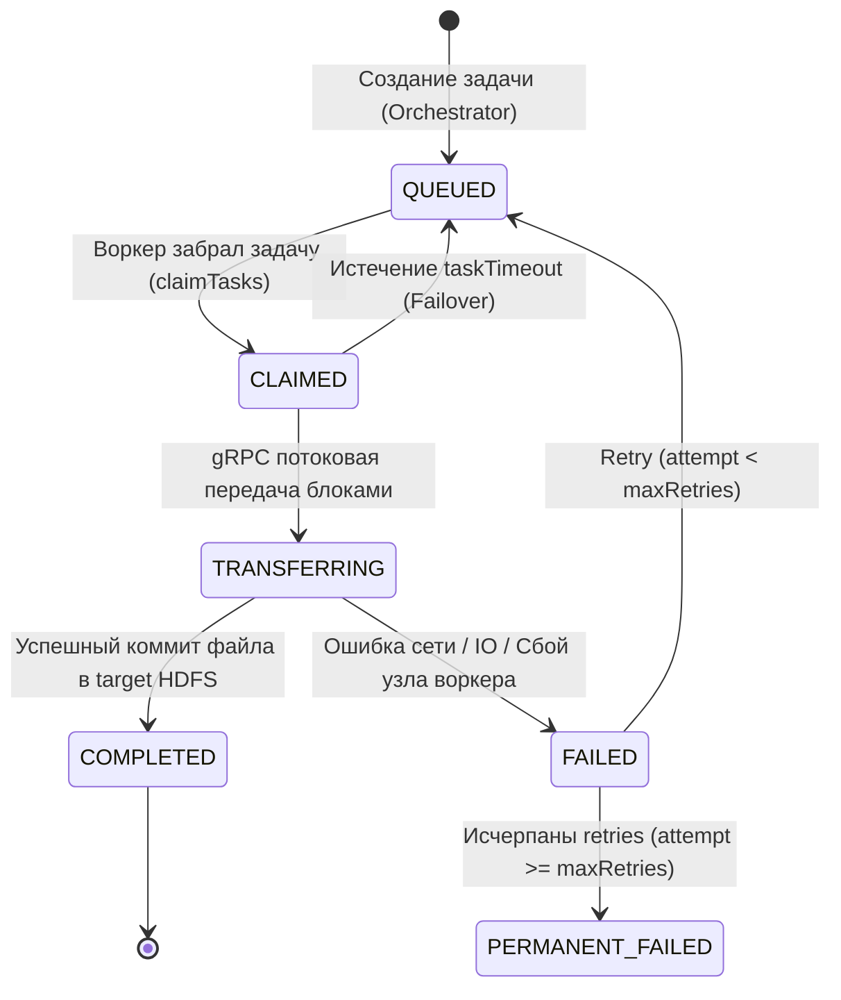
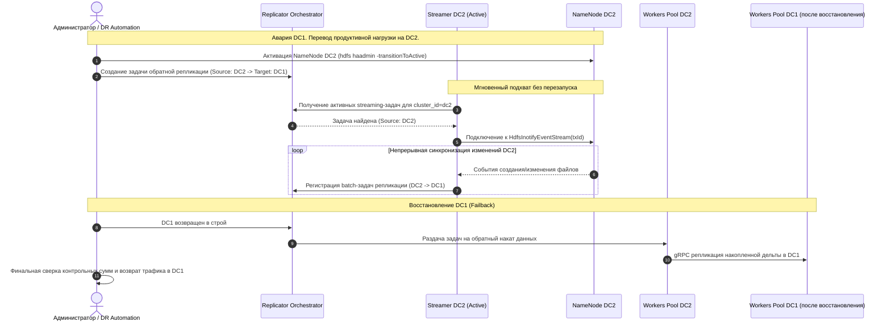

# 🛡️ Отказоустойчивость и высокая доступность (Hadoop gRPC Replicator HA Guide)

Данный документ описывает комплексную архитектуру отказоустойчивости, аварийного восстановления (Disaster Recovery), изоляции привилегий и распределенной координации всех компонентов платформы **Hadoop gRPC Replicator**.

---

## 1. Сводная матрица отказоустойчивости (Global Failure Matrix)

| Компонент | Сценарий сбоя | Механизм обнаружения | Реакция системы и восстановление | RTO (Время восстановления) | RPO (Потеря данных) |
|---|---|---|---|---|---|
| **Orchestrator** | Падение инстанса #1 (OOM, сбой сервера) | L7 Балансировщик (`GET /api/v1/health` таймаут) | Балансировщик переключает HTTP/UI на инстанс #2. ShedLock передает фоновые шедулеры. | **1–3 сек** | **0** (Stateless API + Shared DB) |
| **PostgreSQL (Orchestrator DB)** | Падение Primary БД | Patroni / etcd кворумный мониторинг | Patroni автоматически повышает Standby реплику до Primary. Пул PgBouncer переподключается. | **3–5 сек** | **0** (Синхронная репликация) |
| **Inotify Streamer (Active)** | Падение процесса стримера (DC1) | Heartbeat Lease Timeout в БД Оркестратора (> 10 сек) | Standby Streamer захватывает лидерство, читает EditLog с `last_committed_txid`. | **5–10 сек** | **0 (Near-Zero RPO)** |
| **Inotify Streamer Pool** | Разрыв истории EditLog (`MissingEventsException`) | Перехват исключения клиентом `DFSInotifyEventInputStream` | Авто-переключение на инкрементальное сканирование директорий (Reconciliation Scan). | **Время сканирования** | **0** (Полная сверка каталогов) |
| **Data Worker (Sender)** | Падение воркера во время передачи файла | Пропадание Heartbeat воркера / таймаут задачи | Оркестратор возвращает задачу в статус `QUEUED`. Другой воркер пула берет задачу на повтор. | **По таймауту задачи (60 сек)** | **0** (Повторная передача файла) |
| **Data Receiver** | Сбой узла назначения во время gRPC стрима | Сетевой обрыв gRPC стрима (`UNAVAILABLE`) | Воркер пробует альтернативный адрес приемника из топологии. Незавершенный staging файл удаляется. | **Мгновенно (retry)** | **0** (Атомарный commit в staging) |
| **HDFS NameNode (Source/Target)** | Падение Active NameNode | Hadoop Client `ConfiguredFailoverProxyProvider` | Прозрачный failover клиента на Standby NameNode по виртуальному URI `hdfs://nameservice1`. | **1–3 сек** | **0** (JournalNodes кворум) |
| **HMS Replicator** | Падение агента синхронизации схемы | Истечение Distributed Lease в `HmsCoordinatorService` | Авто-failover задачи на резервный агент кластера. Чтение CDC продолжается с `last_event_id`. | **5–10 сек** | **0** (At-least-once DDL лог) |

---

## 2. Отказоустойчивость Оркестратора (Orchestrator HA)

Оркестратор репликации спроектирован как **Stateless вычислительный узел** с внешним распределенным состоянием в отказоустойчивой СУБД PostgreSQL.



### 2.1. Балансировка и распределение запросов
1. **Единая точка входа**: Все агенты и пользователи обращаются по виртуальному адресу `https://replicator.company.local:8005`.
2. **Stateless сессии**: Аутентификация через JWT Cookies (`common-security-starter`), подписанные общим ключом `hadoop.security.jwt.secret-key`. Запросы любого пользователя или агента могут обрабатываться любым инстансом оркестратора без Sticky Sessions.
3. **Health Monitoring**: Балансировщик опрашивает `GET /actuator/health` или `GET /api/v1/health`. При недоступности инстанса трафик переключается за 1 секунду.

### 2.2. Защита от дублирования шедулеров (ShedLock & Distributed Locks)
Фоновые периодические задачи (Cron Scheduler, проверка брошенных задач HMS, мониторинг оффлайн-агентов) защищены распределенными блокировками **ShedLock** на уровне PostgreSQL:
```java
@Scheduled(fixedDelayString = "${hadoop.replicator.hms-failover-check-ms:3000}")
@SchedulerLock(name = "hms_failover_task_lock", lockAtLeastFor = "1s", lockAtMostFor = "10s")
public void checkAndFailoverOrphanedHmsJobs() {
    // Выполняется строго на одном инстансе оркестратора
}
```
Если активный узел упал во время исполнения шедулера, блокировка автоматически освобождается по таймауту `lockAtMostFor`, и второй инстанс подхватывает выполнение следующего тика.

---

## 3. Отказоустойчивость потокового стриминга HDFS Inotify (Streamer HA)

Потоковый слушатель транзакций EditLog NameNode (`DFSInotifyEventInputStream`) обеспечивает Near-Zero RPO. Потеря стримера или его зависание недопустимы.

### 3.1. Требование $N \ge 2$ и модель Active-Standby
На кластере источника обязательно развертываются **минимум 2 инстанса стримера** (`streamer-01` и `streamer-02`), но только **один работает в статусе ACTIVE**.



### 3.2. Защита от Split-Brain (Lease Fencing & Epochs)
Для предотвращения ситуации, когда "зависший" старый лидер оживает и начинает параллельно слать события:
1. **Client-side Deadline**: Активный стример знает время жизни своей аренды (10 сек). Если в течение 10 секунд он не смог продлить аренду в Оркестраторе, он **обязан немедленно закрыть стрим NameNode**.
2. **Server-side Epoch Guard**: Каждая смена лидера инкрементирует `epoch`. Оркестратор отвергает любые запросы старого лидера с устаревшим токеном эпохи (`409 Conflict: Stale leader epoch`).

### 3.3. Изоляция безопасности (Security Privilege Isolation)
* Стример запускается в строго изолированном режиме: `AGENT_MODE=streamer`.
* **Полная блокировка исполнения задач**:
  * Воркер-цикл заблокирован: агент физически не вызывает `claimTasks`.
  * Приемник заблокирован: gRPC сервер (`:50051`) не открывается.
  * Оркестратор в `TaskService.claimTasks()` возвращает `403 Forbidden` для стримеров.
* Стример владеет привилегированным Kerberos Keytab (`hdfs-streamer@REALM` с правами `supergroup`), но **никогда не касается содержимого пользовательских данных**.

### 3.4. Обработка разрыва EditLog (`MissingEventsException`)
Если оба стримера были недоступны длительное время и NameNode уже удалила старые сегменты EditLog:
1. `stream.poll()` выбрасывает `MissingEventsException(expectedTxid, actualTxid)`.
2. Агент перехватывает исключение и фиксирует статус **`STREAM_GAP_DETECTED`**.
3. Запускается **автоматический Reconciliation Fallback**: фоновый инкрементальный обход каталогов через `analyzeAndCreateTaskPool` для восстановления консистентности.
4. После завершения обхода чтение Inotify возобновляется с `actualTxid`.

### 3.5. Игнорирование Staged-директорий и коммит через `RenameEvent`
Во время записи Spark, Hive и Tez создают временные staging-каталоги (`.hive-staging`, `_temporary`, `.spark-staging`, `.staging`, `.tmp`):
* **Защита от передачи незавершенных попыток**:
  * Любые события `CreateEvent`, `CloseEvent`, `AppendEvent` внутри таких путей **полностью игнорируются** стримером через `HadoopFsManager.isIgnoredPath()`.
  * Незавершенные или отмененные задачи (speculative execution / aborted tasks) не загрязняют целевой кластер и не тратят WAN-трафик.
* **Распознавание коммита (Staged ➔ Committed)**:
  * В момент фиксации коммиттер выполняет `fs.rename(stagedFile, targetFile)`.
  * NameNode генерирует `RenameEvent`.
  * Стример проверяет: `isIgnoredPath(srcPath) == true` и `isIgnoredPath(dstPath) == false`.
  * Стример фиксирует факт **финального коммита** и мгновенно ставит `dstPath` в очередь репликации как готовый файл.

### 3.6. Мультикластерная топология в одном ЦОД: изоляция стримеров по `cluster_id`

В корпоративной инфраструктуре в границах одного дата-центра (например, `dc1`) регулярно сосуществуют несколько независимых HDFS кластеров: например, `prod-core` (транзакционный data lake), `analytics` (витрины данных) и `archive` (холодный архив).



#### Принципы разделения и изоляции:
1. **Каждому кластеру HDFS — свой выделенный пул стримеров**:
   - Inotify является сокет-протоколом конкретного NameNode конкретного кластера (`dfsClient.getInotifyEventStream()`). Каждый кластер имеет свой собственный EditLog и независимый монотонный счетчик транзакций `txId`.
   - Для каждого кластера запускается собственный отказоустойчивый пул стримеров (минимум 2 инстанса на кластер):
     - Кластер `prod-core`: `CLUSTER_ID=prod-core`, `HADOOP_NAMENODE_RPC_ADDRESS=hdfs://nn-core:8020`.
     - Кластер `analytics`: `CLUSTER_ID=analytics`, `HADOOP_NAMENODE_RPC_ADDRESS=hdfs://nn-analytics:8020`.
2. **Изоляция распределенной аренды (Lease Per Cluster)**:
   - В таблице `replicator_streaming_lease` первичным ключом является `cluster_id`.
   - Запросы на продление аренды разделяются: пул кластера `prod-core` соревнуется за запись `cluster_id='prod-core'`, а пул кластера `analytics` — за запись `cluster_id='analytics'`.
   - Никаких взаимных блокировок, гонок или интерференций между стримерами разных кластеров не происходит.
3. **Маршрутизация и фильтрация событий**:
   - Стример кластера `prod-core` запрашивает у Оркестратора только те задачи репликации, где `source_cluster_id == 'prod-core'`, и отслеживает пути только своего NameNode.
   - Стример кластера `analytics` аналогично обрабатывает только задачи с `source_cluster_id == 'analytics'`.
4. **Безопасность и Kerberos Realms**:
   - Если кластеры используют разные Kerberos Realms или разные Keytabs администраторов HDFS, стримеры каждого пула монтируют соответствующие локальные keytab файлы для своего NameNode.
5. **Сетевой шейпинг (Hierarchical Token Bucket)**:
   - Несмотря на независимость стримеров, Оркестратор объединяет оба кластера лимитами дата-центра (`dc_limits: dc1 ➔ dc2`) и общим пулом (`global_limit`). При передаче файлов воркерами трафик с обоих кластеров суммируется и никогда не перегружает общую сетевую магистраль ЦОД.

---

## 4. Отказоустойчивость пула воркеров (Data Worker Pool HA)

Воркеры репликации (`AGENT_MODE=worker` или `all`) забирают атомарные задачи на передачу файлов из распределенной очереди Оркестратора.



1. **Динамический пул воркеров**: Воркеры можно свободно масштабировать горизонтально (добавлять и выводить DataNodes или YARN контейнеры) без остановки репликации.
2. **Таймауты задач (`taskTimeoutSeconds = 60`)**: Если воркер взял задачу и пропал (сбой JVM, авария сети), фоновый монитор Оркестратора возвращает задачу в статус `QUEUED`.
3. **Автоматические повторы (`maxTaskRetries = 3`)**: При транзиентных сбоях сети задача передается повторно с экспоненциальной задержкой.
4. **Идемпотентность передачи**: Приемник сохраняет файлы во временный каталог `staging` (`.tmp-transfer-<uuid>`), сверяет размер и контрольную сумму, и только затем выполняет атомарный `rename`.

---

## 5. Отказоустойчивость приемников (Receiver HA)

Приемник (`DataTransferServiceImpl`) развертывается на каждом узле кластера назначения:
1. **Динамический выбор узла назначения**: Если целевой агент недоступен по gRPC, Sender запрашивает у Оркестратора альтернативный узел назначения из топологии кластера (`GET /api/v1/clusters/{id}/nodes`).
2. **Очистка незавершенных файлов (Staging Cleanup)**: При аварийном обрыве gRPC соединения временный файл в staging директории удаляется сборщиком мусора приемника (`cleanupStagingOrphans()`), предотвращая утечку дискового пространства.

---

## 6. Отказоустойчивость синхронизации Hive Metastore (HMS HA)

Синхронизация схем метаданных опирается на распределенный лизинг в `HmsCoordinatorService.java`:
1. **Автоматический Failover брошенных задач**: Фоновый таймер `checkAndFailoverOrphanedHmsJobs()` каждые 3 секунды проверяет статус агентов. Если назначенный агент перешел в `OFFLINE`, аренда сбрасывается и задача переназначается живому агенту.
2. **Гарантия согласованности (Data-First Consistency Barrier)**: DDL партиции в целевом метасторе применяется **строго после** того, как файлы HDFS гарантированно реплицированы и смаплены на целевой диск.

---

## 7. Мониторинг, метрики и алерты отказоустойчивости

### Метрики Prometheus / Micrometer

| Метрика | Тип | Описание |
|---|---|---|
| `replicator_streamer_active_count` | Gauge | Количество активных лидеров стриминга (норма: ровно 1 на кластер) |
| `replicator_streamer_standby_count`| Gauge | Количество резервных стримеров в пуле (норма: $\ge 1$) |
| `replicator_streamer_txid_lag`      | Gauge | Отставание стримера от NameNode в количестве транзакций |
| `replicator_orchestrator_ha_leader`| Gauge | Флаг лидера фоновых процессов текущего инстанса (1 или 0) |
| `replicator_worker_claimed_tasks`  | Gauge | Количество задач, находящихся в обработке воркерами |
| `replicator_task_retry_total`      | Counter | Общее количество перезапущенных задач из-за сбоев воркеров |

### Критические алерты (Alerting Rules)

```yaml
groups:
  - name: replicator-ha-alerts
    rules:
      - alert: ReplicatorStreamerNoStandby
        expr: replicator_streamer_standby_count{cluster="dc1"} < 1
        for: 2m
        labels:
          severity: warning
        annotations:
          summary: "Отсутствует резервный Streamer инстанс для кластера {{ $labels.cluster }}"
          description: "В кластере работает только 1 стример. При его падении Near-Zero RPO будет нарушен."

      - alert: ReplicatorStreamerSplitBrainRisk
        expr: replicator_streamer_active_count{cluster="dc1"} > 1
        for: 10s
        labels:
          severity: critical
        annotations:
          summary: "Обнаружен Split-Brain стримеров в кластере {{ $labels.cluster }}"
          description: "Более одного активного стримера читают EditLog одновременно!"

      - alert: ReplicatorStreamerHighLag
        expr: replicator_streamer_txid_lag > 50000
        for: 3m
        labels:
          severity: warning
        annotations:
          summary: "Высокое отставание стримера Inotify (лаг > 50 000 транзакций)"
          description: "Риск переполнения EditLog и выпадения в MissingEventsException."
```

---

## 8. Чек-лист проверки готовности к промышленной эксплуатации (Production HA Checklist)

- [ ] Развернуто минимум **2 инстанса Оркестратора** за балансировщиком нагрузки с Keepalived VIP.
- [ ] База данных PostgreSQL сконфигурирована в режиме HA (Patroni / AWS RDS Multi-AZ).
- [ ] В каждом исходном кластере запущено минимум **2 стримера** (`AGENT_MODE=streamer`) на независимых Edge-нодах.
- [ ] Стримеры используют выделенный Kerberos Keytab суперпользователя и изолированы от исполнения задач (`claimTasks` заблокирован).
- [ ] Параметр `hadoop.replicator.streaming.auto-reconciliation-on-gap` установлен в `true`.
- [ ] Настроены Prometheus-алерты на отсутствие Standby-стримера и лаг транзакций.

---

## 9. Резервирование стримеров во втором ЦОД (DC2 / DR) и обратная синхронизация при Failover

Для обеспечения отказоустойчивости корпоративного уровня (Disaster Recovery) архитектура Replicator поддерживает развертывание стримеров в нескольких датацентрах (DC1 и DC2) одновременно.

### Архитектура пулов стримеров между ЦОД

Каждый датацентр обслуживается независимой группой стримеров, привязанных к своему кластеру через `CLUSTER_ID`:

```mermaid
flowchart TB
    subgraph DC1 ["Первичный ЦОД (DC1 / Primary)"]
        NN1["NameNode DC1 (Active)"]
        S1A["Streamer DC1-01 (ACTIVE)"]
        S1B["Streamer DC1-02 (STANDBY)"]
        W1["Workers Pool DC1"]
    end

    subgraph OrchestratorCluster ["Кластер Оркестраторов & БД"]
        ORCH["Orchestrator HA (VIP)"]
        DB[(PostgreSQL)]
        ORCH --- DB
    end

    subgraph DC2 ["Второй ЦОД (DC2 / Disaster Recovery)"]
        NN2["NameNode DC2 (Standby / Target)"]
        S2A["Streamer DC2-01 (ACTIVE для DC2)"]
        S2B["Streamer DC2-02 (STANDBY для DC2)"]
        W2["Workers Pool DC2"]
    end

    NN1 -->|Inotify stream| S1A
    S1A -->|Прямой поток задач DC1->DC2| ORCH
    ORCH -->|Задачи копирования| W1
    W1 -->|gRPC Data Transfer| W2

    NN2 -.->|Inotify stream (Готовность)| S2A
    S2A -.->|Аренда dc2 удерживается (Idle)| ORCH

    classDef active fill:#22c55e,stroke:#15803d,color:#ffffff,stroke-width:2px;
    classDef standby fill:#eab308,stroke:#a16207,color:#ffffff,stroke-width:2px;
    classDef db fill:#0284c7,stroke:#0369a1,color:#ffffff,stroke-width:2px;

    class S1A,S2A active;
    class S1B,S2B standby;
    class DB,ORCH db;
```

### Поведение стримера в DC2 в штатном режиме (Warm Standby)

1. **Независимый лизинг на уровне ЦОД**:
   - В таблице `replicator_streaming_lease` записи ведутся с разделением по ключу `cluster_id` (`dc1` и `dc2`).
   - Стримеры в DC2 соревнуются за лидерство исключительно в рамках `cluster_id="dc2"`. Один из них становится `ACTIVE` для `dc2`, второй — `STANDBY`.
2. **Изоляция потоков событий**:
   - Метод `HdfsInotifyListener` сопоставляет задачи репликации с локальным идентификатором кластера:
     ```java
     boolean matchesCluster(String jobClusterId, String agentClusterId)
     ```
   - В штатном режиме активные задачи репликации имеют `sourceClusterId="dc1"`. Стример в DC2 фильтрует их: для него список локальных задач пуст (`jobs.isEmpty()`).
   - Стример DC2 удерживает лизинг кластера `dc2`, не генерирует сетевых запросов на репликацию и находится в состоянии «горячего резерва» (Warm Standby), непрерывно отслеживая здоровье локального NameNode DC2.

---

### Сценарий аварии DC1 и переключения на DC2 (Failover)

При наступлении аварии в DC1 (отказ оборудования, каналов связи или затопление ЦОД):



### Преимущества запуска стримера во втором ЦОД:

1. **Zero Downtime при Failover**: Не требуется развертывать или переконфигурировать новые процессы стриминга во время аварии — агент в DC2 уже запущен, аутентифицирован по Kerberos и держит соединение.
2. **Мгновенный старт с сохраненного TxID**: При появлении задачи обратной репликации стример начинает чтение EditLog NameNode DC2 с актуальной сохраненной точки.
3. **Безопасность**: Стример в DC2 также работает в изолированном режиме (`AGENT_MODE=streamer`), имеет права только на чтение EditLog своего кластера и не берет на исполнение задачи воркеров (`claimTasks`).

### Конфигурация запуска Streamer для DC2

```bash
# Запуск основного стримера в DC2
export AGENT_MODE=streamer
export CLUSTER_ID=dc2
export HADOOP_STREAMING_ENABLED=true
export HADOOP_NAMENODE_RPC_ADDRESS=hdfs://nn-dc2-01.prod.corp:8020
export KERBEROS_PRINCIPAL=hdfs-streamer/edge-dc2-01.prod.corp@PROD.CORP
export KERBEROS_KEYTAB=/etc/security/keytabs/hdfs-streamer.keytab

java -jar /opt/replicator-agent/replicator-agent.jar
```

---

## 13. Консоль аварийного переключения (DR Console & 1-Click Reverse API)

Для исключения человеческого фактора во время инцидентов платформа оснащена выделенным разделом **Disaster Recovery** в веб-интерфейсе и REST API `/api/v1/dr/*`:

1. **Экстренный останов аварийного кластера (Kill-Switch)**:
   - В один клик переводит все активные задачи упавшего дата-центра в статус `STOPPED`, отключает периодический планировщик и активирует сетевое ограждение (Fencing, лимит канала 0 МБ/с), предотвращая Split-Brain.
2. **Автоматическая инверсия потока данных (1-Click Reverse Replication)**:
   - Создает обратные задачи `DC2 ➔ DC1` для всех каталогов HDFS и баз данных Hive Metastore с сохранением UGI-принципалов и путей, автоматически запуская синхронизацию накопившейся дельты изменений.
3. **Мониторинг отставания дельты (Delta Lag Convergence)**:
   - Отображает объемы несинхронизированных байтов и событий CDC в реальном времени, сигнализируя о моменте достижения RPO = 0 для безопасного возврата продуктивной нагрузки.
4. **Безопасное снятие изоляции без перезаписи данных (Unfence & Failback Protection)**:
   - При оживании DC1 выполняется снятие сетевого ограждения (Unfence Network), но прямые задачи остаются остановленными во избежание перезаписи свежих данных на DC2.
   - Детальный пошаговый регламент и архитектурные диаграммы представлены в документе: [Руководство по Disaster Recovery и защите от Split-Brain (replicator-disaster-recovery-guide.md)](file:///Users/mvmalykh/IdeaProjects/hadoop-explorer/docs/replicator-disaster-recovery-guide.md).


