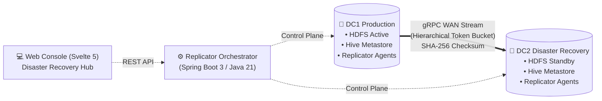
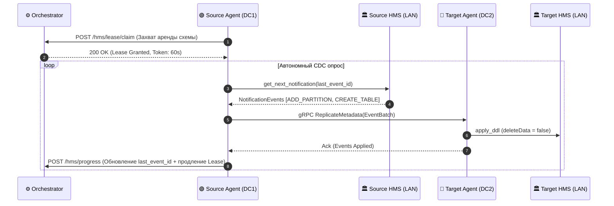
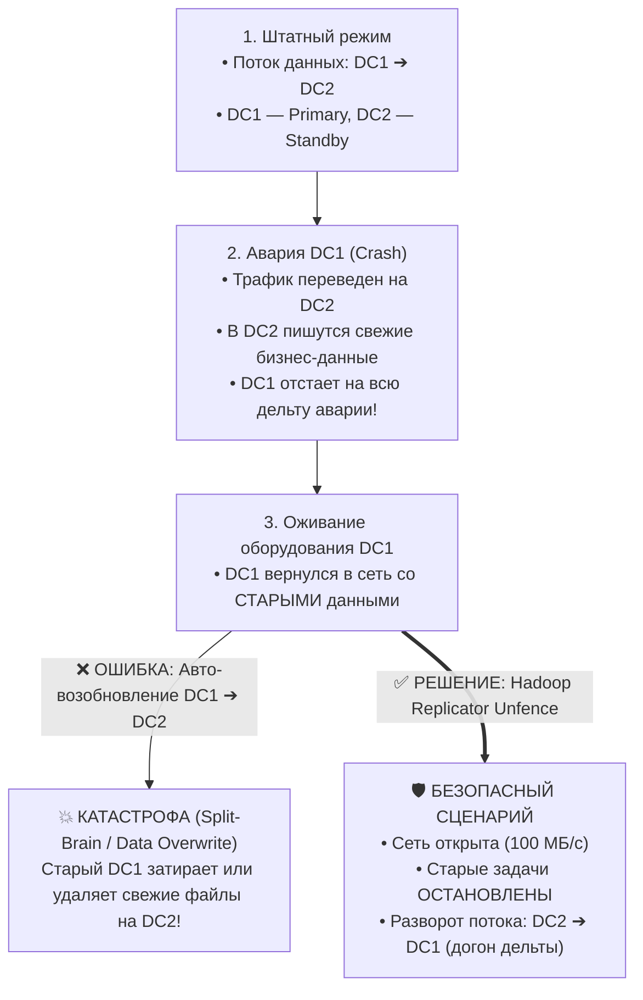

# 📊 Презентация платформы: Hadoop gRPC Replicator
## Высокопроизводительная межкластерная репликация HDFS и Hive Metastore с защитой от Split-Brain и иерархическим контролем полосы WAN

<div align="center">
  
  <p><strong>Материалы для проведения технической презентации и демонстрации команде</strong></p>
  <p><em>Архитектура, протоколы передачи данных, сетевой шейпинг, CDC Hive Metastore и регламент Disaster Recovery</em></p>
</div>

---

## 📑 Структура доклада (Слайды)

1. [Слайд 1: Титульный — Миссия и назначение сервиса](#слайд-1-титульный--hadoop-grpc-replicator)
2. [Слайд 2: Проблематика — Почему Apache DistCp больше не решает задачи бизнеса](#слайд-2-проблематика--почему-apache-distcp-устарел)
3. [Слайд 3: Высокоуровневая архитектура всей конструкции (Control Plane vs Data Plane)](#слайд-3-высокоуровневая-архитектура-всей-конструкции)
4. [Слайд 4: Топология дата-центров и иерархический шейпер (Hierarchical Token Bucket)](#слайд-4-топология-цод-и-шейпер-полосы-hierarchical-token-bucket)
5. [Слайд 5: Интерфейс управления — Аутентификация и безопасность](#слайд-5-интерфейс-управления--аутентификация-и-rbac)
6. [Слайд 6: HDFS Data Plane — Протокол передачи, Zero-Staging и упаковка мелких файлов](#слайд-6-hdfs-data-plane--протокол-передачи-и-оптимизации)
7. [Слайд 7: Интерфейс управления — Главный дашборд и мастер создания задач](#слайд-7-интерфейс-управления--главный-дашборд-и-создание-задач)
8. [Слайд 8: История запусков, аудит и политика хранения (Retention Policy)](#слайд-8-история-запусков-и-политика-хранения-retention)
9. [Слайд 9: Архитектура репликации Hive Metastore (HMS CDC & Inotify Lease)](#слайд-9-репликация-hive-metastore-hms-cdc--inotify-lease)
10. [Слайд 10: Интерфейс управления — Непрерывная потоковая синхронизация схем HMS](#слайд-10-интерфейс-управления--hms-replication-console)
11. [Слайд 11: Катастрофоустойчивость и риск Split-Brain при аварии основного ЦОД](#слайд-11-катастрофоустойчивость-и-риск-split-brain)
12. [Слайд 12: 5-фазный регламент Disaster Recovery: от Kill-Switch до Failback](#слайд-12-5-фазный-архитектурный-регламент-disaster-recovery)
13. [Слайд 13: Интерфейс управления — DR Hub, Kill-Switch и состояние сетевого ограждения](#слайд-13-интерфейс-управления--dr-hub-и-сетевое-ограждение)
14. [Слайд 14: Интерфейс управления — Безопасный Unfence и 1-Click Reverse Replication](#слайд-14-интерфейс-управления--снятие-изоляции-и-разворот-потока)
15. [Слайд 15: Сквозная безопасность, Kerberos Proxy User doAs и Ranger Audit](#слайд-15-безопасность-kerberos-doas-и-apache-ranger)
16. [Слайд 16: Сравнительный анализ (Hadoop Replicator vs Альтернативы)](#слайд-16-сравнительный-анализ-с-альтернативами)
17. [Слайд 17: Эксплуатация, метрики Prometheus и Smoke-тестирование](#слайд-17-эксплуатация-мониторинг-и-автоматические-тесты)
18. [Слайд 18: Итоги и вопросы команды (Q&A)](#слайд-18-итоги-и-обсуждение-с-командой)

---

## Слайд 1: Титульный — Hadoop gRPC Replicator

### Корпоративная межкластерная репликация HDFS и Hive Metastore нового поколения

- **Сервис**: `Hadoop gRPC Replicator` (входит в стек **Hadoop Explorer Platform**);
- **Стек бэкенда**: Java 21 LTS, Spring Boot 3.3.4, gRPC / Protobuf, Netty, Spring Data JPA;
- **Стек фронтенда**: TypeScript, Svelte 5 (Runes), Tailwind CSS, Vite;
- **Целевая среда**: Распределенные кластеры Apache Hadoop 3.x, HDP 3.1, Apache Hive 3/4, Kerberos / FreeIPA / Active Directory.



---

## Слайд 2: Проблематика — Почему Apache DistCp устарел?

### Классический стек межкластерного копирования Hadoop (DistCp) создает критические риски в Enterprise:

| Ограничение DistCp | Как это проявляется на практике | Решение в Hadoop gRPC Replicator |
|---|---|---|
| **YARN Contention** | DistCp запускает тяжелый MapReduce job; очереди переполняются, бизнес-ETL простаивает | **Zero-YARN footprint**: независимые легковесные gRPC-демоны на DataNode |
| **Неуправляемый WAN** | Забивает межЦОДный канал (10–40 Гбит/с), приводя к деградации клиентских сервисов | **Hierarchical Token Bucket**: строгий рантайм-шейпинг DC-DC, HDFS-HDFS и Global |
| **Мелкие файлы (Small Files)** | Миллионы файлов < 1 МБ перегружают NameNode и вызывают дисковый I/O шторм | **Tar-Streaming**: упаковка в потоки на лету с распаковкой прямо в память приемника |
| **Синхронизация схем Hive** | Отсутствует из коробки: метаданные Hive требуют отдельных самописных скриптов | **HMS CDC Engine**: потоковый захват `NOTIFICATION_LOG` и трансляция DDL в рантайме |
| **Отсутствие DR-защиты** | Нет защиты от Split-Brain; случайный запуск затирает обновленный резерв | **Failover Hub & Kill-Switch**: сетевое ограждение (0 МБ/с) + безопасный Unfence |
| **Сложный мониторинг** | Логи размазаны по YARN контейнерам; статус понятен только постфактум | **Real-Time UI Dashboard**: мгновенная скорость (МБ/с), ETA, байты, история запусков |

---

## Слайд 3: Высокоуровневая архитектура всей конструкции

### Строгое разделение Control Plane и Data Plane

```mermaid
flowchart TB
    subgraph UI_Layer["🖥️ Presentation Layer (UI SPA)"]
        Browser["Веб-интерфейс оператора (Svelte 5 / Tailwind)<br/>• Мониторинг задач и скорости • Управление полосой в рантайме<br/>• Консоль Disaster Recovery • Репликация Hive Metastore"]
    end

    subgraph Control_Plane["⚙️ Control Plane (Orchestrator)"]
        Orch["Spring Boot 3 Orchestrator (Port: 8005)<br/>• Job Scheduler (Cron) • Agent Registry & Liveness Heartbeats<br/>• Hierarchical Token Bucket Quotas • Inotify/CDC Lease Manager<br/>• Split-Brain Protection State Machine"]
        DB[("Storage<br/>PostgreSQL / SQLite")]
        Orch <--> DB
    end

    subgraph Data_Plane_DC1["🏢 Data Plane — Data Center 1 (Source)"]
        Agent1["Replicator Agent 1 (Worker)<br/>(Java 21 / Netty gRPC)"]
        Agent2["Replicator Agent 2 (Worker)<br/>(Java 21 / Netty gRPC)"]
        HDFS1[("HDFS NameNode / DataNodes<br/>(DC1 Primary)")]
        HMS1["Hive Metastore 1<br/>(Thrift 9083)"]
        Agent1 <--> HDFS1
        Agent2 <--> HDFS1
        Agent1 <--> HMS1
    end

    subgraph Data_Plane_DC2["🏢 Data Plane — Data Center 2 (Target)"]
        Recv1["Replicator Agent 3 (Receiver)<br/>(Port: 50051 gRPC)"]
        Recv2["Replicator Agent 4 (Receiver)<br/>(Port: 50051 gRPC)"]
        HDFS2[("HDFS NameNode / DataNodes<br/>(DC2 Standby)")]
        HMS2["Hive Metastore 2<br/>(Thrift 9083)"]
        Recv1 <--> HDFS2
        Recv2 <--> HDFS2
        Recv1 <--> HMS2
    end

    Browser <== "REST API / SSE (JWT / SPNEGO)" ==> Orch
    Orch <.. "Heartbeats, Lease, Task Claim" ..> Agent1
    Orch <.. "Heartbeats, Lease, Task Claim" ..> Agent2
    Orch <.. "Heartbeats, Liveness" ..> Recv1
    Orch <.. "Heartbeats, Liveness" ..> Recv2

    Agent1 == "gRPC Data Stream (Zero-Copy Chunks 4MB)" ==> Recv1
    Agent2 == "gRPC Data Stream (Tar-Stream Small Files)" ==> Recv2
```

---

## Слайд 4: Топология ЦОД и шейпер полосы (Hierarchical Token Bucket)

### Гарантия защиты корпоративного WAN-канала от деградации

- **Сетевой шейпинг на 3 уровнях**:
  1. **Global WAN Cap**: предельная планка суммарного трафика всей компании (например, 120 МБ/с);
  2. **DC-DC WAN Limit**: квота магистрального канала между парой дата-центров (например, `DC1 ➔ DC2`: 100 МБ/с);
  3. **HDFS-HDFS Limit**: индивидуальные квоты между парами кластеров (`prod ➔ backup`: 60 МБ/с, `analytics ➔ backup`: 40 МБ/с).
- **Алгоритм работы**:
  - Перед отправкой каждого 4 МБ чанка воркер обращается к потокобезопасному `TokenBucketThrottler`.
  - Задержка вычисляется по узкому горлышку: $\text{delay} = \max(\text{delay}_{\text{global}}, \text{delay}_{\text{dc-dc}}, \text{delay}_{\text{hdfs-hdfs}})$.
  - **Рантайм-применение**: изменение лимита оператором в UI вступает в силу за **менее чем 1 секунду** без перезапуска воркеров!

<div align="center">
  
  <p><em>Рисунок: Раздел «Топология ЦОД и Полоса» с иерархическим шейпером Token Bucket</em></p>
</div>

---

## Слайд 5: Интерфейс управления — Аутентификация и RBAC

### Единая безопасность платформы и разграничение прав

- **Kerberos SSO (SPNEGO)**: бесшовный вход в один клик по билету операционной системы;
- **LDAP / Active Directory**: корпоративная авторизация по логину и паролю;
- **Ролевая модель (RBAC)**:
  - **`ADMIN` (`admin_user`)**: полный доступ к задачам, Kill-Switch, лимитам полосы и имперсонации любого пользователя;
  - **`WRITER` (`de_user`)**: создание и управление своими задачами репликации в рамках назначенной квоты;
  - **`READER` (`analyst_user`)**: режим аудита и мониторинга (Read-Only).

<div align="center">
  
  <p><em>Рисунок: Единый экран входа LDAP & SPNEGO с профилями быстрого переключения ролей</em></p>
</div>

---

## Слайд 6: HDFS Data Plane — Протокол передачи и оптимизации

### Экстремальная скорость передачи без перегрузки дисков и сети

1. **Потоковый gRPC-транспорт (Protobuf + Netty)**:
   - Передача данных чанками по 4 МБ с мультиплексированием HTTP/2;
   - Сквозное вычисление контрольной суммы SHA-256 на лету;
   - **Wire Compression (Zstandard / LZ4)**: сжатие текстовых форматов (CSV, JSON, логов) на лету с экономией до 70% WAN-трафика; автоматическое отключение для Parquet/ORC.
2. **Zero-Staging & Атомарная фиксация**:
   - Данные стримятся напрямую в целевой HDFS во временный файл `targetPath + "._staging_" + jobId`;
   - После подтверждения контрольной суммы вызывается мгновенный `fs.rename()`.
3. **Батчинг мелких файлов (Tar-Streaming)**:
   - Файлы размером < 1 МБ пакуются в виртуальный TAR-поток в памяти отправителя;
   - Распаковка и запись выполняются параллельно на стороне приемника без промежуточных файлов на локальном диске узла.
4. **4-уровневый HDFS Garbage Collector (Reaper)**:
   - Автоматическая очистка staging-файлов при разрыве сетевого соединения;
   - Предстартовая очистка перед перезапуском упавшей задачи;
   - Фоновый сборщик мусора каждые 15 минут удаляет файлы старше 30 минут;
   - Временные файлы автоматически исключаются из Diff-манифестов.

---

## Слайд 7: Интерфейс управления — Главный дашборд и создание задач

### Оперативный контроль репликации в режиме реального времени

<div align="center">
  
  <p><em>Рисунок: Главная панель HDFS Replication — интерактивные счетчики, скорость (⚡ МБ/с), ETA и таблица</em></p>
</div>

- **Создание задачи репликации**:
  - Выбор кластеров источника и приемника с автоматической подстановкой дата-центров;
  - Встроенный планировщик периодических запусков (Cron: `@every_5m`, `@hourly`, произвольные выражения);
  - Настройка глубины хранения истории запусков (Retention Policy);
  - Поддержка Kerberos doAs имперсонации с фиксацией в аудите.

<div align="center">
  
  <p><em>Рисунок: Мастер создания задачи с выбором кластеров, путей, шедулера и Kerberos doAs</em></p>
</div>

---

## Слайд 8: История запусков и политика хранения (Retention)

### Детальная аналитика каждого выполнения и автоматический прунинг

- **Сводные показатели задачи**: общее число запусков, процент успехов, сбои, суммарный переданный объем;
- **Журнал выполнений**: хронология с фиксацией времени старта, финиша, фактической длительности и средней скорости передачи данных;
- **Retention Control**: динамическое изменение глубины хранения истории запусков прямо из интерфейса (автоматическая очистка устаревших записей в БД).

<div align="center">
  
  <p><em>Рисунок: Детальная история выполнений задачи, средняя скорость и настройка Retention</em></p>
</div>

---

## Слайд 9: Репликация Hive Metastore (HMS CDC & Inotify Lease)

### Синхронизация метаданных баз и таблиц между версиями Hive



- **Архитектурные гарантии HMS Engine**:
  - **Non-ACID Gate**: безопасная репликация External и Non-Transactional Managed таблиц; ACID-таблицы корректно фильтруются;
  - **HDFS Federation NameService Mapping**: автоматическая замена `hdfs://ns-dc1/` на `hdfs://ns-dc2/` в путях партиций;
  - **Изоляция HDFS-подзадач**: саб-джобы переноса данных (`HMS_SUBJOB`) привязаны к схеме и не засоряют основной список HDFS;
  - **Распределенный эксклюзивный лизинг (Inotify Lease HA)**: исключает гонки между агентами; при отказе воркера другой агент мгновенно перехватывает CDC-поток без потери позиции.

---

## Слайд 10: Интерфейс управления — HMS Replication Console

### Непрерывный мониторинг схем, лага событий и жизненного цикла

<div align="center">
  
  <p><em>Рисунок: Консоль HMS Replication — статус стримеров CDC, Event Lag и таблица схем</em></p>
</div>

- **Создание репликации схемы**:
  - Выбор баз источника и приемника, маска включения таблиц (`Include Pattern`);
  - Опции безопасной двусторонней сверки (`drop_extraneous_tables` с `deleteData = false`);
  - Защита от разрыва журнала: кнопка **Re-bootstrap** с защитным модальным подтверждением.

<div align="center">
  
  <p><em>Рисунок: Мастер настройки непрерывной потоковой CDC-репликации схемы Hive Metastore</em></p>
</div>

---

## Слайд 11: Катастрофоустойчивость и риск Split-Brain

### Самая опасная ошибка при аварии ЦОД: наивное возобновление задач



> [!CAUTION]
> **Золотое правило Disaster Recovery платформы**:
> Снятие аварийного ограждения восстанавливает **ТОЛЬКО** сетевой канал для управления! Старые прямые задачи `DC1 ➔ DC2` **никогда не запускаются автоматически**!

---

## Слайд 12: 5-фазный архитектурный регламент Disaster Recovery

### Сквозной жизненный цикл непрерывности бизнеса (RPO $\to$ 0, RTO < 5 мин)

| Фаза | Состояние системы | Статус задач DC1 $\to$ DC2 | Сетевой лимит DC1 | Действия Оркестратора и оператора |
|---|---|---|---|---|
| **1. Авария DC1** | Отказ площадки DC1 | `STOPPED` (Cron OFF) | **`0 МБ/с (Fenced)`** | Оператор нажимает **🛑 Kill-Switch**. Задачи заморожены, снят Snapshot |
| **2. Работа на DR** | Трафик на DC2 | `STOPPED` | 0 МБ/с | Приложения пишут в DC2, на дашборде накапливается Delta Lag |
| **3. Оживание DC1** | Узлы DC1 снова Online | `STOPPED` (Защищены) | **`100 МБ/с (Unfenced)`** | Оператор жмет **`🛡️ Снять изоляцию`**. Сеть открыта, задачи НЕ запущены! |
| **4. Догон дельты** | Обратная репликация | `STOPPED` (Заморожены) | 100 МБ/с | Нажатие **`🔄 Reverse Replication`**. Запуск `rev-*` (`DC2 ➔ DC1`) до RPO=0 |
| **5. Failback** | Возврат на DC1 | `SCHEDULED` (Возобновлены)| 100 МБ/с | Переключение клиентов на DC1, отзыв временных зеркал (**`Отозвать ↩`**) |

---

## Слайд 13: Интерфейс управления — DR Hub и сетевое ограждение

### Интуитивная панель управления непрерывностью бизнеса

<div align="center">
  
  <p><em>Рисунок: Консоль Disaster Recovery Hub — статус ЦОД, направление WAN-потока, лаг дельты</em></p>
</div>

- **Активация Kill-Switch в 1 клик**:
  - Мгновенная остановка всех передач с источника DC1;
  - Сетевое ограждение (Fencing): выставление лимита в **0 МБ/с**;
  - Визуальная индикация: тревожная подсветка площадки и бейдж **`ПОДАВЛЕН 🔒`**.

<div align="center">
  
  
  <p><em>Рисунок: Модальное окно подтверждения останова и визуальная индикация подавленного кластера</em></p>
</div>

---

## Слайд 14: Интерфейс управления — Снятие изоляции и разворот потока

### Безопасный возврат узла в сеть и автоматическая генерация зеркал

- **Модальное окно Unfence**:
  - Чекбокс открытия сетевого канала включен по умолчанию;
  - Чекбоксы запуска старых задач защитно заблокированы от случайного включения;
- **1-Click Reverse Replication**:
  - Защита от случайного нажатия: подтверждение вводом слова `REVERSE`;
  - Автоматическая инверсия путей (`sourcePath ⇄ targetPath`) и кластеров (`DC2 ➔ DC1`);
  - Точечный разворот и отзыв зеркал (`Отозвать ↩`) для конкретных каталогов.

<div align="center">
  
  
  <p><em>Рисунок: Модальные окна безопасного снятия изоляции (Unfence) и запуска Reverse Replication</em></p>
</div>

---

## Слайд 15: Безопасность, Kerberos doAs и Apache Ranger

### Соответствие строгим требованиям безопасности банковского сектора

1. **Изоляция учетных записей (Kerberos Keytab Authentication)**:
   - Воркеры аутентифицируются системным принципалом `hdfs-replicator@REALM.LOCAL`;
   - Выполнение операций внутри `KerberosContextManager` исключает смешивание тикетов.
2. **Имперсонация пользователей (Hadoop Proxy User / doAs)**:
   - Создание UGI прокси-пользователя: `UserGroupInformation.createProxyUser(user, baseUgi).doAs(...)`;
   - Строгая проверка прав в **Apache Ranger**: права проверяются относительно автора задачи, а не технического демона;
   - Корректный Ranger Audit Log: `ugi: ivan_ivanov (auth:PROXY via hdfs-replicator)`.
3. **Защита канала передачи блоков (Data Transfer Protection)**:
   - Автоматическая конфигурация SASL-шифрования `dfs.data.transfer.protection = integrity/privacy`;
   - Исключение `SocketException: Connection reset` на защищенных узлах DataNode.
4. **Сквозной TLSv1.3 / mTLS**:
   - Полная криптографическая защита REST API и gRPC-соединений между дата-центрами.

---

## Слайд 16: Сравнительный анализ с альтернативами

### Преимущества Hadoop gRPC Replicator перед существующими решениями:

| Критерий сравнения | Apache DistCp | Apache Falcon (Архив) | WANdisco Fusion | Hadoop gRPC Replicator |
|---|:---:|:---:|:---:|:---:|
| **Зависимость от YARN** | Высокая (MapReduce) | Высокая (Oozie/MR) | Нет (Свой агент) | **Нет (Легковесный gRPC daemon)** |
| **Иерархический шейпер WAN** | ❌ (Только статичный лимит) | ❌ | ⚠️ Частичный | **✅ Global / DC-DC / Cluster в рантайме** |
| **Батчинг мелких файлов** | ⚠️ Лимитирован | ❌ | ⚠️ Задержки | **✅ Потоковый Tar-Streaming на лету** |
| **Репликация Hive Metastore** | ❌ Нет | ⚠️ Только DDL экспорт | ⚠️ Сложная настройка | **✅ Потоковый CDC NotificationLog** |
| **Защита от Split-Brain в DR** | ❌ Ручная | ❌ Ручная | ⚠️ Проприетарный консенсус | **✅ Встроенный Fencing, Unfence, Reverse** |
| **Веб-интерфейс и аналитика** | ❌ CLI / YARN UI | ⚠️ Устаревший UI | ⚠️ Тяжелый портал | **✅ Современный SPA на Svelte 5** |
| **Лицензия и интеграция** | Open Source | Open Source (EoL) | Commercial (\$100k+) | **✅ Собственная кодовая база платформы** |

---

## Слайд 17: Эксплуатация, мониторинг и автоматические тесты

### Готовность к промышленной эксплуатации (Production-Ready)

- **Метрики Prometheus (`:8005/actuator/prometheus`)**:
  - `replication_bytes_total{source_cluster, target_cluster, status}` — суммарный переданный объем;
  - `active_workers`, `replication_transfer_rate_mb_s` — текущая скорость передачи;
  - `hms_replication_event_lag` — отставание CDC-событий Hive Metastore;
  - `fenced_clusters_count` — количество подавленных кластеров под действием Kill-Switch.
- **Health Checks & Liveness**:
  - Эндпоинты `/actuator/health/liveness` и `/readiness` для Kubernetes и систем балансировки.
- **Автоматические Smoke-тесты в Docker Compose (`./demo/replicator/run-smoke-tests.sh`)**:
  - Развертывание 2 изолированных Hadoop-кластеров и баз данных HMS;
  - Проверка начального bootstrap переноса данных и метаданных;
  - Проверка потокового CDC при вставке новых партиций;
  - Симуляция сбоев и верификация целостности контрольных сумм SHA-256.

---

## Слайд 18: Итоги и обсуждение с командой

### Ключевые достижения внедрения Hadoop gRPC Replicator:

1. **Снятие нагрузки с YARN**: бизнес-пайплайны получают 100% вычислительных ресурсов кластера.
2. **Стабильность WAN**: иерархический шейпер гарантирует соблюдение сетевых SLA других сервисов.
3. **Полная консистентность метаданных**: данные в HDFS и схемы в Hive реплицируются согласованно.
4. **Безопасный Disaster Recovery**: регламент аварийного переключения исключает потерю данных и Split-Brain.
5. **Прозрачность для инженеров**: интуитивная консоль управления с подробной историей и метриками.

---

<div align="center">
  <h3>Спасибо за внимание! Вопросы и демонстрация стенда</h3>
  <p><strong>Готовы перейти к демонстрации живой работы сервиса на демо-стенде</strong></p>
</div>
