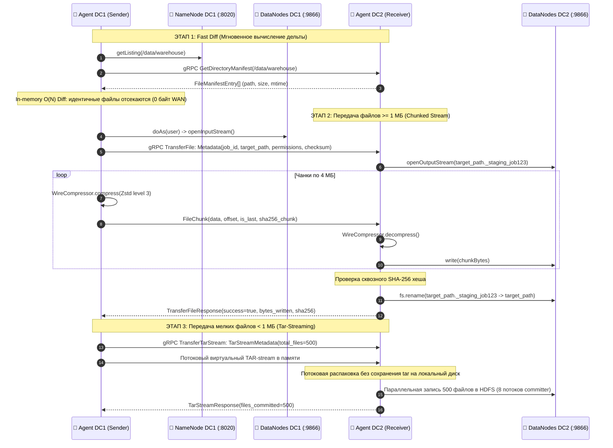
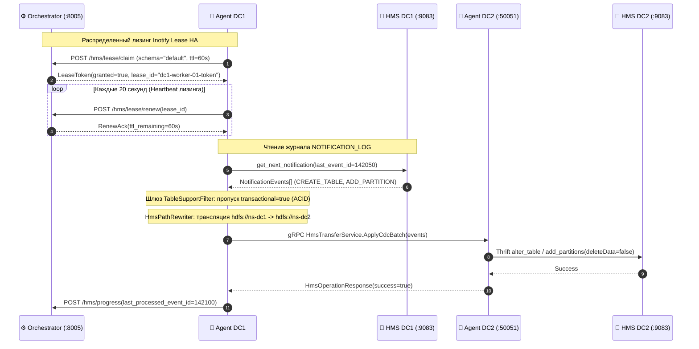

# 📊 Техническая спецификация и архитектура: Hadoop gRPC Replicator
## Руководство для системных архитекторов, DevOps-инженеров и администраторов Data Platform

<div align="center">
  
  <p><strong>Инженерный регламент архитектуры, сетевых протоколов, шейпинга и Disaster Recovery</strong></p>
  <p>🖥️ <a href="replicator-presentation.html"><strong>Интерактивная слайдовая презентация в браузере (HTML)</strong></a> &nbsp;|&nbsp; 📋 <a href="#📑-содержание-инженерных-разделов"><strong>Навигация по разделам</strong></a></p>
</div>

---

## 📑 Содержание инженерных разделов

1. [Слайд 1: Системная спецификация платформы и компоненты](#слайд-1-системная-спецификация-платформы-и-компоненты)
2. [Слайд 2: Генеральная схема физического развертывания и сетевых потоков](#слайд-2-генеральная-схема-физического-развертывания-и-сетевых-потоков)
3. [Слайд 3: Модель развертывания, параметры CLI и конфигурация процессов](#слайд-3-модель-развертывания-параметры-cli-и-конфигурация-процессов)
4. [Слайд 4: Сетевая матрица портов, правила фаервола и L4/L7 протоколы](#слайд-4-сетевая-матрица-портов-правила-фаервола-и-l4l7-протоколы)
5. [Слайд 5: Протокол HDFS Data Plane: Wire-формат, чанкирование и Zero-Staging](#слайд-5-протокол-hdfs-data-plane-wire-формат-чанкирование-и-zero-staging)
6. [Слайд 6: Алгоритм сетевого шейпинга: Иерархический Token Bucket](#слайд-6-алгоритм-сетевого-шейпинга-иерархический-token-bucket)
7. [Слайд 7: Протокол Hive Metastore CDC, распределенный лизинг и Non-ACID Gate](#слайд-7-протокол-hive-metastore-cdc-распределенный-лизинг-и-non-acid-gate)
8. [Слайд 8: Безопасность, Kerberos Impersonation (doAs) и Apache Ranger Audit](#слайд-8-безопасность-kerberos-impersonation-doas-и-apache-ranger-audit)
9. [Слайд 9: SRE Runbook: Авария основного ЦОД и сетевое ограждение (Fencing Kill-Switch)](#слайд-9-sre-runbook-авария-основного-цод-и-сетевое-ограждение-fencing-kill-switch)
10. [Слайд 10: SRE Runbook: Восстановление, безопасный Unfence и Reverse Replication](#слайд-10-sre-runbook-восстановление-безопасный-unfence-и-reverse-replication)
11. [Слайд 11: Управление платформой в Web UI: Топология, Задачи, HMS и DR Hub](#слайд-11-управление-платформой-в-web-ui-топология-задачи-hms-и-dr-hub)
12. [Слайд 12: Наблюдаемость (Observability): Метрики Prometheus, Healthcheck и Алерты](#слайд-12-наблюдаемость-observability-метрики-prometheus-healthcheck-и-алерты)
13. [Слайд 13: Сайзинг оборудования, тюнинг ОС Linux, JVM и траблшутинг](#слайд-13-сайзинг-оборудования-тюнинг-ос-linux-jvm-и-траблшутинг)

---

## Слайд 1: Системная спецификация платформы и компоненты

### Назначение и стек технологий

`Hadoop gRPC Replicator` — специализированный сервис репликации данных HDFS и метаданных Apache Hive Metastore между изолированными дата-центрами (On-Premises, Private Cloud, Hybrid Cloud) с аппаратным контролем полосы WAN и защитой от Split-Brain.

| Параметр | Control Plane (Оркестратор) | Data Plane (Агенты репликации) |
| :--- | :--- | :--- |
| **Бинарный пакет** | `hadoop-grpc-replicator-orchestrator.jar` | `hadoop-grpc-replicator-agent.jar` |
| **Среда исполнения** | Java 21 LTS (Spring Boot 3.3.4) | Java 21 LTS (Netty 4.1 gRPC Daemon) |
| **Сетевые интерфейсы** | `TCP :8005` (HTTP/REST API, SSE шина, Web UI) | `TCP :50051` (gRPC HTTP/2, mTLS v1.3 Full-Duplex) |
| **База метаданных** | PostgreSQL 14+ / H2 (in-memory/file) | Отсутствует (Stateless воркеры) |
| **Аутентификация** | Kerberos SPNEGO SSO, LDAP Bind, JWT HttpOnly | Kerberos Keytab (`hdfs.headless.keytab`), mTLS x509 |
| **Целевые системы** | Браузеры операторов, Prometheus scraper | Hadoop 3.x (RPC :8020/:9000, DTP :9866), Hive Metastore (:9083) |

### Базовые архитектурные факты

1. **Строгое разделение Control Plane и Data Plane**:
   - Оркестратор отвечает исключительно за координацию: планирование задач, учет воркеров, распределение квот полосы Token Bucket и координацию распределенной аренды HMS Lease.
   - **Байты файлов и DDL-пакеты через Orchestrator НЕ прокачиваются**.
2. **Прямой Peer-to-Peer обмен между агентами по WAN**:
   - Передача данных выполняется напрямую между демонами `replicator-agent-dc1` и `replicator-agent-dc2` по порту `TCP :50051`.
   - В фаерволе между ЦОД открывается ровно один порт. Кластерные порты Hadoop (NameNode, DataNodes) наружу не выставляются.
3. **Stateless-архитектура воркеров**:
   - Агенты не сохраняют локальное состояние задач на диск. При перезапуске или сбое воркера подзадачи мгновенно перехватываются соседними агентами кластера.

---

## Слайд 2: Генеральная схема физического развертывания и сетевых потоков

<div align="center">
  
</div>

### Разбор физических контуров и направлений трафика

1. **Контур управления (Control Plane)**:
   - Развертывается на выделенной виртуальной машине (VM) или в Kubernetes Pod в управляющем сетевом сегменте (Management VLAN).
   - Предоставляет REST API и SPA-интерфейс на порту `:8005`.
   - Общается с агентами обоих ЦОД по протоколу HTTP REST (регистрация агентов, heartbeat каждые 5с, выдача квантов подзадач, продление лизинга Lease HA).
2. **Контур ЦОД-1 Primary (Москва)**:
   - Демоны `replicator-agent-dc1` запущены на узлах DataNode или Edge Gateway.
   - Локально в LAN ЦОД-1 (10/25 Gbps) взаимодействуют с:
     - NameNode (`TCP :8020/:9000`) — вычитка структуры директорий и снапшотов;
     - DataNodes (`TCP :9866`) — прямое чтение блоков HDFS по протоколу SASL Data Transfer Protocol от имени пользователя (`doAs`);
     - Hive Metastore (`TCP :9083`) — вычитка событий таблицы `NOTIFICATION_LOG` по протоколу Thrift.
3. **МежЦОДная магистраль WAN (Москва ➔ Санкт-Петербург)**:
   - Единственный порт в фаерволе: **`TCP :50051` (gRPC / HTTP/2, mTLS)**.
   - Трафик идет **напрямую от Agent DC1 к Agent DC2**. Скорость канала жестко лимитируется локальным Token Bucket шейпером.
4. **Контур ЦОД-2 Standby / DR (Санкт-Петербург)**:
   - Демоны `replicator-agent-dc2` слушают порт `:50051`.
   - Принимают чанки данных, пишут во временные файлы `._staging_<jobId>` локального HDFS (`TCP :9866`), сверяют SHA-256 и выполняют атомарный `fs.rename()`.
   - Принимают DDL-пакеты, переписывают URI путей NameService и накатывают схему в локальный Hive Metastore DC2 (`TCP :9083`).

---

## Слайд 3: Модель развертывания, параметры CLI и конфигурация процессов

### Параметры запуска процесса Replicator Orchestrator

```bash
# Запуск Orchestrator как systemd-сервиса или в Docker-контейнере
java -Xms4g -Xmx8g -XX:+UseG1GC \
  -Dserver.port=8005 \
  -Dspring.datasource.url=jdbc:postgresql://postgres.infra:5432/replicator_db \
  -Dspring.datasource.username=replicator_app \
  -Dspring.datasource.password=${DB_PASSWORD} \
  -jar replicator-orchestrator.jar
```

### Параметры запуска процесса Replicator Agent (CLI Options)

Точка входа: `org.apache.hadoop.explorer.replicator.agent.ReplicatorAgentMain`.

| Параметр CLI | Переменная окружения | По умолчанию | Описание и назначение |
| :--- | :--- | :--- | :--- |
| `-id`, `--agent-id` | `AGENT_ID` | `hostname` | Уникальный строковый идентификатор агента в реестре |
| `-c`, `--cluster-id` | `CLUSTER_ID` | `default` | ID обслуживаемого HDFS-кластера (`dc1` или `dc2`) |
| `-m`, `--mode` | `AGENT_MODE` | `all` | Режим работы демона: `all` (sender+receiver), `sender`, `receiver` |
| `-o`, `--orchestrator`| `ORCHESTRATOR_URL` | `http://localhost:8005` | URL управляющего оркестратора для регистрации и heartbeat |
| `-p`, `--port` | `AGENT_RECEIVER_PORT`| `50051` | Порт локального gRPC Netty сервера для приема входящего WAN трафика |
| `-b`, `--bandwidth` | `AGENT_MAX_BANDWIDTH`| `0` (unlimited) | Локальный лимит пропускной способности агента в МБ/с |
| `-s`, `--staging-dir` | `AGENT_STAGING_DIR` | `/tmp/staging` | Локальный каталог временных метаданных staging |
| `-z`, `--compression` | `WIRE_COMPRESSION` | `zstd` | Алгоритм сжатия потока в канале WAN: `zstd`, `lz4`, `none` |
| `-zl`, `--compression-level` | `ZSTD_LEVEL` | `3` | Уровень сжатия Zstandard (от 1 до 22; оптимум CPU/сеть — 3) |

### Сравнение моделей размещения агентов (Colocated vs Dedicated Gateway)

| Характеристика | Модель Colocated (на узлах DataNode) | Модель Dedicated Edge Gateway |
| :--- | :--- | :--- |
| **Физическое размещение** | Устанавливается на физические DataNode кластера | Выделенные 2–4 сервера в стойке с 25G/40G NIC |
| **Локальность данных** | **Short-Circuit Local Read** (чтение блоков напрямую с дисков узла) | Дистанционное чтение блоков по LAN ЦОД (DTP RPC) |
| **Нагрузка на LAN ЦОД** | **0 байт дополнительного трафика** в сети ЦОД | Двойная прокачка (чтение из DataNode + отправка в WAN) |
| **Влияние на Hadoop** | Потребляет 2-4 vCPU и 4-8 GB RAM на узле DataNode | Нулевое влияние на вычислительные ресурсы узлов Hadoop |
| **Рекомендация** | Идеально для кластеров с дисковым I/O запасом | Идеально при жестких политиках изоляции серверов Hadoop |

---

## Слайд 4: Сетевая матрица портов, правила фаервола и L4/L7 протоколы

### Сводная сетевая матрица для NetOps и Информационной Безопасности

| Сетевой сегмент | Источник | Назначение | Протокол L4 / L7 | Порт | Описание потока трафика |
| :--- | :--- | :--- | :--- | :--- | :--- |
| **WAN (МежЦОД)** | `Agent DC1` | `Agent DC2` | **TCP / gRPC (mTLS v1.3)** | **50051** | Прямой стриминг чанков HDFS и пакетов DDL Hive CDC |
| **WAN (МежЦОД)** | `Agent DC2` | `Agent DC1` | **TCP / gRPC (mTLS v1.3)** | **50051** | Обратный поток при Reverse Replication в сценарии DR |
| **Corporate LAN**| Браузер оператора| `Orchestrator` | TCP / HTTPS (TLS 1.3) | **8005** | Доступ к Web UI Svelte 5, REST API, SSE подпискам |
| **Management LAN**| Агенты DC1/DC2 | `Orchestrator` | TCP / HTTP REST | **8005** | Heartbeat (каждые 5с), Claim подзадач, Lease продление |
| **DC LAN (Primary)**| `Agent DC1` | `NameNode DC1` | TCP / Hadoop RPC | **8020 / 9000** | Листинг каталогов, получение блочных манифестов |
| **DC LAN (Primary)**| `Agent DC1` | `DataNodes DC1`| TCP / SASL DTP | **9866** | Блочное чтение данных под Kerberos UGI (`doAs`) |
| **DC LAN (Primary)**| `Agent DC1` | `Hive Metastore 1`| TCP / Thrift RPC | **9083** | Опрос журнала `NOTIFICATION_LOG` Hive Metastore |
| **DC LAN (Standby)**| `Agent DC2` | `NameNode DC2` | TCP / Hadoop RPC | **8020 / 9000** | Создание каталогов, атомарный `fs.rename()` |
| **DC LAN (Standby)**| `Agent DC2` | `DataNodes DC2`| TCP / SASL DTP | **9866** | Запись блоков данных в целевой HDFS |
| **DC LAN (Standby)**| `Agent DC2` | `Hive Metastore 2`| TCP / Thrift RPC | **9083** | Применение DDL изменений схемы (`deleteData=false`) |
| **DC LAN (Оба ЦОД)**| Агенты DC1/DC2 | `Kerberos KDC` | TCP/UDP / Kerberos | **88** | Получение TGT билетов по системному keytab |

### Сетевые рекомендации
- **Jumbo Frames (MTU 9000)**: Настоятельно рекомендуется включить MTU 9000 на межЦОДной оптической магистрали для уменьшения оверхеда прерываний сетевой карты при передаче 4 МБ чанков.
- **Изоляция портов**: Ни один внутренний порт Hadoop (`9000`, `9866`, `9083`, `88`) **не требует открытия в WAN**. Вся передача мультиплексируется через gRPC HTTP/2 соединение по порту `50051`.

---

## Слайд 5: Протокол HDFS Data Plane: Wire-формат, чанкирование и Zero-Staging

### Жизненный цикл передачи данных (Step-by-Step Data Flow)



### Ключевые механизмы Data Plane

1. **Zero-Staging архитектура**:
   - Принимающий агент `Agent DC2` пишет входящий поток напрямую в целевой HDFS во временный файл `<targetPath>._staging_<jobId>`.
   - Локальный диск приемника не используется под буферизацию (исключены лишние циклы чтения/записи на NVMe/SATA).
2. **Атомарная фиксация (Atomic Rename)**:
   - Переименование файла из `._staging_<jobId>` в чистовой `<targetPath>` выполняется через вызов HDFS RPC `fs.rename()`, который в NameNode является атомарной операцией обновления дерева метаданных. Читатели никогда не увидят недокачанный файл.
3. **Защита от утечки дискового пространства (Staging Cleanup)**:
   - В `DataTransferServiceImpl` работает сборщик мусора: метод `cleanOrphanedStaging(ttlMillis)`.
   - Раз в 15 минут сканируются известные целевые директории, и файлы с маской `._staging_*` старше 24 часов (брошенные при аварийном падении узлов) принудительно удаляются.

---

## Слайд 6: Алгоритм сетевого шейпинга: Иерархический Token Bucket

### Архитектура пирамиды лимитов

Сетевой шейпинг реализован на базе иерархического алгоритма **Hierarchical Token Bucket (HTB)** без использования системного `tc/iptables`, работающего на уровне Netty буферов приложений:

```
[Глобальный лимит платформы (Global Limit)] = 200 МБ/с
       │
       ├──► [Канал DC1 ➔ DC2 (Inter-DC WAN)] = 150 МБ/с
       │         │
       │         ├──► Очередь CRITICAL (HMS CDC, витрины): Гарантия 50 МБ/с, Burstable
       │         ├──► Очередь BATCH (Ночные синки сырых слоев): Лимит 80 МБ/с
       │         └──► Очередь BACKGROUND (Архивы, бэкапы): Best Effort (20 МБ/с)
       │
       └──► [Канал DC2 ➔ DC1 (Reverse WAN / DR)] = 50 МБ/с (в штатном режиме)
```

### Механизм троттлинга в коде агента (`LocalBandwidthLimiter`)

1. **Пополнение токенов**: Каждую миллисекунду корзина токенов пополняется в соответствии с лимитом `allowedBytesPerSecond / 1000`. Максимальная емкость корзины ограничена размером пакета для предотвращения burst-всплесков.
2. **Запрос квоты (`throttle(bytes)`)**: Перед отправкой каждого чанка агент вызывает `limiter.throttle(chunkSize)`.
3. **Блокировка без spin-lock**: Если доступных токенов меньше, чем размер чанка, поток переводится в ожидание через высокоточный таймер `LockSupport.parkNanos(sleepTime)`.
4. **Защита от голодания (Starvation-Free)**: Очереди с более высоким приоритетом забирают токены первыми, но для очередей низкого приоритета резервируется минимальный квант полосы (Fair Share).
5. **Динамическое управление**: При изменении лимита полосы в Web UI новое значение транслируется агентам по SSE-каналу и вступает в силу за 100 мс без перезапуска демонов.

---

## Слайд 7: Протокол Hive Metastore CDC, распределенный лизинг и Non-ACID Gate

### Механика вычитки и применения изменений каталога Hive



### Инженерные гарантии репликации метаданных

- **Распределенный лизинг Inotify Lease HA**:
  - Исключает дублирование и гонки: ровно один воркер в кластере читает поток конкретной БД.
  - При падении воркера (отсутствие heartbeat более 60 секунд) аренда автоматически освобождается, и любой другой живой агент подхватывает стриминг с последнего зафиксированного `last_processed_event_id`.
- **Шлюз Non-ACID Gate (`TableSupportFilter`)**:
  - Таблицы с параметром `'transactional'='true'` (Hive full ACID с delta-файлами) безопасно пропускаются, так как прямая репликация их каталогов в рантайме нарушает транзакционную целостность до момента выполнения Compaction.
- **Трансляция Federation NameService (`HmsPathRewriter`)**:
  - Все пути к схемам и партициям (`sdLocation`) на лету переписываются с пространства имен источника на пространство имен приемника (`hdfs://ns-dc1/apps/hive/...` ➔ `hdfs://ns-dc2/apps/hive/...`).
- **Защита от случайного удаления данных (`deleteData=false`)**:
  - При репликации операций `DROP_TABLE` и `DROP_PARTITION` в целевом вызове Thrift API принудительно передается флаг `deleteData=false`. Метаданные удаляются, но физические файлы в HDFS остаются нетронутыми.

---

## Слайд 8: Безопасность, Kerberos Impersonation (doAs) и Apache Ranger Audit

### Архитектура сквозной аутентификации и авторизации

```
[Пользователь / ETL Job: ivan_de]
        │
        ▼ (Создание задачи в UI / REST API с JWT токеном)
[Replicator Orchestrator]
        │
        ▼ (Выдача задания агенту: author="ivan_de", run_as_service=false)
[Replicator Agent (DC1)]
        │ 1. Авторизация агента по системному keytab: hdfs-replicator@REALM
        │ 2. Создание прокси-пользователя: UGI.createProxyUser("ivan_de", systemUGI)
        │ 3. Вызов блочного чтения: proxyUGI.doAs(() -> hdfs.open(path))
        ▼
[HDFS NameNode / DataNodes] ──► [Apache Ranger Plugin]
                                      │
                                      ▼
                        Логирование в Ranger Audit:
                        • User: "ivan_de" (реальный автор задачи)
                        • Proxy: "hdfs-replicator" (техучетка агента)
                        • Action: "READ"
                        • Resource: "/data/raw/transactions"
                        • Result: ALLOWED / DENIED
```

### Ключевые принципы информационной безопасности

1. **Kerberos Impersonation (`UserGroupInformation.doAs`)**:
   - Агент запускается под системным принципалом (например, `hdfs-replicator/node01@REALM`), прописанным в `core-site.xml` в параметре `hadoop.proxyuser.hdfs-replicator.hosts` и `hadoop.proxyuser.hdfs-replicator.groups`.
   - Каждое обращение к файловой системе выполняется под реальным логином инициатора задачи через механизм Proxy User. Если у пользователя `ivan_de` нет прав на чтение директории, операция будет отклонена NameNode с ошибкой `AccessControlException`.
2. **Сохранение метаданных безопасности POSIX**:
   - При передаче файла в `FileMetadata` упаковываются оригинальный битовый режим прав доступа (`file_mode`), владелец (`owner`) и группа (`group`).
   - На целевой стороне агент восстанавливает оригинальные права через вызовы `fs.setPermission()` и `fs.setOwner()`.
3. **mTLS шифрование межЦОДного канала**:
   - Канал `TCP :50051` защищен протоколом взаимной TLS-аутентификации (mTLS v1.3).
   - Агент DC1 проверяет сертификат Агента DC2, а Агент DC2 разрешает подключения только от клиентов с валидным сертификатом доверенного корпоративного CA.

---

## Слайд 9: SRE Runbook: Авария основного ЦОД и сетевое ограждение (Fencing Kill-Switch)

### Пошаговый сценарий действий при падении DC1

```
СОСТОЯНИЕ: Полный отказ инфраструктуры ЦОД-1 (Пожар / Сетевой сплит / Питание)

[1. ДЕТЕКТИРОВАНИЕ]
  • Оркестратор фиксирует таймаут heartbeat от агентов DC1 (> 15 сек).
  • Внутренний мониторинг фиксирует недоступность NameNode DC1.

[2. СЕТЕВОЕ ОГРАЖДЕНИЕ: АКТИВАЦИЯ KILL-SWITCH]
  • Дежурный SRE / Администратор нажимает 🛑 Kill-Switch в UI DR Hub.
  • Или через автоматический CLI скрипт:
    curl -X POST http://orchestrator:8005/api/dr/fencing/activate \
         -H "Authorization: Bearer ${JWT_TOKEN}"

[3. СИСТЕМНЫЕ ДЕЙСТВИЯ ПЛАТФОРМЫ ПОД КАПОТОМ]
  ├── Лимит WAN полосы в Token Bucket Шейпере принудительно сбрасывается в 0 МБ/с.
  ├── Все активные входящие/исходящие gRPC стримы отменяются (Status.CANCELLED).
  ├── Все прямые задачи репликации переходят в статус STOPPED.
  └── Фоновый планировщик Cron Schedules принудительно деактивируется.

[4. ПРОМОУШЕН РЕЗЕРВНОГО ЦОД (DC2 PROMOTION)]
  • Клиентский трафик (Spark, Trino, BI) переключается на ЦОД-2.
  • ЦОД-2 становится основным активным кластером на запись.
```

### Защита от Split-Brain: почему Kill-Switch обязателен

Если упавший ЦОД-1 внезапно оживет при отсутствии сетевого ограждения, старые фоновые задачи репликации могли бы начать перетирать свежие файлы, записанные клиентами на ЦОД-2 во время аварии. Kill-Switch выставляет жесткий барьер (0 МБ/с + деактивация задач), исключая любую возможность рассинхронизации или повреждения данных.

---

## Слайд 10: SRE Runbook: Восстановление, безопасный Unfence и Reverse Replication

### Пошаговый алгоритм безопасного возврата ЦОД-1 в строй

```
СОСТОЯНИЕ: ЦОД-1 восстановлен после аварии. Необходимо синхронизировать дельту.

[1. СНЯТИЕ ИЗОЛЯЦИИ (UNFENCE)]
  • В UI DR Hub нажимается кнопка "Снять изоляцию" (Unfence).
  • Снимается ограничение 0 МБ/с, восстанавливается лимит канала.
  • ⚠️ ВАЖНО: Прямые задачи (DC1 -> DC2) ОСТАЮТСЯ В СТАТУСЕ STOPPED!
    Автоматический перезапуск прямых задач строго заблокирован ядром платформы.

[2. ЗАПУСК REVERSE REPLICATION (ДОГОН ДЕЛЬТЫ)]
  • В 1-Click мастере выбираются таблицы и директории, измененные во время аварии.
  • Автоматически генерируются зеркальные задачи:
    Source: DC2 (Standby Cluster) ➔ Target: DC1 (Primary Cluster)
  • Поток данных РАЗВОРАЧИВАЕТСЯ: Agent DC2 стримит блоки в Agent DC1 по WAN :50051.

[3. ВЫРАВНИВАНИЕ ДЕЛЬТЫ И МЕТРИК]
  • Мониторинг отслеживает:
    - Bytes remaining = 0
    - HMS Event Lag = 0
  • Данные на ЦОД-1 догнали все изменения, внесенные на ЦОД-2.

[4. ПЕРЕКЛЮЧЕНИЕ ТРАФИКА (FAILBACK)]
  • Клиентские приложения переключаются обратно на ЦОД-1.
  • Обратные задачи останавливаются, возобновляется штатная репликация DC1 -> DC2.
```

---

## Слайд 11: Управление платформой в Web UI: Топология, Задачи, HMS и DR Hub

### Рабочие экраны администратора и инженера данных

#### 1. Управление топологией дата-центров и шейпером полосы
<div align="center">
  
</div>
*Конфигурация глобальных лимитов WAN, порогов каналов между ЦОД и приоритетных очередей без перезапуска демонов.*

---

#### 2. Главная панель задач и мониторинг передачи в реальном времени
<div align="center">
  
</div>
*Контроль активных потоков данных, мгновенной сетевой утилизации в МБ/с, переданных байт и прогноза времени завершения (ETA).*

---

#### 3. Консоль потоковой CDC репликации Hive Metastore
<div align="center">
  
</div>
*Мониторинг отставания событий (Lag), статуса распределенной аренды Inotify Lease HA и журнала трансляции DDL.*

---

#### 4. Центр катастрофоустойчивости DR Hub в режиме изоляции Kill-Switch
<div align="center">
  
</div>
*Яркая индикация сетевого барьера (0 МБ/с), заморозка прямых задач и защита кластера от Split-Brain.*

---

#### 5. Мастер безопасного снятия изоляции и 1-Click Reverse Replication
<div align="center">
  
</div>
*Безопасный Unfence без автоматического старта прямых задач и запуск обратного потока DC2 ➔ DC1 для догона дельты.*

---

## Слайд 12: Наблюдаемость (Observability): Метрики Prometheus, Healthcheck и Алерты

### Эндпоинты мониторинга

- **Метрики Prometheus**: `GET http://orchestrator:8005/actuator/prometheus`
- **Проверка здоровья (Healthcheck)**: `GET http://orchestrator:8005/actuator/health`
  - Проверяет: статус соединения с БД, активность зарегистрированных агентов, статус Token Bucket.

### Реестр ключевых метрик Prometheus

| Название метрики | Тип | Лейблы | Описание |
| :--- | :--- | :--- | :--- |
| `replicator_throughput_bytes_total` | Counter | `dc`, `cluster_id` | Суммарный объем переданных байт по WAN каналу |
| `replicator_throughput_bytes_per_second` | Gauge | `dc`, `cluster_id` | Текущая мгновенная скорость передачи данных |
| `replicator_task_duration_seconds` | Histogram | `status`, `job_id` | Длительность выполнения задач и подзадач |
| `replicator_hms_lag_events` | Gauge | `db_name` | Количество необработанных событий в NOTIFICATION_LOG |
| `replicator_active_streams_count` | Gauge | `direction` | Количество одновременно открытых gRPC потоков |
| `replicator_staging_orphans_count` | Gauge | `cluster_id` | Количество обнаруженных осиротевших файлов staging |
| `replicator_agent_heartbeat_timestamp`| Gauge | `agent_id`, `dc` | Временная метка последнего успешного heartbeat |

### Рекомендуемые правила для Prometheus Alertmanager

```yaml
groups:
  - name: replicator-alerts
    rules:
      - alert: ReplicatorAgentOffline
        expr: time() - replicator_agent_heartbeat_timestamp > 30
        for: 1m
        labels:
          severity: critical
        annotations:
          summary: "Агент репликатора {{ $labels.agent_id }} не отвечает более 30 секунд"

      - alert: ReplicatorHmsLagHigh
        expr: replicator_hms_lag_events > 10000
        for: 5m
        labels:
          severity: warning
        annotations:
          summary: "Высокое отставание репликации Hive Metastore в БД {{ $labels.db_name }} (> 10000)"

      - alert: ReplicatorThroughputZeroOnActiveJobs
        expr: replicator_throughput_bytes_per_second == 0 and replicator_active_streams_count > 0
        for: 3m
        labels:
          severity: warning
        annotations:
          summary: "Зависание gRPC стримов передачи данных при активных заданиях"
```

---

## Слайд 13: Сайзинг оборудования, тюнинг ОС Linux, JVM и траблшутинг

### Рекомендации по ресурсам и аппаратному обеспечению

| Узел / Компонент | vCPU | RAM | Сетевой адаптер (NIC) | Дисковая подсистема |
| :--- | :--- | :--- | :--- | :--- |
| **Orchestrator Host** | 4–8 vCPU | 8–16 GB | 1 Gbps / 10 Gbps | 50 GB SSD (NVMe) под базу данных |
| **Agent Colocated** | 4 vCPU | 8 GB JVM Heap | 10 Gbps / 25 Gbps | Совместно с DataNode Hadoop |
| **Agent Dedicated** | 8–16 vCPU | 16–32 GB RAM | 25 Gbps / 40 Gbps | 200 GB SSD под системные журналы |

### Тюнинг ядра Linux для 10G/40G WAN каналов (`/etc/sysctl.conf`)

```ini
# Увеличение максимального размера сетевых буферов TCP для исключения дропов пакетов
net.core.rmem_max = 67108864
net.core.wmem_max = 67108864
net.core.rmem_default = 33554432
net.core.wmem_default = 33554432

# Авто-тюнинг TCP окон (min, default, max)
net.ipv4.tcp_rmem = 4096 87380 33554432
net.ipv4.tcp_wmem = 4096 65536 33554432

# Увеличение очереди подключений и дескрипторов файлов
net.core.somaxconn = 4096
net.core.netdev_max_backlog = 10000
fs.file-max = 2097152
```

### Тюнинг JVM (Java 21 LTS)

```bash
# Рекомендуемые опции JVM для воркеров репликатора
-XX:+UseG1GC \
-XX:MaxGCPauseMillis=50 \
-XX:InitiatingHeapOccupancyPercent=45 \
-XX:+ExplicitGCInvokesConcurrent \
-Dio.netty.allocator.type=pooled \
-Dio.netty.allocator.numDirectArenas=4
```

### Диагностика типовых инцидентов (Troubleshooting FAQ)

1. **Ошибка `GSSException: No valid credentials provided (Mechanism level: Failed to find any Kerberos tgt)`**:
   - *Причина*: Истек TGT тикет технической учетной записи демона.
   - *Решение*: Проверить валидность keytab через `klist -kt /etc/security/keytabs/hdfs.headless.keytab`. Агент автоматически обновляет тикет за 10 минут до истечения срока действия.
2. **Ошибка `org.apache.hadoop.ipc.RemoteException: Cannot create file ... NameNode is in safe mode`**:
   - *Причина*: Целевой кластер находится в безопасном режиме (SafeMode) после рестарта.
   - *Решение*: Дождаться выхода кластера из SafeMode (`hdfs dfsadmin -safemode wait`) или выполнить `hdfs dfsadmin -safemode leave`.
3. **Зависание gRPC потоков при наличии Stateful Firewall**:
   - *Причина*: Межсетевой экран сбрасывает неактивные TCP соединения по таймауту TCP Keepalive.
   - *Решение*: В конфигурации Netty включены gRPC Keepalive: `keepAliveTime(30, TimeUnit.SECONDS)`, `keepAliveTimeout(10, TimeUnit.SECONDS)`.
