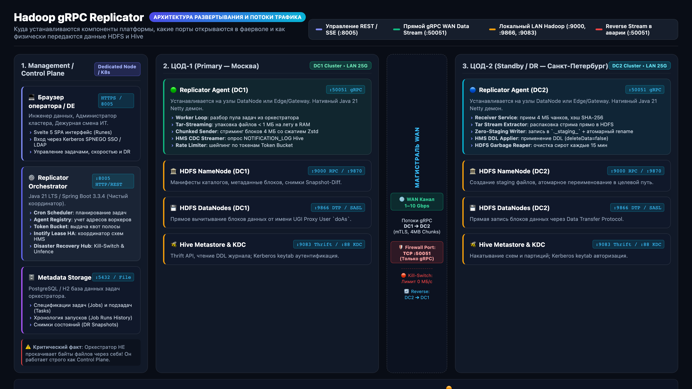
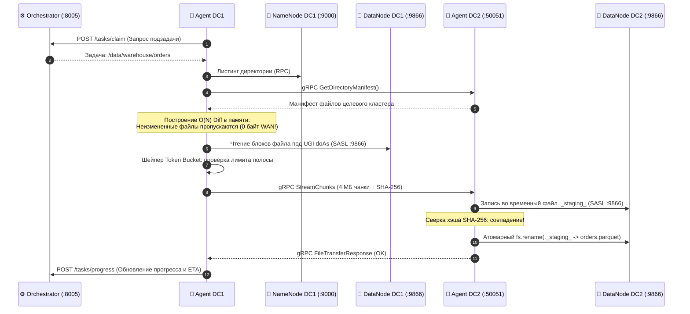
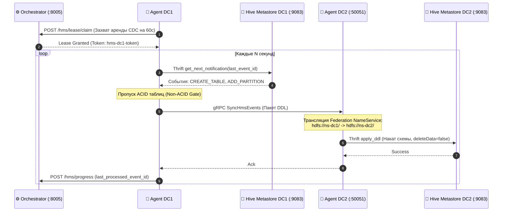
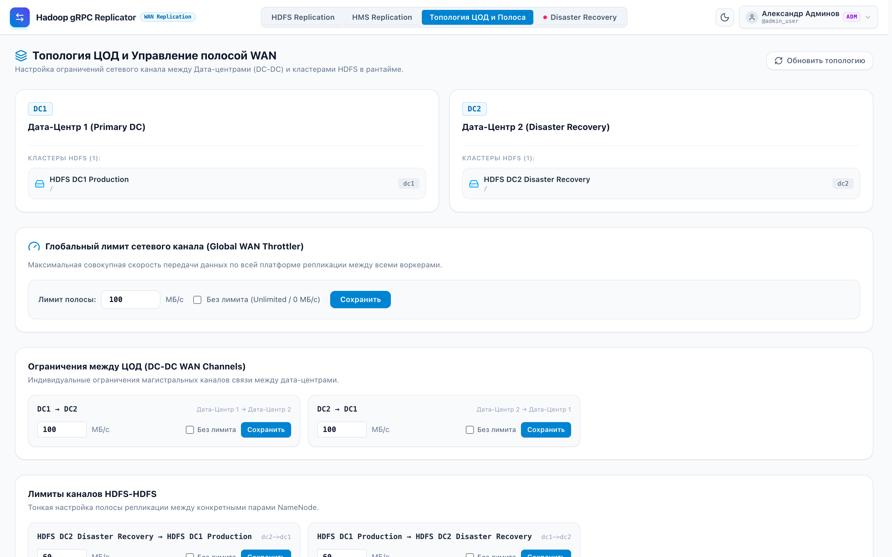
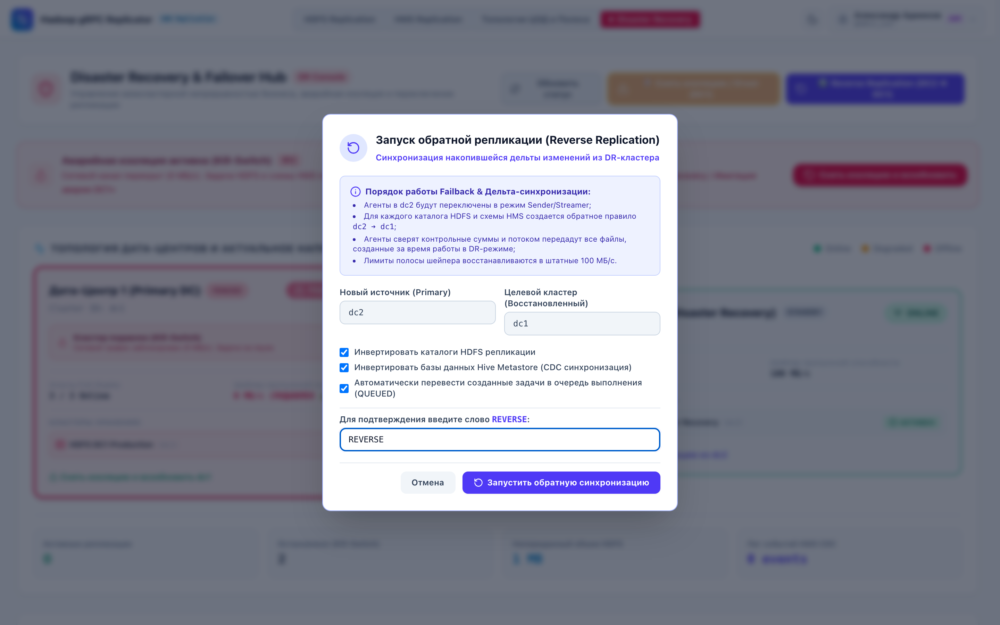

# 📊 Презентация платформы: Hadoop gRPC Replicator
## Архитектура физического развертывания («Что ставится куда») и сетевые потоки («Как ходит трафик»)

<div align="center">
  
  <p><strong>Материалы для проведения технической презентации и демонстрации команде инженеров и архитекторов</strong></p>
  <p><em>Control Plane vs Data Plane, сетевая матрица портов, прямое peer-to-peer gRPC соединение, иерархический шейпинг и регламент Disaster Recovery</em></p>
  <p>🖥️ <a href="replicator-presentation.html"><strong>Интерактивное слайд-шоу в браузере (HTML)</strong></a> &nbsp;|&nbsp; 📥 <a href="replicator-presentation.pptx"><strong>Файл презентации PowerPoint (PPTX)</strong></a></p>
</div>

---

## 📑 Содержание слайдов презентации

1. [Слайд 1: Титульный — Архитектура развертывания и сетевые потоки](#слайд-1-титульный--hadoop-grpc-replicator)
2. [Слайд 2: Главная архитектурная схема развертывания и трафика](#слайд-2-главная-архитектурная-схема-развертывания-и-трафика)
3. [Слайд 3: Что куда устанавливается (Placement Map)](#слайд-3-что-куда-устанавливается-placement-map)
4. [Слайд 4: Сетевая матрица портов и фаервола (Network Matrix)](#слайд-4-сетевая-матрица-портов-и-фаервола-network-matrix)
5. [Слайд 5: Жизненный цикл передачи HDFS файла (Data Flow)](#слайд-5-жизненный-цикл-передачи-hdfs-файла-data-flow)
6. [Слайд 6: Жизненный цикл репликации Hive Metastore CDC (Metadata Flow)](#слайд-6-жизненный-цикл-репликации-hive-metastore-cdc-metadata-flow)
7. [Слайд 7: Потоки трафика в Disaster Recovery (Штатно vs Kill-Switch vs Reverse)](#слайд-7-потоки-трафика-в-disaster-recovery)
8. [Слайд 8: Архитектура в интерфейсе — Топология ЦОД и шейпер полосы](#слайд-8-архитектура-в-интерфейсе--топология-цод-и-шейпер-полосы)
9. [Слайд 9: Архитектура в интерфейсе — Задачи и прямой мониторинг передачи](#слайд-9-архитектура-в-интерфейсе--задачи-и-прямой-мониторинг-передачи)
10. [Слайд 10: Архитектура в интерфейсе — Потоковая репликация Hive Metastore](#слайд-10-архитектура-в-интерфейсе--потоковая-репликация-hive-metastore)
11. [Слайд 11: Архитектура в интерфейсе — DR Hub, изоляция и Kill-Switch](#слайд-11-архитектура-в-интерфейсе--dr-hub-изоляция-и-kill-switch)
12. [Слайд 12: Архитектура в интерфейсе — Снятие изоляции и Reverse Replication](#слайд-12-архитектура-в-интерфейсе--снятие-изоляции-и-reverse-replication)
13. [Слайд 13: Аппаратный сайзинг и чеклист информационной безопасности](#слайд-13-аппаратный-сайзинг-и-чеклист-информационной-безопасности)

---

## Слайд 1: Титульный — Hadoop gRPC Replicator

### Архитектура развертывания («Что ставится куда») и сетевые потоки («Как ходит трафик»)

- **Сервис**: `Hadoop gRPC Replicator` (входит в стек **Hadoop Explorer Platform**);
- **Стек бэкенда**: Java 21 LTS, Spring Boot 3.3.4, gRPC / Protobuf, Netty, Spring Data JPA;
- **Стек фронтенда**: TypeScript, Svelte 5 (Runes), Tailwind CSS, Vite;
- **Целевая среда**: Распределенные кластеры Apache Hadoop 3.x, HDP 3.1, Apache Hive 3/4, Kerberos / FreeIPA / Active Directory.

### Ключевые архитектурные тезисы

1. **🏢 Что куда устанавливается?**
   - **Control Plane (Orchestrator)**: отдельный сервер управления, VM или Kubernetes Pod. Слушает порт `8005` (REST API + Web UI Svelte 5).
   - **Data Plane (Replicator Agents)**: устанавливаются в каждом ЦОД на узлы Hadoop DataNode (Colocated) или Edge Gateway узлы с 10/25/40G LAN.
   - **Hadoop узлы**: NameNode, DataNodes, Hive Metastore работают в штатном режиме без сторонних плагинов или изменений в ядре Hadoop.

2. **🌐 Как ходит трафик данных?**
   - **Прямой gRPC WAN стрим**: трафик данных идет **НАПРЯМУЮ** от `Agent DC1` к `Agent DC2` по порту `50051 (mTLS)`.
   - **Оркестратор НЕ качает байты через себя**: он выполняет исключительно функции Control Plane (раздача задач, координация лимитов Token Bucket, продление аренды).
   - Потоковая нарезка чанков по 4 МБ, Tar-Streaming мелких файлов, сквозной расчет хэша SHA-256 на лету.

3. **🛡️ Сеть и Disaster Recovery**
   - В межЦОДном фаерволе между площадками открывается **ТОЛЬКО ОДИН ПОРТ**: `TCP :50051 (gRPC / HTTP/2, mTLS)`.
   - Иерархический шейпер Hierarchical Token Bucket гарантирует жесткое соблюдение лимитов WAN-канала в мегабайтах в секунду.
   - При аварии Kill-Switch мгновенно глушит WAN-трафик в 0 МБ/с, а после оживания площадки Reverse Replication разворачивает поток трафика `DC2 ➔ DC1`.

---

## Слайд 2: Главная архитектурная схема развертывания и трафика

### Генеральная схема размещения компонентов и направлений сетевых потоков



### Пояснение к генеральной схеме

1. **Верхний контур — Control Plane (Orchestrator Host)**:
   - Хост оркестратора разворачивается в управляющей зоне сети (Management Network).
   - Предоставляет пользователям SPA-консоль на Svelte 5 и REST API на порту `:8005`.
   - Координирует работу агентов: раздает подзадачи (`/tasks/claim`), собирает прогресс (`/tasks/progress`), управляет квотами скорости Token Bucket и распределенной блокировкой `Inotify Lease HA` для Hive CDC.
   - **Критический архитектурный принцип**: Байты пользовательских файлов через оркестратор НЕ передаются!

2. **Левый контур — ЦОД-1 Primary (Москва, Data Plane & Hadoop Cluster)**:
   - В дата-центре запускаются демоны `replicator-agent-dc1` на узлах кластера.
   - Внутри периметра ЦОД агенты по локальной сети (LAN 10/25 Gbps) взаимодействуют с:
     - NameNode (`:9000/:8020 Hadoop RPC`) — для мгновенного построения манифестов директорий;
     - DataNodes (`:9866 Data Transfer Protocol`) — для блочного чтения данных под Kerberos UGI автора (`doAs`);
     - Hive Metastore (`:9083 Thrift RPC`) — для вычитки журнала событий `NOTIFICATION_LOG`.

3. **Центральный межЦОДный WAN-канал (Магистраль Москва ➔ Санкт-Петербург)**:
   - Единственный порт в фаерволе между ЦОД: **`TCP :50051` (gRPC over HTTP/2, mTLS)**.
   - Трафик идет **напрямую от Data Plane DC1 к Data Plane DC2**.
   - Аппаратная скорость канала защищена шейпером Hierarchical Token Bucket.

4. **Правый контур — ЦОД-2 Standby / DR (Санкт-Петербург, Data Plane & Standby Cluster)**:
   - Демоны `replicator-agent-dc2` слушают порт `:50051` и принимают 4 МБ блоки данных.
   - Принимают поток, пишут в DataNodes DC2 во временные файлы `._staging_`, сверяют хэш SHA-256 и вызывают атомарный `fs.rename()`.
   - Применяют DDL-схемы в локальный Hive Metastore DC2 по порту `:9083`.

---

## Слайд 3: Что куда устанавливается (Placement Map)

### Детальная спецификация хостов, контейнеров и ролей в инфраструктуре

| Компонент / Сервер | Процесс и Стек | Порты | Размещение в инфраструктуре | Роль и обязанности |
| :--- | :--- | :--- | :--- | :--- |
| **Control Plane Host** | `replicator-orchestrator`<br/>(Java 21 / Spring Boot 3) | `TCP 8005` (HTTP/REST, SSE) | Отдельная VM (4-8 vCPU, 8-16 GB RAM) или Kubernetes Deployment | Оркестрация задач, веб-консоль Svelte 5, Cron Scheduler, иерархический шейпер Token Bucket, хранение метаданных в PostgreSQL/H2. **Файлы через себя НЕ пропускает.** |
| **ЦОД-1 Data Plane** | `replicator-agent-dc1`<br/>(Java 21 / Netty gRPC Daemon) | `TCP 50051` (gRPC Server / Client) | На узлах Hadoop DataNode (Colocated) или Edge Gateway (10/25G LAN) | Сканирование HDFS манифестов, прямое чтение блоков DataNode (:9866) под UGI автора (`doAs`), чтение HMS NOTIFICATION_LOG (:9083), стриминг данных в WAN. |
| **ЦОД-2 Data Plane** | `replicator-agent-dc2`<br/>(Java 21 / Netty gRPC Daemon) | `TCP 50051` (gRPC Server / Client) | На узлах Hadoop DataNode (Colocated) или Edge Gateway DC2 | Прием 4 МБ чанков по WAN, Zero-Staging запись в DataNode (:9866), расчет SHA-256, атомарный rename, трансляция NameService и накат DDL в HMS (:9083). |
| **Клиентские ПК** | Веб-браузер (Chrome, Firefox, Safari) | `TCP 8005` (HTTPS к Orchestrator) | Рабочие места администраторов и дата-инженеров | Управление задачами, мониторинг скорости, просмотр HMS CDC, 1-Click DR Hub (Kill-Switch / Unfence / Reverse Replication). |

---

## Слайд 4: Сетевая матрица портов и фаервола (Network Matrix)

### Полный реестр сетевых доступов для согласования со службой информационной безопасности (ИБ)

| Направление соединения | Протокол | Порт | Назначение сетевого потока | Сегмент сети |
| :--- | :--- | :--- | :--- | :--- |
| **Agent DC1 ➔ Agent DC2** | `gRPC / HTTP/2 (mTLS)` | **TCP 50051** | Прямая передача блоков HDFS и DDL пакетов Hive Metastore | **WAN (МежЦОД)** |
| **Agent DC2 ➔ Agent DC1** | `gRPC / HTTP/2 (mTLS)` | **TCP 50051** | Обратная репликация Reverse Replication при аварии (DR) | **WAN (МежЦОД)** |
| **Браузер ➔ Orchestrator** | `HTTPS / HTTP` | **TCP 8005** | Доступ к веб-интерфейсу Svelte 5, REST API, SSE событиям | Corporate LAN |
| **Agents ➔ Orchestrator** | `HTTP REST` | **TCP 8005** | Heartbeat (каждые 5с), Claim подзадач, продление Lease | Management LAN |
| **Agent ➔ NameNode (локально)** | `Hadoop RPC` | **TCP 9000 / 8020** | Листинг каталогов, метаданные блоков, атомарный rename | DC LAN (Внутри ЦОД) |
| **Agent ➔ DataNodes (локально)** | `Data Transfer Protocol` | **TCP 9866 (SASL)** | Прямое чтение и запись блоков HDFS | DC LAN (Внутри ЦОД) |
| **Agent ➔ Hive Metastore** | `Thrift RPC` | **TCP 9083** | Чтение NOTIFICATION_LOG (DC1) и накат DDL схемы (DC2) | DC LAN (Внутри ЦОД) |
| **Agent ➔ Kerberos KDC** | `Kerberos AS/TGS` | **TCP/UDP 88** | Получение тикетов TGT по keytab технической учетной записи | DC LAN (Внутри ЦОД) |

> [!IMPORTANT]
> **Минимум дыр в фаерволе**: Для работы репликации между дата-центрами требуется открыть **ровно один порт** — `TCP :50051`. Ни NameNode, ни DataNodes, ни Hive Metastore наружу в WAN не публикуются!

---

## Слайд 5: Жизненный цикл передачи HDFS файла (Data Flow)

### Пошаговый цикл передачи: от анализа дельты до атомарного переименования в целевом кластере



### 4 ключевых этапа передачи данных

1. **Шаг 1. Анализ дельты и планирование**:
   - Воркер в DC1 забирает подзадачу из Orchestrator (`:8005 /tasks/claim`).
   - Запрашивает манифест у локальной NameNode DC1 (`:9000`).
   - Одним gRPC вызовом `GetDirectoryManifest` запрашивает манифест у `Agent DC2`.
   - В памяти строится мгновенный $O(N)$ Diff: файлы с одинаковым размером и mtime пропускаются без передачи по сети.
2. **Шаг 2. Чтение блоков и упаковка**:
   - Агент DC1 читает блоки из локальных DataNodes DC1 (`:9866`) под UGI автора задачи (`doAs`).
   - Запрашивает квант полосы у иерархического шейпера Token Bucket.
   - Мелкие файлы (< 1 МБ) упаковываются на лету в виртуальный Tar-Stream.
   - Большие файлы нарезываются на чанки по 4 МБ со сжатием Zstd/LZ4.
3. **Шаг 3. Прямой gRPC WAN стриминг**:
   - Агент DC1 стримит чанки **НАПРЯМУЮ** в `Agent DC2` (`:50051 gRPC, mTLS`).
   - Байты файлов **НЕ проходят через Оркестратор**.
   - Потоковое вычисление контрольной суммы SHA-256 на обеих сторонах.
   - Скорость передачи строго удерживается шейпером Token Bucket.
4. **Шаг 4. Zero-Staging и фиксация в HDFS**:
   - Агент DC2 пишет блоки в DataNodes DC2 (`:9866`) во временный файл `._staging_`.
   - По завершении стрима сверяется хэш SHA-256: при совпадении вызывается атомарный `fs.rename()`.
   - Для мелких файлов Tar-Stream распаковывается потоково прямо в HDFS без промежуточного диска.
   - Агент DC1 отправляет рапорт в Orchestrator (`:8005 /progress`) с пересчетом общего ETA.

---

## Слайд 6: Жизненный цикл репликации Hive Metastore CDC (Metadata Flow)

### Потоковая передача DDL-событий с распределенным лизингом Inotify Lease HA



### 4 этапа работы механизма Hive CDC

1. **Захват эксклюзивной аренды (Lease HA)**:
   - Воркер DC1 запрашивает аренду потока схемы: `POST /hms/lease/claim` в Оркестратор.
   - Оркестратор выдает эксклюзивный токен аренды на 60 секунд с автоматическим продлением каждые 20 секунд.
   - Полностью исключены гонки: ровно один воркер в кластере читает CDC-поток конкретной базы данных. При падении воркера аренда истекает и поток подхватывает соседний агент.
2. **Локальный опрос NOTIFICATION_LOG**:
   - Агент DC1 по локальному LAN Thrift (`:9083`) вычитывает события из Hive Metastore DC1.
   - Перехватываются события: `CREATE_TABLE`, `ADD_PARTITION`, `ALTER_TABLE`, `DROP_PARTITION`.
   - **Non-ACID Gate**: ACID transactional таблицы безопасно пропускаются, предотвращая порчу delta-файлов.
3. **Передача пакетов DDL по WAN**:
   - Агент DC1 отправляет пачку DDL в `Agent DC2` по WAN (`:50051 gRPC`).
   - Агент DC2 транслирует Federation NameService: заменяет пути вида `hdfs://ns-dc1/...` на `hdfs://ns-dc2/...`.
   - Перелинковывает `sdLocation` на целевой кластер и генерирует фоновые подзадачи переноса файлов партиций.
4. **Применение DDL и подтверждение**:
   - Агент DC2 по локальному LAN Thrift (`:9083`) накатывает DDL в Hive Metastore DC2.
   - **Защита данных**: при `DROP_TABLE` принудительно выставляется `deleteData=false`.
   - Агент DC2 подтверждает накат ➔ Агент DC1 рапортует прогресс в Orchestrator и фиксирует `last_processed_event_id`.

---

## Слайд 7: Потоки трафика в Disaster Recovery

### Штатно vs Fencing Kill-Switch (0 МБ/с) vs Reverse Replication разворот

| Параметр | Штатный режим (DC1 ➔ DC2) | Авария DC1 и Kill-Switch | Снятие изоляции и Reverse Replication |
| :--- | :--- | :--- | :--- |
| **Трафик клиентов** | Приложения читают/пишут в **DC1** | Клиенты переключаются на **DC2** | Клиенты продолжают писать в **DC2** |
| **Направление WAN** | `Agent DC1 ➔ Agent DC2 (:50051)` | **Канал заморожен (0 МБ/с)** | `Agent DC2 ➔ Agent DC1 (:50051)` *(Разворот!)* |
| **Шейпер полосы** | Лимит канала (например, 100 МБ/с) | **Лимит выставлен в 0 МБ/с (Fencing)** | Лимит канала для обратного потока |
| **Статус прямых задач** | `RUNNING` / По расписанию | Все прямые задачи остановлены (`STOPPED`) | Прямые задачи остаются `STOPPED` |
| **Защита от Split-Brain** | Не требуется (активен один ЦОД) | **Сетевой барьер гарантирован** | **DC1 догоняет дельту, накопленную на DC2** |

```
ШТАТНЫЙ РЕЖИМ:
[Клиенты] ➔ [DC1 Active] ═══════ gRPC WAN :50051 (100 МБ/с) ══════> [DC2 Standby]

АВАРИЯ DC1 (KILL-SWITCH 0 МБ/с):
[DC1 Dead]   ⛔ 0 МБ/с Fencing Barrier ⛔   [DC2 Promoted]  [Клиенты]

ВОССТАНОВЛЕНИЕ DC1 (REVERSE REPLICATION РАЗВОРОТ ТРАФИКА):
[DC1 Catching Up] <═════ gRPC WAN :50051 (Reverse Flow) ═════ [DC2 Active]  [Клиенты]
```

> [!WARNING]
> **Критический архитектурный инвариант**: При снятии изоляции («Unfence») остановленные прямые задачи `DC1 ➔ DC2` **НИКОГДА автоматически не запускаются**! Иначе оживший DC1 стёр бы свежие файлы, записанные клиентами на DC2. Вместо этого запускается реверсивная репликация `DC2 ➔ DC1`.

---

## Слайд 8: Архитектура в интерфейсе — Топология ЦОД и шейпер полосы

### Управление пирамидой лимитов Hierarchical Token Bucket



- **Глобальный лимит пула ЦОД**: верхняя граница суммарной пропускной способности WAN между Москвой и Санкт-Петербургом (например, 150 МБ/с).
- **Приоритеты очередей**:
  - `CRITICAL` (High Priority) — потоковая репликация схем Hive Metastore и витрин реального времени;
  - `BATCH` (Normal) — ночные тяжелые синки сырых слоев Data Lake;
  - `BACKGROUND` (Low) — архивные данные и бэкапы.
- **Динамическое перераспределение без перезапуска демонов**: изменение лимитов в UI мгновенно вступает в силу через SSE-шину.

---

## Слайд 9: Архитектура в интерфейсе — Задачи и прямой мониторинг передачи

### Контроль задач и статуса репликации в реальном времени


- **Мгновенный статус**: активные потоки передачи, текущая сетевая утилизация WAN в МБ/с, количество переданных файлов и байт.
- **Расчет дельты в реальном времени**: прогресс-бар вычисляет оставшийся объем и прогноз времени завершения (ETA).
- **Мастер создания задач**: указание исходного и целевого путей HDFS, выбор профиля шейпинга полосы, настройка Cron-расписания.

---

## Слайд 10: Архитектура в интерфейсе — Потоковая репликация Hive Metastore

### Непрерывная синхронизация DDL-событий каталога метаданных


- **Мониторинг отставания (Lag)**: отображение разницы между `Max Event ID` в `NOTIFICATION_LOG` источника и `Last Processed Event ID` на приемнике.
- **Статус распределенной аренды Inotify Lease HA**: текущий воркер-держатель аренды, время истечения аренды (TTL), предупреждения об истечении лизинга.
- **Скрытие служебных подзадач**: фоновые перемещения файлов партиций HDFS изолированы и не захламляют общий список задач.

---

## Слайд 11: Архитектура в интерфейсе — DR Hub, изоляция и Kill-Switch

### Аварийное сетевое ограждение и защита от Split-Brain


- **Большой баннер изоляции**: ярко-красный индикатор аварийного режима и сетевого барьера.
- **Мгновенный Kill-Switch**: одно нажатие устанавливает лимит WAN в 0 МБ/с и останавливает все задачи.
- **Статус сетевого барьера (Network Barrier Status)**: подтверждение того, что трафик в сторону аварийного ЦОД заблокирован на уровне шейпера.

---

## Слайд 12: Архитектура в интерфейсе — Снятие изоляции и Reverse Replication

### Безопасное снятие ограждения и 1-Click запуск обратного догона дельты



- **Безопасный Unfence**: снятие сетевого барьера без автоматического перезапуска прямых задач.
- **1-Click Reverse Replication**: автоматическое создание зеркальных задач с инвертированными путями (`DC2 ➔ DC1`) для догона дельты на оживший ЦОД.
- **Индивидуальный выбор задач**: чекбоксы для выборочного догона критических таблиц перед полным открытием трафика.

---

## Слайд 13: Аппаратный сайзинг и чеклист информационной безопасности

### Рекомендации по аппаратному сайзингу

| Модель развертывания | Плюсы | Минусы | Рекомендуемый сайзинг на узел |
| :--- | :--- | :--- | :--- |
| **Colocated (на узлах DataNode)** | Максимальная локальность данных (Short-Circuit Local Read), нулевая нагрузка на LAN ЦОД | Требует установки демона на узлы Hadoop | 2-4 vCPU, 4-8 GB RAM JVM, 10G/25G сетевая карта |
| **Dedicated Edge Gateway** | Полная изоляция от Hadoop-узлов, простота обновления и сопровождения | Чтение блоков идет по сети LAN ЦОД | 8-16 vCPU, 16-32 GB RAM, 25G/40G сетевая карта |

### Чеклист информационной безопасности (ИБ)

- [x] **Изоляция портов**: в межЦОДном фаерволе открыт только порт `TCP :50051`.
- [x] **Шифрование канала**: mTLS v1.3 с взаимной проверкой сертификатов агентов.
- [x] **Kerberos сквозная безопасность**: чтение и запись блоков выполняются строго под UGI автора задачи (`UserGroupInformation.doAs`).
- [x] **Apache Ranger аудит**: все операции логируются в Ranger HDFS Access Audit под именем инициатора.
- [x] **Безопасность метаданных**: при операциях `DROP TABLE` флаг `deleteData=false` исключает потерю физических файлов.
