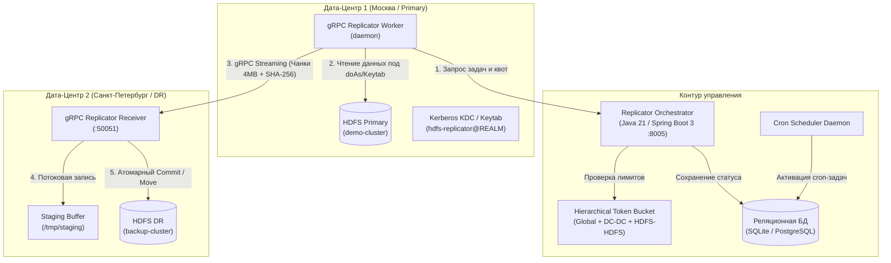

<div align="center">

# Руководство пользователя: Hadoop gRPC Replicator

<p><strong>Высокопроизводительная межкластерная репликация HDFS через WAN с контролем сетевых квот (Hierarchical Token Bucket), Kerberos-изоляцией и встроенным планировщиком</strong></p>

</div>

---

**Hadoop gRPC Replicator** — корпоративный сервис платформы **Hadoop Explorer Platform**, предназначенный для надежной, быстрой и управляемой репликации петабайтных массивов данных HDFS между географически распределенными дата-центрами (DC1 ➔ DC2 ➔ DC3) через WAN-каналы. 

Система исключает деградацию бизнес-трафика за счет строгого многоуровневого контроля полосы пропускания (Hierarchical Token Bucket), гарантирует целостность данных через сквозное хэширование SHA-256 с атомарным фиксатором в Staging и поддерживает как разовый запуск задач, так и периодическую репликацию по расписанию (Cron Scheduler) от имени системной техучетки.

---

## 📑 Содержание

1. [Архитектура и потоки данных](#1-архитектура-и-потоки-данных)
2. [Топология дата-центров (DC) и кластеров HDFS](#2-топология-дата-центров-dc-и-кластеров-hdfs)
3. [Многоуровневый контроль полосы (Hierarchical Token Bucket)](#3-многоуровневый-контроль-полосы-hierarchical-token-bucket)
   - [Полоса между Дата-Центрами (DC-DC WAN Limits)](#31-полоса-между-дата-центрами-dc-dc-wan-limits)
   - [Полоса между HDFS-кластерами (Cluster-to-Cluster Limits)](#32-полоса-между-hdfs-кластерами-cluster-to-cluster-limits)
   - [Глобальный пул пропускной способности (Global WAN Pool)](#33-глобальный-пул-пропускной-способности-global-wan-pool)
4. [Аутентификация и ролевая модель доступа (RBAC)](#4-аутентификация-и-ролевая-модель-доступа-rbac)
   - [Режим Администратора (ADMIN): сквозной контроль всех задач](#41-режим-администратора-admin-сквозной-контроль-всех-задач)
   - [Пользовательский режим (USER): изоляция персональных задач](#42-пользовательский-режим-user-изоляция-персональных-задач)
   - [Вход через Kerberos SPNEGO SSO и LDAP](#43-вход-через-kerberos-spnego-sso-и-ldap)
5. [Запуск от системной техучетки и изоляция Kerberos](#5-запуск-от-системной-техучетки-и-изоляция-kerberos)
6. [Планировщик периодических задач (Cron Scheduler)](#6-планировщик-периодических-задач-cron-scheduler)
7. [Дифференциальная синхронизация Snapshot Diff](#7-дифференциальная-синхронизация-snapshot-diff)
8. [Интерфейс оператора (Web UI Guide)](#8-интерфейс-оператора-web-ui-guide)
   - [Управление задачами репликации](#81-управление-задачами-репликации)
   - [Создание новой задачи репликации](#82-создание-новой-задачи-репликации)
   - [Управление топологией и лимитами в рантайме](#83-управление-топологией-и-лимитами-в-рантайме)
9. [Мониторинг и метрики Prometheus](#9-мониторинг-и-метрики-prometheus)
10. [Диагностика и устранение неполадок (Troubleshooting & FAQ)](#10-диагностика-и-устранение-неполадок-troubleshooting--faq)

---

## 1. Архитектура и потоки данных

Hadoop gRPC Replicator состоит из трех специализированных компонентов, взаимодействующих по высокоэффективным протоколам:



### Ключевые принципы передачи данных:
1. **Потоковый gRPC транспорт**: данные передаются непрерывным потоком чанков фиксированного размера (по умолчанию 4 МБ) по мультиплексированному HTTP/2 соединению.
2. **Атомарность и защита от повреждения (Atomic Commit)**: принимающий сервис (`Receiver`) принимает чанки во временный буфер (`staging_dir`). Только после валидации контрольной суммы SHA-256 всего файла производится атомарное перемещение (`rename`) в целевой каталог HDFS.
3. **Безопасное прерывание и возобновление**: при обрыве соединения незавершенные временные файлы удаляются, исключая появление «битых» файлов в целевом кластере.

---

## 2. Топология дата-центров (DC) и кластеров HDFS

В конфигурационном файле сервиса декларируется физическая топология инфраструктуры:
- **Дата-центры (DC)**: независимые площадки размещения оборудования (например, `dc1` — Москва, `dc2` — Санкт-Петербург, `dc3` — Новосибирск).
- **HDFS Кластеры**: каждый кластер жестко привязан к конкретному дата-центру (`dc_id`).

### Пример топологии в конфигурации:
```yaml
topology:
  datacenters:
    - id: "dc1"
      name: "ЦОД 1 (Москва / Primary)"
      location: "Moscow, DC-1"
    - id: "dc2"
      name: "ЦОД 2 (Санкт-Петербург / DR)"
      location: "Saint-Petersburg, DC-2"

  clusters:
    # В ЦОД 1 — два кластера HDFS:
    - id: "demo-cluster"
      name: "HDFS Primary (Prod DataLake)"
      dc_id: "dc1"
      default_path: "/data/production"
    - id: "analytics-cluster"
      name: "HDFS Analytics (Secondary DataLake)"
      dc_id: "dc1"
      default_path: "/data/analytics"

    # В ЦОД 2 — один кластер HDFS:
    - id: "backup-cluster"
      name: "HDFS DR (Backup DataLake)"
      dc_id: "dc2"
      default_path: "/backup/mirror"
```

При создании задачи репликатор автоматически сопоставляет выбранные кластеры с их дата-центрами для корректного применения правил сетевого шейпинга.

---

## 3. Многоуровневый контроль полосы (Hierarchical Token Bucket)

Для предотвращения перегрузки выделенных каналов связи репликатор использует трехуровневую иерархию корзин токенов:

```
[Глобальный пул WAN: 120 МБ/с]
         │
         └──► [Магистраль DC1 ➔ DC2: 100 МБ/с]
                      │
                      ├──► [Квота Prod ➔ Backup: 60 МБ/с]
                      └──► [Квота Analytics ➔ Backup: 40 МБ/с]

[Локальный обмен в DC1]
         └──► [Квота Prod ➔ Analytics: 80 МБ/с]
```

### Алгоритм работы шейпера:
Перед отправкой каждого чанка размером $B$ байт воркер выполняет запрос к Оркестратору:
1. Оркестратор находит применимые корзины токенов:
   - Глобальная корзина $K_{\text{global}}$
   - Корзина дата-центров $K_{\text{dc\_dc}}$ для пары $(\text{DC}_{\text{src}}, \text{DC}_{\text{dst}})$
   - Корзина кластеров $K_{\text{hdfs\_hdfs}}$ для пары $(\text{Cluster}_{\text{src}}, \text{Cluster}_{\text{dst}})$
2. Для каждой корзины вычисляется задержка $T_i$ при дефиците токенов:
   $$T_i = \max\left(0, \frac{B - \text{tokens}_i}{\text{rate}_i}\right)$$
3. Итоговое время ожидания для воркера определяется самым узким местом:
   $$T_{\text{wait}} = \max(T_{\text{global}}, T_{\text{dc\_dc}}, T_{\text{hdfs\_hdfs}})$$
4. Токены списываются со всех применимых корзин: $\text{tokens}_i \leftarrow \text{tokens}_i - B$.
5. Если $T_{\text{wait}} > 0$, воркер выполняет асинхронную паузу (`sleep`) перед отправкой чанка в gRPC-канал.
6. **Снятие ограничения канала (Unlimited)**: если администратор снимает галочку на лимите канала в интерфейсе (устанавливается значение `0 МБ/с`), соответствующая корзина токенов отключается (`rate = 0` ➔ $T_i = 0$), канал переходит в режим безлимитной передачи на полной скорости физической сети.

---

## 4. Аутентификация и ролевая модель доступа (RBAC)

Интерфейс и API сервиса строго интегрированы в ролевую модель безопасности платформы:

### 4.1 Режим Администратора (`ADMIN` / `admin_user` / `ADM`)
- Обладает правами глобального аудитора и супероператора.
- В таблице задач видит **все задачи всех пользователей организации** без ограничений.
- Имеет право менять сетевые лимиты DC-DC, HDFS-HDFS и глобальный лимит WAN в рантайме.
- В шапке отображается фиолетовый бейдж `ADM`, а над таблицей — информационный статус:
  > 👑 **Режим Администратора платформы:** Вам доступны для просмотра и управления все задачи репликации всех пользователей организации.

### 4.2 Режим Инженера данных (`WRITER` / `writer_user`, `de_user` / `RW`)
- Инженер данных видит **свои задачи, задачи инженерного пула** (`writer_user`, `de_user`, `data_engineer`), общие задачи администратора и системные процессы по расписанию.
- Имеет полные права на создание новых задач репликации, ручной запуск, остановку, редактирование параметров и удаление задач пула инженеров.
- В шапке отображается янтарный бейдж роли `RW`.
- **Строгий запрет редактирования сетевых лимитов топологии (Read-Only)**:
  - Вкладка «Топология ЦОД и Полоса» отображается в режиме аудита с предупреждающим бейджем `READ ONLY`.
  - Все поля ввода лимитов заблокированы (`disabled`), кнопки применения скрыты.
  - Любая попытка прямого вызова API изменения лимитов (`POST /api/v1/limits/global`, `POST /api/v1/limits/dc-dc`, `POST /api/v1/limits/hdfs-hdfs`, `PUT /api/v1/tokens/limit`) отклоняется с ошибкой `HTTP 403 Forbidden` (*"Только администратор платформы имеет право изменять сетевые лимиты топологии"*).

### 4.3 Режим Наблюдателя и Аналитика (`READER` / `reader_user`, `analyst_user` / `RO`)
- Наблюдатель или аналитик видит задачи платформы в режиме **мониторинга и аудита** (для отслеживания статусов репликации WAN, прогресса передачи и журналов ошибок).
- В шапке отображается серый бейдж роли `RO`.
- Все управляющие кнопки в строках задач (запуск `▶`, остановка `⏹`, редактирование `✎`, удаление `🗑`) отключены (`disabled`) с подсказкой «Режим только чтения: управление недоступно».
- Кнопка создания новой задачи репликации скрыта, а любые прямые API-запросы на мутацию данных (`POST /api/v1/jobs`, `PUT`, `DELETE`) отклоняются бэкендом с кодом `HTTP 403 Forbidden`.
- Сетевые лимиты топологии отображаются исключительно для ознакомления в режиме Read-Only.

### 4.4 Вход через Kerberos SPNEGO SSO и LDAP
- **Kerberos SSO (SPNEGO)**: однократный вход в один клик по билету Kerberos без ввода пароля.
- **LDAP / Active Directory**: вход по корпоративному логину и паролю.
- **Демо-профили**: кнопки быстрого входа под `admin_user` (ADM), `writer_user` (RW) и `reader_user` (RO) без дублирования ролей, а также табы фильтрации по сервисам платформы («Универсальные», «Replicator», «HDFS», «YARN», «SQL», «Spark») для оперативного тестирования ролевого разграничения.

### 4.5 Дизайн-система и темы оформления (Light / Dark Mode)
Интерфейс оркестратора в точности повторяет дизайн-систему HDFS Explorer (`Header.svelte`, `theme.css`):
- **Переключатель тем (Sun / Moon)**: расположен в шапке справа перед блоком профиля пользователя.
- **Светлая тема**: чистый корпоративный стиль с палитрой `slate-50` / `white` / `slate-200` и высокой контрастностью таблиц и форм.
- **Тёмная тема**: глубокая палитра `slate-950` / `slate-900` / `slate-800` для снижения нагрузки на зрение при ночных дежурствах.
- Выбор темы сохраняется в `localStorage` по единому платформенному ключу `hadoop_theme` и автоматически учитывает настройки операционной системы (`prefers-color-scheme`).
- Сбор метрик Prometheus осуществляется сервером мониторинга напрямую через эндпоинт `/metrics` (кнопка скрыта из пользовательской навигации для минимизации визуального шума).

---

## 5. Запуск от системной техучетки и изоляция Kerberos

Для долговременных задач синхронизации критично, чтобы репликация не прерывалась при истечении тикета пользователя или закрытии браузера.

При создании задачи доступна опция **«Запускать от системной техучетки»** (`run_as_service_account=True`):
1. **Принципал по умолчанию**: `hdfs-replicator@REALM.LOCAL` (задается через переменную `REPLICATOR_SERVICE_PRINCIPAL`).
2. **Изоляция тикетов (Kerberos Context Isolation)**:
   - Воркер выполняет операцию внутри контекстного менеджера `KerberosContextManager`.
   - Для каждой операции выделяется изолированный файл кэша билетов: `KRB5CCNAME=/tmp/krb5cc_repl_{uuid}`.
   - Выполняется `kinit -kt keytab_path principal`.
   - По завершении передачи тикет безопасно уничтожается через `kdestroy`.
   - Это гарантирует, что параллельные задачи под разными учетными записями не перезаписывают тикеты друг друга.

---

## 6. Планировщик периодических задач (Cron Scheduler)

Для регулярной синхронизации каталогов (например, ежечасной репликации логов или ежедневного ночного бэкапа) встроен планировщик задач:

### Поддерживаемые форматы расписания:
| Пресет / Cron | Описание | Интервал |
|---|---|---|
| `@every_5m` | Каждые 5 минут | Раз в 5 минут |
| `@every_15m` | Каждые 15 минут | Раз в 15 минут |
| `@hourly` | Каждый час | В начале каждого часа |
| `@daily` / `@midnight` | Раз в сутки | В полночь (00:00 UTC) |
| `*/10 * * * *` | Пользовательский Cron | Каждые 10 минут |

### Жизненный цикл запланированной задачи:
1. При создании периодической задачи (`is_scheduled=True`) она получает статус **`SCHEDULED`** (вместо пассивного ожидания в других статусах) и вычисляется точное время следующего запуска `next_run_at`.
2. Фоновый демон планировщика опрашивает базу данных каждые 5 секунд.
3. Пока текущее время `now < next_run_at`, задача сохраняет статус **`SCHEDULED`** (отображается индиго-бейджем в веб-интерфейсе).
4. При наступлении времени `now >= next_run_at`:
   - Создается отдельная запись в истории запусков **`JobRun`** с типом триггера `SCHEDULED` и порядковым номером (`#1`, `#2`, ...).
   - Задача переводится в статус **`QUEUED`**, связывается с `active_run_id` и подхватывается свободным воркером (`RUNNING`).
   - Фиксируется время запуска `last_run_at` и вычисляется следующее время `next_run_at`.
   - Автоматически запускается очистка старых записей истории (`prune_job_runs`) сверх настроенного лимита глубины хранения.
5. По завершении выполнения цикла передачи (успех `COMPLETED` или ошибка `FAILED`):
   - Статистика текущего запуска (длительность, переданные байты, средняя скорость МБ/с, причина ошибки) сохраняется в истории `JobRun`.
   - Периодическая задача автоматически возвращается в статус **`SCHEDULED`** в ожидании следующего цикла по расписанию!

### Настройка глубины истории запусков (History Retention):
Для предотвращения неограниченного роста базы данных при частых периодических запусках (например, каждые 5 минут) предусмотрена настройка глубины истории:
- Поле `history_retention_runs` задается при создании задачи или изменяется при редактировании (по умолчанию: **20** запусков, допустимый диапазон от 1 до 500).
- При превышении лимита старые завершенные запуски автоматически удаляются из таблицы `replication_job_runs`.
- Глубину истории можно на лету скорректировать прямо из модального окна истории запусков кнопкой «Применить лимит».

---

## 7. Дифференциальная синхронизация Snapshot Diff

Если в HDFS включены снэпшоты каталогов (`hdfs dfsadmin -allowSnapshot`), сервис поддерживает инкрементальную синхронизацию без повторной передачи неизменных файлов:

1. **Команда генерации диффа**:
   ```bash
   hdfs dfs -snapshotDiff /data/production .s1 .s2
   ```
2. **Обработка в API**: эндпоинт `POST /api/v1/jobs/{id}/snapshot-diff` принимает текстовый вывод диффа и формирует подзадачи (`tasks`):
   - `+` (Создание): передача нового файла в целевой кластер.
   - `M` (Модификация): повторная передача измененного файла.
   - `-` (Удаление): удаление соответствующего файла на целевой стороне.
   - `R` (Переименование): атомарное переименование файла на целевой стороне без повторной перекачки по сети.

---

## 8. Интерфейс оператора (Web UI Guide)

Веб-консоль репликатора доступна по адресу `http://<host>:8005` и реализована как полноценное SPA-приложение (`frontend/apps/replicator`) на Svelte 5 с использованием общих компонентов платформы [`Header.svelte`](../frontend/common/components/Header.svelte) и [`LoginModal.svelte`](../frontend/common/components/LoginModal.svelte) из `@hadoop-explorer/common`:

### 8.1 Управление задачами репликации
- **Список задач**: занимает всю ширину экрана и отображает статус, кластеры с указанием ЦОД, исходный и целевой пути, автора задачи, учетную запись исполнения и расширенный блок прогресса в реальном времени.
- **Детализация прогресса репликации**:
  - Точный процент выполнения и переданный объем (`copied_bytes / total_bytes`).
  - **Время старта**: момент фактического запуска задачи в работу воркером.
  - **Примерное время окончания (ETA / Финиш)**: расчетное время завершения репликации на основе текущей динамики и оставшегося объема данных (для завершенных задач — фактическое время завершения).
  - **Средняя скорость репликации**: эффективная скорость передачи в МБ/с (`⚡`), рассчитываемая на протяжении передачи.
- **Индикаторы статуса**:
  - `SCHEDULED` (индиго) — периодическая задача по расписанию ожидает наступления следующего времени запуска (`next_run_at`).
  - `QUEUED` (желтый) — ожидает освобождения воркера в очереди.
  - `RUNNING` (синий, пульсирующий) — идет активная передача данных.
  - `COMPLETED` (зеленый) — передача успешно завершена, контрольная сумма совпала.
  - `FAILED` (красный) — ошибка передачи или сбой NameNode.
  - `CANCELLED` (серый) — задача остановлена оператором.
- **Панель действий над задачей (Колонка «ДЕЙСТВИЯ»)**:
  - **Старт / Запуск (▶)**: запускает или перезапускает задачу, сбрасывая прогресс и переводя её в статус `QUEUED` для немедленной обработки воркером. Доступна строго в противоположной доступности к кнопке «Стоп» — когда задача остановлена или ожидает расписания (`SCHEDULED`, `COMPLETED`, `FAILED`, `CANCELLED`).
  - **Стоп / Остановка (■)**: корректно прерывает выполнение задачи, переводя её в статус `CANCELLED`. Доступна строго для активных задач (`RUNNING` или `QUEUED`).
  - **Редактировать (✏️)**: открывает модальное окно редактирования параметров задачи (исходный/целевой кластер, пути в HDFS, параметры техучетки, расписание cron, глубина истории). Доступна **только для неактивной задачи** (в покое или остановленной).
  - **История всех запусков (📜 History)**: открывает модальное окно подробной истории всех запусков со статистикой и динамической настройкой глубины хранения. На кнопке отображается фиолетовый бейдж с общим числом сохраненных запусков (`runs_count`).
  - **Удалить (🗑️)**: безвозвратно удаляет задачу, ее историю запусков и подзадачи из базы данных после подтверждения оператором. Доступна **только для неактивной задачи** (активную задачу необходимо предварительно остановить кнопкой «Стоп»).

### 8.2 Интерактивная фильтрация и поиск задач (Фильтры по статусам и авторам)
Для оперативного контроля сотен задач в очереди консоль предоставляет гибкую систему поиска и фильтрации:
- **Интерактивные карточки статистики**:
  - Карточки верхнего дашборда («Всего задач», «В работе», «В очереди», «По расписанию», «Завершено», «Ошибки») являются интерактивными кнопками.
  - Клик по любой карточке мгновенно включает фильтр по соответствующему статусу (с визуальной контурной подсветкой активной карточки). Повторный клик снимает фильтр и возвращает отображение всех задач.
- **Панель фильтров над таблицей**:
  - **Полнотекстовый поиск (Search)**: мгновенная клиентская фильтрация по фрагменту ID задачи, исходному или целевому пути в HDFS, именам кластеров, Kerberos principal или имени автора.
  - **Селектор статуса (Status Filter)**: выбор из всех доступных статусов (`ALL`, `RUNNING`, `QUEUED`, `SCHEDULED`, `COMPLETED`, `FAILED`, `CANCELLED`) с динамическим счетчиком задач в каждом статусе.
  - **Селектор автора (Author Filter)**: выбор из динамического списка всех авторов, создававших задачи в системе (например, `admin_user`, `de_user`, `analyst_user`, `system_operator`), со счетчиком задач каждого автора.
  - **Индикатор количества и сброс**: отображает соотношение «Показано: X из Y задач» и кнопку **«Сбросить»** при наличии любых активных фильтров.
  - При отсутствии совпадений выводится наглядная плашка с предложением сбросить фильтры.
- **REST API поддержка**: эндпоинт `GET /api/v1/jobs?status=SCHEDULED&author=admin_user` поддерживает серверную фильтрацию по query-параметрам `status` и `author` с сохранением правил ролевой изоляции (RBAC).

### 8.3 Создание новой задачи репликации
1. Нажмите кнопку **«Новая задача репликации»** в правом верхнем углу.
2. В появившемся окне:
   - Выберите **Исходный кластер (Source)** и **Целевой кластер (Target)** из выпадающих списков с указанием их ЦОД.
   - Укажите **Исходный путь в HDFS** (например, `/data/production/events/2026-10`).
   - Укажите **Целевой путь в HDFS** (например, `/backup/mirror/events/2026-10`).
   - При необходимости активируйте **«Запускать от системной техучетки»** и укажите принципал.
   - Для периодической синхронизации включите чекбокс **«Запуск по расписанию»** и выберите пресет (например, `@every_5m`).
   - Задайте **Глубину истории запусков** (по умолчанию: 20, диапазон 1–500) для ограничения количества сохраняемых отчетов о выполнениях.
3. Нажмите **«Создать задачу»**. Задача немедленно отобразится в таблице: с индиго-статусом `SCHEDULED` для периодических задач или в статусе `QUEUED` для разовых задач.

### 8.4 Управление топологией и лимитами в рантайме
Перейдите на вкладку **«Топология ЦОД и Полоса»**:
- Ознакомьтесь с картой дата-центров и привязанными к ним кластерами.
- Для изменения полосы любого канала (DC-DC или HDFS-HDFS) введите новое значение в поле ввода (в МБ/с) и нажмите кнопку **«Сохранить»**. Новое ограничение вступит в силу для всех воркеров в течение 1 секунды.

### 8.5 История запусков задачи и статистика (Job Runs History & Retention)
Для отслеживания динамики выполнения периодических и ручных запусков оператору доступно отдельное окно истории (`GET /api/v1/jobs/{id}/runs`):
1. Нажмите кнопку с иконкой истории (📜) в строке интересующей задачи.
2. В модальном окне отображаются:
   - **Сводные метрики**: суммарное число запусков в истории, количество успешных выполнений, количество сбоев и суммарный объем переданных данных в байтах.
   - **Управление глубиной истории (Retention)**: поле ввода лимита хранения с кнопкой «Применить лимит». Изменение лимита сразу применяет прунинг устаревших записей в базе данных через `PUT /api/v1/jobs/{id}`.
   - **Журнал выполнений**: хронологический список запусков с детальной статистикой:
     - Порядковый номер запуска (`#1`, `#2`, ...).
     - Источник запуска: `Шедулер` (по расписанию) или `Вручную` (по клику оператора).
     - Статус каждого запуска с цветовым бейджем.
     - Точное время старта и завершения.
     - Фактическая длительность выполнения (в секундах или минутах).
     - Переданный объем байт (`copied_bytes / total_bytes`).
     - Эффективная средняя скорость репликации в МБ/с.
     - Текст ошибки или автор запуска.
3. Возможность обновить историю в реальном времени кнопкой синхронизации.

---

## 9. Мониторинг и метрики Prometheus

Сервис экспортирует метрики на эндпоинте `/metrics` (порт 8005):

| Метрика | Тип | Описание |
|---|---|---|
| `replication_bytes_total{status}` | Counter | Общий объем переданных байт данных |
| `active_workers` | Gauge | Количество активных воркеров передачи |
| `replication_jobs_total{status, mode}` | Counter | Количество задач по статусам и типу учетной записи |
| `throttling_delay_seconds_total` | Counter | Суммарное время задержки воркеров из-за Token Bucket шейпера |

---

## 10. Диагностика и устранение неполадок (Troubleshooting & FAQ)

### Вопрос: Задача зависла в статусе QUEUED
- **Причина**: Не запущен воркер репликации (`worker daemon`) или исчерпаны свободные слоты передачи.
- **Решение**: Проверьте статус контейнера воркера: `docker logs replicator-worker`.

### Вопрос: Скорость репликации ниже ожидаемой
- **Причина**: Срабатывает одно из звеньев иерархического шейпера (DC-DC limit, HDFS-HDFS limit или Global pool).
- **Решение**: Проверьте счетчик `throttling_delay_seconds_total` в `/metrics` и при необходимости увеличьте лимит на вкладке «Топология ЦОД и Полоса».

### Вопрос: Ошибка аутентификации Kerberos (GSSException)
- **Причина**: Истек или не найден keytab для системного принципала.
- **Решение**: Убедитесь, что файл keytab смонтирован в контейнер воркера и доступен по пути, указанному в переменной `KRB5_KEYTAB_PATH`.
