<div align="center">


# Руководство пользователя: Hadoop gRPC Replicator

<p><strong>Высокопроизводительная межкластерная репликация HDFS через WAN с контролем сетевых квот (Hierarchical Token Bucket), Kerberos-изоляцией и встроенным планировщиком</strong></p>

</div>

---

**Hadoop gRPC Replicator** — корпоративный сервис платформы **Hadoop Explorer Platform**, предназначенный для надежной, быстрой и управляемой репликации петабайтных массивов данных HDFS между географически распределенными дата-центрами (DC1 ➔ DC2 ➔ DC3) через WAN-каналы. 

Система исключает деградацию бизнес-трафика за счет строгого многоуровневого контроля полосы пропускания (Hierarchical Token Bucket), гарантирует целостность данных через сквозное хэширование SHA-256 с атомарным фиксатором в Staging и поддерживает как разовый запуск задач, так и периодическую репликацию по расписанию (Cron Scheduler) от имени системной техучетки.

> [!TIP]
> **Материалы для команды**: Для проведения технического доклада и демонстрации архитектуры доступна иллюстрированная [Презентация Replicator со скриншотами и архитектурой всей конструкции](replicator-presentation.md), готовый [Интерактивный HTML-слайддек для браузера](replicator-presentation.html), а также файл слайд-шоу [PowerPoint PPTX](replicator-presentation.pptx).

---

## 📑 Содержание

1. [Архитектура и потоки данных](#1-архитектура-и-потоки-данных)
2. [Топология дата-центров (DC) и кластеров HDFS](#2-топология-дата-центров-dc-и-кластеров-hdfs)
3. [Многоуровневый контроль полосы (Hierarchical Token Bucket)](#3-многоуровневый-контроль-полосы-hierarchical-token-bucket)
   - [Полоса между Дата-Центрами (DC-DC WAN Limits)](#31-полоса-между-дата-центрами-dc-dc-wan-limits)
   - [Полоса между HDFS-кластерами (Cluster-to-Cluster Limits)](#32-полоса-между-hdfs-кластерами-cluster-to-cluster-limits)
   - [Глобальный пул пропускной способности (Global WAN Pool)](#33-глобальный-пул-пропускной-способности-global-wan-pool)
4. [Аутентификация и ролевая модель доступа (RBAC)](#4-аутентификация-и-ролевая-модель-доступа-rbac)
   - [Режим Администратора (ADMIN): сквозной контроль всех задач](#41-режим-администратора-admin-сквозной-контроль-всех-задач)
   - [Пользовательский режим (USER): изоляция персональных задач](#42-пользовательский-режим-user-изоляция-персональных-задач)
   - [Вход через Kerberos SPNEGO SSO и LDAP](#43-вход-через-kerberos-spnego-sso-и-ldap)
5. [Запуск от системной техучетки и изоляция Kerberos](#5-запуск-от-системной-техучетки-и-изоляция-kerberos)
6. [Планировщик периодических задач (Cron Scheduler)](#6-планировщик-периодических-задач-cron-scheduler)
7. [Режимы синхронизации: инкрементальная синхронизация каталогов и Snapshot Diff](#7-режимы-синхронизации-инкрементальная-синхронизация-каталогов-и-snapshot-diff)
   - [Рекурсивная инкрементальная синхронизация (по умолчанию)](#71-рекурсивная-инкрементальная-синхронизация-каталогов-по-умолчанию-без-снэпшотов)
   - [Дифференциальная синхронизация Snapshot Diff](#72-дифференциальная-синхронизация-snapshot-diff-для-snapshottable-директорий)
   - [Масштабирование: распределенный пул задач (Distributed Task Queue)](#73-масштабирование-на-всех-доступных-агентов-распределенный-пул-задач-distributed-task-queue)
   - [Фильтрация временных и служебных файлов/каталогов](#74-автоматическая-фильтрация-временных-и-служебных-файловкаталогов)
   - [Батчинг мелких файлов (Tar-Streaming) и Zero-Staging](#75-батчинг-мелких-файлов-small-files-bundling--tar-streaming-и-zero-staging-в-hdfs)
8. [Интерфейс оператора (Web UI Guide)](#8-интерфейс-оператора-web-ui-guide)
   - [Управление задачами репликации](#81-управление-задачами-репликации)
   - [Создание новой задачи репликации](#82-создание-новой-задачи-репликации)
   - [Управление топологией и лимитами в рантайме](#83-управление-топологией-и-лимитами-в-рантайме)
   - [История запусков задачи и статистика](#85-история-запусков-задачи-и-статистика-job-runs-history--retention)
   - [Репликация Hive Metastore (Раздел «HMS Replication»)](#86-репликация-hive-metastore-раздел-hms-replication)
   - [Консоль аварийного переключения (Раздел «Disaster Recovery & Failover»)]()
9. [Мониторинг и метрики Prometheus](#9-мониторинг-и-метрики-prometheus)
10. [Диагностика и устранение неполадок (Troubleshooting & FAQ)](#10-диагностика-и-устранение-неполадок-troubleshooting--faq)

---

## 1. Архитектура и потоки данных

Hadoop gRPC Replicator состоит из трех специализированных компонентов, взаимодействующих по высокоэффективным протоколам:

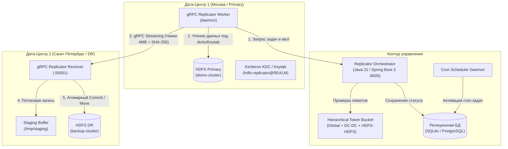

### Ключевые принципы передачи данных:
1. **Потоковый gRPC транспорт**: данные передаются непрерывным потоком чанков фиксированного размера (по умолчанию 4 МБ) по мультиплексированному HTTP/2 соединению.
2. **Атомарность и защита от повреждения (Atomic Commit)**: принимающий сервис (`Receiver`) принимает чанки во временный буфер (`staging_dir`). Только после валидации контрольной суммы SHA-256 всего файла производится атомарное перемещение (`rename`) в целевой каталог HDFS.
3. **Безопасное прерывание и возобновление**: при обрыве соединения незавершенные временные файлы удаляются, исключая появление «битых» файлов в целевом кластере.

---

## 2. Топология дата-центров (DC) и кластеров HDFS

В конфигурационном файле сервиса декларируется физическая топология инфраструктуры:
- **Дата-центры (DC)**: независимые площадки размещения оборудования (например, `dc1` — Москва, `dc2` — Санкт-Петербург, `dc3` — Новосибирск).
- **HDFS Кластеры**: каждый кластер жестко привязан к конкретному дата-центру (`dc_id`).

### Пример топологии в конфигурации:
```yaml
topology:
  datacenters:
    - id: "dc1"
      name: "ЦОД 1 (Москва / Primary)"
      location: "Moscow, DC-1"
    - id: "dc2"
      name: "ЦОД 2 (Санкт-Петербург / DR)"
      location: "Saint-Petersburg, DC-2"

  clusters:
    # В ЦОД 1 — два кластера HDFS:
    - id: "demo-cluster"
      name: "HDFS Primary (Prod DataLake)"
      dc_id: "dc1"
      default_path: "/data/production"
    - id: "analytics-cluster"
      name: "HDFS Analytics (Secondary DataLake)"
      dc_id: "dc1"
      default_path: "/data/analytics"

    # В ЦОД 2 — один кластер HDFS:
    - id: "backup-cluster"
      name: "HDFS DR (Backup DataLake)"
      dc_id: "dc2"
      default_path: "/backup/mirror"
```

При создании задачи репликатор автоматически сопоставляет выбранные кластеры с их дата-центрами для корректного применения правил сетевого шейпинга.

---

## 3. Многоуровневый контроль полосы (Hierarchical Token Bucket)

Для предотвращения перегрузки выделенных каналов связи репликатор использует трехуровневую иерархию корзин токенов:

```
[Глобальный пул WAN: 120 МБ/с]
         │
         └──► [Магистраль DC1 ➔ DC2: 100 МБ/с]
                      │
                      ├──► [Квота Prod ➔ Backup: 60 МБ/с]
                      └──► [Квота Analytics ➔ Backup: 40 МБ/с]

[Локальный обмен в DC1]
         └──► [Квота Prod ➔ Analytics: 80 МБ/с]
```

### Алгоритм работы шейпера:
Перед отправкой каждого чанка размером $B$ байт воркер выполняет запрос к Оркестратору:
1. Оркестратор находит применимые корзины токенов:
   - Глобальная корзина $K_{\text{global}}$
   - Корзина дата-центров $K_{\text{dc-dc}}$ для пары `(DC_src, DC_dst)`
   - Корзина кластеров $K_{\text{hdfs-hdfs}}$ для пары `(Cluster_src, Cluster_dst)`
2. Для каждой корзины вычисляется задержка $T_i$ при дефиците токенов:
   $$T_i = \max\left(0, \frac{B - \text{tokens}_i}{\text{rate}_i}\right)$$
3. Итоговое время ожидания для воркера определяется самым узким местом:
   $$T_{\text{wait}} = \max(T_{\text{global}}, T_{\text{dc-dc}}, T_{\text{hdfs-hdfs}})$$
4. Токены списываются со всех применимых корзин: $\text{tokens}_i \leftarrow \text{tokens}_i - B$.
5. Если $T_{\text{wait}} > 0$, воркер выполняет асинхронную паузу (`sleep`) перед отправкой чанка в gRPC-канал.
6. **Снятие ограничения канала (Unlimited)**: если администратор снимает галочку на лимите канала в интерфейсе (устанавливается значение `0 МБ/с`), соответствующая корзина токенов отключается (`rate = 0` ➔ $T_i = 0$), канал переходит в режим безлимитной передачи на полной скорости физической сети.

---

## 4. Аутентификация и ролевая модель доступа (RBAC)

Интерфейс и API сервиса строго интегрированы в ролевую модель безопасности платформы:

### 4.1 Режим Администратора (`ADMIN` / `admin_user` / `ADM`)
- Обладает правами глобального аудитора и супероператора.
- В таблице задач видит **все задачи всех пользователей организации** без ограничений.
- Имеет право менять сетевые лимиты DC-DC, HDFS-HDFS и глобальный лимит WAN в рантайме.
- **Эксклюзивный доступ к управлению Disaster Recovery**: только администратор имеет право выполнять аварийный останов (Kill-Switch), запускать обратную репликацию площадок (`Reverse Replication`), точечно разворачивать маршруты и отзывать зеркала.
- **Управление пользователем имперсонации (doAs)**: администратор имеет эксклюзивное право указывать произвольного пользователя/принципала (`execution_principal`) как при создании и редактировании задач в разделе **HDFS Replication**, так и при создании задач синхронизации метаданных в разделе **HMS Replication**.
- В шапке отображается фиолетовый бейдж `ADM`, а над таблицей — информационный статус:
  > 👑 **Режим Администратора платформы:** Вам доступны для просмотра и управления все задачи репликации всех пользователей организации.

### 4.2 Режим Инженера данных (`WRITER` / `writer_user`, `de_user` / `RW`)
- Инженер данных видит **свои задачи, задачи инженерного пула** (`writer_user`, `de_user`, `data_engineer`), общие задачи администратора и системные процессы по расписанию.
- Имеет полные права на создание новых задач репликации, ручной запуск, остановку, редактирование параметров и удаление задач пула инженеров.
- **Ограничение на имперсонацию (Изоляция безопасности)**: поле пользователя имперсонации заблокировано для ввода (`disabled`) и всегда отображает текущего автора задачи (`user.username`). Бэкенд строго валидирует запросы и принудительно фиксирует контекст исполнения за текущей сессией инженера данных, предотвращая подмену прав в Ranger Audit.
- В шапке отображается янтарный бейдж роли `RW`.
- **Строгий запрет редактирования сетевых лимитов топологии и управления Disaster Recovery (Read-Only)**:
  - Вкладка «Топология ЦОД и Полоса» и консоль «Disaster Recovery» работают в режиме аудита с предупреждающим бейджем `READ ONLY`.
  - Управляющие кнопки (Kill-Switch, мастер разворота, точечный разворот маршрута и отзыв зеркал) скрыты.
  - Любые попытки прямого вызова управляющих эндпоинтов API (`POST /api/v1/limits/*`, `POST /api/v1/dr/*`) отклоняются бэкендом с кодом `HTTP 403 Forbidden` (*"Управление разделом Disaster Recovery доступно только Администратору платформы (ADMIN)"*).

### 4.3 Режим Наблюдателя и Аналитика (`READER` / `reader_user`, `analyst_user` / `RO`)
- Наблюдатель или аналитик видит задачи платформы в режиме **мониторинга и аудита** (для отслеживания статусов репликации WAN, прогресса передачи и журналов ошибок).
- В шапке отображается серый бейдж роли `RO`.
- Все управляющие кнопки в строках задач (запуск `▶`, остановка `⏹`, редактирование `✎`, удаление `🗑`) отключены (`disabled`) с подсказкой «Режим только чтения: управление недоступно».
- Кнопка создания новой задачи репликации скрыта, а любые прямые API-запросы на мутацию данных (`POST /api/v1/jobs`, `PUT`, `DELETE`) отклоняются бэкендом с кодом `HTTP 403 Forbidden`.
- Сетевые лимиты топологии и раздел Disaster Recovery отображаются исключительно для ознакомления в режиме Read-Only.

### 4.4 Вход через Kerberos SPNEGO SSO и LDAP
- **Kerberos SSO (SPNEGO)**: однократный вход в один клик по билету Kerberos без ввода пароля.
- **LDAP / Active Directory**: вход по корпоративному логину и паролю.
- **Демо-профили**: кнопки быстрого входа под `admin_user` (ADM), `writer_user` (RW) и `reader_user` (RO) без дублирования ролей, а также табы фильтрации по сервисам платформы («Универсальные», «Replicator», «HDFS», «YARN», «SQL», «Spark») для оперативного тестирования ролевого разграничения.

<div align="center">
  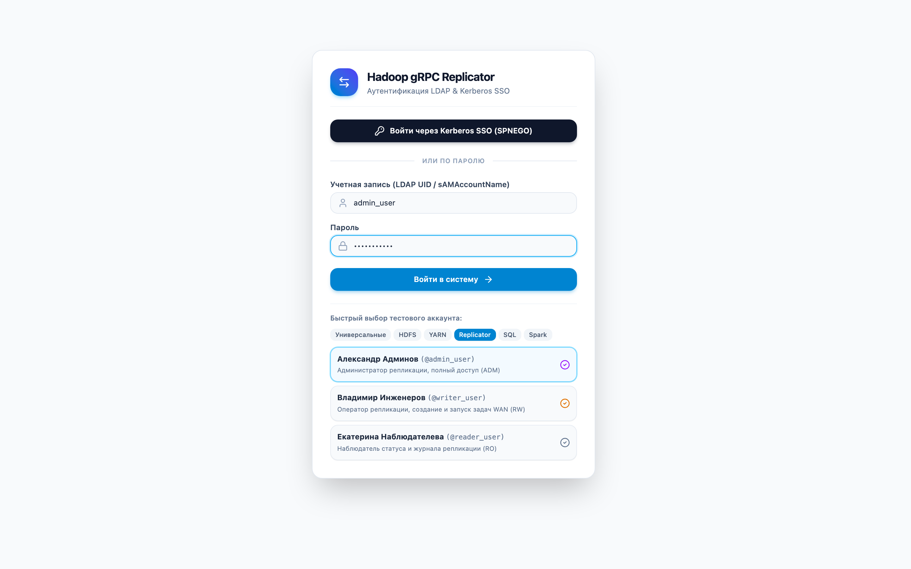
  <p><em>Рисунок 1: Экран аутентификации LDAP & Kerberos Single Sign-On (SPNEGO) с профилями быстрого переключения ролей</em></p>
</div>

### 4.5 Дизайн-система и темы оформления (Light / Dark Mode)
Интерфейс оркестратора в точности повторяет дизайн-систему HDFS Explorer (`Header.svelte`, `theme.css`):
- **Переключатель тем (Sun / Moon)**: расположен в шапке справа перед блоком профиля пользователя.
- **Светлая тема**: чистый корпоративный стиль с палитрой `slate-50` / `white` / `slate-200` и высокой контрастностью таблиц и форм.
- **Тёмная тема**: глубокая палитра `slate-950` / `slate-900` / `slate-800` для снижения нагрузки на зрение при ночных дежурствах.
- Выбор темы сохраняется в `localStorage` по единому платформенному ключу `hadoop_theme` и автоматически учитывает настройки операционной системы (`prefers-color-scheme`).
- Сбор метрик Prometheus осуществляется сервером мониторинга напрямую через эндпоинт `/metrics` (кнопка скрыта из пользовательской навигации для минимизации визуального шума).

---

## 5. Запуск от системной техучетки и изоляция Kerberos

Для долговременных задач синхронизации критично, чтобы репликация не прерывалась при истечении тикета пользователя или закрытии браузера.

При создании задачи доступна опция **«Запускать от системной техучетки»** (`run_as_service_account=True`):
1. **Принципал по умолчанию**: `hdfs-replicator@REALM.LOCAL` (задается через переменную `REPLICATOR_SERVICE_PRINCIPAL`).
2. **Изоляция тикетов (Kerberos Context Isolation)**:
   - Воркер выполняет операцию внутри контекстного менеджера `KerberosContextManager`.
   - Для каждой операции выделяется изолированный файл кэша билетов: `KRB5CCNAME=/tmp/krb5cc_repl_{uuid}`.
   - Выполняется `kinit -kt keytab_path principal`.
   - По завершении передачи тикет безопасно уничтожается через `kdestroy`.
   - Это гарантирует, что параллельные задачи под разными учетными записями не перезаписывают тикеты друг друга.

---

## 6. Планировщик периодических задач (Cron Scheduler)

Для регулярной синхронизации каталогов (например, ежечасной репликации логов или ежедневного ночного бэкапа) встроен планировщик задач:

### Поддерживаемые форматы расписания:
| Пресет / Cron | Описание | Интервал |
|---|---|---|
| `@every_5m` | Каждые 5 минут | Раз в 5 минут |
| `@every_15m` | Каждые 15 минут | Раз в 15 минут |
| `@hourly` | Каждый час | В начале каждого часа |
| `@daily` / `@midnight` | Раз в сутки | В полночь (00:00 UTC) |
| `*/10 * * * *` | Пользовательский Cron | Каждые 10 минут |

### Жизненный цикл запланированной задачи:
1. При создании периодической задачи (`is_scheduled=True`) она получает статус **`SCHEDULED`** (вместо пассивного ожидания в других статусах) и вычисляется точное время следующего запуска `next_run_at`.
2. Фоновый демон планировщика опрашивает базу данных каждые 5 секунд.
3. Пока текущее время `now < next_run_at`, задача сохраняет статус **`SCHEDULED`** (отображается индиго-бейджем в веб-интерфейсе).
4. При наступлении времени `now >= next_run_at`:
   - Создается отдельная запись в истории запусков **`JobRun`** с типом триггера `SCHEDULED` и порядковым номером (`#1`, `#2`, ...).
   - Задача переводится в статус **`QUEUED`**, связывается с `active_run_id` и подхватывается свободным воркером (`RUNNING`).
   - Фиксируется время запуска `last_run_at` и вычисляется следующее время `next_run_at`.
   - Автоматически запускается очистка старых записей истории (`prune_job_runs`) сверх настроенного лимита глубины хранения.
5. По завершении выполнения цикла передачи (успех `COMPLETED` или ошибка `FAILED`):
   - Статистика текущего запуска (длительность, переданные байты, средняя скорость МБ/с, причина ошибки) сохраняется в истории `JobRun`.
   - Периодическая задача автоматически возвращается в статус **`SCHEDULED`** в ожидании следующего цикла по расписанию!

### Настройка глубины истории запусков (History Retention):
Для предотвращения неограниченного роста базы данных при частых периодических запусках (например, каждые 5 минут) предусмотрена настройка глубины истории:
- Поле `history_retention_runs` задается при создании задачи или изменяется при редактировании (по умолчанию: **20** запусков, допустимый диапазон от 1 до 500).
- При превышении лимита старые завершенные запуски автоматически удаляются из таблицы `replication_job_runs`.
- Глубину истории можно на лету скорректировать прямо из модального окна истории запусков кнопкой «Применить лимит».

---

## 7. Режимы синхронизации: инкрементальная синхронизация каталогов и Snapshot Diff

Сервис поддерживает два режима межкластерной репликации в топологии изолированных ЦОД:

### 7.1 Рекурсивная инкрементальная синхронизация каталогов (по умолчанию, без снэпшотов)
Основной режим репликации не требует включения снэпшотов в HDFS и прав суперпользователя NameNode:
1. **Строгая изоляция дата-центров (DC1 ↔ DC2)**:
   - Оркестратор (`replicator-orchestrator`) не подключается к HDFS и не перекачивает данные через себя — он выступает исключительно как Control Plane (шейпер квот Token Bucket, реестр агентов, планировщик).
   - Вся работа с файловой системой HDFS/FS ведется локальными агентами (`replicator-agent`) внутри своего ЦОД. Межкластерный обмен идет строго между агентами по защищенному gRPC-каналу (`:50051`).
2. **Пакетный манифест целевого каталога (Batch Manifest RPC `GetDirectoryManifest`)**:
   - Вместо медленных пофайловых round-trip запросов через WAN агент-источник (Sender) выполняет ровно **один gRPC-вызов `GetDirectoryManifest`** к агенту-приемнику (Receiver).
   - Агент-приемник локально опрашивает свой целевой HDFS/FS и возвращает компактный плоский манифест всех файлов в целевом каталоге (`relativePath`, `size`, `modificationTime`).
3. **Мгновенный локальный Diff дерева в памяти (In-Memory Diff)**:
   - Агент-источник сравнивает локальное дерево исходного каталога с удаленным манифестом в оперативной памяти (O(N) hash map lookup).
   - За доли миллисекунд вычисляется точная дельта: какие файлы отсутствуют на приемнике, какие изменились по размеру или mtime, а какие идентичны.
4. **Инкрементальный пропуск неизмененных файлов**:
   - Файлы, существующие на приемнике с совпадающим размером, мгновенно помечаются как синхронизированные и полностью пропускаются (0 байт сетевого трафика WAN).
5. **Потоковая передача дельты**:
   - Только новые или модифицированные файлы передаются потоком чанков с контролем полосы (Hierarchical Token Bucket) и атомарно коммитятся в целевой HDFS.
6. **Детализированный отчет**:
   - Прогресс отображает количество переданных и пропущенных файлов (`Синхронизация каталога завершена: передано X, пропущено Y (всего Z файлов)`).

### 7.2 Дифференциальная синхронизация Snapshot Diff (для snapshottable директорий)
Для каталогов сверхбольшого объема (миллионы файлов), где администратором кластера предварительно разрешены снимки (`hdfs dfsadmin -allowSnapshot`):
1. **Управление снимками агентом Replicator**:
   - Создание снимка на источнике: агент выполняет `HadoopFsManager.createSnapshot(dir, snapName)` под сервисной или прокси-учетной записью.
   - Вычисление diff между снимками: агент запрашивает у NameNode разницу `dfs.getSnapshotDiffReport(dir, snap1, snap2)`.
2. **Типы операций в Snapshot Diff**:
   - `+` (Создание / ADD): передача нового файла в целевой кластер.
   - `M` (Модификация / MODIFY): повторная передача измененного файла.
   - `-` (Удаление / DELETE): удаление соответствующего файла на целевой стороне.
   - `R` (Переименование / RENAME): атомарное переименование файла или подкаталога на целевой стороне через `dfs.rename` без передачи данных по сети.
3. **Фиксация и Retention**:
   - Создание идентичного снимка на приемнике после завершения синхронизации дельты.
   - Автоматическая очистка устаревших снимков агентом согласно настроенной политике retention (`HadoopFsManager.deleteSnapshot(dir, snapName)`).

### 7.3 Масштабирование на всех доступных агентов: распределенный пул задач (Distributed Task Queue)
При объемах данных в сотни терабайт и петабайт (1 PB+) прокачка всех файлов через единственный агент создает критическое бутылочное горлышко по сети и процессору. Для снятия этого ограничения в Replicator реализована двухфазная распределенная архитектура:

```
┌────────────────────────────────────────────────────────────────────────────────────────┐
│ 1. ФАЗА АНАЛИЗА (Analyzer Phase)                                                       │
│ Агент-анализатор (или первый свободный агент кластера-источника DC1)                   │
│  - Обходит дерево каталогов HDFS-1                                                     │
│  - Запрашивает манифест HDFS-2 через gRPC GetDirectoryManifest (1 сетевой вызов)       │
│  - Выполняет in-memory diff                                                            │
│  - Регистрирует пул пофайловых задач в Оркестраторе (POST /api/v1/jobs/{id}/tasks/batch│
│    * Файлы с совпадающим размером -> SKIPPED (0 байт сетевого трафика)                 │
│    * Новые и измененные файлы -> QUEUED в пуле задач                                  │
└───────────────────────────────────────────┬────────────────────────────────────────────┘
                                            │
                                            ▼
┌────────────────────────────────────────────────────────────────────────────────────────┐
│ 2. ФАЗА РАСПРЕДЕЛЕННОЙ ПЕРЕДАЧИ (Distributed Parallel Workers Phase)                   │
│ Все доступные агенты кластера DC1 параллельно забирают задачи из пула:                │
│                                                                                        │
│   ┌────────────────────┐   claimTasks (N=5)   ┌────────────────────────────────────┐   │
│   │ Agent Worker DC1-1 │ ◄─────────────────── │                                    │   │
│   └─────────┬──────────┘                      │                                    │   │
│             │                                 │      Оркестратор Replicator        │   │
│   ┌─────────▼──────────┐   claimTasks (N=5)   │      Distributed Task Queue        │   │
│   │ Agent Worker DC1-2 │ ◄─────────────────── │      (/api/v1/tasks/claim)         │   │
│   └─────────┬──────────┘                      │                                    │   │
│             │                                 │   - Атомарное назначение агенту    │   │
│   ┌─────────▼──────────┐   claimTasks (N=5)   │   - Балансировка приемников DC2    │   │
│   │ Agent Worker DC1-N │ ◄─────────────────── │   - Агрегация суммарных copiedBytes│   │
│   └─────────┬──────────┘                      └────────────────────────────────────┘   │
└─────────────┼──────────────────────────────────────────────────────────────────────────┘
              │
              │  Параллельный gRPC стриминг на наименее загруженные узлы DC2
              ▼
┌────────────────────────────────────────────────────────────────────────────────────────┐
│ 3. ПРИЕМ И АТОМАРНЫЙ КОММИТ В ЦОД 2                                                    │
│   - Поток файлов распределяется между всеми онлайн-приемниками DC2 (Least Loaded)      │
│   - Каждый воркер подтверждает завершение файла: POST /api/v1/tasks/{taskId}/complete  │
│   - При сбое передачи файла воркер отправляет: POST /api/v1/tasks/{taskId}/fail        │
│   - Родительская задача переходит в терминальный статус (COMPLETED или FAILED)         │
│     СТРОГО после того, как завершены ВСЕ подзадачи в пуле.                             │
└────────────────────────────────────────────────────────────────────────────────────────┘
```

#### Инкапсуляция подзадач, автоматический failover и прозрачность для клиента:
- **Единая родительская задача (`Job`)**: с точки зрения веб-клиента и REST API подзадачи полностью инкапсулированы внутри основной задачи. Клиенту не требуется отслеживать отдельные пофайловые таски — они выступают внутренними сабтасками пула воркеров.
- **Автоматический Failover подзадач при сбое воркера (Self-Healing & Re-queue)**: если при передаче отдельного файла происходит сетевой сбой (`failTask`, разрыв gRPC, сбой сокета) или агент аварийно завершает работу (узел переходит в `OFFLINE`), задача **не переходит сразу в статус `FAILED`**. Оркестратор автоматически увеличивает счетчик попыток `retry_count`, возвращает задачу в очередь `QUEUED` и назначает ее **другому доступному агенту кластера**. Родительская задача остается в статусе `RUNNING`, обеспечивая непрерывность репликации без ручного вмешательства оператора.
- **Отложенное терминальное закрытие**: только если для конкретной подзадачи исчерпан лимит повторных попыток (`retry_count >= max_retries`), она окончательно переходит в статус `FAILED`. При этом родительская задача **не закрывается немедленно**, а остается в статусе `RUNNING`, пока другие параллельные воркеры продолжают разбор очереди и передачу оставшихся файлов. После завершения всех сабтасок (`activeRemaining == 0`), при наличии хотя бы одной неразрешимой ошибки задача переводится в `FAILED` с подробным журналом причин, а при отсутствии ошибок — в `COMPLETED`.
- **Счетчики реплицируемых объектов и скорость**: в основной задаче ведется прозрачный сквозной учет:
  - `total_objects` — общее число обнаруженных файлов и объектов;
  - `transferred_objects` — успешно переданные файлы;
  - `skipped_objects` — пропущенные файлы (инкрементальный пропуск совпадающих по размеру объектов);
  - `failed_objects` — число файлов, завершившихся окончательной ошибкой после всех попыток;
  - `total_bytes` / `copied_bytes` — суммарный и переданный объем данных;
  - `average_speed_mb_s` — средняя скорость передачи данных в МБ/с.

#### Роли и режимы работы агентов (`AGENT_MODE`):
- `all` (по умолчанию) — универсальный агент: автоматически берет задачи на анализ (если задание в очереди `QUEUED`), участвует в разборе пула пофайловых задач как воркер (`claimTasks`), и принимает входящие потоки как приемник (`receiver`).
- `analyzer` — выделенный агент-координатор: опрашивает HDFS, выполняет diff деревьев и формирует пул подзадач в Оркестраторе, не тратя полосу пропускания на перекачку файлов.
- `worker` (или `sender`) — высокопроизводительный воркер передачи данных: развертывается на каждой DataNode кластера, параллельно забирает файлы из пула и качает их на приемники.
- `receiver` — выделенный приемник в целевом кластере (DC2).

### 7.4 Автоматическая фильтрация временных и служебных файлов/каталогов
В процессе работы распределенных вычислительных движков (Apache Spark, MapReduce, Hive Tez), стриминговых коннекторов (Spark Streaming, Kafka Connect, Flume) и системных утилит в HDFS непрерывно формируются временные служебные структуры. Репликация таких данных недопустима: она ведет к рассинхронизации коммитов, повреждению таблиц, дублированию записей и засорению WAN-каналов.

В Replicator встроен строгий двусторонний фильтр на уровне `HadoopFsManager` и `ReplicationSender`:

#### 1. Фильтрация каталогов (Directory Filtering):
При рекурсивном сканировании дерева каталогов агент полностью исключает спуск (`SKIP_SUBTREE`) в следующие папки:
* **Каталоги staging движков Hive / Tez / Spark**:
  - Каталоги, создаваемые Apache Hive при `INSERT OVERWRITE` / `LOAD DATA`: `.hive-staging*`, `_hive_staging*`, `hive-staging*` (включая каталоги вида `.hive-staging_hive_YYYY-MM-DD_...`).
  - Служебные подкаталоги внешних задач MapReduce/Tez для Hive: `-ext-10000`, `-ext-*`, `_ext-*`.
  - Каталоги сессий и staging Apache Tez и Spark: `.tez-staging*`, `tez-staging*`, `_tez_session_dir*`, `.spark-staging-*`, `spark-staging-*`.
* **Каталоги коммиттеров, начинающиеся с `_`**: `_temporary`, `_staging`, `_distcp`, `_tmp` и любые другие папки с префиксом `_` (кроме транзакционных логов Delta Lake `_delta_log`).
* **Скрытые служебные каталоги, начинающиеся с `.`**: `.staging`, `.tmp`, `.Trash` (корзина HDFS), `.git`, `.idea`.
* **Системные каталоги ОС и HDFS**: `lost+found`.
* **Каталоги с временными суффиксами**: `*.tmp`, `*.temp`, `*.staging`.

#### 2. Фильтрация файлов (File Filtering):
Исключаются файлы со следующими признаками:
* **Скрытые файлы**: любые файлы, имя которых начинается с `.` (`.DS_Store`, `.*.crc`, скрытые файлы окружения).
* **Временные файлы движков Hive / Tez / Spark**: содержащие подстроки `hive-staging`, `hive_staging`, `spark-staging`, `tez-staging`.
* **Файлы незавершенной записи**: суффиксы и расширения `*.tmp`, `*.temp`, `*.inprogress` (активная запись стриминга), `*.staging`, `*.pending`, `*.copying`, `*.part`, `*.partial`, `*.swp`, `*.swo`, `*~` (бэкапы редакторов).
* **Маркеры промежуточного копирования**: содержащие подстроку `_copying_` (генерируемые Hadoop FsShell / DistCp до завершения передачи).
* **Временные файлы коммиттеров**: начинающиеся с `_temporary*`, `_tmp*`.
* **Системные файлы операционных систем**: `Thumbs.db`, `desktop.ini`, `.DS_Store`.

#### 3. Сохранение легитимных файлов и маркеров метаданных:
* Служебные маркеры успешного завершения ETL-пайплайнов, сводные метаданные Parquet и транзакционные каталоги:
  - `_SUCCESS` и `_SUCCESS.crc`
  - `_metadata` и `_common_metadata`
  - Транзакционный лог `_delta_log` (Delta Lake)
  **НЕ отсекаются** и надежно реплицируются в целевой кластер, если они находятся вне временных папок коммиттеров.

#### 4. Двусторонняя защита целостности:
* **На стороне источника (Sender / Analyzer)**: агент исключает временные файлы из пула задач и сетевой передачи. Если для репликации указан одиночный временный файл или папка — задача сразу помечается завершенной без сетевых операций.
* **На стороне приемника (Receiver)**: удаленный вызов `GetDirectoryManifest` формирует манифест с применением аналогичного фильтра, исключая ложные расхождения при in-memory diff.

### 7.5 Батчинг мелких файлов (Small Files Bundling / Tar-Streaming) и Zero-Staging в HDFS

При репликации директорий со стриминговыми источниками (Kafka Connect, Flume, Spark Streaming, CDC-таблицы, лог-файлы) пользователь часто сталкивается с проблемой **«миллионов мелких файлов»** (размером от нескольких килобайт до 1 МБ). При классической пофайловой репликации на каждый файл тратится существенное время на создание задачи в очереди, вызов RPC к NameNode и локальный дисковый I/O.

#### Как работает оптимизация:
1. **Автоматический батчинг на лету**:
   - При анализе каталога агент автоматически определяет файлы размером менее порога `smallFileThresholdBytes` (по умолчанию **1 МБ**).
   - Такие файлы объединяются в составные виртуальные пакеты `BUNDLE_TAR` размером до **16 МБ** (до **500 файлов** в одном бандле).
   - Для пользователя и интерфейса этот процесс полностью прозрачен: статистика задания отображает суммарное число перенесенных файлов (`transferred_objects`) и общий переданный объем байт (`copied_bytes`).

2. **Zero-Staging (без локального диска)**:
   - В отличие от традиционных утилит, требующих сохранения промежуточных tar-архивов на локальный диск (`/tmp`), Replicator Agent использует **Zero-Staging**: архив упаковывается на лету в памяти потоком (`TarArchiveOutputStream`) и сразу транслируется в gRPC-канал через метод `TransferTarStream`.
   - Принимающий агент считывает байты из сетевого стрима напрямую через `TarArchiveInputStream` и параллельно записывает файлы в целевой HDFS пулом из 8 рабочих потоков (`bundleCommitConcurrency`) с сохранением всех прав доступа и Kerberos UGI `doAs`.
   - Для крупных одиночных файлов (`FILE`) локальный staging также исключен: временный файл создается непосредственно в целевой HDFS (`targetPath + "._staging_" + jobId"`) с последующим атомарным переименованием (`fs.rename()`).

3. **Бизнес-эффект**:
   - Ускорение репликации директорий с миллионами мелких файлов **в 5–10 раз** по сравнению со стандартным пофайловым режимом.
   - Снижение нагрузки на RPC NameNode исходного и целевого кластеров более чем на 80%.
   - Полное устранение износа и задержек локального SSD/диска хостов агентов.

### 7.6 Автоматическая очистка временных staging-файлов и защита от накопления мусора на HDFS

При репликации данных через WAN-каналы в реальных условиях возможны сетевые сбои (обрывы TCP-соединения, таймауты) или аварийные перезагрузки агентов репликации. В Replicator реализована надежная автоматическая система очистки промежуточных staging-файлов:

1. **Мгновенная реактивная очистка**: при любом сбое передачи файла или бандла принимающий агент немедленно удаляет незавершенный временный файл (`._staging_*`) с целевой HDFS.
2. **Предстартовая очистка**: при повторном запуске задачи (после ошибки или ручного перезапуска оператором) агент автоматически вычищает любые оставшиеся staging-файлы предыдущего запуска в целевой директории перед началом новой передачи.
3. **Автоматический сборщик мусора по расписанию**: если процесс агента был аварийно завершен на уровне ОС (`kill -9`), фоновый демон сборщика мусора периодически сканирует известные целевые каталоги и удаляет любые staging-файлы старше 30 минут.
4. **Чистый просмотр и исключение из расхождений**: временные файлы staging исключены из манифестов каталогов и никогда не отображаются как расхождения при сверке данных. Целевой каталог всегда остается чистым и консистентным.

---

## 8. Интерфейс оператора (Web UI Guide)

Веб-консоль репликатора доступна по адресу `http://<host>:8005` и реализована как полноценное SPA-приложение (`frontend/apps/replicator`) на Svelte 5 с использованием общих компонентов платформы [`Header.svelte`](../frontend/common/components/Header.svelte) и [`LoginModal.svelte`](../frontend/common/components/LoginModal.svelte) из `@hadoop-explorer/common`:

<div align="center">
  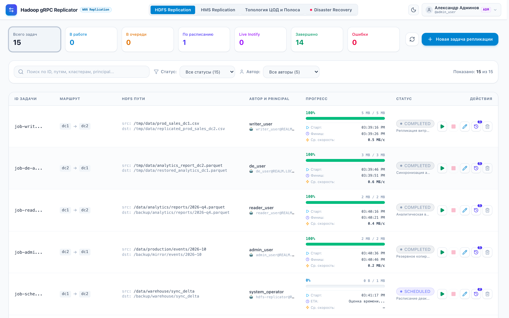
  <p><em>Рисунок 2: Главная панель HDFS Replication со счетчиками статусов, поиском и таблицей задач</em></p>
</div>

### 8.1 Управление задачами репликации
- **Список задач**: занимает всю ширину экрана и отображает статус, кластеры с указанием ЦОД, исходный и целевой пути, автора задачи, учетную запись исполнения и расширенный блок прогресса в реальном времени.
- **Детализация прогресса репликации**:
  - Точный процент выполнения и переданный объем (`copied_bytes / total_bytes`).
  - **Время старта**: момент фактического запуска задачи в работу воркером.
  - **Примерное время окончания (ETA / Финиш)**: расчетное время завершения репликации на основе текущей динамики и оставшегося объема данных (для завершенных задач — фактическое время завершения).
  - **Средняя скорость репликации**: эффективная скорость передачи в МБ/с (`⚡`), рассчитываемая на протяжении передачи.
- **Индикаторы статуса**:
  - `SCHEDULED` (индиго) — периодическая задача по расписанию ожидает наступления следующего времени запуска (`next_run_at`).
  - `QUEUED` (желтый) — ожидает освобождения воркера в очереди.
  - `RUNNING` (синий, пульсирующий) — идет активная передача данных.
  - `COMPLETED` (зеленый) — передача успешно завершена, контрольная сумма совпала.
  - `FAILED` (красный) — ошибка передачи или сбой NameNode.
  - `CANCELLED` (серый) — задача остановлена оператором.
- **Панель действий над задачей (Колонка «ДЕЙСТВИЯ»)**:
  - **Старт / Запуск (▶)**: запускает или перезапускает задачу, сбрасывая прогресс и переводя её в статус `QUEUED` для немедленной обработки воркером. Доступна строго в противоположной доступности к кнопке «Стоп» — когда задача остановлена или ожидает расписания (`SCHEDULED`, `COMPLETED`, `FAILED`, `CANCELLED`).
  - **Стоп / Остановка (■)**: корректно прерывает выполнение задачи, переводя её в статус `CANCELLED`. Доступна строго для активных задач (`RUNNING` или `QUEUED`).
  - **Редактировать (✏️)**: открывает модальное окно редактирования параметров задачи (исходный/целевой кластер, пути в HDFS, параметры техучетки, расписание cron, глубина истории). Доступна **только для неактивной задачи** (в покое или остановленной).
  - **История всех запусков (📜 History)**: открывает модальное окно подробной истории всех запусков со статистикой и динамической настройкой глубины хранения. На кнопке отображается фиолетовый бейдж с общим числом сохраненных запусков (`runs_count`).
  - **Удалить (🗑️)**: безвозвратно удаляет задачу, ее историю запусков и подзадачи из базы данных после подтверждения оператором. Доступна **только для неактивной задачи** (активную задачу необходимо предварительно остановить кнопкой «Стоп»).

### 8.2 Интерактивная фильтрация и поиск задач (Фильтры по статусам и авторам)
Для оперативного контроля сотен задач в очереди консоль предоставляет гибкую систему поиска и фильтрации:
- **Интерактивные карточки статистики**:
  - Карточки верхнего дашборда («Всего задач», «В работе», «В очереди», «По расписанию», «Завершено», «Ошибки») являются интерактивными кнопками.
  - Клик по любой карточке мгновенно включает фильтр по соответствующему статусу (с визуальной контурной подсветкой активной карточки). Повторный клик снимает фильтр и возвращает отображение всех задач.
- **Панель фильтров над таблицей**:
  - **Полнотекстовый поиск (Search)**: мгновенная клиентская фильтрация по фрагменту ID задачи, исходному или целевому пути в HDFS, именам кластеров, Kerberos principal или имени автора.
  - **Селектор статуса (Status Filter)**: выбор из всех доступных статусов (`ALL`, `RUNNING`, `QUEUED`, `SCHEDULED`, `COMPLETED`, `FAILED`, `CANCELLED`) с динамическим счетчиком задач в каждом статусе.
  - **Селектор автора (Author Filter)**: выбор из динамического списка всех авторов, создававших задачи в системе (например, `admin_user`, `de_user`, `analyst_user`, `system_operator`), со счетчиком задач каждого автора.
  - **Индикатор количества и сброс**: отображает соотношение «Показано: X из Y задач» и кнопку **«Сбросить»** при наличии любых активных фильтров.
  - При отсутствии совпадений выводится наглядная плашка с предложением сбросить фильтры.
- **REST API поддержка**: эндпоинт `GET /api/v1/jobs?status=SCHEDULED&author=admin_user` поддерживает серверную фильтрацию по query-параметрам `status` и `author` с сохранением правил ролевой изоляции (RBAC).

### 8.3 Создание новой задачи репликации
1. Нажмите кнопку **«Новая задача репликации»** в правом верхнем углу.
2. В появившемся окне:
   - Выберите **Исходный кластер (Source)** и **Целевой кластер (Target)** из выпадающих списков с указанием их ЦОД.
   - Укажите **Исходный путь в HDFS** (например, `/data/production/events/2026-10`).
   - Укажите **Целевой путь в HDFS** (например, `/backup/mirror/events/2026-10`).
   - Укажите **Пользователя имперсонации (doAs)**:
     - Для пользователей с ролью **Администратор** поле доступно для редактирования (с бейджем `admin`) — можно указать любого системного пользователя или Kerberos principal (`username@REALM.LOCAL`).
     - Для остальных пользователей поле заблокировано (`disabled`) и отображает имя текущего пользователя, создающего задачу (с бейджем `doAs`).
     - При редактировании существующей задачи (модальное окно «Редактировать задачу») администраторы также могут скорректировать пользователя имперсонации.
   - При необходимости активируйте **«Запускать от системной техучетки»** и укажите принципал.
   - Для периодической синхронизации включите чекбокс **«Запуск по расписанию»** и выберите пресет (например, `@every_5m`).
   - Задайте **Глубину истории запусков** (по умолчанию: 20, диапазон 1–500) для ограничения количества сохраняемых отчетов о выполнениях.
3. Нажмите **«Создать задачу»**. Задача немедленно отобразится в таблице: с индиго-статусом `SCHEDULED` для периодических задач или в статусе `QUEUED` для разовых задач, а в колонке создателя отображается бейдж фактического UGI doAs (`👤 user [doAs]`).

<div align="center">
  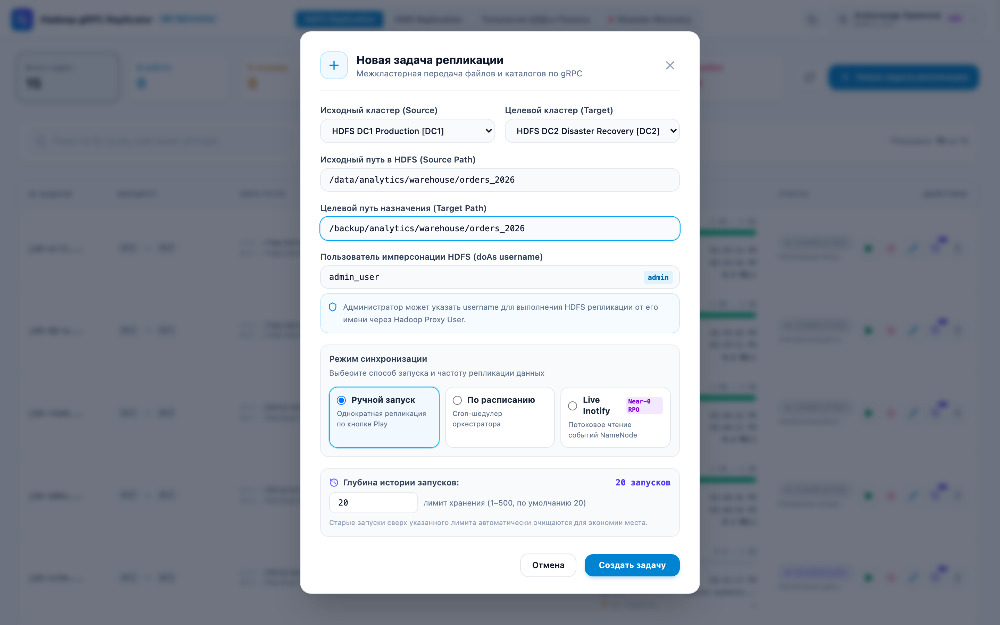
  <p><em>Рисунок 3: Модальное окно создания новой задачи репликации HDFS с выбором кластеров, путей, шедулера и Kerberos doAs</em></p>
</div>

### 8.4 Управление топологией и лимитами в рантайме
Перейдите на вкладку **«Топология ЦОД и Полоса»**:
- Ознакомьтесь с картой дата-центров и привязанными к ним кластерами.
- Для изменения полосы любого канала (DC-DC или HDFS-HDFS) введите новое значение в поле ввода (в МБ/с) и нажмите кнопку **«Сохранить»**. Новое ограничение вступит в силу для всех воркеров в течение 1 секунды.

<div align="center">
  
  <p><em>Рисунок 4: Раздел «Топология ЦОД и Полоса» с иерархическим шейпером Token Bucket (DC-DC, HDFS-HDFS, Global)</em></p>
</div>

### 8.5 История запусков задачи и статистика (Job Runs History & Retention)
Для отслеживания динамики выполнения периодических и ручных запусков оператору доступно отдельное окно истории (`GET /api/v1/jobs/{id}/runs`):
1. Нажмите кнопку с иконкой истории (📜) в строке интересующей задачи.
2. В модальном окне отображаются:
   - **Сводные метрики**: суммарное число запусков в истории, количество успешных выполнений, количество сбоев и суммарный объем переданных данных в байтах.
   - **Управление глубиной истории (Retention)**: поле ввода лимита хранения с кнопкой «Применить лимит». Изменение лимита сразу применяет прунинг устаревших записей в базе данных через `PUT /api/v1/jobs/{id}`.
   - **Журнал выполнений**: хронологический список запусков с детальной статистикой:
     - Порядковый номер запуска (`#1`, `#2`, ...).
     - Источник запуска: `Шедулер` (по расписанию) или `Вручную` (по клику оператора).
     - Статус каждого запуска с цветовым бейджем.
     - Точное время старта и завершения.
     - Фактическая длительность выполнения (в секундах или минутах).
     - Переданный объем байт (`copied_bytes / total_bytes`).
     - Эффективная средняя скорость репликации в МБ/с.
     - Текст ошибки или автор запуска.
3. Возможность обновить историю в реальном времени кнопкой синхронизации.

<div align="center">
  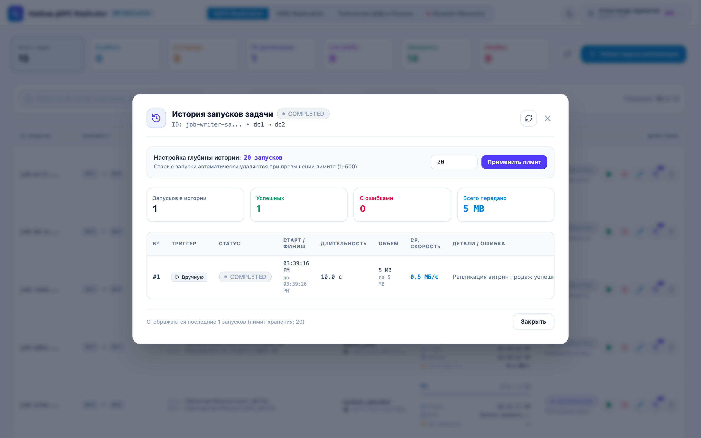
  <p><em>Рисунок 5: Модальное окно детальной истории запусков задачи (Job Runs History, Retention, средняя скорость)</em></p>
</div>

### 8.6 Репликация Hive Metastore (Раздел «HMS Replication»)
Для синхронизации метаданных баз данных и таблиц Hive между кластерами (например, HDP 3.1 ➔ Apache Hive 3.1.3) в интерфейсе выделен отдельный **Раздел «HMS Replication»**:

<div align="center">
  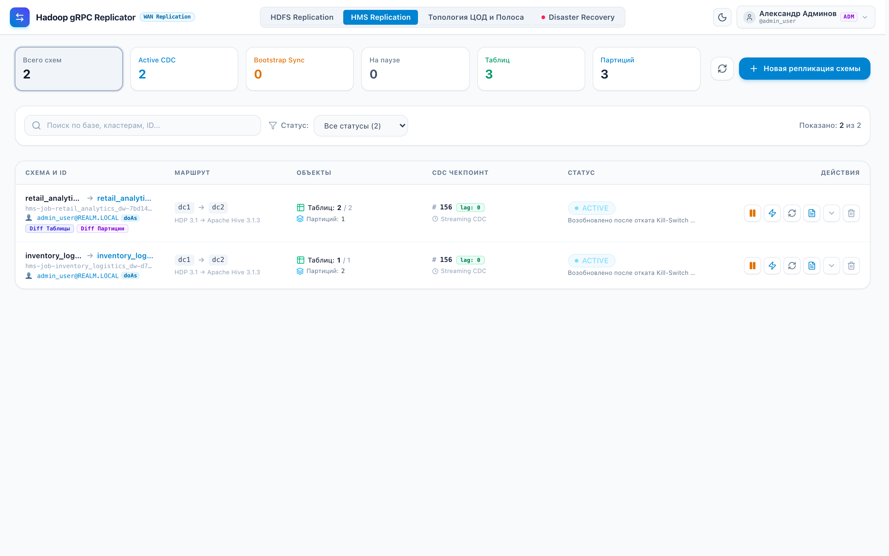
  <p><em>Рисунок 6: Раздел «HMS Replication» (статус распределенного лизинга Inotify/CDC стримеров, Event Lag и таблица схем)</em></p>
</div>

1. **Изоляция HDFS-подзадач**:
   - Автоматические подзадачи репликации файлов партиций (`job_type = 'HMS_SUBJOB'`) **не отображаются** в регламентном разделе «HDFS Replication».
   - Они привязаны к родительской мета-джоре и отображаются внутри карточки в табе **«Вложенные задачи переноса HDFS»**.
   - Передача данных выполняется стандартным распределенным пулом воркеров gRPC с полным соблюдением WAN-квот Hierarchical Token Bucket.
2. **Поддерживаемые типы таблиц (Non-ACID Gate)**:
   - Поддерживаются **External таблицы** (Parquet, ORC, Avro, Text, Iceberg).
   - Поддерживаются **Managed Non-Transactional таблицы** (`MANAGED_TABLE`, у которых `transactional != true`).
   - Transactional ACID таблицы автоматически пропускаются со статусом `SKIPPED_ACID` и не блокируют очередь.
3. **Поддержка HDFS Federation**:
   - Если партиции таблицы размещены на различных NameService федерации (например, `hdfs://ns-cold/...` и `hdfs://ns-hot/...`), репликатор автоматически определяет исходный NameService и транслирует URI в целевой NameService по правилам `federation-mappings`.
4. **Полный начальный Bootstrap и CDC**:
   - При создании задачи репликации базы фиксируется `high_water_mark_event_id` и выполняется полный первичный экспорт всех существующих таблиц и партиций (статус `BOOTSTRAPPING`).
   - По завершении Bootstrap задача переходит в статус `ACTIVE` (потоковый опрос `NOTIFICATION_LOG`).
5. **Безопасное удаление (`deleteData = false`)**:
   - При обработке событий `DROP_TABLE` и `DROP_PARTITION` метаданные удаляются из целевого HMS с флагом `deleteData = false`, физические файлы в HDFS сохраняются.
6. **Создание задачи репликации базы (Выбор кластеров из топологии)**:
   - Нажмите **«Новая репликация базы»**.
   - Выберите **Исходный кластер (Source)** и **Целевой кластер (Target)** из выпадающего списка топологии (например, `HDFS DC1 Production [DC1] — HDP 3.1` и `HDFS DC2 Disaster Recovery [DC2] — Apache Hive 3.1.3`). Выпадающие списки автоматически заполняются из актуальной конфигурации топологии и ЦОД платформы аналогично регламентному разделу HDFS Replication.
   - Укажите имя исходной базы (`Source Database`, например `analytics`).
   - Укажите имя целевой базы (`Target Database`, оставьте пустым для совпадения).
   - Укажите **Пользователя имперсонации (doAs)**:
     - Для пользователей с ролью **Администратор** поле открыто для редактирования (с бейджем `admin`), позволяя задать пользователя/принципала, от имени которого будут создаваться подзадачи HDFS переноса файлов данных партиций (`HMS_SUBJOB`).
     - Для обычных пользователей поле заблокировано (`disabled`) и предзаполнено текущим именем пользователя (с бейджем `doAs`), а бэкенд на стороне REST API жестко контролирует авторство.
   - При необходимости укажите фильтр включения таблиц (`Include Pattern`, по умолчанию `*`).
   - **Двусторонний Diff и Reconciliation**:
     - Опция **«Удалять лишние таблицы на приемнике»** (`drop_extraneous_tables`): удаляет из целевой базы таблицы, отсутствующие в источнике (с флагом `deleteData = false`, физические данные не удаляются).
     - Опция **«Удалять лишние партиции на приемнике»** (`drop_extraneous_partitions`): синхронизирует список партиций, удаляя устаревшие партиции на приемнике (`deleteData = false`).

<div align="center">
  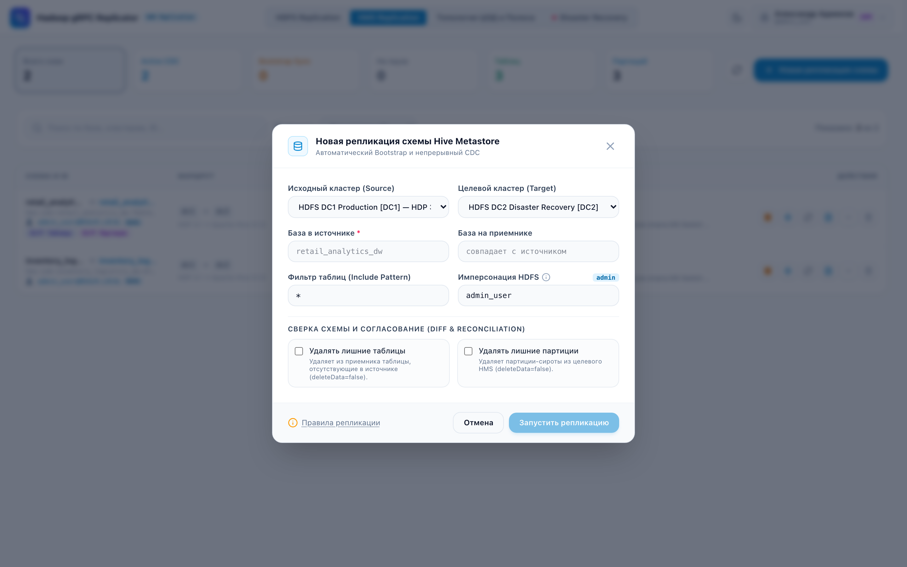
  <p><em>Рисунок 7: Модальное окно настройки непрерывной потоковой CDC-репликации схемы Hive Metastore</em></p>
</div>

7. **Управление жизненным циклом (Пауза, Возобновление и Сохранение изменений)**:
   - **Остановка (Pause)**: переводит задачу в статус `PAUSED`. При этом фоновый опрос `NOTIFICATION_LOG` приостанавливается, однако текущий чекпоинт `last_processed_event_id` **сохраняется**.
   - **Сохранение изменений**: Все DDL-операции в исходном Hive регистрируются в `NOTIFICATION_LOG` с монотонно возрастающим ID (`NL_ID`). При возобновлении (`Resume`) опрос начинается строго с `last_processed_event_id + 1`. Все изменения (создание/изменение таблиц, добавление партиций), произошедшие за время простоя, последовательно вычитываются пачками (replay CDC лога) и реплицируются без потерь.
   - **Защита от разрыва журнала (Кнопка «Re-bootstrap» с подтверждением)**: Если задача находилась на паузе дольше срока хранения событий Hive (`hive.metastore.event.expiry.duration`), оператор может запустить **Re-bootstrap** из таблицы или детального модального окна схемы. Для предотвращения случайных запусков тяжелой операции реализовано отдельное модальное окно с подтверждением оператора. Репликатор повторно снимет полный срез таблиц и партиций без удаления целевых данных (`deleteData = false`) и зафиксирует новый High Water Mark.
8. **Безопасное удаление задачи репликации схемы**:
   - Задача может быть удалена оператором с модальным подтверждением безопасности (кнопка корзины в списке схем и на панели управления).
   - При удалении каскадно очищаются метаданные задачи, дочерние саб-джобы репликации файлов партиций HDFS и журнал аудита DDL-событий.
9. **Единый дизайн-код и полноразмерная таблица данных**:
   - Интерфейс HMS Replication приведен в точное визуальное и структурное соответствие с регламентным разделом HDFS Replication:
     - Верхний ряд: 6 компактных карточек статистики с фильтрацией по статусу и кнопками «Обновить» и «Новая репликация схемы» справа в единой линии;
     - Панель поиска по схемам/кластерам и фильтрации со счетчиком «Показано X из Y»;
     - Полноразмерная таблица схем (Full-width Data Table) с аккуратными колонками (`Схема и ID`, `Маршрут / Кластеры`, `Объекты`, `CDC Чекпоинт`, `Статус`, `Действия`), включая отображение пользователя имперсонации `👤 user [doAs]`;
     - Компактный ряд иконочных действий в каждой строке (Пауза/Пуск, Опрос CDC, Re-bootstrap, Журнал DDL, Быстрый просмотр, Удаление);
     - Просторное модальное окно детального просмотра схемы с табами журнала DDL и вложенных HDFS подзадач переноса данных (с отображением пользователя подзадачи).
10. **Автоматические Smoke-тесты в Docker (`run-smoke-tests.sh`)**:
   - Стенд включает полный цикл автоматической верификации репликации между двумя ЦОД:
     - Создание БД и таблицы с данными в DC1;
     - Начальный Bootstrap sync в DC2;
     - Создание новой таблицы в DC1 и потоковая синхронизация CDC;
     - Верификация переноса схемы и файлов данных на DC2 (`./demo/replicator/run-smoke-tests.sh`).

### 8.7 Консоль аварийного переключения (Disaster Recovery & Failover Hub)

Выделенная панель **Disaster Recovery** в верхнем меню предназначена для управления непрерывностью бизнеса, предотвращения Split-Brain при аварии основного дата-центра и запуска обратной синхронизации дельты изменений:

1. **Мониторинг доступности площадок и сетевого потока (Data Flow Canvas)**:
   - Интерактивные карточки площадок **DC1** и **DC2** отображают статус доступности (`ONLINE`, `DEGRADED`, `OFFLINE`), число активных агентов Full-Duplex и текущие лимиты пропускной способности;
   - Центральный блок WAN-канала визуализирует актуальное направление потока данных (`DC1 ➔ DC2` в штатном режиме или `DC2 ➔ DC1` в режиме аварийного переключения);
   - Вывод суммарного отставания (Lag): объем непереданных данных HDFS в байтах и количество неотправленных DDL/DML событий Hive Metastore CDC.

<div align="center">
  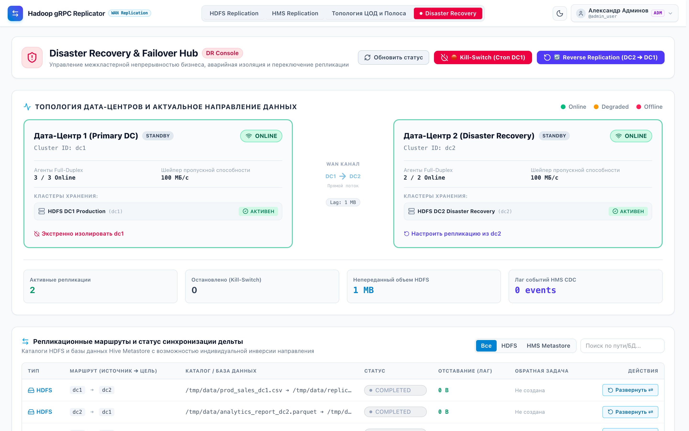
  <p><em>Рисунок 8: Консоль Disaster Recovery & Failover Hub (Data Flow Canvas, сетевой поток, таблица маршрутов)</em></p>
</div>

2. **Экстренная изоляция и аварийный останов (Kill-Switch)**:
   - Кнопка **🛑 Kill-Switch (Стоп DC1)** открывает модальное окно аварийного останова с аудитом причины;

<div align="center">
  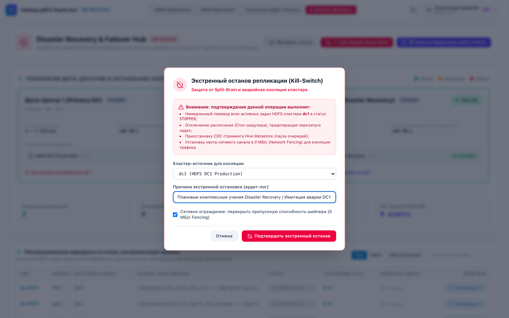
  <p><em>Рисунок 9: Модальное окно экстренного останова (Kill-Switch) с сетевым ограждением Fencing (0 МБ/с)</em></p>
</div>

   - При подтверждении система автоматически:
     - Переводит все активные задачи HDFS с источником DC1 в статус `STOPPED`;
     - Снимает признак запуска по расписанию (`isScheduled = false`), предотвращая повторные запуски шедулером;
     - Приостанавливает потоковую репликацию CDC Hive Metastore (`PAUSED`);
     - Активирует сетевое ограждение (Network Fencing), выставляя лимит канала в 0 МБ/с;
     - Панель изолированного кластера визуально окрашивается в тревожный красный цвет с пульсирующим бейджем `ПОДАВЛЕН (FENCED)`, а для каждого привязанного HDFS кластера выводится индикатор `ПОДАВЛЕН 🔒`.

<div align="center">
  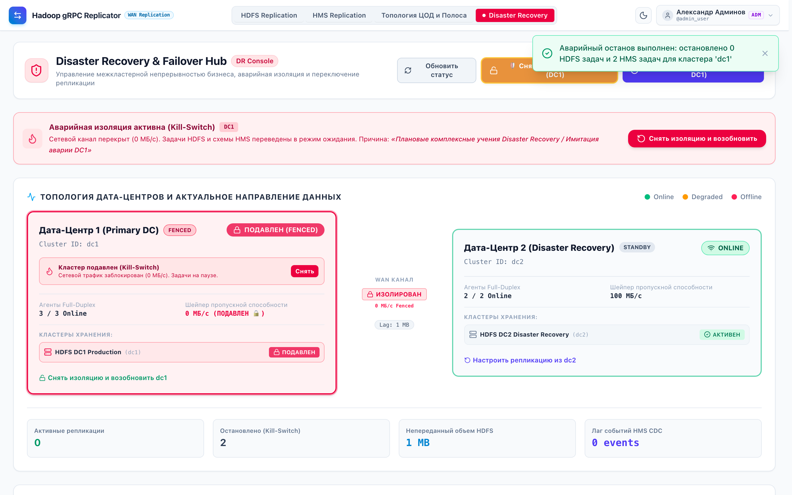
  <p><em>Рисунок 10: Индикация подавленного кластера при активном Kill-Switch (статус ПОДАВЛЕН 🔒 и тревожный баннер)</em></p>
</div>

   - **Динамическая кнопка снятия изоляции / откат (Rollback / Unfence)**:
     - Кнопка **🛑 Kill-Switch** динамически трансформируется в янтарную кнопку **`🛡️ Снять изоляцию / Откат ({CLUSTER})`**;
     - В модальном окне отката доступен выпадающий список выбора кластера (с автоматической пометкой изолированного кластера `[ПОДАВЛЕН 🔒]`);
     - Также на панели подавленного кластера и в тревожном баннере доступна быстрая кнопка **«Снять»**;
     - **Защита от Split-Brain и перезаписи данных**: В модальном окне отображается предупреждение о недопустимости запуска старых задач, если во время аварии данные писались в DC2. Опции возобновления прямых задач по умолчанию **выключены**. Подтверждение операции снимает сетевое ограждение (восстанавливая канал 100 МБ/с для управления и приема дельты), сохраняя старые задачи остановленными;
     - Подробный регламент см. в: [Руководство по Disaster Recovery и защите от Split-Brain (replicator-disaster-recovery-guide.md)](file:///Users/mvmalykh/IdeaProjects/hadoop-explorer/docs/replicator-disaster-recovery-guide.md).

<div align="center">
  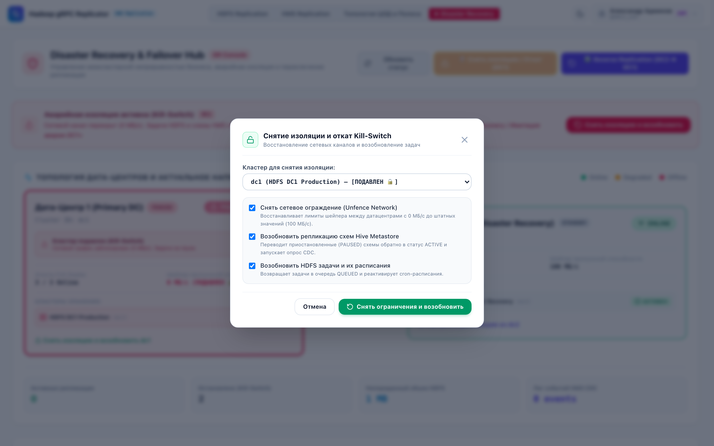
  <p><em>Рисунок 11: Модальное окно безопасного снятия изоляции (Unfence) с защитой от Split-Brain и перезаписи данных</em></p>
</div>

3. **Мастер обратной репликации (Reverse Replication: `DC2 ➔ DC1`)**:
   - Кнопка **🔄 Reverse Replication (DC2 ➔ DC1)** активирует мастер разворота потока данных при восстановлении основного дата-центра;
   - Защита от случайных действий: модальное окно требует явного подтверждения вводом слова `REVERSE`;
   - Система автоматически создает зеркальные обратные задачи для всех каталогов HDFS и баз данных HMS: меняются местами как кластеры площадок (`from_cluster_id ➔ to_cluster_id`), так и пути каталогов HDFS (`sourcePath = direct.getTargetPath()`, `targetPath = direct.getSourcePath()`), гарантируя корректный перенос накопленной дельты изменений из резервного хранилища обратно в боевой кластер. Система переводит воркеры в DC2 в режим отправщиков и восстанавливает штатный лимит канала (100 МБ/с).

<div align="center">
  
  <p><em>Рисунок 12: Мастер запуска обратной репликации дельты изменений (Reverse Replication DC2 ➔ DC1)</em></p>
</div>

4. **Точечный разворот маршрута и управление зеркалами (Reverse & Undo Failback)**:
   - В таблице маршрутов доступна кнопка **«Развернуть ⇄»** для конкретных каталогов HDFS:
     - При нажатии создается новая встречная задача репликации (`dc2 ➔ dc1`, префикс `rev-...`), в которой меняются местами кластеры и пути передачи данных. Задача отображается отдельной строкой в таблице с фиолетовым бейджем **`Зеркало ⇄`**;
     - Исходная прямая задача фиксирует наличие зеркала (`has_reverse_job: true`), предотвращая дублирование правил;
     - Вместо скрытия управления у исходной задачи активируется янтарная кнопка **«Отозвать ↩»**, а у сгенерированного зеркала — кнопка **«Удалить зеркало ✕»**;
     - Нажатие **«Отозвать ↩»** удаляет созданную зеркальную задачу, снимает блокировку прямого маршрута и возвращает кнопку «Развернуть ⇄» в исходное состояние;
     - При ошибках передачи (например, временной недоступности NameNode `dc1`) статус `FAILED` сопровождается подробной диагностической подсказкой с реальным текстом ошибки агента.

---

## 9. Мониторинг и метрики Prometheus

Сервис экспортирует метрики на эндпоинте `/metrics` (порт 8005):

| Метрика | Тип | Описание |
|---|---|---|
| `replication_bytes_total{status}` | Counter | Общий объем переданных байт данных |
| `active_workers` | Gauge | Количество активных воркеров передачи |
| `replication_jobs_total{status, mode}` | Counter | Количество задач по статусам и типу учетной записи |
| `throttling_delay_seconds_total` | Counter | Суммарное время задержки воркеров из-за Token Bucket шейпера |

---

## 10. Диагностика и устранение неполадок (Troubleshooting & FAQ)

### Вопрос: Задача зависла в статусе QUEUED
- **Причина**: Не запущен воркер репликации (`worker daemon`) или исчерпаны свободные слоты передачи.
- **Решение**: Проверьте статус контейнера воркера: `docker logs replicator-worker`.

### Вопрос: Скорость репликации ниже ожидаемой
- **Причина**: Срабатывает одно из звеньев иерархического шейпера (DC-DC limit, HDFS-HDFS limit или Global pool).
- **Решение**: Проверьте счетчик `throttling_delay_seconds_total` в `/metrics` и при необходимости увеличьте лимит на вкладке «Топология ЦОД и Полоса».

### Вопрос: Ошибка аутентификации Kerberos (GSSException)
- **Причина**: Истек или не найден keytab для системного принципала.
- **Решение**: Убедитесь, что файл keytab смонтирован в контейнер воркера и доступен по пути, указанному в переменной `KRB5_KEYTAB_PATH`.
