<div align="center">


# Руководство пользователя: Spark Web Explorer

<p><strong>Корпоративная интерактивная веб-студия для разработки, отладки и запуска аналитических задач и ETL на Apache Spark (PySpark, Scala Spark, Spark SQL) с управлением сессиями Apache Livy и ресурсами YARN</strong></p>

</div>

---

**Spark Web Explorer** — высокопроизводительная корпоративная веб-студия для дата-инженеров, специалистов по машинному обучению (ML) и аналитиков данных. Платформа предоставляет единую интерактивную рабочую среду (notebook-like IDE) для работы с кластерами **Apache Spark** через шлюз **Apache Livy**, позволяя мгновенно переключаться между языками **PySpark**, **Scala Spark** и **Spark SQL**, исследовать метаданные таблиц Hive Metastore и Apache Iceberg, настраивать ресурсы драйвера/воркеров и очереди YARN, а также безопасно выполнять интерактивный код с поддержкой Kerberos SSO и ролевой модели доступа.

---

## 📑 Содержание

1. [Введение и ключевые возможности](#1-введение-и-ключевые-возможности)
2. [Архитектура и интеграция компонентов](#2-архитектура-и-интеграция-компонентов)
3. [Аутентификация, безопасность и имперсонация](#3-аутентификация-безопасность-и-имперсонация)
4. [Главный экран и организация рабочей студии](#4-главный-экран-и-организация-рабочей-студии)
5. [Каталог метаданных (Hive Metastore & Apache Iceberg)](#5-каталог-метаданных-hive-metastore--apache-iceberg)
6. [Разработка и выполнение кода](#6-разработка-и-выполнение-кода)
   - [Поддержка языков: PySpark, Scala Spark и Spark SQL](#61-поддержка-языков-pyspark-scala-spark-и-spark-sql)
   - [Независимые буферы кода и кэширование результатов](#62-независимые-буферы-кода-и-кэширование-результатов)
   - [Табличный предпросмотр DataFrame и экспорт CSV](#63-табличный-предпросмотр-dataframe-и-экспорт-csv)
   - [Консоль вывода, логирование стадий и Execution Plan](#64-консоль-вывода-логирование-стадий-и-execution-plan)
7. [Управление сессиями Spark и интеграция с YARN](#7-управление-сессиями-spark-и-интеграция-с-yarn)
   - [Параметры сессии и профили ресурсов](#71-параметры-сессии-и-профили-ресурсов)
   - [Матрица версий Spark и виртуальные окружения Python](#72-матрица-версий-spark-и-виртуальные-окружения-python)
   - [Внешние библиотеки: Maven Packages, JAR и Py-Files](#73-внешние-библиотеки-maven-packages-jar-и-py-files)
   - [Очереди YARN и разграничение прав доступа (Queue ACL)](#74-очереди-yarn-и-разграничение-прав-доступа-queue-acl)
8. [Многовкладочный режим и персистентность воркспейса](#8-многовкладочный-режим-и-персистентность-воркспейса)
9. [Горячие клавиши и клавиатурная навигация](#9-горячие-клавиши-и-клавиатурная-навигация)
10. [Часто задаваемые вопросы (FAQ) и диагностика ошибок](#10-часто-задаваемые-вопросы-faq-и-диагностика-ошибок)

---

## 1. Введение и ключевые возможности

Запуск интерактивных задач Spark на корпоративных кластерах часто сопряжен с рутинными сложностями: необходимостью настройки локального окружения, подключением через тяжеловесные Jupyter-серверы, сложностями с Kerberos-билетами, ручным мониторингом аллокации YARN и конкуренцией за ресурсы.

**Spark Web Explorer** превращает работу с Apache Spark в интуитивный и прозрачный процесс:

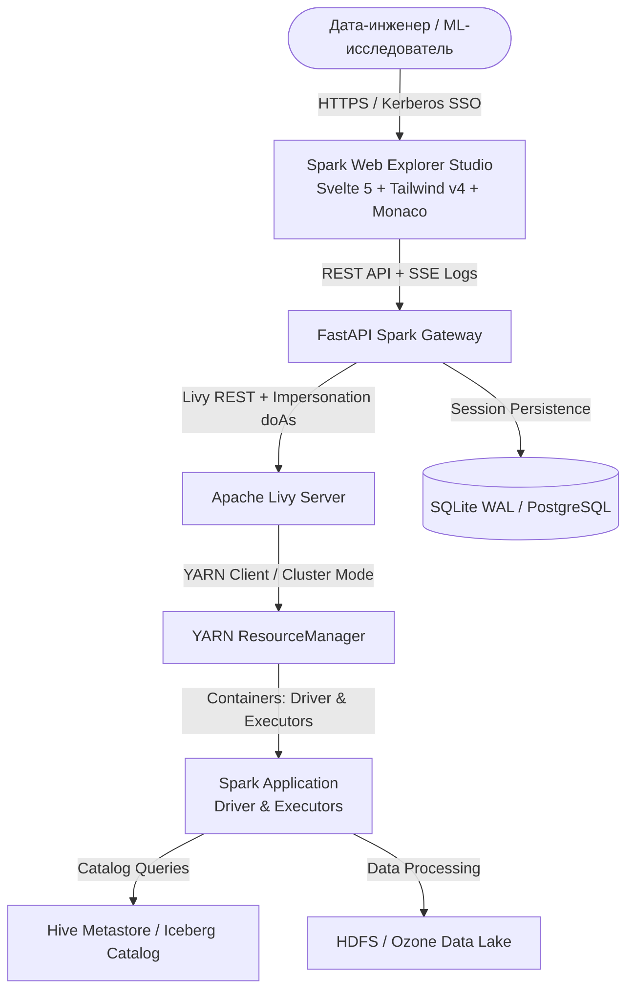

### Ключевые возможности:

- **🚀 Мультиязычная студия (3-in-1):** Полноценное написание и отладка скриптов на **PySpark**, **Scala Spark** и чистом **Spark SQL** в едином редакторе с сохранением раздельных контекстов.
- **⚡ Управление сессиями Livy в реальном времени:** Создание, мониторинг состояния (`idle`, `busy`, `dead`), перезапуск и принудительный сброс интерактивных сессий без перезапуска приложений YARN.
- **📦 Матрица версий Spark и Python Runtime:** Гибкий выбор версии Spark (3.5.1, 3.2.4, 2.4.8 legacy) и предустановленных сред Conda/Venv в HDFS (`py310-default`, `py310-ml` с PyTorch/Scikit-Learn).
- **🛡️ Безопасность и контроль доступа к YARN:** Аутентификация LDAP / Kerberos SPNEGO, строгая имперсонация (`proxyUser / doAs`) и проверка прав на запуск в выделенных очередях YARN (`root.analytics`, `root.etl`, `root.adhoc`).
- **🗃️ Интеграция с каталогами данных:** Просмотр баз данных, таблиц и структуры колонок из Hive Metastore и Apache Iceberg Catalog в боковой панели с быстрой вставкой шаблонов в код.
- **📊 Визуализация DataFrame и экспорт:** Отображение табличных выборок данных с возможностью постраничного просмотра, фильтрации и выгрузки в CSV (с защитой от формульных инъекций).
- **💾 Персистентность рабочих пространств:** Сохранение структуры вкладок, текста скриптов, конфигураций сессий и буферов на сервере — возможность мгновенно продолжить исследование на любом рабочем месте.

---

## 2. Архитектура и интеграция компонентов

В основе архитектуры Spark Web Explorer лежит событийно-ориентированный шлюз на FastAPI, взаимодействующий с кластером Apache Livy через отказоустойчивые каналы с паттерном Circuit Breaker.

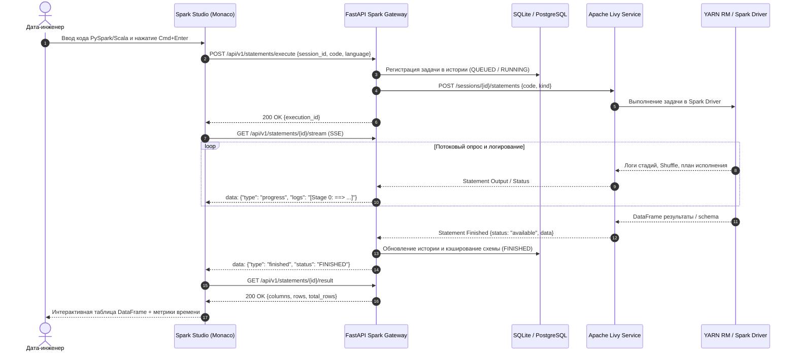

---

## 3. Аутентификация, безопасность и имперсонация

Вход в систему осуществляется через экран корпоративной аутентификации. Поддерживаются протоколы **Active Directory / OpenLDAP** и бесшовный вход **Kerberos SPNEGO SSO**.

<div align="center">
  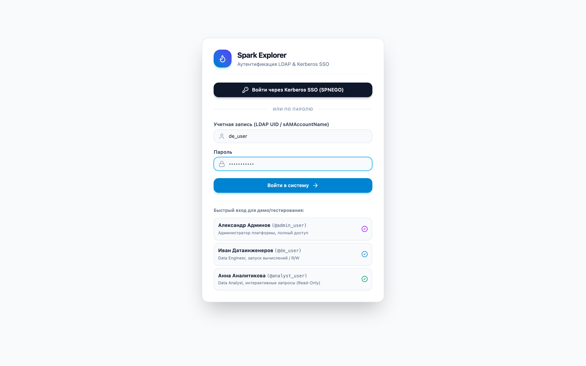
  <p><em>Рисунок 1: Экран аутентификации LDAP & Kerberos SSO</em></p>
</div>

### Ролевая модель и разграничение доступа (RBAC):

| Ролевая группа | Доступные кластеры | Разрешенные очереди YARN | Профили ресурсов | Действия с кодом |
| :--- | :---: | :---: | :---: | :---: |
| **Platform Admins** (`hadoop-admins`) | ✅ Все кластеры | `root.*` (все очереди) | Small, Medium, Large | Полный доступ (RW) |
| **Data Engineers** (`data-engineers`) | ✅ Prod / Sandbox | `root.etl`, `root.analytics` | Small, Medium, Large | Полный доступ (RW) |
| **BI Analysts** (`bi-analysts`) | ✅ Sandbox / Prod (Spark SQL) | `root.analytics`, `root.adhoc` | Small, Medium | Только чтение (SELECT / display) |

> [!IMPORTANT]
> **Принцип Livy / YARN Impersonation (`proxyUser` / `doAs`)**: Любой код, отправляемый через шлюз, исполняется на узлах YARN строго от лица авторизованного пользователя (`de_user`), что обеспечивает соблюдение прав доступа HDFS POSIX и политик Ranger/Sentry ACL.

---

## 4. Главный экран и организация рабочей студии

После авторизации открывается основная рабочая среда Spark Web Explorer, оптимизированная для комфортной работы как на ноутбуках, так и на широкоформатных мониторах (Retina 2x).

<div align="center">
  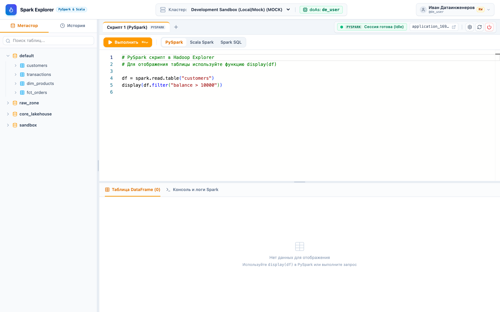
  <p><em>Рисунок 2: Главный экран рабочей студии Spark Web Explorer</em></p>
</div>

### Элементы интерфейса:

1. **Верхняя панель управления (Header Bar):**
   - Логотип и бейдж платформы (`Spark Explorer PySpark & Scala`).
   - Селектор активного кластера Hadoop (например, `Development Sandbox` или `Production Hadoop`).
   - Индикатор текущего контекста имперсонации (`doAs: de_user`).
   - Профиль пользователя с бейджами ролей (`RW` — чтение/запись, `RO` — только чтение).
2. **Панель управления сессией (Session Bar):**
   - Кнопка **«Выполнить» (`⌘+↵` / `Ctrl+Enter`)** и кнопка прерывания задачи **«Остановить»**.
   - Переключатель языков скрипта (**PySpark**, **Scala Spark**, **Spark SQL**).
   - Индикатор статуса сессии Livy (например, `🟢 PYSPARK Сессия готова (Idle)`).
   - Ссылка на YARN Application Tracking URL (`application_169...`).
   - Кнопки конфигурации параметров сессии, перезапуска и завершения.
3. **Левая боковая панель (Sidebar):**
   - Вкладка **Метастор**: иерархическое дерево каталогов, баз данных, таблиц и атрибутов колонок.
   - Вкладка **История**: архив выполненных задач с метриками и временем запуска.
4. **Центральная зона редактора (Monaco Editor):**
   - Полнофункциональный редактор с номерами строк, мини-картой и подсветкой синтаксиса.
5. **Нижняя зона результатов (Resizable Split Panel):**
   - Переключение между интерактивной таблицей **DataFrame** и консолью **Логи Spark**.
   - Панель фильтрации строк и кнопка экспорта в CSV.

---

## 5. Каталог метаданных (Hive Metastore & Apache Iceberg)

Боковая панель предоставляет прямой доступ к метаданным озера данных. Дата-инженер может изучить схему таблицы до написания кода и отправки тяжелых распределенных задач.

<div align="center">
  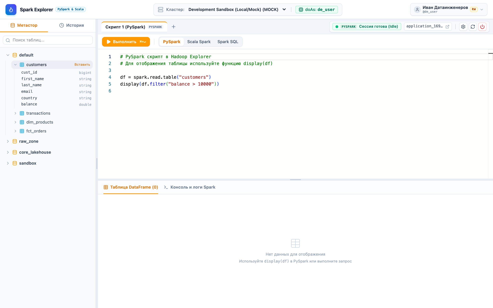
  <p><em>Рисунок 3: Дерево каталога метаданных и инспекция структуры таблицы customers</em></p>
</div>

### Работа с каталогом:

- **Навигация по базам данных:** Раскрытие баз данных (`default`, `raw_zone`, `core_lakehouse`, `sandbox`) в один клик.
- **Инспекция структуры колонок:** При клике по таблице (например, `customers`) отображается список всех атрибутов с их строгими типами данных (`bigint`, `string`, `double`, `timestamp`).
- **Быстрая вставка (Insert Action):** При наведении на имя таблицы появляется кнопка **«Вставить»**, которая автоматически генерирует в редакторе корректную конструкцию загрузки данных в зависимости от выбранного языка:
  - Для PySpark: `df = spark.read.table("default.customers")`
  - Для Scala Spark: `val df = spark.read.table("default.customers")`
  - Для Spark SQL: `SELECT * FROM default.customers LIMIT 50;`

---

## 6. Разработка и выполнение кода

### 6.1. Поддержка языков: PySpark, Scala Spark и Spark SQL

Spark Web Explorer поддерживает три основных языка разработки. Переключение между ними осуществляется одним кликом на панели инструментов:

```
[ PySpark ]  [ Scala Spark ]  [ Spark SQL ]
```

- **PySpark:** Идеально подходит для data science, построения ML-пайплайнов, работы с Pandas API on Spark и сложной функциональной обработки.
- **Scala Spark:** Нативный высокопроизводительный API для написания сложной типобезопасной бизнес-логики и работы с нативными Dataset API.
- **Spark SQL:** Декларативные ANSI SQL запросы, агрегации, оконные функции и оптимизация запросов через оптимизатор Catalyst.

### 6.2. Независимые буферы кода и кэширование результатов

Уникальной особенностью платформы является архитектура **изолированных буферов**:
- Каждая вкладка сохраняет независимый текст кода для PySpark, Scala и SQL.
- Результаты выполнения (таблицы DataFrame и логи) кэшируются раздельно для каждого языка. При переключении с PySpark на Scala или SQL ваши результаты предыдущего вычисления не сбрасываются.

### 6.3. Табличный предпросмотр DataFrame и экспорт CSV

После выполнения кода результат автоматически отображается в табличной форме:

<div align="center">
  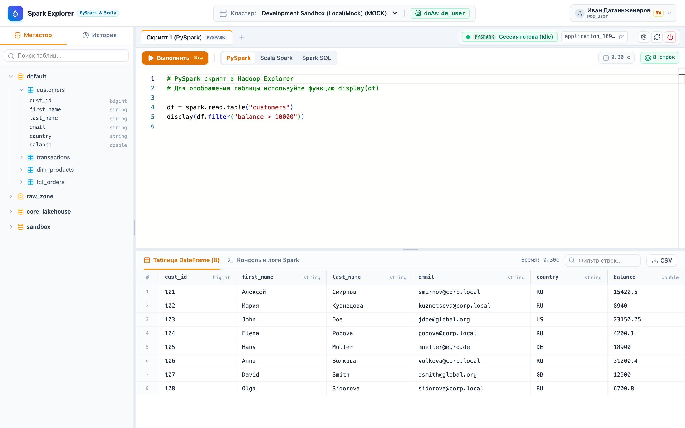
  <p><em>Рисунок 4: Таблица DataFrame с результатами выполнения PySpark скрипта</em></p>
</div>

- **Интерактивная таблица:** Отображение имен колонок, строгих типов данных и строк выборки.
- **Клиентская фильтрация:** Поле «Фильтр строк...» позволяет мгновенно отфильтровать видимые строки без повторного обращения к кластеру.
- **Экспорт в CSV:** Кнопка **«Экспорт CSV»** формирует чистый CSV-файл с санитизацией спецсимволов (`=`, `+`, `-`, `@`) для безопасного открытия в Excel.

### 6.4. Консоль вывода, логирование стадий и Execution Plan

Вкладка **«Консоль и логи Spark»** предоставляет детализированную информацию о ходе выполнения распределенной задачи:

<div align="center">
  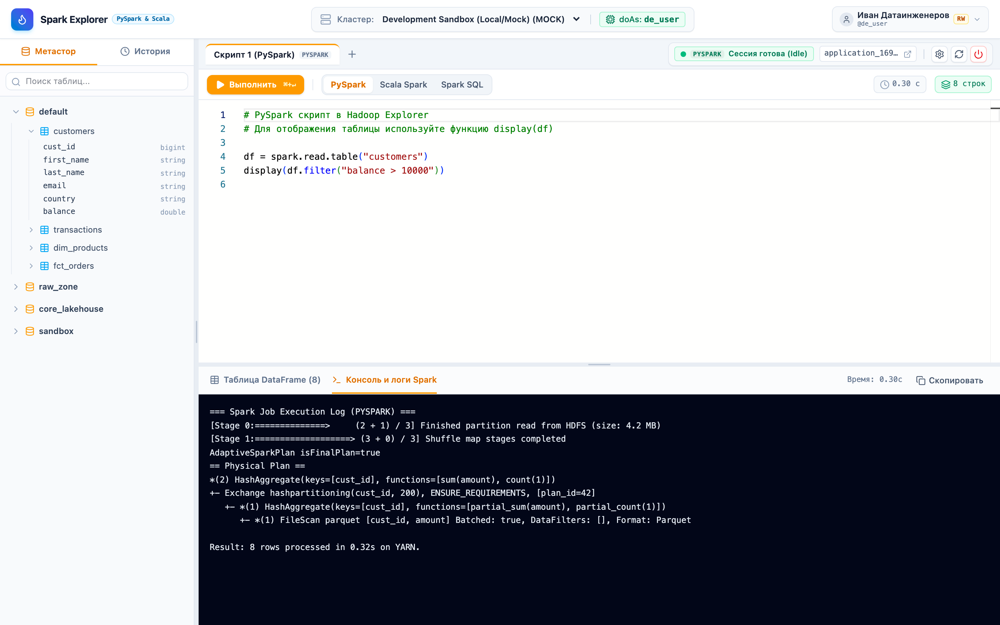
  <p><em>Рисунок 5: Консоль выполнения, сборщик логов и физический план выполнения Catalyst</em></p>
</div>

- **Мониторинг стадий (Stages):** Отображение прогресса выполнения партиций `(X + Y) / Z` в реальном времени.
- **Physical Execution Plan:** Визуализация физического плана Catalyst (HashAggregate, Exchange hashpartitioning, FileScan parquet).
- **Трассировка ошибок:** Подробный стек-трейс ошибок JVM и Python (`Py4JJavaError`, `AnalysisException`) с указанием строк кода.
- **Кнопка «Скопировать»:** Быстрое копирование полного диагностического лога в буфер обмена для баг-репортов.

### Примеры скриптов на разных языках:

#### Scala Spark:
<div align="center">
  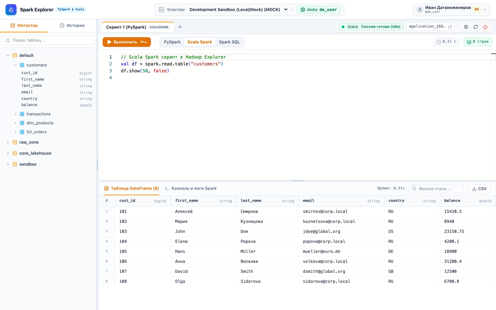
  <p><em>Рисунок 6: Разработка и отладка аналитического скрипта на Scala Spark</em></p>
</div>

```scala
// Scala Spark аналитический скрипт
val df = spark.read.table("customers")
val res = df.filter($"balance" > 10000)
res.show(50, false)
```

#### Spark SQL:
<div align="center">
  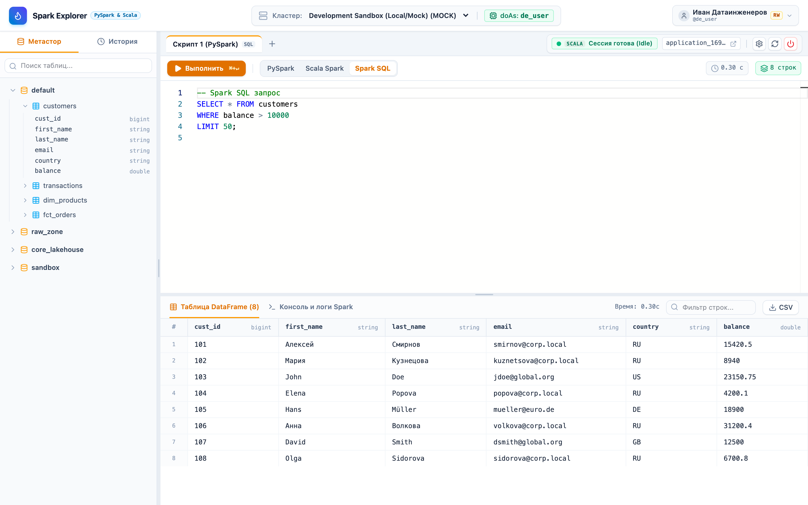
  <p><em>Рисунок 7: Выполнение интерактивного запроса Spark SQL</em></p>
</div>

```sql
-- Spark SQL интерактивный запрос
SELECT cust_id, first_name, last_name, balance
FROM customers
WHERE balance > 10000
ORDER BY balance DESC
LIMIT 50;
```

---

## 7. Управление сессиями Spark и интеграция с YARN

Для гибкой адаптации под различные типы задач (от быстрой аналитики до тяжелых ML-вычислений) предусмотрено модальное окно глубокой настройки сессии Livy.

<div align="center">
  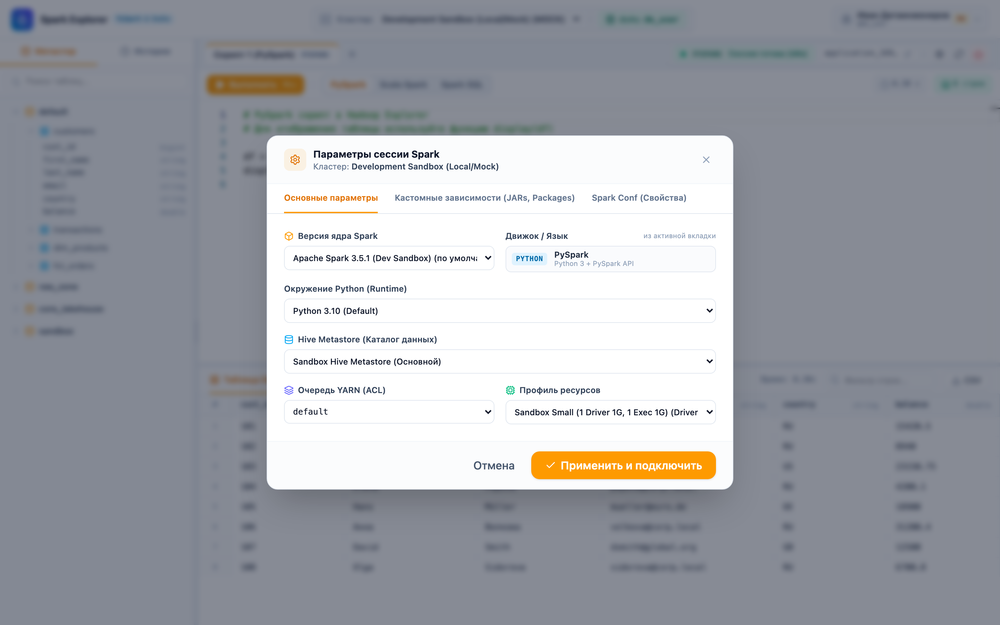
  <p><em>Рисунок 8: Конфигурация параметров сессии Spark, профилей ресурсов и очередей YARN</em></p>
</div>

### 7.1. Параметры сессии и профили ресурсов

Вкладка **«Основные параметры»** позволяет выбрать профиль выделения ресурсов:

| Профиль ресурсов | Память Driver | Ядра Driver | Память Executor | Ядра Executor | Кол-во Executor | Назначение |
| :--- | :--- | :--- | :--- | :--- | :--- | :--- |
| **Small (Sandbox)** | 1 GB | 1 core | 1 GB | 1 core | 1-2 | Отладка синтаксиса, быстрые выборки |
| **Medium (Standard)** | 4 GB | 2 cores | 8 GB | 2 cores | 4 | Регулярная аналитика, агрегации |
| **Large (Production)** | 8 GB | 4 cores | 16 GB | 4 cores | 8+ | Тяжелые JOIN, ML-обучение, большие витрины |

### 7.2. Матрица версий Spark и виртуальные окружения Python

- **Версия ядра Spark:** Выбор между стабильной версией **Apache Spark 3.5.1**, **Spark 3.2.4** и устаревшими кластерами **Spark 2.4.8**.
- **Python Runtime:** Выбор изолированного Conda/Venv окружения, распространяемого через HDFS-архивы (`spark.yarn.dist.archives`). Доступны как базовые среды с минимальным набором библиотек, так и специализированные ML-окружения (`py310-ml`).

### 7.3. Внешние библиотеки: Maven Packages, JAR и Py-Files

Вкладка **«Кастомные зависимости»** позволяет подключать внешние модули без пересборки кластера:
- **Maven Packages:** Координаты артефактов (например, `org.apache.spark:spark-sql-kafka-0-10_2.12:3.5.1`).
- **JAR-архивы:** Пути в HDFS или локальной ФС к кастомным UDF и коннекторам.
- **Python Files (`py-files`):** Дополнительные `.py` и `.zip` модули бизнес-логики.

### 7.4. Очереди YARN и разграничение прав доступа (Queue ACL)

Выпадающий список очередей динамически фильтруется на бэкенде в соответствии с группами текущего пользователя. При попытке выбора недоступной очереди шлюз возвращает ошибку валидации до аллокации ресурсов.

---

## 8. Многовкладочный режим и персистентность воркспейса

Spark Web Explorer поддерживает полноценный многозадачный режим:

<div align="center">
  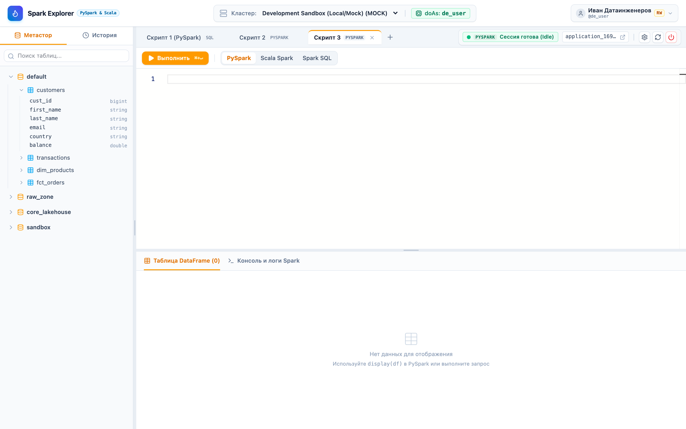
  <p><em>Рисунок 9: Многовкладочный режим со смешанными языковыми сессиями</em></p>
</div>

- **Панель вкладок (Tabs):** Кнопка **`+`** (или `title="Новый скрипт"`) создает новую вкладку редактора.
- **Индикаторы языка:** На каждой вкладке отображается бейдж активного языка (`PYSPARK`, `SCALA`, `SQL`).
- **Автосохранение воркспейса:** Любые изменения (создание вкладок, изменение кода, переключение активного языка, ширина панелей) автоматически синхронизируются с базой данных через эндпоинт `PUT /api/v1/workspace`. При закрытии браузера или переходе на другой компьютер рабочая среда восстанавливается в точности до символа.

---

## 9. Горячие клавиши и клавиатурная навигация

Для максимальной скорости работы в редакторе Monaco поддержаны стандартные сочетания клавиш:

| Сочетание клавиш (macOS) | Сочетание клавиш (Windows / Linux) | Действие |
| :--- | :--- | :--- |
| <kbd>Cmd</kbd> + <kbd>Enter</kbd> | <kbd>Ctrl</kbd> + <kbd>Enter</kbd> | **Выполнить скрипт** (или выделенный фрагмент кода) |
| <kbd>Ctrl</kbd> + <kbd>Space</kbd> | <kbd>Ctrl</kbd> + <kbd>Space</kbd> | Принудительный вызов контекстного автодополнения Monaco |
| <kbd>Cmd</kbd> + <kbd>F</kbd> | <kbd>Ctrl</kbd> + <kbd>F</kbd> | Поиск и замена в тексте скрипта |
| <kbd>Cmd</kbd> + <kbd>/</kbd> | <kbd>Ctrl</kbd> + <kbd>/</kbd> | Закомментировать / раскомментировать строку |
| <kbd>Option</kbd> + <kbd>Shift</kbd> + <kbd>F</kbd> | <kbd>Shift</kbd> + <kbd>Alt</kbd> + <kbd>F</kbd> | Автоматическое форматирование кода |
| <kbd>Esc</kbd> | <kbd>Esc</kbd> | Закрыть модальное окно настроек сессии |

---

## 10. Часто задаваемые вопросы (FAQ) и диагностика ошибок

### В: Как вывести DataFrame в таблицу результатов?
> **О:** В PySpark вы можете использовать стандартный вызов `df.show()` или специальную функцию `display(df)`. В Scala Spark поддерживается `df.show(50, false)`, а в Spark SQL — стандартная выборка `SELECT ...`.

---

### В: Что делать, если сессия перешла в статус `dead` или завершилась по таймауту?
> **О:** Сессия Livy автоматически завершается YARN при превышении `session_idle_timeout_seconds` (по умолчанию 30 минут неактивности). Для возобновления работы нажмите кнопку «Выполнить» — шлюз автоматически аллоцирует новую сессию в YARN с вашими сохраненными параметрами.

---

### В: Как подключить библиотеку, которой нет на кластере?
> **О:** Нажмите иконку ⚙️ (Параметры сессии Spark), перейдите на вкладку «Кастомные зависимости» и укажите координаты Maven-пакета в поле **Packages** (например, `com.crealytics:spark-excel_2.12:3.5.0_0.20.3`). Перезапустите сессию для применения изменений.

---

### В: Почему выполнение прерывается с ошибкой OutOfMemoryError (OOM)?
> **О:** При агрегации больших объемов данных или операциях `collect()` на Driver может не хватить памяти. Рекомендуется:
> 1. Открыть параметры сессии и переключить профиль ресурсов на **Medium** или **Large**.
> 2. Избегать полного `df.collect()` в PySpark — используйте `df.limit(100).toPandas()` или встроенный табличный вывод.
> 3. Использовать фильтрацию по партициям (`partition pruning`) перед операциями группировки.

---

<div align="center">
  <sub>Hadoop Explorer Platform &bull; Разработано для высоконагруженных корпоративных озер данных</sub>
</div>
