<div align="center">


# Руководство пользователя: SQL Web Explorer

<p><strong>Корпоративная интерактивная веб-студия для выполнения аналитических запросов к Trino и Apache Hive с поддержкой ИИ-ассистента</strong></p>

</div>

---

**SQL Web Explorer** — современная высокопроизводительная веб-консоль для аналитиков данных, дата-инженеров и исследователей. Платформа предоставляет единую рабочую среду для интерактивной работы с распределенными SQL-движками **Trino (PrestoSQL)** и **Apache Hive (HiveServer2 / Cloudera / Hortonworks)**, обеспечивая удобную навигацию по метаданным озер данных (Hive Metastore / Iceberg / Delta Lake), многовкладочный редактор кода на базе Monaco, асинхронный стриминг результатов и встроенный ИИ-ассистент с оптимизацией под кластеры Hadoop и YARN.

---

## 📑 Содержание

1. [Введение и ключевые возможности](#1-введение-и-ключевые-возможности)
2. [Архитектура и потоки данных](#2-архитектура-и-потоки-данных)
3. [Аутентификация и ролевая модель безопасности](#3-аутентификация-и-ролевая-модель-безопасности)
4. [Главный экран и организация рабочей студии](#4-главный-экран-и-организация-рабочей-студии)
5. [Дерево каталогов, схем и таблиц](#5-дерево-каталогов-схем-и-таблиц)
6. [Редактор SQL и выполнение запросов](#6-редактор-sql-и-выполнение-запросов)
   - [Редактор Monaco и автодополнение](#61-редактор-monaco-и-автодополнение)
   - [Асинхронное выполнение и потоковая отдача данных (SSE)](#62-асинхронное-выполнение-и-потоковая-отдача-данных-sse)
   - [Таблица результатов, фильтрация и экспорт (CSV / JSON)](#63-таблица-результатов-фильтрация-и-экспорт-csv--json)
7. [Многовкладочный режим и персистентность сессий](#7-многовкладочный-режим-и-персистентность-сессий)
8. [История запросов и кэш результатов](#8-история-запросов-и-кэш-результатов)
9. [Мониторинг очереди и управление кластерными задачами](#9-мониторинг-очереди-и-управление-кластерными-задачами)
10. [Встроенный ИИ-ассистент (AI SQL Studio)](#10-встроенный-ии-ассистент-ai-sql-studio)
    - [Интеллектуальная генерация SQL (YARN & Partition Aware)](#101-интеллектуальная-генерация-sql-yarn--partition-aware)
    - [Анализ безопасности, линтинг и поиск антипаттернов](#102-анализ-безопасности-линтинг-и-поиск-антипаттернов)
    - [Объяснение логики и оптимизация производительности](#103-объяснение-логики-и-оптимизация-производительности)
11. [Горячие клавиши и клавиатурная навигация](#11-горячие-клавиши-и-клавиатурная-навигация)
12. [Часто задаваемые вопросы (FAQ) и диагностика ошибок](#12-часто-задаваемые-вопросы-faq-и-диагностика-ошибок)

---

## 1. Введение и ключевые возможности

При работе со сверхбольшими объемами данных в распределенных кластерах аналитики сталкиваются со сложными интерфейсами (CLI `beeline`, `trino-cli`), медленной загрузкой схем, риском запуска неоптимизированных запросов без ограничения `LIMIT` и отсутствием сохранения истории сессий между устройствами.

**SQL Web Explorer** объединяет мощь передовых SQL-движков с максимальным удобством рабочего пространства:

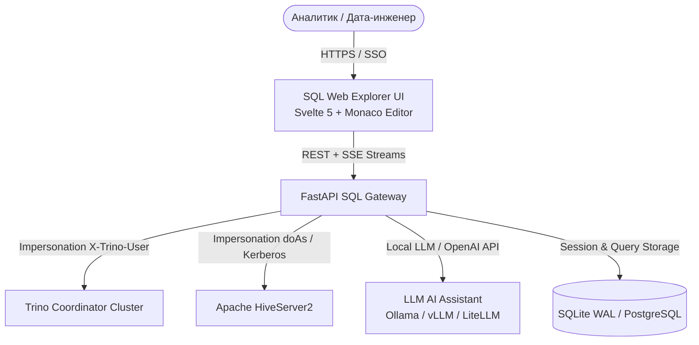

### Ключевые возможности:

- **⚡ Поддержка Trino и Apache Hive в одном окне:** Мгновенное переключение между высокоскоростным federated-движком Trino и пакетным HiveServer2 без смены инструмента.
- **💻 Полнофункциональный редактор Monaco:** Подсветка синтаксиса, контекстное автодополнение ключевых слов и названий таблиц/колонок, умное форматирование SQL и поддержка работы с несколькими вкладками запросов.
- **🔄 Асинхронный Server-Sent Events (SSE) стриминг:** Вывод строк результатов по мере их генерации на кластере без зависания интерфейса и с защитой от переполнения памяти браузера.
- **🧠 Встроенный ИИ-ассистент:** Генерация SQL по текстовому описанию, валидация запросов на безопасность (AST-проверка от несанкционированного DML/DDL), статический анализ производительности (поиск декартовых произведений, отсутствия партиций, неэффективного Shuffle) и пошаговое объяснение логики.
- **💾 Полная персистентность рабочих пространств:** Автоматическое сохранение открытых вкладок, текста запросов, расположения панелей и истории в базе данных — продолжение работы с того же места на любом компьютере.
- **📊 Кэширование результатов и экспорт:** Просмотр ранее выполненных выборок без повторной нагрузки на кластер, фильтрация данных на клиенте и экспорт в CSV (со встроенной защитой от Formula Injection) и JSON.
- **🔒 Корпоративная безопасность:** Прозрачная аутентификация через Kerberos SPNEGO SSO / LDAP, ролевое разграничение доступа к кластерам (RBAC) и надежная имперсонация (`X-Trino-User`, `doAs`).

---

## 2. Архитектура и потоки данных

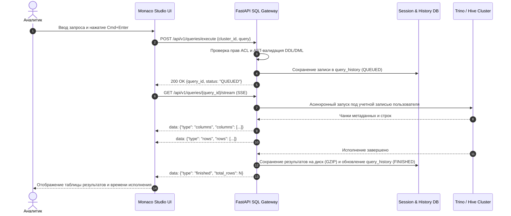

---

## 3. Аутентификация и ролевая модель безопасности

SQL Web Explorer интегрируется с корпоративной службой каталогов Active Directory / OpenLDAP и поддерживает Kerberos SPNEGO SSO.

<div align="center">
  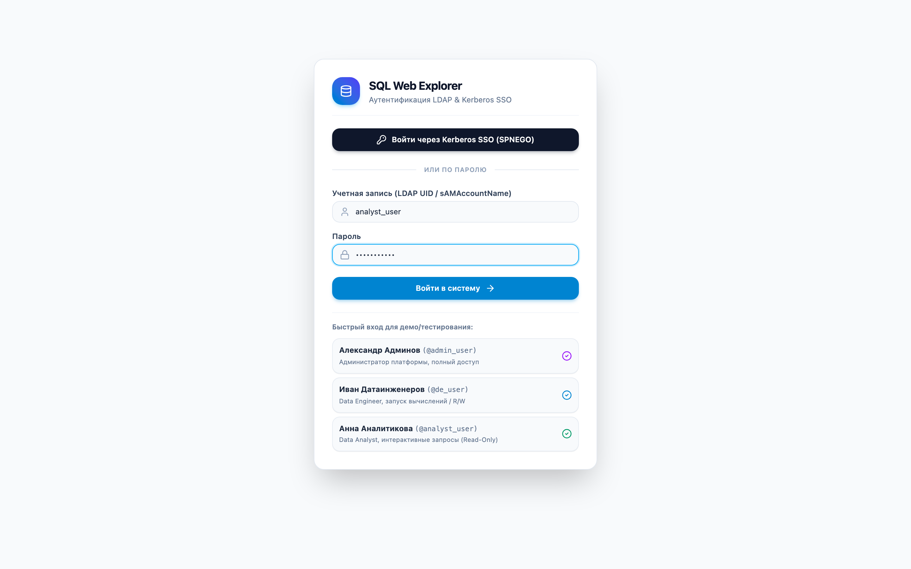
  <p><em>Рисунок 1: Экран аутентификации LDAP & Kerberos SPNEGO SSO</em></p>
</div>

### Ролевые группы и доступ к кластерам:

Доступ к конкретным кластерам Trino и Hive настраивается в файле `clusters.yaml`:

| Группа пользователей | Trino Analytics (Prod) | Hive HDP Cluster | Apache HiveServer2 | Доступ к DDL/DML (DROP, ALTER) |
| :--- | :---: | :---: | :---: | :---: |
| **Data Platform Admins** (`data-platform-admins`) | ✅ Полный доступ | ✅ Полный доступ | ✅ Полный доступ | ✅ Разрешено |
| **Data Engineers** (`data-engineers`) | ✅ Полный доступ | ✅ Полный доступ | ✅ Полный доступ | ⚠️ Только в staging/dev |
| **BI Analysts** (`bi-analysts`, `reporting`) | ✅ Только SELECT | ❌ Закрыто ACL | ✅ Только SELECT | ❌ Запрещено (Read-Only) |

> [!IMPORTANT]
> **Имперсонация пользователей (User Impersonation)**: Все запросы к кластерам передаются с заголовком реального авторизованного пользователя (`X-Trino-User: username` в Trino или `hive.server2.proxy.user=username` в Hive). Кластер применяет политики безопасности Ranger / Apache Sentry строго к учетной записи аналитика.

---

## 4. Главный экран и организация рабочей студии

Главное рабочее пространство спроектировано для максимальной концентрации на написании кода и анализе данных.

<div align="center">
  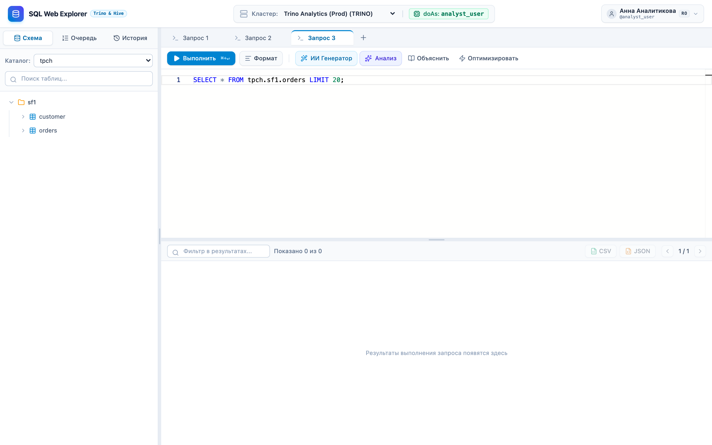
  <p><em>Рисунок 2: Главный экран рабочей студии SQL Web Explorer</em></p>
</div>

### Основные компоненты интерфейса:

1. **Верхняя панель (Header):**
   - Переключатель активного кластера Trino/Hive;
   - Информация о профиле пользователя и назначенных ролях;
   - Кнопка выхода (Logout).
2. **Левая боковая панель (Sidebar):**
   - **Вкладка «Схема»:** иерархическое дерево каталогов, схем, таблиц и колонок;
   - **Вкладка «Очередь»:** мониторинг активных запросов на кластере;
   - **Вкладка «История»:** хронологический журнал выполненных запросов.
3. **Разделитель панелей (Resizable Splitter):**
   - Плавное перетаскивание мышью для настройки ширины боковой панели каталогов и высоты области результатов;
   - Двойной клик по разделителю сбрасывает пропорции к стандартным значениям.
4. **Панель вкладок (Tabs Bar):**
   - Создание новых вкладок кнопкой **«+»**;
   - Переименование, переключение и закрытие вкладок.
5. **Панель инструментов (Query Toolbar):**
   - Кнопка **«Выполнить» (Cmd+Enter / Ctrl+Enter)**;
   - Кнопка **«Остановить»** для отмены тяжелого запроса;
   - Кнопка **«Формат»** для автоматического выравнивания SQL;
   - Кнопки быстрого доступа к **ИИ-ассистенту** («ИИ Генератор», «Анализ», «Объяснить», «Оптимизировать»).

---

## 5. Дерево каталогов, схем и таблиц

Боковая панель «Схема» предоставляет быстрый доступ к структуре данных с кэшированием метаданных:

<div align="center">
  
  <p><em>Рисунок 3: Раскрытое дерево каталогов tpch → sf1 → таблица customer с типами данных</em></p>
</div>

### Возможности работы со схемой:
- **Выпадающий список каталогов:** выбор каталога Trino (`tpch`, `analytics`, `hive`, `iceberg`, `postgresql`);
- **Быстрый поиск / фильтр:** мгновенная фильтрация схем и таблиц по названию;
- **Инспекция структуры полей:** клик по таблице раскрывает полный список колонок с указанием точных типов данных (`bigint`, `varchar`, `double`, `timestamp`, `date`);
- **Быстрая генерация запроса:** клик по таблице автоматически вставляет в редактор шаблонный запрос `SELECT * FROM ... LIMIT 50`.

---

## 6. Редактор SQL и выполнение запросов

### 6.1. Редактор Monaco и автодополнение
Редактор предоставляет профессиональные возможности:
- Подсветка синтаксиса SQL (ANSI SQL, Trino SQL, HiveQL);
- Автодополнение ключевых слов, функций агрегации, оконных функций и колонок;
- Выполнение выделенного фрагмента текста: если в редакторе выделен блок текста, по `Cmd+Enter` выполнится только он.

### 6.2. Асинхронное выполнение и потоковая отдача данных (SSE)
После запуска запроса система подключается к SSE-потоку. В панели инструментов отображаются статус («Постановка в очередь...», «Исполнение на кластере...»), таймер реального времени и счетчик поступивших строк.

<div align="center">
  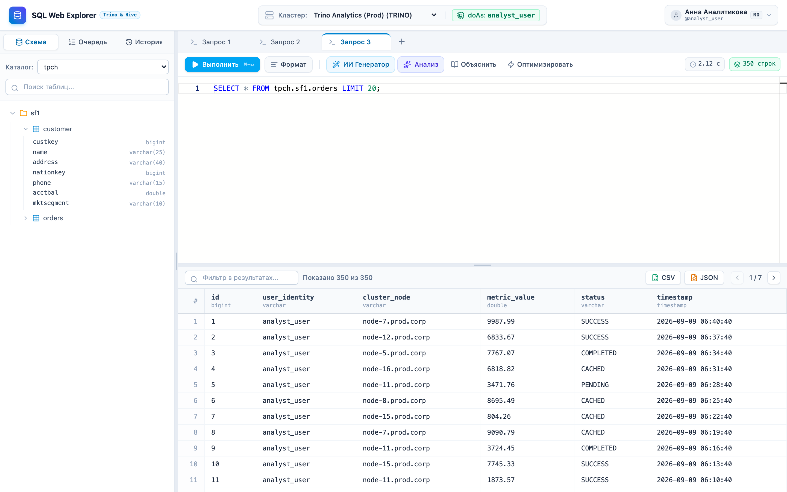
  <p><em>Рисунок 4: Таблица результатов выборки из таблицы customer (время исполнения 0.44 с, 50 строк)</em></p>
</div>

### 6.3. Таблица результатов, фильтрация и экспорт (CSV / JSON)
- **Клиентская фильтрация:** поле поиска позволяет мгновенно отфильтровать строки в таблице без повторного обращения к серверу;
- **Пагинация:** переключение между страницами результатов;
- **Экспорт в CSV:** экспорт данных с автоматическим экранированием спецсимволов и защитой от CSV Formula Injection (DDE);
- **Экспорт в JSON:** выгрузка структурированного массива JSON-объектов.

---

## 7. Многовкладочный режим и персистентность сессий

SQL Web Explorer позволяет вести параллельную работу над несколькими задачами благодаря многовкладочному интерфейсу:

<div align="center">
  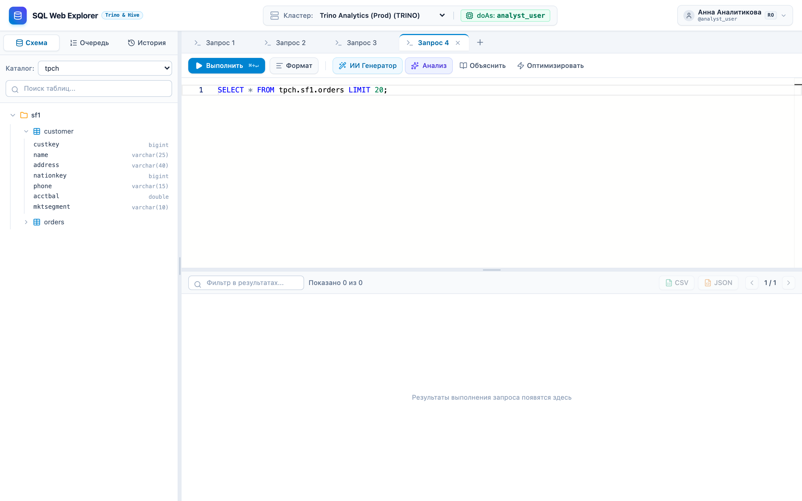
  <p><em>Рисунок 5: Работа с несколькими независимыми вкладками запросов</em></p>
</div>

- Каждая вкладка хранит собственный текст запроса, статус выполнения, время и полученные результаты;
- Состояние всех вкладок непрерывно синхронизируется с сервером. При перезагрузке страницы или входе с другого устройства все открытые вкладки и текст восстанавливаются в точности.

---

## 8. История запросов и кэш результатов

Вкладка «История» в боковой панели содержит полный аудит всех запросов, выполненных текущим пользователем:

<div align="center">
  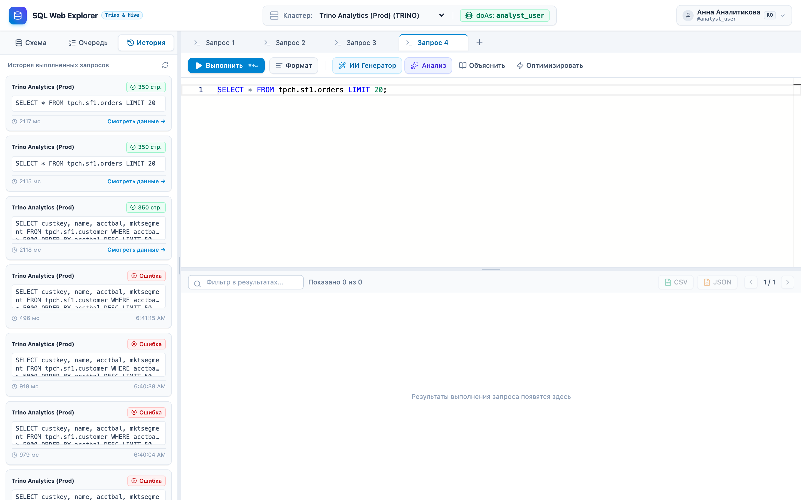
  <p><em>Рисунок 6: Панель истории запросов с цветовой индикацией статусов и длительности</em></p>
</div>

### Преимущества истории:
- **Цветовая индикация:** зеленый (`COMPLETED`), красный (`FAILED`), желтый (`RUNNING`);
- **Клик по тексту запроса:** моментально переносит SQL в активный редактор;
- **Кнопка загрузки кэшированного результата (Иконка архива):** открывает сохраненный результат запроса из кэша сервера без повторного запуска на кластере Trino/Hive.

---

## 9. Мониторинг очереди и управление кластерными задачами

Вкладка «Очередь» позволяет отслеживать фоновые и выполняющиеся задачи пользователя на кластере:

<div align="center">
  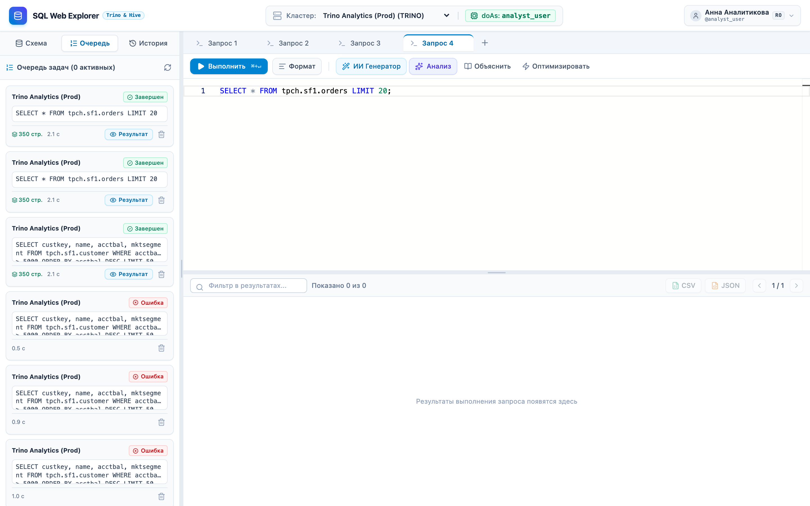
  <p><em>Рисунок 7: Мониторинг очереди запросов с возможностью отмены</em></p>
</div>

- Отображение текущего статуса (`QUEUED`, `RUNNING`);
- **Кнопка прерывания (Красный крестик):** отправляет сигнал отмены в координатор Trino / сессию Hive, моментально высвобождая ресурсы кластера YARN.

---

## 10. Встроенный ИИ-ассистент (AI SQL Studio)

Встроенный ИИ-ассистент спроектирован специально для экосистемы Apache Hadoop и может работать как с локальными On-premise LLM (Ollama, vLLM, DeepSeek-Coder, Qwen-Coder), так и в автономном эвристическом режиме.

### 10.1. Интеллектуальная генерация SQL (YARN & Partition Aware)

Позволяет описать бизнес-задачу на русском или английском языке и получить оптимизированный SQL-запрос.

<div align="center">
  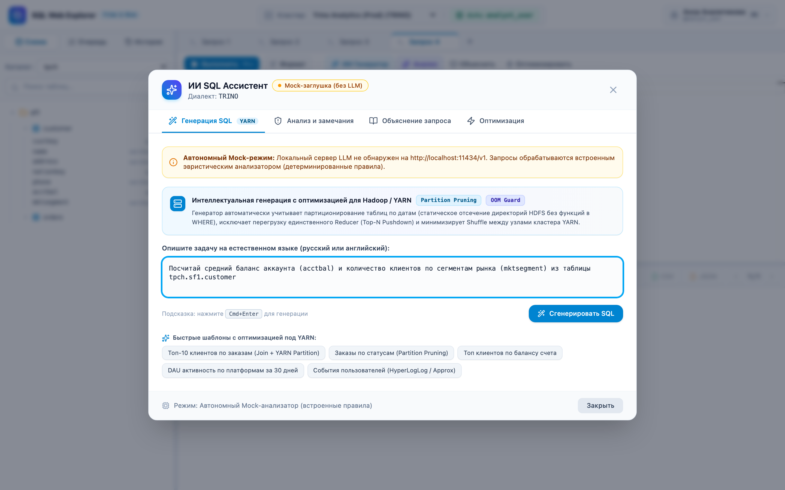
  <p><em>Рисунок 8: Генерация аналитического SQL с учетом отсечения партиций HDFS и защиты OOM</em></p>
</div>

> [!TIP]
> ИИ-генератор автоматически применяет техники оптимизации: **Partition Pruning** (отсечение директорий HDFS по датам без оборачивания полей в функции в секции `WHERE`), предотвращение перегрузки единственного Reducer (Top-N Pushdown) и минимизацию сетевого Shuffle между узлами YARN.

---

### 10.2. Анализ безопасности, линтинг и поиск антипаттернов

Вкладка «Анализ и замечания» выполняет глубокую статическую проверку текста запроса:

<div align="center">
  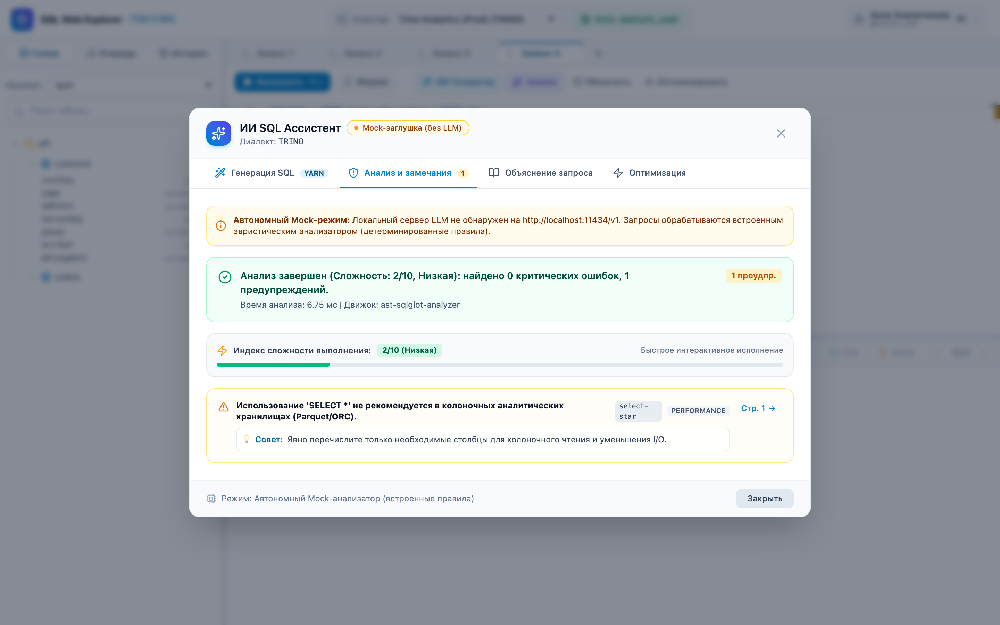
  <p><em>Рисунок 9: Анализ запроса на деструктивные операции, антипаттерны и декартовы произведения</em></p>
</div>

- **Проверка безопасности:** обнаружение деструктивных команд (`DROP`, `TRUNCATE`, `ALTER`) в Read-Only кластерах;
- **Антипаттерны производительности:** предупреждение об отсутствии `LIMIT`, сканировании всех партиций (Full Table Scan), скрытых декартовых произведениях (`Cartesian Product / CROSS JOIN`) и неэффективных условиях `LIKE '%text%'`.

---

### 10.3. Объяснение логики и оптимизация производительности

Вкладка «Объяснение запроса» разбивает сложный аналитический запрос (с CTE, оконными функциями и джойнами) на пошаговые смысловые блоки на русском языке:

<div align="center">
  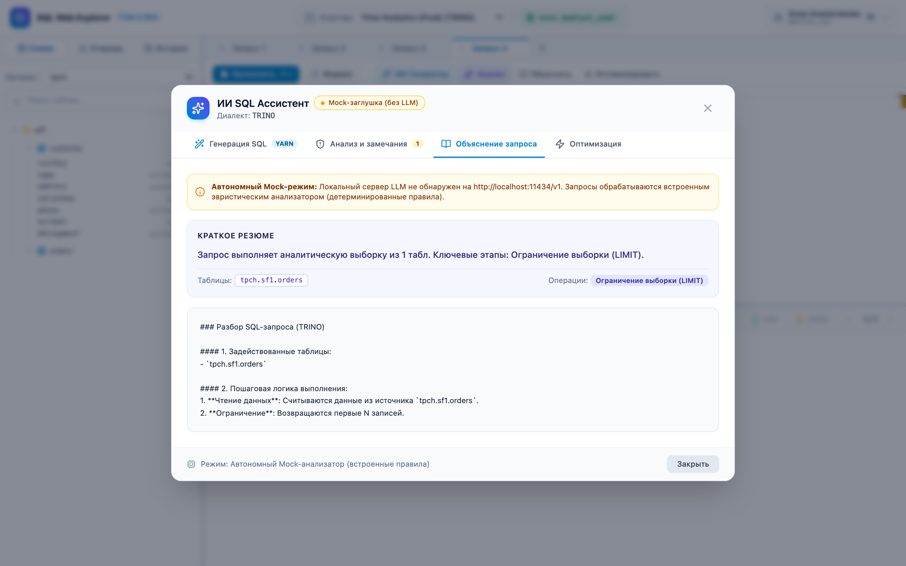
  <p><em>Рисунок 10: Пошаговый разбор логики выполнения аналитического запроса</em></p>
</div>

---

## 11. Горячие клавиши и клавиатурная навигация

| Комбинация | Область действия | Описание операции |
| :--- | :--- | :--- |
| `Cmd + Enter` / `Ctrl + Enter` | Редактор Monaco | Выполнить текущий запрос (или выделенный блок текста) |
| `Shift + Alt + F` | Редактор Monaco | Автоматическое форматирование SQL |
| `Escape` | Модальные окна | Закрыть окно ИИ-ассистента или диалог |
| `Cmd + T` / Клик по `+` | Вкладки | Открыть новую вкладку запроса |
| `Двойной клик по разделителю` | Разделитель панелей | Сбросить ширину боковой панели к 320 px |

---

## 12. Часто задаваемые вопросы (FAQ) и диагностика ошибок

### Q: Почему при выполнении запроса в Hive возникает задержка перед стартом?
> **О:** В отличие от Trino, который выполняет запросы в памяти на worker-нодах, Apache Hive компилирует запрос в распределенный направленный ациклический граф (DAG) Apache Tez или задачу MapReduce и запрашивает контейнеры у YARN ResourceManager. Вы можете отслеживать прогресс в панели инструментов.

---

### Q: Сохраняются ли результаты запросов при закрытии браузера?
> **О:** Да. Серверный шлюз автоматически кэширует результаты завершенных запросов на диске (в формате GZIP). Вы можете в любой момент открыть вкладку «История», найти нужный запрос и нажать кнопку **«Загрузить результат»** без повторного исполнения на кластере.

---

### Q: Как подключить локальную модель LLM для работы ИИ-ассистента?
> **О:** Установите Ollama (`ollama run qwen2.5-coder:7b`) и укажите в файле конфигурации `config.yaml` секцию:
> ```yaml
> ai:
>   enabled: true
>   provider: "openai_compatible"
>   base_url: "http://localhost:11434/v1"
>   model: "qwen2.5-coder:7b"
> ```
> Сервис автоматически обнаружит инференс-сервер и активирует нейросетевой режим генерации.
