<div align="center">


# Руководство пользователя: YARN Queue Explorer

<p><strong>Корпоративное веб-приложение для мониторинга, балансировки и управления очередями Apache YARN Capacity Scheduler</strong></p>

</div>

---

**YARN Queue Explorer** — веб-приложение корпоративного уровня для централизованного визуального мониторинга, проектирования, балансировки и управления иерархией очередей планировщика **Apache YARN Capacity Scheduler** в распределенных Hadoop-кластерах.

---

## 📑 Содержание

1. [Введение и ключевые возможности](#1-введение-и-ключевые-возможности)
2. [Ролевая модель и безопасность (RBAC & Four-Eyes Principle)](#2-ролевая-модель-и-безопасность-rbac--four-eyes-principle)
3. [Аутентификация и вход в систему](#3-аутентификация-и-вход-в-систему)
4. [Главный экран и структура интерфейса (Dashboard)](#4-главный-экран-и-структура-интерфейса-dashboard)
5. [Режимы отображения и пересчета ресурсов (% vs GB / vCores)](#5-режимы-отображения-и-пересчета-ресурсов--vs-gb--vcores)
6. [Редактирование параметров очередей](#6-редактирование-параметров-очередей)
7. [Создание и удаление очередей](#7-создание-и-удаление-очередей)
8. [Конструктор правил сопоставления очередей (Queue Mappings)](#8-конструктор-правил-сопоставления-очередей-queue-mappings)
9. [Анализ и верификация изменений (Diff Panel)](#9-анализ-и-верификация-изменений-diff-panel)
10. [Процесс согласования и применения изменений (Approval & Deployment Workflow)](#10-процесс-согласования-и-применения-изменений-approval--deployment-workflow)
11. [Генерация и применение XML-конфигурации](#11-генерация-и-применение-xml-конфигурации)
12. [Горячие клавиши и подсказки](#12-горячие-клавиши-и-подсказки)
13. [Часто задаваемые вопросы (FAQ) и диагностика](#13-часто-задаваемые-вопросы-faq-и-диагностика)
14. [Связанная документация](#14-связанная-документация)

---

## 1. Введение и ключевые возможности

Apache YARN Capacity Scheduler распределяет вычислительные ресурсы (оперативную память RAM и ядра vCPU) между организациями, командами и приложениями (Spark, Flink, Trino, MapReduce) с помощью иерархического дерева очередей.

Ручное редактирование XML-файлов конфигурации `capacity-scheduler.xml` сопряжено с рисками:
- Нарушение инварианта 100% емкости на уровнях иерархии;
- Ошибки в именовании путей очередей (`root.dept.team`);
- Отсутствие версионирования и согласования изменений;
- Сложность пересчета относительных долей (%) в физические ресурсы (гигабайты памяти и количество ядер);
- Ошибки при ручной доставке на хосты ResourceManager и отсутствие автоматического отката при сбоях.

**YARN Queue Explorer** решает эти задачи:

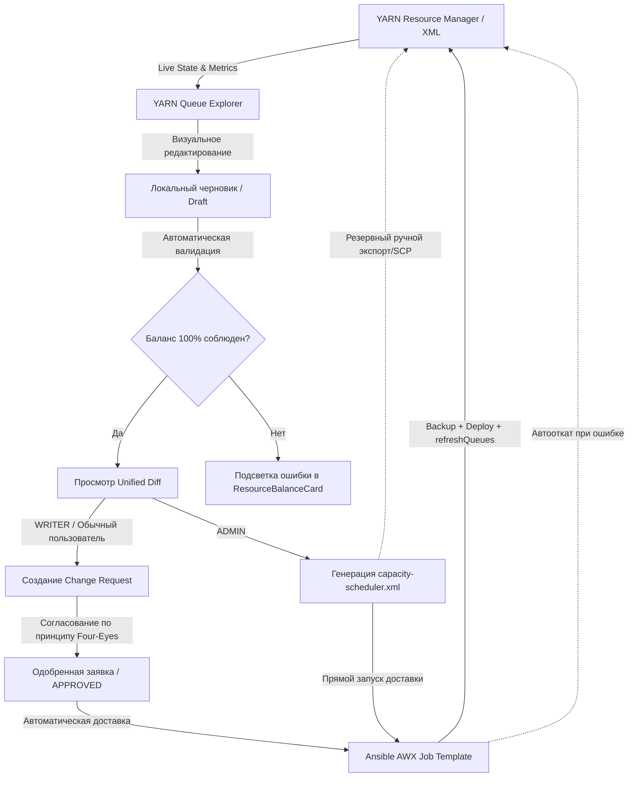

### Основные возможности платформы:
- 📊 **Интерактивное дерево очередей**: иерархическое отображение веток и листовых очередей, статусов (`RUNNING`/`STOPPED`), политик упорядочивания (`FAIR`/`FIFO`), лимитов и текущей утилизации.
- ⚖️ **Автоматический балансировщик ресурсов**: расчет суммарной емкости дочерних узлов в реальном времени с мгновенным предупреждением о недовыделении (`underallocated`) или перевыделении (`overallocated`) квот.
- 🔄 **Двусторонний автопересчет (% ↔ GB / vCores)**: возможность редактирования как в процентах, так и в физических гигабайтах и ядрах с автоматическим пересчетом и режимом связывания (Linked Mode).
- 🔀 **Конструктор правил Queue Mappings**: настройка автоматического распределения задач пользователей и групп по очередям (`u:%user`, `g:%group`) без ручного ввода регулярных выражений.
- 🛡 **Принцип четырех глаз (Four-Eyes Principle)**: разделение прав на подготовку изменений и их утверждение с центром согласования заявок (Change Requests).
- 🚀 **Автоматическая доставка и Zero-Downtime применение через Ansible AWX**: безопасное применение конфигурации на всех хостах ResourceManager (Active и Standby) с автоматическим созданием резервных копий, выполнением `yarn rmadmin -refreshQueues`, онлайн-просмотром логов выполнения и мгновенным откатом (Rollback) в случае сбоев.
- 📄 **Бесшовный экспорт в XML**: формирование валидного `capacity-scheduler.xml` с готовыми CLI-инструкциями для ручного применения (в качестве резервного сценария).

---

## 2. Ролевая модель и безопасность (RBAC & Four-Eyes Principle)

В системе реализовано разграничение прав доступа на основе ролей (Role-Based Access Control) с поддержкой групп Active Directory / OpenLDAP:

| Роль | Бейдж в UI | Права и доступные действия |
| :--- | :---: | :--- |
| **READER** (Наблюдатель) | `RO` | Просмотр дерева очередей, мониторинг утилизации ресурсов и метрик кластера, просмотр согласованных заявок. Редактирование заблокировано. |
| **WRITER** (Оператор / Инженер) | `RW` | Создание локальных черновиков, редактирование параметров очередей, добавление и удаление очередей, создание заявок на изменение (Change Requests) с обоснованием. |
| **ADMIN** (Администратор) | `ADM` | Полный доступ: согласование и отклонение заявок других пользователей, прямое применение черновиков, генерация и экспорт `capacity-scheduler.xml`. |

> [!IMPORTANT]
> **Принцип четырех глаз (Four-Eyes Principle)**: Администратор не может утвердить заявку, автором которой является он сам. Для критических изменений на продакшн-кластерах требуется одобрение другого администратора платформы.

---

## 3. Аутентификация и вход в систему

При переходе в приложение открывается единый экран корпоративной аутентификации.

<div align="center">
  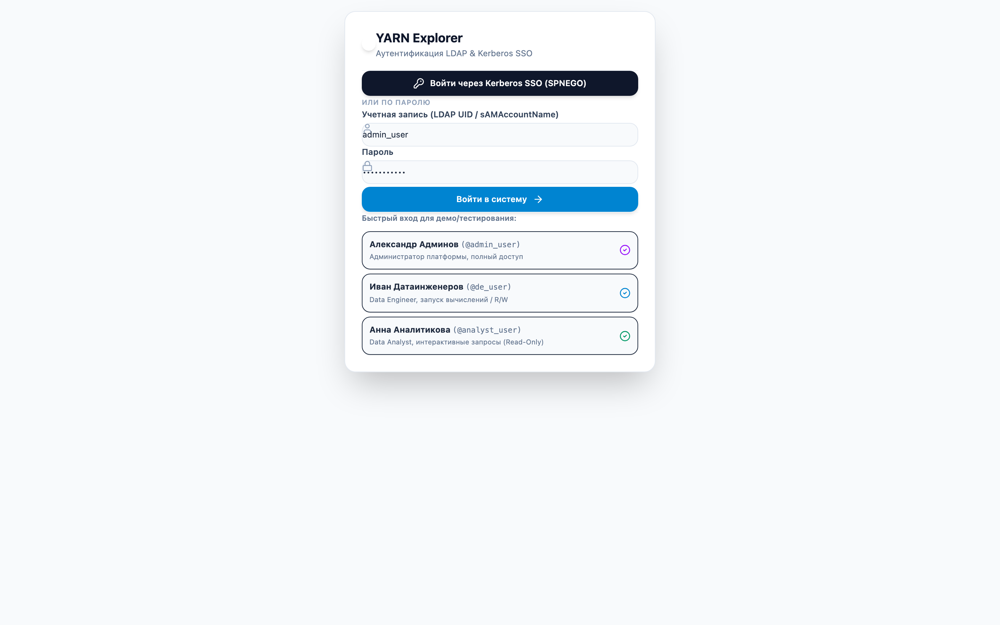
  <p><em>Рисунок 1: Экран аутентификации LDAP & Kerberos Single Sign-On (SPNEGO)</em></p>
</div>

### Доступные способы авторизации:
1. **Kerberos Single Sign-On (SPNEGO)**:
   - Если ваша рабочая станция находится в домене Active Directory / FreeIPA и в браузере настроен Kerberos-тикет, нажмите кнопку **«Войти через Kerberos SSO (SPNEGO)»**. Вход выполнится бесшовно без ввода пароля.
2. **Аутентификация по логину и паролю (LDAP / AD)**:
   - Введите ваш корпоративный логин (например, `sAMAccountName` или `uid`) и пароль в соответствующие поля формы и нажмите **«Войти в систему»**.
3. **Быстрый демо-вход**:
   - Для ознакомительных и тестовых стендов в нижней части формы доступны готовые профили:
     - **Александр Админов** (`admin_user`) — Администратор платформы (роль `ADMIN`);
     - **Владимир Инженеров** (`writer_user`) — Data Platform Engineer (роль `WRITER`);
     - **Екатерина Наблюдателева** (`reader_user`) — BI Analyst (роль `READER`).

---

## 4. Главный экран и структура интерфейса (Dashboard)

После успешного входа открывается главный экран управления очередями выбранного Hadoop-кластера:

<div align="center">
  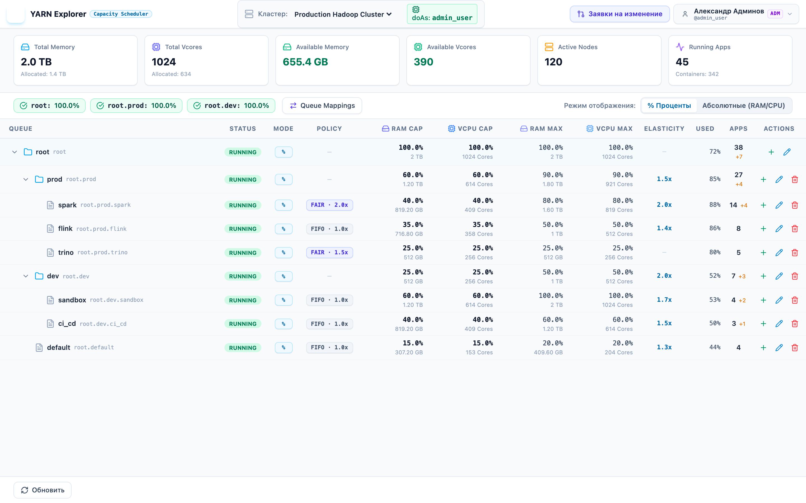
  <p><em>Рисунок 2: Главная панель управления очередями YARN Capacity Scheduler</em></p>
</div>

### Основные функциональные зоны:

```
┌──────────────────────────────────────────────────────────────────────────────────────────────┐
│  [1] Верхняя панель (Header): Логотип | Селектор кластера | doAs-пользователь | Профиль (ADM)│
├──────────────────────────────────────────────────────────────────────────────────────────────┤
│  [2] Метрики кластера: Память (Used/Total) | Ядра vCPU | Активные узлы | Контейнеры | Задачи │
├──────────────────────────────────────────────────────────────────────────────────────────────┤
│  [3] Тулбар: Партиции (DEFAULT) | Баланс веток (100% OK) | Queue Mappings | Режим (% / ABS) │
├──────────────────────────────────────────────────────────────────────────────────────────────┤
│                                                                                              │
│  [4] Интерактивная таблица иерархии очередей (QueueTreeTable)                                │
│      - Queue (путь и вложенность)                                                            │
│      - Status (RUNNING / STOPPED)                                                            │
│      - Mode (% / ABS)                                                                        │
│      - Policy (FAIR 2.0x / FIFO 1.0x)                                                        │
│      - RAM Capacity & Max Capacity                                                           │
│      - vCPU Capacity & Max Capacity                                                          │
│      - Used (% утилизации с цветовым прогресс-баром)                                         │
│      - Apps (активные и ожидающие приложения)                                                │
│      - Actions (+ Добавить дочернюю, ✏️ Редактировать, 🗑 Удалить)                            │
│                                                                                              │
│  [5] Нижняя панель действий (Footer Bar): Обновить | Сбросить | Просмотр Diff | XML / Заявка │
└──────────────────────────────────────────────────────────────────────────────────────────────┘
```

1. **Верхняя панель (Header)**:
   - Переключатель кластеров (например, `Production Hadoop Cluster` и `Analytics & ML Cluster`).
   - Бейдж impersonation `doAs: admin_user`.
   - Кнопка вызова центра заявок с бейджем количества заявок, ожидающих рассмотрения.
   - Меню профиля с отображением LDAP-групп и кнопкой выхода.
2. **Панель метрик кластера (Cluster Metrics Bar)**:
   - Отображает физические параметры кластера в реальном времени: объем выделенной памяти RAM, количество vCPU, количество активных NodeManager узлов и запущенных приложений.
3. **Панель балансировки (Resource Balance Card)**:
   - Индикатор зеленого цвета `100.0% · OK` сигнализирует о соблюдении инварианта емкости для всех уровней дерева.
   - При нарушении баланса отображается точное значение нераспределенных или избыточных ресурсов.

> [!TIP]
> **Прямые ссылки (URL Deep Linking):** Выбранный кластер, партиция и фокусная очередь автоматически сохраняются в URL-хэше браузера (например, `#cluster=cluster-1&partition=gpu&queue=root.ml.training`), что позволяет делиться прямыми ссылками на конкретное состояние очередей с коллегами и использовать кнопки истории браузера «Назад» / «Вперед».

---

## 5. Режимы отображения и пересчета ресурсов (% vs GB / vCores)

YARN Explorer поддерживает мгновенное переключение между процентным представлением квот и физическими абсолютными величинами.

Переключатель находится в правой части тулбара: **«% Проценты»** и **«Абсолютные (RAM/CPU)»**.

<div align="center">
  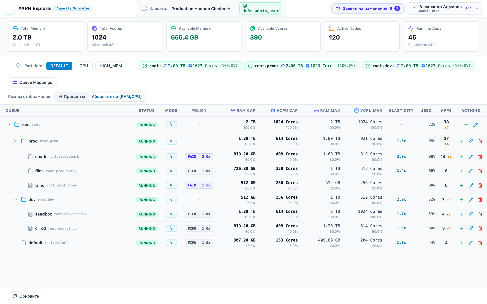
  <p><em>Рисунок 3: Просмотр абсолютных физических ресурсов кластера (RAM и vCPU)</em></p>
</div>

### Особенности режимов:
- **Процентный режим (`%`)**: показывает долю емкости очереди относительно родительского узла (Capacity %) и максимальный потолок при заимствовании ресурсов (Max Capacity %). Под основным числом мелким шрифтом выводится эквивалент в GB/TB.
- **Абсолютный режим (`ABS`)**: отображает гарантированные ресурсы в гигабайтах RAM и штуках ядер vCPU (например, `819.2 GB` и `409.6 Cores`).
- **Коэффициент эластичности (Elasticity Ratio)**: столбец показывает, во сколько раз очередь может превысить гарантированную квоту при наличии свободных ресурсов в кластере (например, `2.0x` для эластичной очереди `root.prod.spark` с емкостью 40% и лимитом 80%).

---

## 6. Редактирование параметров очередей

Для изменения параметров очереди нажмите иконку **✏️ (Pencil)** в столбце *Actions* соответствующей строки таблицы или кликните по бейджу политики/режима. Справа откроется панель детальной конфигурации:

<div align="center">
  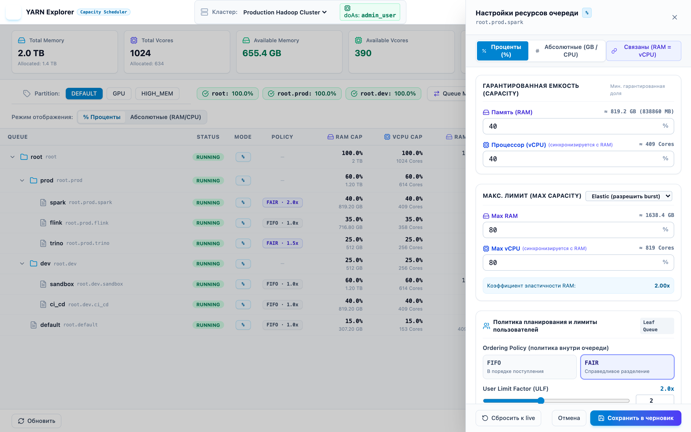
  <p><em>Рисунок 4: Боковая панель детального редактирования параметров очереди</em></p>
</div>

### Настраиваемые параметры:

#### 1. Гарантированная емкость (Guaranteed Capacity) и Максимум (Max Capacity)
- **Связанный режим (Linked Mode 🔗)**: по умолчанию включен. Изменение доли памяти автоматически синхронно меняет долю ядер vCPU. При необходимости раздельной настройки нажмите кнопку с иконкой замка (Unlink).
- **Тип очереди**:
  - `Эластичная (Elastic)`: очередь может заимствовать свободные ресурсы кластера вплоть до *Max Capacity*.
  - `Фиксированная (Fixed)`: жесткий лимит (*Max Capacity = Capacity*), предотвращает выход за рамки бюджета.

#### 2. Политика планирования и лимиты пользователей
- **Ordering Policy**:
  - `FAIR` (Честное распределение): ресурсы делятся поровну между параллельно запущенными приложениями в очереди.
  - `FIFO` (Первым пришел — первым обслужен): приложения выполняются строго по очереди поступления.
- **User Limit Factor (ULF)**: коэффициент, определяющий, какую долю от гарантированной емкости очереди может занять один пользователь. Значение `1.0` означает не более 100% очереди, значение `2.0` позволяет активному пользователю утилизировать до 200% емкости очереди при отсутствии конкуренции.

#### 3. Лимиты приложений (Application Limits)
- `maximum-applications`: максимальное число одновременно зарегистрированных приложений в очереди (защита от исчерпания памяти RM).
- `maximum-am-resource-percent`: процент ресурсов очереди, который разрешено выделить под ApplicationMaster-контейнеры (например, `0.3` = 30%). Предотвращает ситуацию AM Deadlock.
- `max-parallel-apps`: жесткий лимит одновременно исполняемых приложений.
- `maximum-application-lifetime`: максимальное время жизни приложения в секундах, после которого оно автоматически завершается планировщиком.

> [!TIP]
> После внесения изменений нажмите кнопку **«Сохранить в черновик»**. Изменения сохранятся в оперативной памяти сессии, подсветятся в таблице желтым цветом и немедленно пересчитают баланс веток, не затрагивая работающий кластер.

---

## 7. Создание и удаление очередей

### Добавление дочерней очереди
Чтобы создать новую очередь, нажмите иконку **➕ (Plus)** в строке родительской очереди (например, `root.dev`):

<div align="center">
  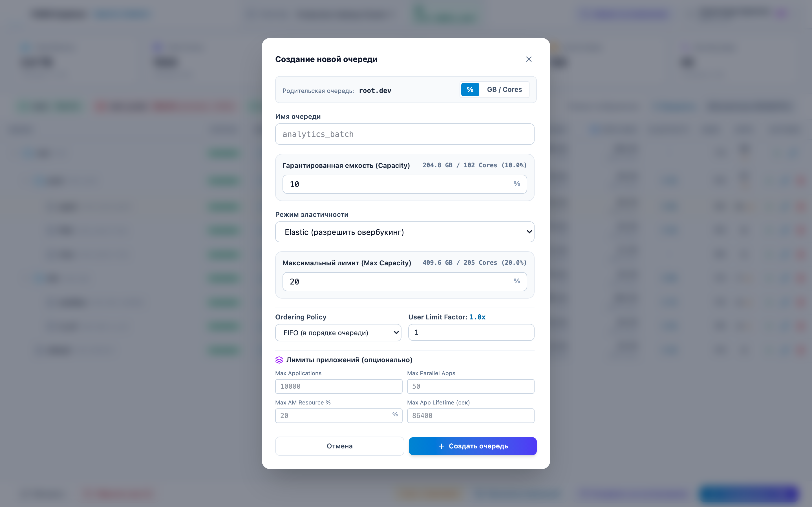
  <p><em>Рисунок 5: Модальное окно добавления новой дочерней очереди</em></p>
</div>

1. Введите системное имя новой очереди (латинские буквы, цифры, символы подчеркивания).
2. Задайте начальные значения гарантированной емкости и максимального потолка.
3. Выберите статус (`RUNNING`) и политику упорядочивания (`FAIR` / `FIFO`).
4. Нажмите **«Создать очередь»**. Очередь появится в дереве с зеленым бейджем `NEW`.

### Удаление очереди
- Для удаления нажмите иконку **🗑 (Trash)**.
- Очередь (и все ее вложенные поддеревья) помечается в черновике красным бейджем `DEL` с полупрозрачным фоном.

---

## 8. Конструктор правил сопоставления очередей (Queue Mappings)

Для автоматического направления задач пользователей в определенные очереди без явного указания параметра `-Dmapreduce.job.queuename` используется механизм **Queue Mappings**.

Нажмите кнопку **«Queue Mappings»** на верхней панели инструментов:

<div align="center">
  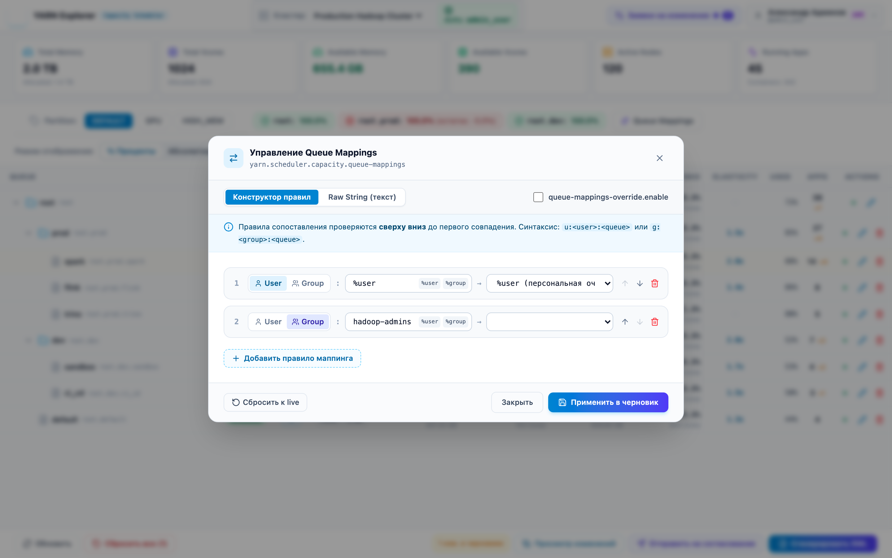
  <p><em>Рисунок 6: Конструктор правил сопоставления очередей (Queue Mappings & Overrides)</em></p>
</div>

### Возможности конструктора:
- **Добавление правил**:
  - Сопоставление пользователя: `u:%user:%user` (направление пользователя в очередь с его именем).
  - Сопоставление конкретного пользователя в целевую очередь: `u:etl_service:root.prod.spark`.
  - Сопоставление группы: `g:data-engineers:root.prod.spark`.
- **Переопределение клиентских параметров (Override)**:
  - Чекбокс *«Разрешить принудительное переопределение очереди (Override client specified queue)»* активирует параметр `yarn.scheduler.capacity.queue-mappings-override.enable=true`, гарантируя соблюдение корпоративных политик безопасности.
- **Интерактивная сортировка**: правила применяются планировщиком сверху вниз до первого совпадения. Вы можете менять порядок правил перетаскиванием или стрелками.

---

## 9. Анализ и верификация изменений (Diff Panel)

Когда в черновике накопились изменения, в нижнем тулбаре отображается счетчик (например, `1 изм. в черновике`).

Нажмите кнопку **«Просмотр изменений»** для открытия Unified Diff-панели:

<div align="center">
  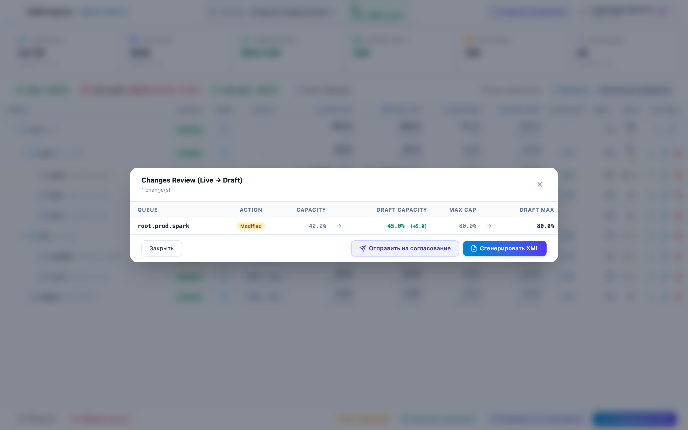
  <p><em>Рисунок 7: Панель сравнения параметров конфигурации Live vs Draft</em></p>
</div>

### Возможности Diff-панели:
- Построчное и поколоночное сопоставление исходных значений (*Live Configuration*) и проектных значений (*Draft Configuration*).
- Расчет числовой дельты (например, `40.0% → 45.0% (+5.0)`).
- Подробный аудит изменений всех второстепенных атрибутов (ULF, Ordering Policy, Application Limits, Node Labels).
- Отображение блока изменений в правилах маппинга (*Queue Mappings & Overrides*).

---

## 10. Процесс согласования изменений (Approval Workflow)

### Шаг 1: Создание заявки (для операторов и инженеров)
Из панели Diff или нижнего тулбара нажмите **«Отправить на согласование»**:

<div align="center">
  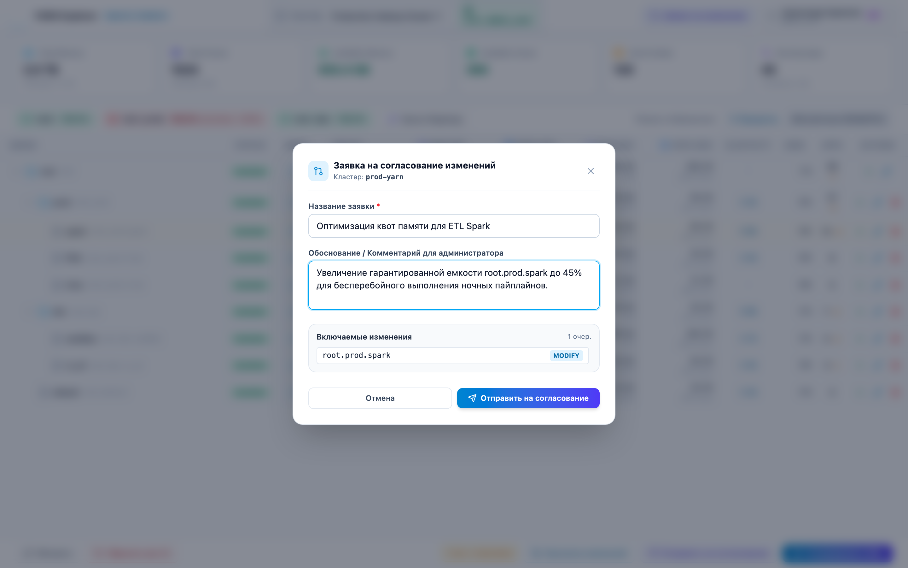
  <p><em>Рисунок 8: Модальное окно подачи заявки на изменение (Change Request)</em></p>
</div>

1. Заполните понятное название заявки (например, *«Оптимизация квот памяти для ETL Spark»*).
2. Укажите подробное техническое обоснование, номер тикета в Jira/Task-трекере и период ожидаемой нагрузки.
3. Нажмите **«Отправить на согласование»**. Заявка зарегистрируется в базе данных и получит статус `PENDING`.

---

### Шаг 2: Центр согласования заявок (для администраторов)
Администраторы видят уведомление с мигающим индикатором и счетчиком новых заявок в шапке приложения. Нажатие на кнопку **«Заявки на изменение»** открывает Центр согласования:

<div align="center">
  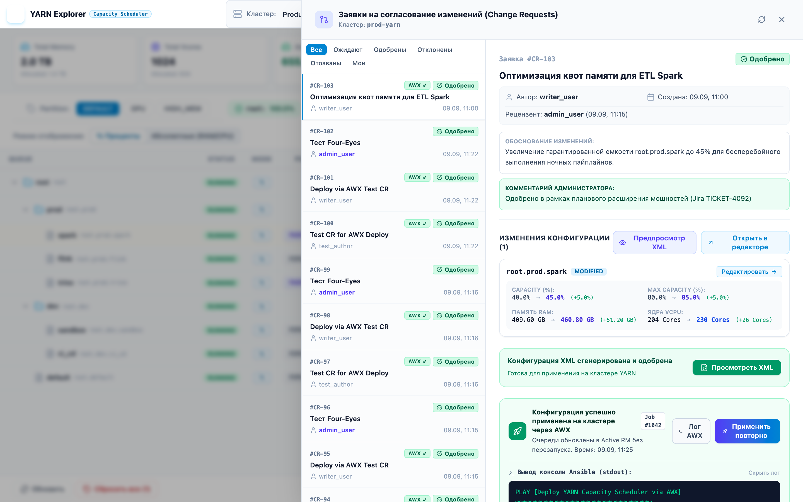
  <p><em>Рисунок 9: Центр согласования и аудита заявок на изменение</em></p>
</div>

#### Функции Центра согласования:
- **Фильтры**: просмотр заявок со статусами `Все`, `Мои`, `На согласовании (Pending)`, `Одобренные (Approved)`, `Отклоненные (Rejected)`.
- **Просмотр карточки заявки**:
  - Имя автора, время подачи, статус, текстовое обоснование.
  - Список всех затрагиваемых очередей с точными дельтами ресурсов.
- **Действия**:
  - **«Одобрить заявку» (Approve)**: утверждение заявки администратором с добавлением резолюции.
  - **«Отклонить» (Reject)**: отклонение с обязательным указанием причины.
  - **«Применить в черновик»**: загрузка параметров из исторической или чужой заявки в ваш активный черновик для доработки.
  - **«XML»**: предпросмотр готового XML-фрагмента, сформированного для данной заявки.

---

### Шаг 3: Автоматическое применение изменений на кластере через AWX (Deployment)

После утверждения заявки (статус `APPROVED`) администраторам становится доступен блок автоматизированной доставки конфигурации на целевой кластер:

<div align="center">
  
  <p><em>Рисунок 10: Утвержденная заявка со статусом доставки, Job ID и встроенным просмотром логов AWX</em></p>
</div>

1. **Запуск доставки**:
   - Нажмите кнопку **«Применить на кластере через AWX»** в карточке одобренной заявки.
   - Система упакует согласованный XML в защищенный Base64-пейлоад и инициирует запуск шаблона Ansible Job Template в AWX через REST API.
2. **Индикация статуса**:
   - `AWX...` — задача запущена в AWX, выполняется доставка файлов и горячая перезагрузка. UI автоматически опрашивает статус выполнения раз в 3 секунды.
   - `AWX ✓` (`SUCCESSFUL`) — конфигурация успешно доставлена на все узлы ResourceManager и активирована командой `yarn rmadmin -refreshQueues`. В карточке фиксируется дата и время деплоя.
   - `AWX ✕` (`FAILED`) — при выполнении возникла ошибка (например, кластер отклонил параметры очереди).
3. **Идентификатор задачи (Job ID)**:
   - В карточке заявки отображается номер задания (например, `AWX Job #1042`), являющийся прямой ссылкой на отчет в консоли Ansible AWX.
4. **Встроенный терминал «Лог AWX»**:
   - Нажатие на кнопку **«Лог AWX»** раскрывает встроенный терминал с журналом выполнения плейбука в реальном времени (`stdout`). Это позволяет администратору провести диагностику шагов плейбука (Pre-flight валидация, резервное копирование, деплой, `refreshQueues`) без необходимости перехода в сторонние системы.
5. **Гарантия отказоустойчивости (Automatic Rollback)**:
   - Если команда `yarn rmadmin -refreshQueues` завершается ошибкой (например, удаление очереди, в которой еще есть активные приложения), сценарий Ansible автоматически восстанавливает предварительно созданную резервную копию `capacity-scheduler.xml` на всех узлах и повторно выполняет `refreshQueues`. Кластер гарантированно остается в работоспособном состоянии.

---

## 11. Генерация и применение XML-конфигурации

Администраторы платформы могут работать с XML-конфигурацией напрямую через модальное окно **«Сгенерировать XML»**:

<div align="center">
  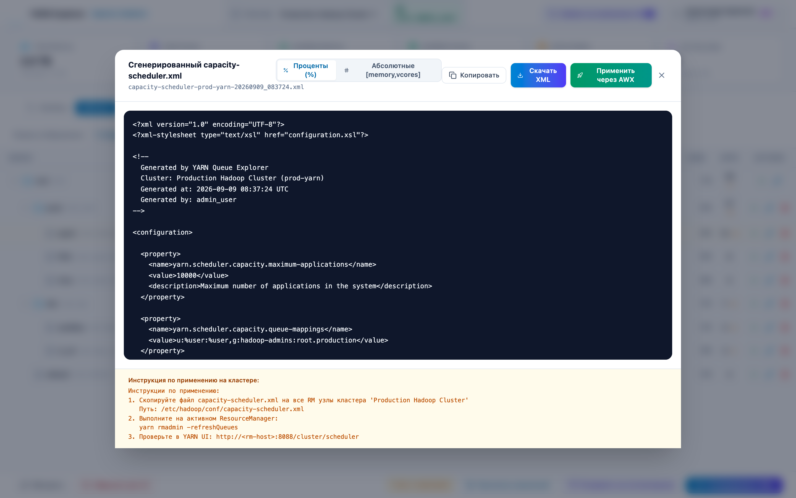
  <p><em>Рисунок 11: Модальное окно генерации, прямого применения через AWX и экспорта capacity-scheduler.xml</em></p>
</div>

### Экспорт и прямое применение:
1. **Выбор формата**: переключатель позволяет сгенерировать конфигурацию как в классическом процентном формате (`%`), так и в абсолютном ресурсном формате (`Absolute Resource Allocation`).
2. **Прямое применение через AWX (Для администраторов)**:
   - Нажмите кнопку **«Применить через AWX»** в модальном окне для немедленной доставки текущего черновика на кластер без оформления Change Request (рекомендуется для dev- и test-контуров).
   - При нажатии запускается AWX Job, а статус применения и номер задачи выводятся в информационном баннере модального окна.
3. **Ручной экспорт**:
   - **«Копировать XML»**: копирует полный XML-код конфигурации в буфер обмена.
   - **«Скачать XML»**: скачивает готовый файл `capacity-scheduler-<cluster_id>-<timestamp>.xml`.

### Способы применения конфигурации на кластере:

#### Способ 1: Автоматизированная доставка через Ansible AWX (Рекомендуемый корпоративный стандарт)
- Доставка осуществляется в один клик из интерфейса YARN Queue Explorer.
- Синхронное обновление всех хостов ResourceManager (Active и Standby).
- Автоматическое создание бэкапа перед заменой конфигурации.
- Безопасное применение без перезапуска сервисов через `yarn rmadmin -refreshQueues`.
- Автоматический откат (Rollback) при любых ошибках валидации YARN.
- Полная аудируемость и сохранение истории запусков в AWX.
- *Подробное руководство по настройке интеграции и Ansible-ролей см. в документе: [Руководство по интеграции с Ansible AWX](awx-yarn-deployment.md).*

#### Способ 2: Ручное применение через CLI / SCP (Резервный метод)
Используется при регламентных работах или недоступности системы AWX:

```bash
# 1. Скопируйте сгенерированный файл на хосты активного и резервного ResourceManager:
scp capacity-scheduler.xml hadoop-rm-1.company.local:/etc/hadoop/conf/capacity-scheduler.xml
scp capacity-scheduler.xml hadoop-rm-2.company.local:/etc/hadoop/conf/capacity-scheduler.xml

# 2. Выполните команду горячей перезагрузки конфигурации без перезапуска демонов RM:
yarn rmadmin -refreshQueues

# 3. Убедитесь в успешном обновлении через YARN Cluster Scheduler UI:
# http://<yarn-rm-host>:8088/cluster/scheduler
```

---

## 12. Горячие клавиши и подсказки

| Клавиша / Комбинация | Контекст | Действие |
| :--- | :--- | :--- |
| `Escape` | Любое модальное окно / Drawer | Закрыть текущее модальное окно или боковую панель |
| `Enter` | Форма аутентификации | Отправить учетные данные и выполнить вход |
| `Click` по строке очереди | Таблица очередей | Быстрый переход в режим редактирования параметров |
| `Click` по шеврону `▼` / `▶` | Таблица очередей | Свернуть или развернуть ветку дочерних очередей |

---

## 13. Часто задаваемые вопросы (FAQ) и диагностика

### Q1: Почему кнопка «Сгенерировать XML» неактивна или отсутствует?
> **Ответ**: Генерация и экспорт XML-файла конфигурации доступны только пользователям с ролью **ADMIN (`ADM`)**. Пользователи с ролью `WRITER` используют механизм подачи заявок (**«Отправить на согласование»**).

### Q2: В тулбаре горит красное предупреждение «Баланс ветки нарушен: 105% (overallocated)». Что делать?
> **Ответ**: Согласно спецификации YARN Capacity Scheduler, сумма параметров `capacity` всех непосредственных дочерних очередей любого родительского узла (включая `root`) должна быть строго равна **100%**. Отредактируйте емкости дочерних очередей так, чтобы их сумма составила 100%.

### Q3: Можно ли переименовать существующую очередь?
> **Ответ**: В YARN Capacity Scheduler путь очереди является ее первичным ключом. Чтобы «переименовать» очередь, создайте новую очередь с нужным именем и перенесите квоты, а старую очередь пометьте на удаление.

### Q4: Что происходит при нажатии «Сбросить все»?
> **Ответ**: Локальный черновик (Draft) очищается, и таблица возвращается к исходному состоянию, загруженному из работающего кластера YARN (*Live State*).

### Q5: Как настроить интеграцию с Ansible AWX для автоматической доставки конфигурации?
> **Ответ**: Интеграция задается в конфигурационном файле сервиса `backend/yarn/config/config.yaml` в глобальной секции `awx:`, а также per-cluster в настройках `clusters[].awx:`. Для каждого кластера указывается `job_template_id` или `job_template_name`, а также токен доступа и URL сервера AWX. Подробный пошаговый процесс развертывания роли, плейбука и настройки AWX представлен в [Руководстве по интеграции с Ansible AWX](awx-yarn-deployment.md).

### Q6: Что произойдет, если YARN не примет новую конфигурацию при выполнении AWX Job?
> **Ответ**: В Ansible-роли `yarn_capacity_scheduler` реализован блок `rescue`: при возникновении ошибки на этапе вызова `yarn rmadmin -refreshQueues` плейбук автоматически возвращает резервную копию `capacity-scheduler.xml.bak.<timestamp>` на всех хостах ResourceManager и повторно выполняет `refreshQueues`. Кластер остается в исходном стабильном состоянии без сбоя обслуживания, а в интерфейсе заявки отображается бейдж ошибки с возможностью изучить детальный вывод ошибки в окне «Лог AWX».

---

## 14. Связанная документация

- 🚀 [Руководство по доставке конфигураций через Ansible AWX](awx-yarn-deployment.md) — детальная архитектура, настройка Ansible-роли, шаблонов задач AWX и механизм отката (Rollback).
- ⚙️ [Руководство по конфигурации Hadoop Explorer Platform](CONFIGURATION.md) — параметры `config.yaml`, переменные окружения, подключение к кластерам YARN и ролевая модель RBAC.
- 🏛️ [Архитектура платформы Hadoop Explorer](ARCHITECTURE.md) — общие принципы архитектуры, подсистемы безопасности (Kerberos SPNEGO, LDAP, JWT) и отказоустойчивости (Circuit Breaker, Distributed Lock).
- 🏠 [Главная страница репозитория](../README.md) — общий обзор монорепозитория, быстрый запуск демо-стендов и тесты.

---

*Документация актуальна для Hadoop Explorer Platform v0.1.0+.*
